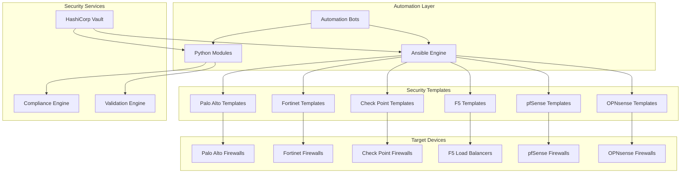
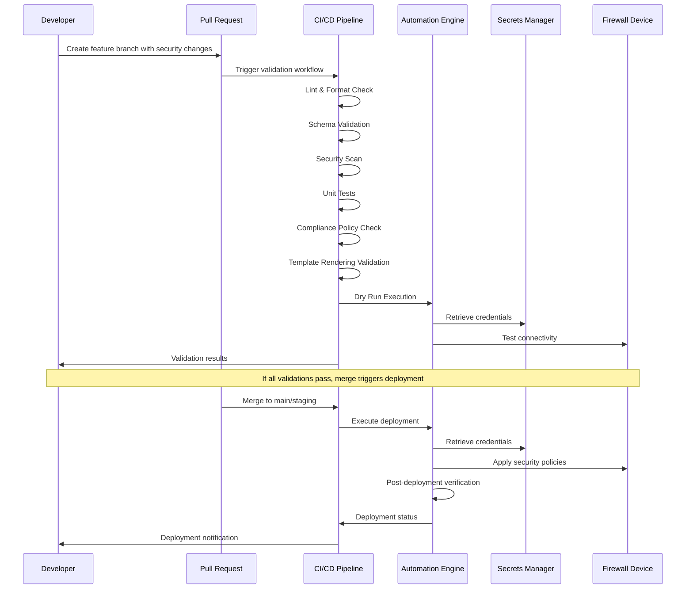
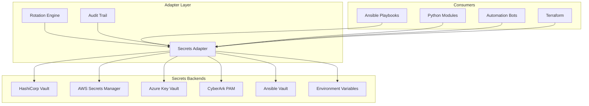
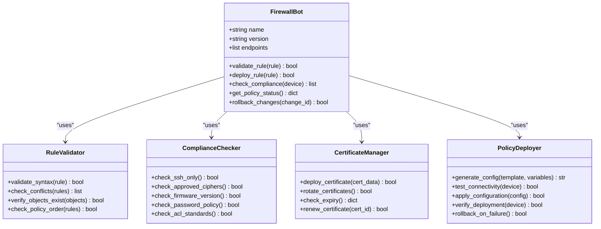
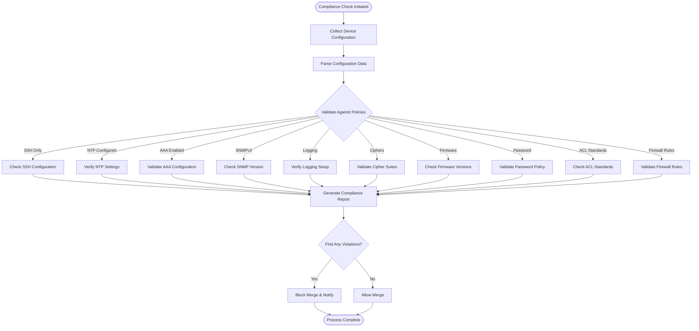
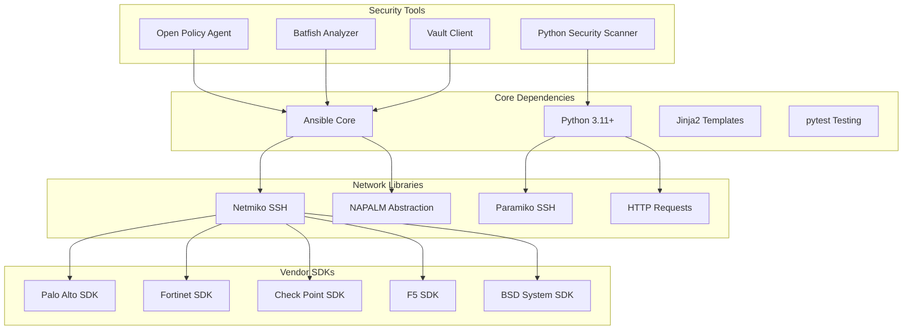

# Security & Firewall Vendors

<cite>
**Referenced Files in This Document**
- [README.md](file://README.md)
</cite>

## Table of Contents
1. [Introduction](#introduction)
2. [Project Structure](#project-structure)
3. [Core Components](#core-components)
4. [Architecture Overview](#architecture-overview)
5. [Detailed Component Analysis](#detailed-component-analysis)
6. [Dependency Analysis](#dependency-analysis)
7. [Performance Considerations](#performance-considerations)
8. [Troubleshooting Guide](#troubleshooting-guide)
9. [Conclusion](#conclusion)

## Introduction

The Enterprise Network Automation Platform provides comprehensive security and firewall vendor support across multiple platforms including Palo Alto (PAN-OS), Fortinet (FortiOS), Check Point (Gaia), F5 (BIG-IP), pfSense, and OPNsense. This platform enables automated security policy management, threat prevention configuration, certificate management, and compliance checking through a unified GitOps-driven approach.

The platform supports both API and SSH connectivity for all major firewall vendors, enabling consistent automation patterns across multi-vendor environments. It implements Infrastructure as Code principles where every configuration, policy, template, test, pipeline, dashboard, and bot is stored in Git with secrets managed securely through HashiCorp Vault, AWS Secrets Manager, Azure Key Vault, or CyberArk PAM.

## Project Structure

The platform follows a modular architecture with dedicated directories for each security vendor:



**Diagram sources**
- [README.md:103-180](file://README.md#L103-L180)
- [README.md:203-217](file://README.md#L203-L217)

**Section sources**
- [README.md:103-180](file://README.md#L103-L180)

## Core Components

### Supported Vendor Platforms

The platform provides comprehensive support for six major security and firewall vendors:

| Vendor | Platform | Protocol Support | Status |
|--------|----------|------------------|---------|
| **Palo Alto Networks** | PAN-OS | SSH, API | Supported |
| **Fortinet** | FortiOS | SSH, API | Supported |
| **Check Point** | Gaia | SSH, API | Supported |
| **F5 Networks** | BIG-IP | SSH, iControl REST | Supported |
| **pfSense** | FreeBSD-based | SSH, API | Supported |
| **OPNsense** | FreeBSD-based | SSH, API | Supported |

### Technology Stack

The platform leverages a robust technology stack for network automation:

- **Automation Engine**: Ansible, Python 3.11+, NAPALM, Netmiko, Nornir
- **Protocols**: NETCONF, RESTCONF, SSH, SNMPv3, gRPC, Telemetry Streaming
- **Templates**: Jinja2, YAML structured data
- **Testing**: pytest, Molecule, Batfish, pyATS, linting, schema validation
- **Compliance**: Custom Python checks, OPA, Batfish ACL analysis
- **Secrets Management**: HashiCorp Vault, AWS Secrets Manager, Azure Key Vault, CyberArk, Ansible Vault

### Playbook Catalogue

The platform includes specialized playbooks for security operations:

| Playbook | Purpose | Command |
|----------|---------|---------|
| `firewall_rules.yml` | Deploy firewall rule sets | `ansible-playbook playbooks/firewall_rules.yml -i inventories/production/hosts.yml` |
| `certificates.yml` | Deploy TLS certificates | `ansible-playbook playbooks/certificates.yml -i inventories/production/hosts.yml` |
| `compliance_scan.yml` | Run compliance checks | `ansible-playbook playbooks/compliance_scan.yml -i inventories/lab/hosts.yml --check --diff` |
| `initial_provisioning.yml` | Bootstrap new device (hostname, AAA, NTP, DNS, SSH, SNMP, Syslog, banners) | `ansible-playbook playbooks/initial_provisioning.yml -i inventories/lab/hosts.yml` |
| `ssh_hardening.yml` | Harden SSH configuration | `ansible-playbook playbooks/ssh_hardening.yml` |

**Section sources**
- [README.md:203-217](file://README.md#L203-L217)
- [README.md:371-435](file://README.md#L371-L435)

## Architecture Overview

The security automation architecture follows a layered approach with clear separation of concerns:



**Diagram sources**
- [README.md:34-99](file://README.md#L34-L99)
- [README.md:479-514](file://README.md#L479-L514)

### Secret Management Architecture

The platform implements a comprehensive secrets management strategy:



**Diagram sources**
- [README.md:339-368](file://README.md#L339-L368)

**Section sources**
- [README.md:34-99](file://README.md#L34-L99)
- [README.md:339-368](file://README.md#L339-L368)

## Detailed Component Analysis

### Security Bot Architecture

The platform includes a specialized Firewall Bot that provides REST APIs and ChatOps integrations for self-service security operations:



**Diagram sources**
- [README.md:460-476](file://README.md#L460-L476)

### Vendor-Specific Implementation Patterns

Each security vendor follows consistent implementation patterns while accommodating vendor-specific differences:

#### Palo Alto Networks (PAN-OS)
- **API Support**: XML API for policy management, address objects, and service definitions
- **SSH Support**: Traditional CLI for backup and basic operations
- **Template Structure**: Dedicated templates under `templates/paloalto/`
- **Policy Objects**: Address groups, service objects, application filters
- **Threat Prevention**: Profile-based security policies

#### Fortinet (FortiOS)
- **API Support**: REST API for policy management and object administration
- **SSH Support**: Full CLI access for advanced operations
- **Template Structure**: Vendor-specific templates under `templates/fortinet/`
- **Policy Objects**: Address objects, service groups, application lists
- **Threat Prevention**: IPS profiles, web filtering, antivirus settings

#### Check Point (Gaia)
- **API Support**: SmartConsole API and Clish commands via SSH
- **SSH Support**: Comprehensive CLI access for all operations
- **Template Structure**: Gaia-specific templates under `templates/checkpoint/`
- **Policy Objects**: Network objects, services, users/groups
- **Threat Prevention**: Threat Prevention Suite integration

#### F5 Networks (BIG-IP)
- **API Support**: iControl REST API for comprehensive management
- **SSH Support**: TMOS shell for advanced troubleshooting
- **Template Structure**: BIG-IP specific templates under `templates/f5/`
- **Policy Objects**: Virtual servers, pools, monitors, profiles
- **Security Features**: WAF policies, DDoS protection, SSL offloading

#### pfSense & OPNsense
- **API Support**: REST API for configuration management
- **SSH Support**: Full FreeBSD-based system access
- **Template Structure**: BSD-specific templates under respective directories
- **Policy Objects**: Aliases, rules, NAT configurations
- **Threat Prevention**: Snort/Suricata integration

### Compliance Framework

The platform implements comprehensive compliance checking across all security devices:



**Diagram sources**
- [README.md:548-579](file://README.md#L548-L579)

**Section sources**
- [README.md:460-476](file://README.md#L460-L476)
- [README.md:548-579](file://README.md#L548-L579)

## Dependency Analysis

The security automation platform has well-defined dependencies between components:



**Diagram sources**
- [README.md:184-199](file://README.md#L184-L199)

### External Integration Points

The platform integrates with various external systems:

| Integration Type | Systems | Purpose |
|------------------|---------|---------|
| **Secrets Management** | HashiCorp Vault, AWS Secrets Manager, Azure Key Vault, CyberArk | Secure credential storage and rotation |
| **Monitoring** | Prometheus, Grafana, OpenTelemetry | Performance metrics and alerting |
| **Communication** | Slack, Microsoft Teams, GitHub Actions | Notifications and ChatOps |
| **Version Control** | Git, GitHub | Configuration management and collaboration |
| **Cloud Providers** | AWS, Azure, GCP | Cloud networking infrastructure |

**Section sources**
- [README.md:184-199](file://README.md#L184-L199)

## Performance Considerations

The platform is designed for enterprise-scale operations with performance optimization in mind:

### Scalability Features
- **Parallel Processing**: Concurrent execution across multiple devices and regions
- **Connection Pooling**: Efficient reuse of SSH and API connections
- **Configuration Caching**: Minimize redundant API calls and configuration parsing
- **Batch Operations**: Group related changes to reduce device interactions

### Resource Optimization
- **Memory Management**: Stream processing for large configuration files
- **CPU Efficiency**: Optimized template rendering and validation algorithms
- **Network Bandwidth**: Compression and delta updates for configuration transfers
- **Storage Efficiency**: Deduplicated backups and incremental updates

### Monitoring and Observability
- **Execution Metrics**: Track playbook execution times and success rates
- **Resource Utilization**: Monitor CPU, memory, and network usage
- **Error Tracking**: Comprehensive logging and error categorization
- **Performance Alerts**: Proactive monitoring of system health

## Troubleshooting Guide

Common issues and their resolutions for security automation:

| Issue Category | Problem | Resolution |
|----------------|---------|------------|
| **Connectivity** | SSH connection timeout | Verify SSH reachability: `ansible all -m ping -i inventories/lab/hosts.yml` |
| **Authentication** | Vault authentication failure | Verify OIDC token or AppRole credentials; check Vault policies |
| **Template Errors** | Jinja2 template rendering error | Check template syntax: `python -m python.config_gen --debug --device <name>` |
| **Compliance Failures** | Compliance check failure | Review `compliance/` policies and device running config diff |
| **API Issues** | Vendor API rate limiting | Implement retry logic and exponential backoff |
| **Certificate Problems** | Certificate deployment failure | Verify certificate format and chain validity |
| **Policy Conflicts** | Firewall rule conflicts | Use conflict detection tools and review rule ordering |
| **Backup Issues** | Configuration backup failure | Check device storage space and backup permissions |

### Debugging Commands

```bash
# Test device connectivity
ansible all -m ping -i inventories/lab/hosts.yml

# Debug template rendering
python -m python.config_gen --debug --device <device-name>

# Run compliance checks locally
python -m python.compliance --inventory inventories/lab/hosts.yml

# Test firewall bot endpoint
curl -X GET http://localhost:8080/api/v1/firewall/rules

# Check vault connectivity
vault status

# Validate JSON/YAML schemas
python -c "import jsonschema; print('Schema validation working')"
```

**Section sources**
- [README.md:674-685](file://README.md#L674-L685)

## Conclusion

The Enterprise Network Automation Platform provides comprehensive security and firewall vendor support through a unified, GitOps-driven approach. The platform successfully abstracts vendor-specific complexities while maintaining the flexibility to leverage native APIs and SSH capabilities for optimal performance and functionality.

Key strengths include:

- **Multi-Vendor Support**: Consistent automation patterns across Palo Alto, Fortinet, Check Point, F5, pfSense, and OPNsense
- **Security-First Design**: Integrated compliance checking, secrets management, and audit trails
- **Enterprise Scale**: Designed for thousands of devices across multiple regions and environments
- **Operational Excellence**: Comprehensive testing, monitoring, and rollback capabilities
- **Developer Experience**: Intuitive GitOps workflows with automated validation and approval processes

The platform's modular architecture ensures maintainability and extensibility, allowing organizations to add new vendor support and security features while preserving existing automation investments. The emphasis on compliance, security, and operational excellence makes it suitable for highly regulated industries such as finance, healthcare, and government sectors.