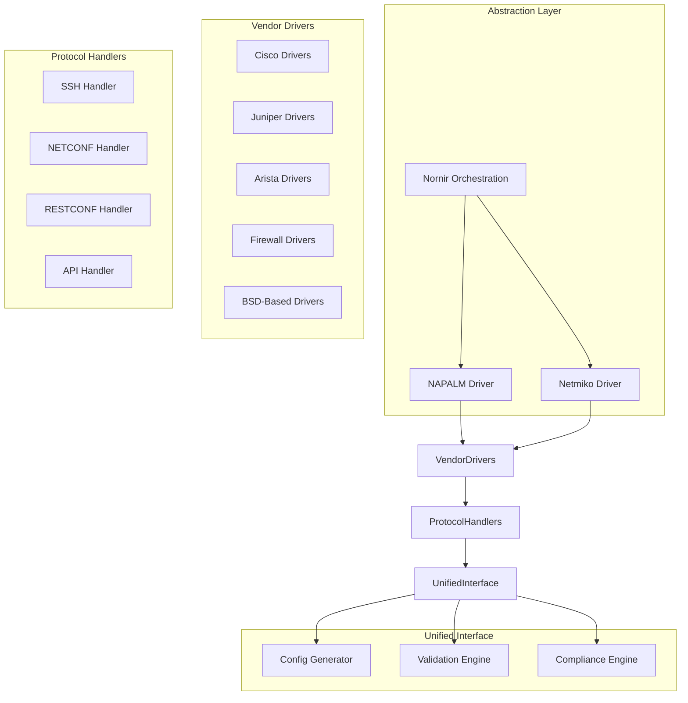
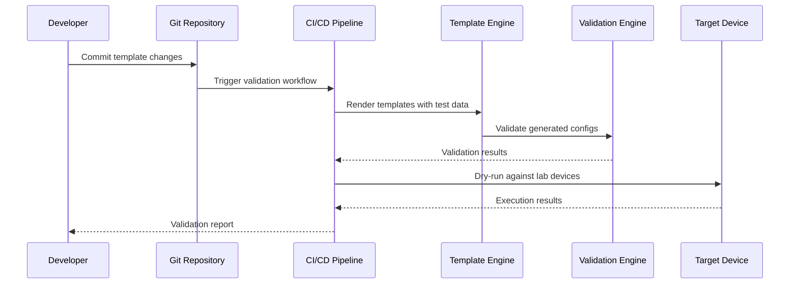
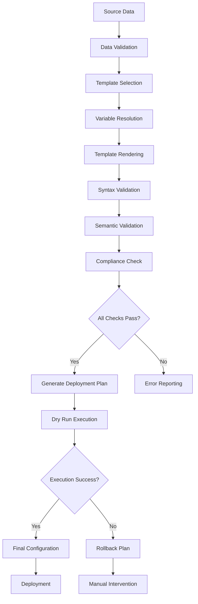
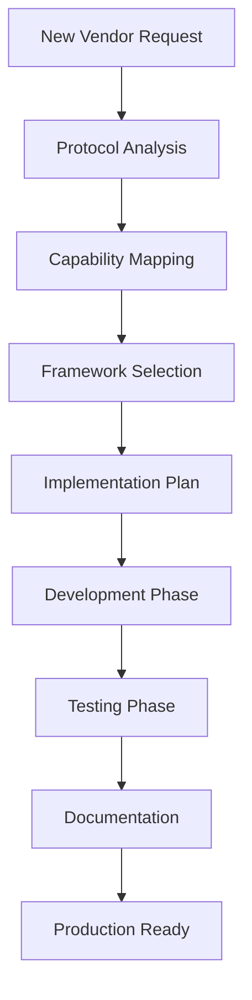

# Vendor & Platform Support

<cite>
**Referenced Files in This Document**
- [README.md](file://README.md)
</cite>

## Table of Contents
1. [Introduction](#introduction)
2. [Supported Vendors Overview](#supported-vendors-overview)
3. [Protocol Support Matrix](#protocol-support-matrix)
4. [Multi-Vendor Abstraction Architecture](#multi-vendor-abstraction-architecture)
5. [Template Management System](#template-management-system)
6. [Vendor-Specific Implementation Details](#vendor-specific-implementation-details)
7. [Configuration Generation Pipeline](#configuration-generation-pipeline)
8. [Adding New Vendor Support](#adding-new-vendor-support)
9. [Troubleshooting Vendor Connectivity](#troubleshooting-vendor-connectivity)
10. [Migration Strategies](#migration-strategies)
11. [Best Practices](#best-practices)
12. [Conclusion](#conclusion)

## Introduction

The Enterprise Network Automation Platform provides comprehensive multi-vendor network automation capabilities through a unified abstraction layer. This platform supports nine major networking vendors across on-premises and data center environments, enabling consistent configuration management, compliance enforcement, and operational automation regardless of underlying vendor implementations.

The platform leverages industry-standard frameworks including NAPALM, Netmiko, and Nornir to provide vendor-agnostic automation while maintaining access to vendor-specific features when required. All configurations are managed through GitOps workflows with Jinja2 templates organized by vendor-platform combinations, ensuring maintainability and consistency across diverse network environments.

## Supported Vendors Overview

The platform currently supports nine major networking vendors with comprehensive protocol coverage:

### On-Premises / Data Center Vendors

| Vendor | Platforms | Status | Key Features |
|--------|-----------|---------|--------------|
| **Cisco** | IOS, IOS-XE, NX-OS | ✅ Supported | Full NETCONF/RESTCONF support, eAPI for EOS |
| **Juniper** | SRX, MX | ✅ Supported | Comprehensive NETCONF support, Junos XML API |
| **Arista** | EOS | ✅ Supported | eAPI, NETCONF, RESTCONF capabilities |
| **Palo Alto** | PAN-OS | ✅ Supported | XML API, SSH automation |
| **Fortinet** | FortiOS | ✅ Supported | REST API, SSH automation |
| **Check Point** | Gaia | ✅ Supported | SmartConsole API, SSH automation |
| **F5** | BIG-IP | ✅ Supported | iControl REST API, SSH automation |
| **pfSense** | FreeBSD-based | ✅ Supported | API access, SSH automation |
| **OPNsense** | FreeBSD-based | ✅ Supported | API access, SSH automation |

### Cloud Networking Providers

| Provider | Services | Module Location |
|----------|----------|-----------------|
| **AWS** | VPC, Subnets, Route Tables, Security Groups, Transit Gateway | `terraform/aws/` |
| **Azure** | VNets, NSGs, ExpressRoute, Application Gateway | `terraform/azure/` |
| **GCP** | VPC, Firewall Rules, Cloud Router, Cloud NAT | `terraform/gcp/` |

**Section sources**
- [README.md:203-226](file://README.md#L203-L226)

## Protocol Support Matrix

The platform implements a comprehensive protocol support matrix that enables consistent automation across different vendor platforms:

### Core Protocol Support

| Protocol | Cisco | Juniper | Arista | Palo Alto | Fortinet | Check Point | F5 | pfSense | OPNsense |
|----------|-------|---------|--------|-----------|----------|-------------|----|---------|----------|
| **SSH** | ✅ | ✅ | ✅ | ✅ | ✅ | ✅ | ✅ | ✅ | ✅ |
| **NETCONF** | ✅ | ✅ | ✅ | ❌ | ❌ | ❌ | ❌ | ❌ | ❌ |
| **RESTCONF** | ✅ | ❌ | ✅ | ❌ | ❌ | ❌ | ❌ | ❌ | ❌ |
| **eAPI** | ❌ | ❌ | ✅ | ❌ | ❌ | ❌ | ❌ | ❌ | ❌ |
| **Native API** | ❌ | ❌ | ❌ | ✅ | ✅ | ✅ | ✅ | ✅ | ✅ |

### Advanced Protocol Support

| Protocol | Use Case | Supported By |
|----------|----------|--------------|
| **SNMPv3** | Monitoring, Telemetry | All vendors |
| **gRPC** | Model-driven telemetry | Cisco, Juniper, Arista |
| **Telemetry Streaming** | Real-time metrics | F5, modern platforms |
| **Syslog** | Event logging | All vendors |

### Protocol Selection Strategy

The platform automatically selects the optimal protocol based on:
- Device capability detection
- Feature availability requirements
- Performance considerations
- Security policies
- Legacy device compatibility

**Section sources**
- [README.md:207-217](file://README.md#L207-L217)

## Multi-Vendor Abstraction Architecture

The platform implements a sophisticated multi-vendor abstraction layer using three primary frameworks:

### Framework Architecture



### NAPALM Integration

NAPALM provides a unified interface for common network operations:
- Configuration retrieval and deployment
- Device connectivity testing
- Standardized data models
- Automatic capability detection

### Netmiko Integration

Netmiko handles CLI-based automation:
- SSH session management
- Command execution and parsing
- Vendor-specific command sets
- Session persistence and retry logic

### Nornir Orchestration

Nornir provides advanced orchestration capabilities:
- Multi-threaded device management
- Inventory management
- Task parallelization
- Plugin architecture for custom drivers

**Section sources**
- [README.md:184-199](file://README.md#L184-L199)
- [README.md:438-456](file://README.md#L438-L456)

## Template Management System

The platform uses a hierarchical template organization system with Jinja2 templating engine:

### Template Directory Structure

```
templates/
├── cisco_ios/           # Cisco IOS specific templates
├── cisco_iosxe/         # Cisco IOS-XE specific templates  
├── cisco_nxos/          # Cisco NX-OS specific templates
├── juniper_srx/         # Juniper SRX specific templates
├── juniper_mx/          # Juniper MX specific templates
├── arista_eos/          # Arista EOS specific templates
├── paloalto/            # Palo Alto PAN-OS templates
├── fortinet/            # Fortinet FortiOS templates
├── checkpoint/          # Check Point Gaia templates
├── f5/                  # F5 BIG-IP templates
├── pfsense/             # pfSense templates
└── opnsense/            # OPNsense templates
```

### Template Organization Patterns

Templates are organized following these patterns:
- **Vendor-specific directories**: Each vendor has dedicated template folders
- **Platform differentiation**: Separate templates for different OS versions
- **Feature-based grouping**: Templates grouped by network feature (VLANs, routing, security)
- **Common base templates**: Shared template components for cross-vendor consistency

### Template Rendering Pipeline



**Section sources**
- [README.md:116-128](file://README.md#L116-L128)

## Vendor-Specific Implementation Details

### Cisco Ecosystem (IOS, IOS-XE, NX-OS)

#### Protocol Support
- **SSH**: Primary automation protocol with full CLI support
- **NETCONF**: YANG-based configuration management
- **RESTCONF**: Modern RESTful API for configuration
- **eAPI**: Python API for EOS platforms

#### Implementation Approach
- Uses NAPALM driver for standardized operations
- NETCONF for advanced configuration management
- RESTCONF for modern API-first automation
- SSH fallback for legacy IOS devices

#### Template Patterns
- Modular configuration sections for interfaces, routing, security
- Version-specific conditional logic for IOS vs IOS-XE differences
- NX-OS specific object-oriented configuration syntax

### Juniper Ecosystem (SRX, MX)

#### Protocol Support
- **SSH**: Comprehensive CLI automation
- **NETCONF**: Native XML-based configuration management
- **Junos XML API**: Advanced operational data access

#### Implementation Approach
- NETCONF primary for configuration management
- SSH for operational commands and troubleshooting
- Junos-specific template patterns with commit groups

#### Template Patterns
- Junos-style configuration hierarchy
- Commit group support for atomic changes
- Policy-based configuration generation

### Arista EOS

#### Protocol Support
- **SSH**: Full CLI automation
- **eAPI**: Python-native API integration
- **NETCONF**: YANG-based configuration
- **RESTCONF**: RESTful API access

#### Implementation Approach
- eAPI preferred for high-performance operations
- NETCONF for complex configuration scenarios
- SSH for legacy compatibility

#### Template Patterns
- EOS-specific command syntax
- eAPI-compatible configuration structures
- Python-friendly template variables

### Firewall Vendors (Palo Alto, Fortinet, Check Point)

#### Common Patterns
- **SSH**: Primary automation protocol
- **Native APIs**: Vendor-specific REST/XML APIs
- **Template isolation**: Complete separation from router/switch templates

#### Implementation Considerations
- Stateful firewall rule management
- Object-based configuration (addresses, services, zones)
- Policy versioning and rollback capabilities

### Load Balancers (F5 BIG-IP)

#### Protocol Support
- **SSH**: CLI automation
- **iControl REST API**: Comprehensive management API
- **TMOS Shell**: Advanced configuration access

#### Implementation Approach
- iControl REST API for most operations
- SSH for specific TMOS commands
- Template patterns for virtual servers, pools, monitors

### BSD-Based Firewalls (pfSense, OPNsense)

#### Protocol Support
- **SSH**: Primary automation protocol
- **API access**: Web API for configuration management
- **Package management**: Automated package updates

#### Implementation Approach
- API-first approach where available
- SSH fallback for direct system access
- Package and plugin management automation

**Section sources**
- [README.md:207-217](file://README.md#L207-L217)
- [README.md:116-128](file://README.md#L116-L128)

## Configuration Generation Pipeline

The platform implements a sophisticated configuration generation pipeline that ensures consistency and compliance across all vendors:

### Pipeline Architecture



### Data Flow Components

1. **Source Data Collection**: Inventory, host_vars, group_vars
2. **Template Selection**: Based on vendor/platform identification
3. **Variable Resolution**: Hierarchical variable resolution with precedence
4. **Template Rendering**: Jinja2 engine with vendor-specific filters
5. **Validation Layers**: Syntax, semantic, and compliance checks
6. **Deployment Planning**: Change impact analysis and rollback planning

### Error Handling and Recovery

The pipeline includes comprehensive error handling:
- **Syntax errors**: Immediate rejection with detailed error messages
- **Semantic errors**: Configuration logic validation failures
- **Compliance violations**: Policy enforcement failures
- **Runtime errors**: Device communication and execution failures

**Section sources**
- [README.md:438-456](file://README.md#L438-L456)

## Adding New Vendor Support

### Step-by-Step Implementation Guide

#### 1. Vendor Identification and Capability Assessment



#### 2. Framework Integration

Choose appropriate automation framework(s):
- **NAPALM**: For standardized operations and common features
- **Netmiko**: For CLI-based automation and legacy support
- **Custom Driver**: For vendor-specific API requirements

#### 3. Template Development

Create vendor-specific templates following established patterns:
- Organize under `templates/vendor_name/` directory
- Implement modular template structure
- Include comprehensive variable definitions
- Add vendor-specific filters and macros

#### 4. Testing and Validation

Implement comprehensive testing:
- Unit tests for template rendering
- Integration tests with vendor simulators
- Compliance validation against security policies
- Performance testing for large-scale deployments

#### 5. Documentation and Training

Provide complete documentation:
- Vendor-specific setup instructions
- Template usage examples
- Troubleshooting guides
- Best practices and recommendations

### Template Development Patterns

#### Base Template Structure

```yaml
# Variable definition pattern
variables:
  hostname: "{{ inventory_hostname }}"
  vendor: "{{ vendor }}"
  platform: "{{ platform }}"
  region: "{{ region }}"
  site: "{{ site }}"
```

#### Conditional Logic Pattern

```jinja2

# IOS-XE specific configuration

# NX-OS specific configuration

```

#### Reusable Component Pattern

```jinja2



```

**Section sources**
- [README.md:116-128](file://README.md#L116-L128)

## Troubleshooting Vendor Connectivity

### Common Connectivity Issues

#### SSH Connection Problems
- **Authentication failures**: Verify credentials and key permissions
- **Connection timeouts**: Check network reachability and firewall rules
- **Protocol mismatches**: Ensure compatible SSH versions and cipher suites

#### NETCONF/RESTCONF Issues
- **Capability negotiation failures**: Verify device supports required capabilities
- **YANG model mismatches**: Ensure correct model versions are installed
- **Session management**: Handle connection pooling and timeout settings

#### API Authentication Problems
- **Token expiration**: Implement automatic token refresh mechanisms
- **Permission issues**: Verify API user has sufficient privileges
- **Rate limiting**: Implement request throttling and retry logic

### Diagnostic Tools and Techniques

#### Network Connectivity Testing
```bash
# Test SSH connectivity
ansible all -m ping -i inventories/lab/hosts.yml

# Test NETCONF connectivity
python -m python.netconf --device <device> --test

# Test API connectivity
python -m python.restconf --device <device> --test
```

#### Template Debugging
```bash
# Debug template rendering
python -m python.config_gen --debug --device <device>

# Generate dry-run output
python -m python.config_gen --dry-run --device <device>

# Validate template syntax
ansible-playbook playbooks/template_validation.yml
```

#### Log Analysis and Monitoring
- **Automation logs**: Review execution logs for error details
- **Device logs**: Analyze syslog and audit logs for authentication failures
- **Network traces**: Capture packets for protocol-level debugging

### Performance Optimization

#### Connection Pooling
- Implement persistent connections where supported
- Configure connection timeouts appropriately
- Use connection multiplexing for bulk operations

#### Parallel Processing
- Leverage Nornir's parallel execution capabilities
- Implement intelligent batching for large device fleets
- Monitor resource utilization and adjust concurrency levels

**Section sources**
- [README.md:674-685](file://README.md#L674-L685)

## Migration Strategies

### Platform Migration Planning

#### Assessment Phase
1. **Inventory Analysis**: Catalog current platform versions and features
2. **Dependency Mapping**: Identify inter-device dependencies and relationships
3. **Risk Assessment**: Evaluate migration risks and rollback requirements
4. **Timeline Planning**: Develop phased migration approach

#### Migration Approaches

##### Blue-Green Deployment
- Maintain parallel environments during transition
- Gradual traffic shifting between old and new platforms
- Immediate rollback capability if issues arise

##### Phased Migration
- Migrate devices in logical groups (by function, location, or priority)
- Validate each phase before proceeding to next
- Maintain backward compatibility during transition period

##### Big Bang Migration
- Complete platform replacement in single maintenance window
- Requires extensive pre-testing and validation
- Highest risk but fastest completion time

### Rollback Procedures

#### Configuration Rollback
- Automated backup and restore procedures
- Version-controlled configuration history
- Point-in-time recovery capabilities

#### Service Rollback
- Traffic rerouting to unaffected platforms
- Temporary service degradation protocols
- Customer communication and escalation procedures

### Post-Migration Validation

#### Functional Testing
- Verify all network services operate correctly
- Validate routing protocols and adjacency formation
- Test failover and redundancy mechanisms

#### Performance Validation
- Compare performance metrics before and after migration
- Monitor resource utilization and capacity planning
- Validate SLA compliance and service quality

**Section sources**
- [README.md:642-671](file://README.md#L642-L671)

## Best Practices

### Vendor Abstraction Guidelines

#### Consistent Interface Design
- Define standard operation interfaces across all vendors
- Implement graceful degradation for unsupported features
- Provide vendor-specific extensions when necessary

#### Template Management
- Use modular template design with reusable components
- Implement comprehensive variable validation
- Maintain separate development and production template versions

#### Testing and Quality Assurance
- Implement automated testing for all vendor integrations
- Use vendor simulators for regression testing
- Maintain golden configuration baselines for comparison

### Security Considerations

#### Credential Management
- Never store credentials in templates or source code
- Use secure secrets management solutions
- Implement credential rotation policies

#### Access Control
- Principle of least privilege for automation accounts
- Audit logging for all automated operations
- Regular security assessments of automation infrastructure

### Operational Excellence

#### Monitoring and Alerting
- Comprehensive monitoring of automation health
- Alerting for failed operations and degraded performance
- Capacity planning and trend analysis

#### Documentation and Knowledge Management
- Maintain up-to-date vendor capability matrices
- Document known limitations and workarounds
- Create runbooks for common operational scenarios

## Conclusion

The Enterprise Network Automation Platform provides a robust, scalable solution for managing diverse multi-vendor network environments. Through its sophisticated abstraction layer leveraging NAPALM, Netmiko, and Nornir, the platform delivers consistent automation capabilities across Cisco, Juniper, Arista, and various firewall and load balancer vendors.

The template-based approach ensures maintainable and extensible configuration management, while the comprehensive testing and validation pipeline guarantees reliability and compliance. The platform's design facilitates easy addition of new vendor support and provides clear migration strategies for platform transitions.

Key strengths include:
- **Vendor Agnostic Operations**: Consistent automation across diverse platforms
- **Comprehensive Protocol Support**: SSH, NETCONF, RESTCONF, and native APIs
- **Robust Template System**: Modular, maintainable configuration management
- **Enterprise-Grade Security**: Secure credential management and access control
- **Operational Excellence**: Comprehensive monitoring, testing, and validation

This foundation enables organizations to achieve true multi-vendor network automation while maintaining the flexibility to leverage vendor-specific features when required.