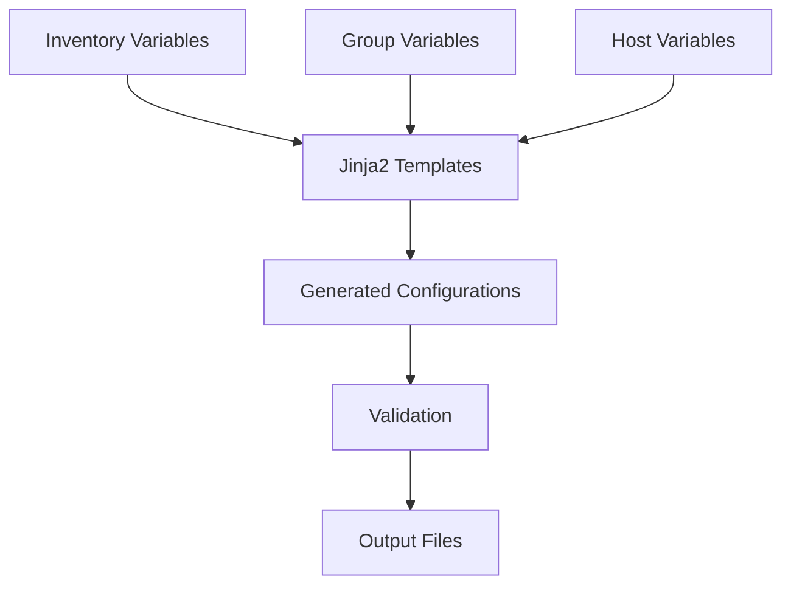

# Getting Started Guide

<cite>
**Referenced Files in This Document**
- [README.md](file://README.md)
</cite>

## Table of Contents
1. [Introduction](#introduction)
2. [Prerequisites](#prerequisites)
3. [Quick Start Setup](#quick-start-setup)
4. [Environment Validation](#environment-validation)
5. [First Automation Run](#first-automation-run)
6. [Configuration Generation](#configuration-generation)
7. [Testing and Compliance](#testing-and-compliance)
8. [Troubleshooting Guide](#troubleshooting-guide)
9. [Next Steps](#next-steps)

## Introduction

The Enterprise Network Automation Platform is a production-grade, vendor-agnostic network automation platform designed for enterprise-scale operations. It demonstrates Infrastructure as Code, GitOps, CI/CD, compliance enforcement, observability, and security practices used by Fortune 100 organizations including banks, telecoms, and cloud-native enterprises.

This platform manages thousands of network devices across multi-vendor, multi-region environments, simulating how major enterprises automate the full lifecycle of routers, switches, firewalls, load balancers, VPN gateways, and cloud networking components. Every configuration, policy, template, test, pipeline, dashboard, and bot is stored in Git, with secrets never committed — everything is code.

## Prerequisites

Before beginning the setup process, ensure you have the following prerequisites installed and configured:

### Core Requirements
- **Python 3.11+**: Required for all Python-based automation modules and scripts
- **Ansible 2.15+**: Primary automation engine for device configuration management
- **Terraform 1.5+**: Infrastructure as Code tool for cloud networking components
- **Git with LFS support**: Version control system with Large File Storage capability
- **HashiCorp Vault access**: Secrets management system for secure credential handling

### Optional but Recommended
- **Docker or Podman**: For running Molecule tests and isolated testing environments
- **pre-commit**: Git hook manager for automated code quality checks
- **pytest**: Python testing framework for unit and integration tests
- **Molecule**: Testing framework for Ansible roles

### System Requirements
- **Operating System**: Linux, macOS, or Windows (WSL2 recommended for Windows users)
- **Network Access**: SSH connectivity to target network devices
- **Disk Space**: Minimum 5GB free space for dependencies and temporary files
- **Memory**: Minimum 4GB RAM, 8GB recommended for optimal performance

**Section sources**
- [README.md:231-237](file://README.md#L231-L237)

## Quick Start Setup

Follow these step-by-step instructions to bootstrap your local development environment:

### Step 1: Clone the Repository

```bash
git clone https://github.com/<org>/network-automation.git
cd network-automation
```

Replace `<org>` with your organization's GitHub username or organization name.

### Step 2: Create Virtual Environment

Create an isolated Python virtual environment to manage dependencies:

```bash
python -m venv .venv
source .venv/bin/activate  # Linux/macOS
# .venv\Scripts\activate   # Windows
```

### Step 3: Install Python Dependencies

Install all required Python packages using the project's requirements file:

```bash
pip install -r requirements.txt
```

### Step 4: Install Ansible Collections

Install the necessary Ansible collections for network automation:

```bash
ansible-galaxy collection install -r requirements.yml
```

### Step 5: Configure Pre-commit Hooks

Set up pre-commit hooks to automatically enforce code quality standards:

```bash
pre-commit install
```

### Step 6: Validate Your Environment

Run the environment validation script to ensure all prerequisites are properly installed:

```bash
python scripts/validate_environment.py
```

This script will check for:
- Python version compatibility
- Ansible installation and version
- Terraform availability
- Git LFS support
- HashiCorp Vault connectivity
- Network connectivity to target devices

**Section sources**
- [README.md:239-262](file://README.md#L239-L262)

## Environment Validation

After completing the bootstrap process, verify your setup by running the environment validation script. This comprehensive check ensures all components are properly configured and ready for use.

### Validation Checklist

The validation script performs the following checks:

| Component | Check | Expected Result |
|-----------|-------|-----------------|
| Python | Version ≥ 3.11 | ✅ Pass |
| Ansible | Version ≥ 2.15 | ✅ Pass |
| Terraform | Version ≥ 1.5 | ✅ Pass |
| Git | LFS support enabled | ✅ Pass |
| Vault | Authentication successful | ✅ Pass |
| Network | SSH connectivity to lab devices | ✅ Pass |

### Troubleshooting Common Issues

If the validation fails, refer to the troubleshooting section below for specific solutions.

**Section sources**
- [README.md:260-262](file://README.md#L260-L262)

## First Automation Run

Once your environment is validated, you can run your first automation task. The platform provides several playbooks for common network operations.

### Running a Compliance Scan

Execute a dry-run compliance scan against your lab devices:

```bash
ansible-playbook playbooks/compliance_scan.yml \
  -i inventories/lab/hosts.yml \
  --check --diff
```

This command:
- Uses the lab inventory (`inventories/lab/hosts.yml`)
- Runs in check mode (`--check`) without making changes
- Shows detailed differences (`--diff`) for review

### Generating Device Configuration

Generate configuration for a specific device using the configuration generation module:

```bash
python -m python.config_gen --device core-rtr-01 --output ./output/
```

This creates configuration files based on templates and structured data for the specified device.

### Understanding the Output

The configuration generation process:
1. Reads device variables from inventory files
2. Applies Jinja2 templates from the `templates/` directory
3. Generates vendor-specific configurations
4. Outputs files to the specified directory

**Section sources**
- [README.md:264-280](file://README.md#L264-L280)

## Configuration Generation

The platform uses a sophisticated configuration generation system based on Jinja2 templates and structured data. Here's how it works:

### Template Structure

Templates are organized by vendor and platform:
- `templates/cisco_ios/` - Cisco IOS devices
- `templates/cisco_nxos/` - Cisco NX-OS devices  
- `templates/juniper_srx/` - Juniper SRX devices
- `templates/arista_eos/` - Arista EOS devices
- And many more vendors...

### Data Flow



### Customizing Templates

To customize configurations:
1. Modify host variables in `host_vars/`
2. Update group variables in `group_vars/`
3. Edit Jinja2 templates in the appropriate vendor directory
4. Regenerate configurations using the config generator

**Section sources**
- [README.md:116-128](file://README.md#L116-L128)
- [README.md:438-456](file://README.md#L438-L456)

## Testing and Compliance

The platform includes comprehensive testing and compliance checking capabilities to ensure network configurations meet organizational standards.

### Running Unit Tests

Execute the complete test suite:

```bash
pytest tests/unit/ -v
```

For specific test categories:
```bash
pytest tests/unit/ -v -k "test_compliance"
pytest tests/unit/ -v -k "test_config_generation"
```

### Running Compliance Checks

Execute local compliance checks against your inventory:

```bash
python -m python.compliance --inventory inventories/lab/hosts.yml
```

### Test Categories

| Test Type | Purpose | Command |
|-----------|---------|---------|
| Unit Tests | Python modules and filters | `pytest tests/unit/` |
| Integration Tests | Device connectivity and parsing | `pytest tests/integration/` |
| Compliance Tests | Policy enforcement | `pytest tests/compliance/` |
| Golden Config Tests | Baseline comparison | `pytest tests/golden_config/` |

### Compliance Policies

The platform enforces various security and operational policies:
- SSH-only access (no Telnet)
- NTP configuration requirements
- AAA authentication enforcement
- SNMPv3 usage only
- Approved cipher suites
- Password complexity requirements

**Section sources**
- [README.md:275-280](file://README.md#L275-L280)
- [README.md:517-544](file://README.md#L517-L544)
- [README.md:548-580](file://README.md#L548-L580)

## Troubleshooting Guide

Common issues and their solutions during setup and operation:

### Connection Issues

| Issue | Symptoms | Solution |
|-------|----------|----------|
| Ansible connection timeout | SSH connection failures | Verify SSH reachability: `ansible all -m ping -i inventories/lab/hosts.yml` |
| Vault authentication failure | Secret retrieval errors | Check OIDC token or AppRole credentials; verify Vault policies |
| Python dependency conflicts | Import errors | Ensure virtual environment is activated and dependencies are current |

### Template Rendering Errors

| Issue | Symptoms | Solution |
|-------|----------|----------|
| Jinja2 syntax error | Template rendering failures | Debug with: `python -m python.config_gen --debug --device <name>` |
| Missing variables | Undefined variable errors | Check inventory files for required variables |
| Template path issues | File not found errors | Verify template directory structure matches expected layout |

### Performance Issues

| Issue | Symptoms | Solution |
|-------|----------|----------|
| Slow playbook execution | Long processing times | Use `--forks` parameter to increase parallelism |
| High memory usage | Memory exhaustion | Process devices in smaller batches |
| Disk space problems | Write failures | Clean up temporary files and old backups |

### Verification Steps

After resolving issues, verify your setup:
1. Re-run environment validation: `python scripts/validate_environment.py`
2. Test basic connectivity: `ansible all -m ping -i inventories/lab/hosts.yml`
3. Run a simple playbook: `ansible-playbook playbooks/hostname.yml -l <device>`

**Section sources**
- [README.md:674-685](file://README.md#L674-L685)

## Next Steps

Congratulations! You've successfully set up the Enterprise Network Automation Platform. Here are some recommended next steps:

### Explore the Playbook Catalogue

The platform includes numerous playbooks for common network operations:

| Category | Example Playbooks |
|----------|-------------------|
| Device Lifecycle | `initial_provisioning.yml`, `hostname.yml`, `aaa.yml` |
| Network Services | `vlan.yml`, `trunk.yml`, `acl.yml` |
| Routing Protocols | `ospf.yml`, `bgp.yml`, `static_routes.yml` |
| Operations | `backup.yml`, `compliance_scan.yml`, `health_check.yml` |

### Set Up Monitoring

Configure monitoring and observability:
- Deploy Prometheus and Grafana dashboards
- Set up alerting rules
- Configure syslog collection
- Enable telemetry streaming

### Implement GitOps Workflow

Establish a proper GitOps workflow:
1. Create feature branches for changes
2. Open pull requests for peer review
3. Run automated validation in CI/CD
4. Deploy to staging for testing
5. Promote to production after approval

### Join the Community

- Contribute to the project via pull requests
- Report issues and request features
- Share best practices and experiences
- Help improve documentation

Remember: All changes should follow the established coding standards, include appropriate tests, and pass all validation checks before being merged into the main branch.

**Section sources**
- [README.md:371-435](file://README.md#L371-L435)
- [README.md:619-638](file://README.md#L619-L638)