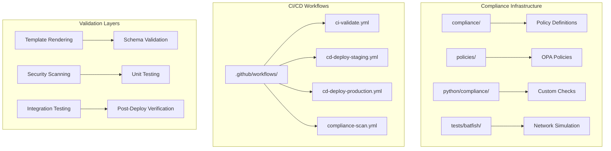
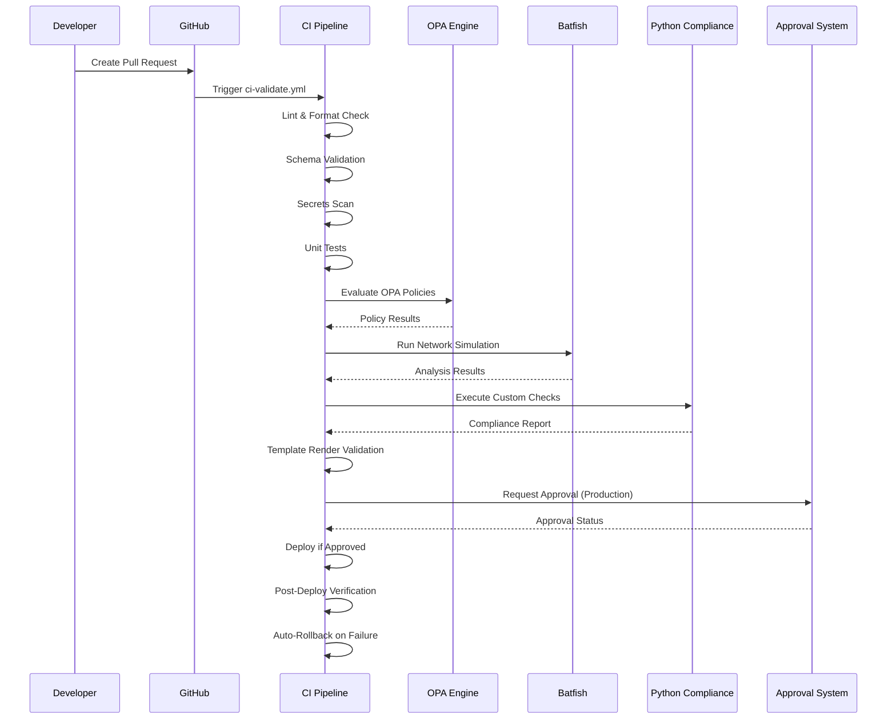
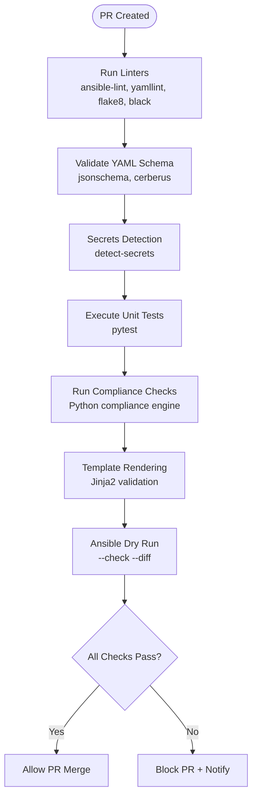
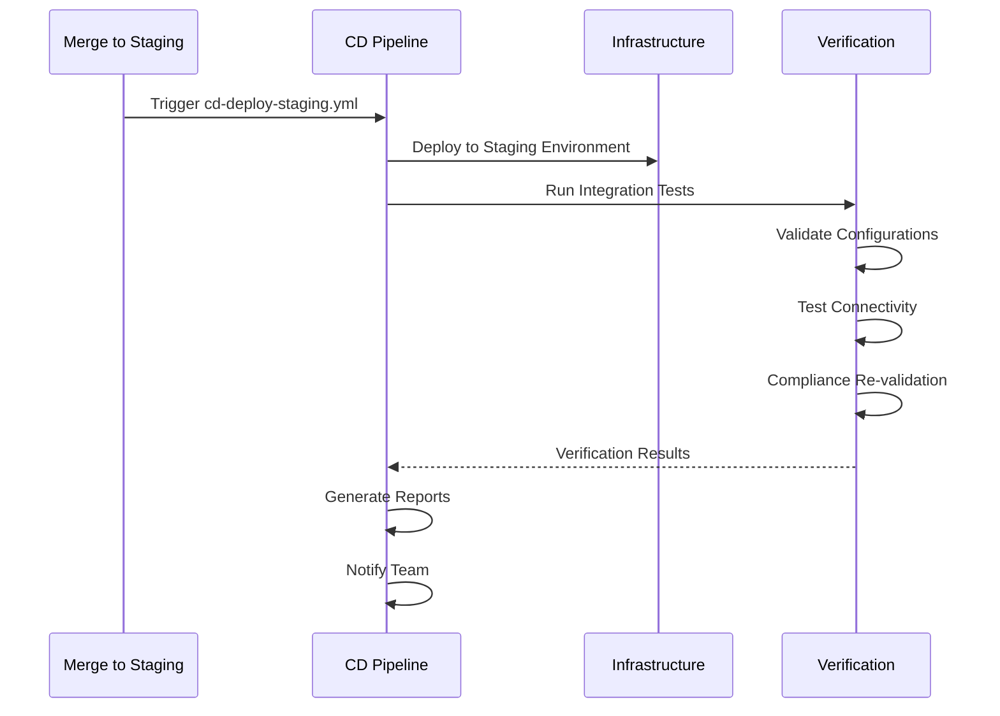
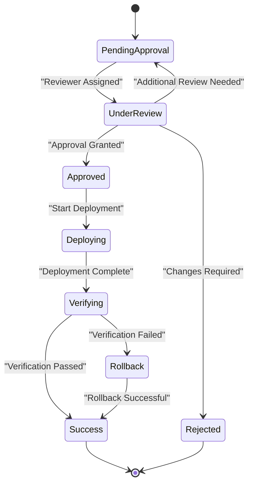
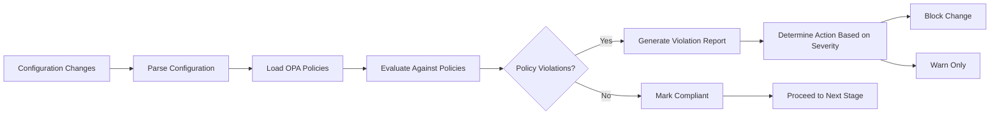
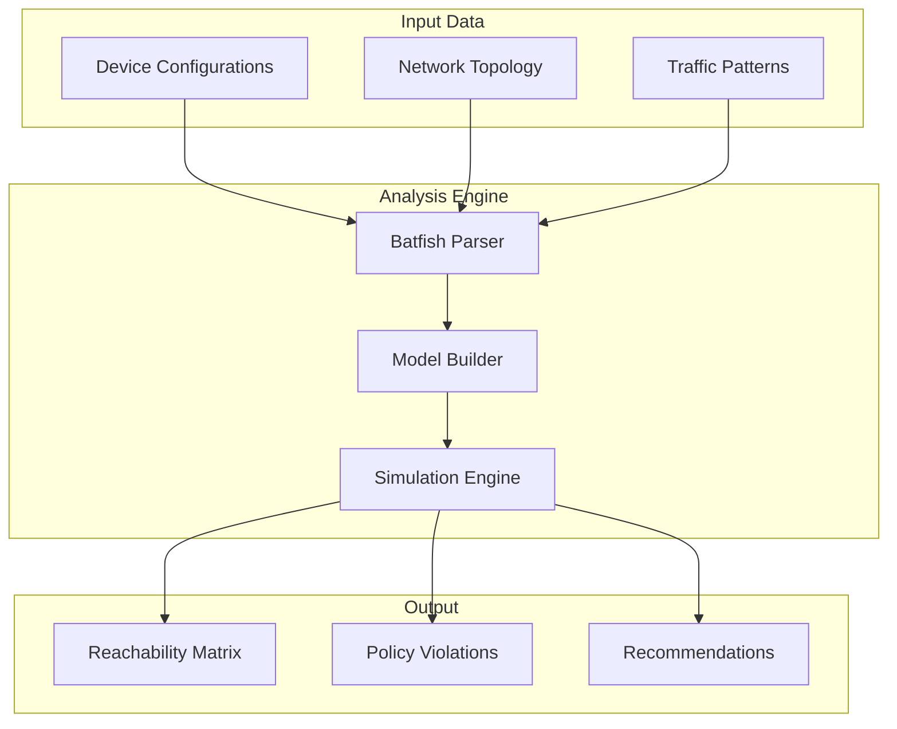
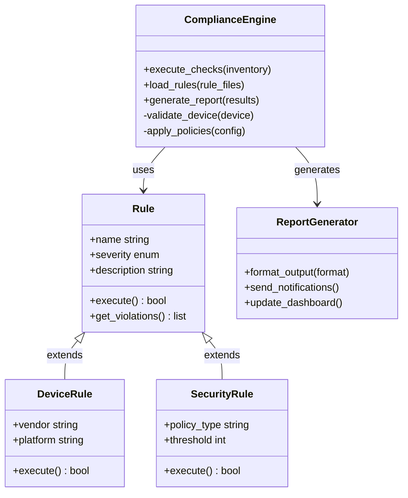
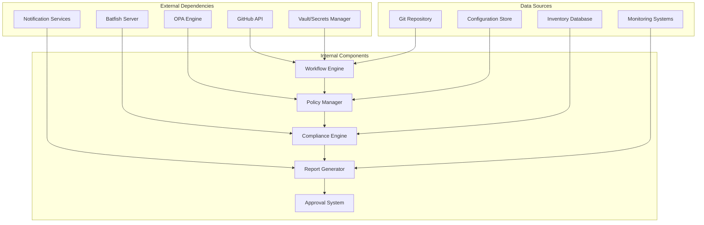

# CI/CD Compliance Gates

<cite>
**Referenced Files in This Document**
- [README.md](file://README.md)
</cite>

## Table of Contents
1. [Introduction](#introduction)
2. [Project Structure](#project-structure)
3. [Core Components](#core-components)
4. [Architecture Overview](#architecture-overview)
5. [Detailed Component Analysis](#detailed-component-analysis)
6. [Dependency Analysis](#dependency-analysis)
7. [Performance Considerations](#performance-considerations)
8. [Troubleshooting Guide](#troubleshooting-guide)
9. [Conclusion](#conclusion)

## Introduction

This document provides comprehensive documentation for CI/CD compliance gates that enforce policy enforcement throughout the automated pipeline in the Enterprise Network Automation Platform. The platform implements a robust compliance framework that ensures security, configuration standards, and operational policies are enforced at every stage of the software development lifecycle.

The compliance system integrates multiple validation layers including Open Policy Agent (OPA) policy evaluation, Batfish network simulation analysis, custom Python compliance execution, and template rendering validation. These gates work together to prevent non-compliant changes from reaching production environments while providing detailed feedback to developers about policy violations.

## Project Structure

The compliance gates are implemented across multiple directories within the repository structure:

**Diagram sources**
- [README.md:105-180](file://README.md#L105-L180)
- [README.md:479-514](file://README.md#L479-L514)

**Section sources**
- [README.md:105-180](file://README.md#L105-L180)
- [README.md:479-514](file://README.md#L479-L514)

## Core Components

The CI/CD compliance system consists of several key components that work together to enforce policies throughout the deployment pipeline:

### GitHub Actions Workflows

The platform implements four primary workflows that handle different stages of the compliance process:

| Workflow | Trigger | Purpose | Key Compliance Checks |
|----------|---------|---------|---------------------|
| `ci-validate.yml` | PR opened/updated | Pull request validation | Linting, schema validation, secrets scanning, unit tests, compliance checks |
| `cd-deploy-staging.yml` | Merge to staging | Staging deployment verification | Template rendering, dry run, integration tests, compliance validation |
| `cd-deploy-production.yml` | Merge to main + approval | Production deployment | Full compliance audit, approval workflow, rollback triggers |
| `compliance-scan.yml` | Scheduled (daily) | Continuous compliance monitoring | Policy enforcement, drift detection, security scanning |

### OPA Policy Evaluation

Open Policy Agent (OPA) policies provide declarative policy enforcement for infrastructure-as-code configurations. The policies define rules for:

- SSH-only access enforcement (no Telnet)
- NTP server configuration requirements
- AAA authentication setup (TACACS+/RADIUS)
- SNMPv3 mandatory usage
- Approved cipher suite validation
- Password complexity and rotation policies
- ACL standard compliance
- Firewall rule validation

### Batfish Network Simulation

Batfish performs deep packet inspection and network behavior analysis to validate:

- ACL reachability and conflicts
- Routing protocol convergence
- Firewall rule effectiveness
- Network connectivity patterns
- Security zone compliance
- Traffic flow validation

### Custom Python Compliance Engine

The Python compliance module provides extensible rule checking capabilities:

- Device-specific compliance validation
- Configuration baseline comparison
- Security posture assessment
- Performance threshold monitoring
- License compliance verification
- Vendor-specific policy enforcement

**Section sources**
- [README.md:479-514](file://README.md#L479-L514)
- [README.md:548-582](file://README.md#L548-L582)

## Architecture Overview

The compliance gate architecture follows a multi-layered approach where each stage adds additional validation depth:

**Diagram sources**
- [README.md:36-50](file://README.md#L36-L50)
- [README.md:483-501](file://README.md#L483-L501)

## Detailed Component Analysis

### Pull Request Validation Gate

The pull request validation gate serves as the first line of defense against non-compliant changes:

#### Validation Sequence

**Diagram sources**
- [README.md:483-501](file://README.md#L483-L501)

#### Key Validation Steps

1. **Code Quality**: Automated linting ensures code style consistency
2. **Schema Validation**: YAML and JSON files validated against defined schemas
3. **Security Scanning**: Secret detection prevents credential leakage
4. **Unit Testing**: Python modules and Jinja2 filters tested
5. **Compliance Checks**: Policy enforcement using custom Python engine
6. **Template Validation**: Jinja2 templates rendered without errors
7. **Dry Run**: Ansible playbooks executed in check mode

### Staging Deployment Verification

The staging environment serves as a pre-production validation layer:

#### Deployment Flow

**Diagram sources**
- [README.md:483-501](file://README.md#L483-L501)

### Production Deployment Approval

Production deployments require manual approval through a structured workflow:

#### Approval Process

**Diagram sources**
- [README.md:619-638](file://README.md#L619-L638)

### OPA Policy Evaluation

OPA policies provide centralized policy management and enforcement:

#### Policy Categories

| Policy Category | Description | Enforcement Point | Severity |
|----------------|-------------|-------------------|----------|
| Access Control | SSH-only, no Telnet, authentication requirements | PR Validation | Critical |
| Configuration Standards | NTP, DNS, logging, banners | All Stages | High |
| Security Baseline | SNMPv3, approved ciphers, password policies | All Stages | High |
| Network Design | ACL standards, routing protocols, VLAN schemes | Network Simulation | Medium |
| Operational Requirements | Monitoring, backup, change management | Runtime | Low |

#### Policy Evaluation Flow

**Diagram sources**
- [README.md:568-579](file://README.md#L568-L579)

### Batfish Network Simulation Analysis

Batfish provides deep network analysis capabilities:

#### Analysis Types

1. **ACL Reachability**: Validates firewall and ACL rules
2. **Routing Convergence**: Ensures proper route propagation
3. **Security Zone Compliance**: Validates network segmentation
4. **Traffic Flow Analysis**: Simulates network traffic patterns
5. **Configuration Consistency**: Detects conflicting rules

#### Simulation Process

**Diagram sources**
- [README.md:524-529](file://README.md#L524-L529)

### Custom Python Compliance Execution

The Python compliance engine provides flexible rule checking:

#### Rule Categories

| Rule Type | Description | Implementation |
|-----------|-------------|----------------|
| Device-Specific | Vendor and platform-specific checks | Modular rule classes |
| Configuration-Based | Running config vs desired state | Diff-based validation |
| Security-Focused | Authentication, encryption, access control | Security policy engine |
| Performance-Oriented | Resource utilization, capacity planning | Threshold monitoring |
| Operational | Backup, monitoring, logging requirements | Service availability checks |

#### Execution Framework

**Diagram sources**
- [README.md:452-456](file://README.md#L452-L456)

### Template Rendering Validation

Jinja2 template validation ensures configuration generation reliability:

#### Validation Process

1. **Syntax Checking**: Jinja2 syntax validation
2. **Variable Resolution**: Template variable completeness
3. **Filter Testing**: Custom filter functionality
4. **Output Validation**: Generated config format verification
5. **Diff Analysis**: Changes between versions

### Failure Handling and Notification Mechanisms

The system implements comprehensive error handling and notification:

#### Error Classification

| Error Type | Severity | Response | Notification |
|------------|----------|----------|--------------|
| Critical Policy Violation | Critical | Block deployment | Immediate alert to team |
| High Severity Issue | High | Block deployment | Slack/Teams notification |
| Medium Severity Warning | Medium | Warn but allow | Dashboard update |
| Low Severity Info | Low | Log only | Weekly report |

#### Notification Channels

- **Slack/Teams**: Real-time notifications for critical issues
- **Email**: Detailed reports for stakeholders
- **Dashboard**: Visual compliance status and trends
- **GitHub Comments**: Inline feedback on pull requests
- **PagerDuty**: Escalation for critical failures

**Section sources**
- [README.md:479-514](file://README.md#L479-L514)
- [README.md:548-582](file://README.md#L548-L582)
- [README.md:674-685](file://README.md#L674-L685)

## Dependency Analysis

The compliance system has well-defined dependencies between components:

**Diagram sources**
- [README.md:339-357](file://README.md#L339-L357)
- [README.md:583-604](file://README.md#L583-L604)

### Component Coupling Analysis

- **Low Coupling**: Each compliance check is modular and independently testable
- **High Cohesion**: Related functionality grouped within modules
- **Clear Interfaces**: Well-defined APIs between components
- **Extensible Design**: New policies and checks can be added without modifying core logic

### External Integration Points

1. **Version Control**: Git operations for configuration management
2. **Secrets Management**: Secure credential handling
3. **Communication Services**: Multi-channel notification delivery
4. **Monitoring Systems**: Metrics collection and alerting
5. **Cloud Providers**: Infrastructure provisioning and management

**Section sources**
- [README.md:339-357](file://README.md#L339-L357)
- [README.md:583-604](file://README.md#L583-L604)

## Performance Considerations

The compliance system is designed for scalability and performance:

### Optimization Strategies

1. **Parallel Processing**: Multiple compliance checks run concurrently
2. **Caching**: Policy results cached to reduce computation overhead
3. **Incremental Analysis**: Only changed configurations re-analyzed
4. **Resource Pooling**: Shared resources for expensive operations like Batfish
5. **Batch Operations**: Grouped device operations for efficiency

### Scalability Factors

- **Horizontal Scaling**: Additional workers for parallel processing
- **Distributed Analysis**: Batfish instances for large networks
- **Asynchronous Processing**: Non-blocking notification delivery
- **Database Optimization**: Efficient querying of compliance history

### Resource Management

- **Memory Usage**: Streaming processing for large configuration files
- **CPU Utilization**: Parallel execution with resource limits
- **Network I/O**: Connection pooling and retry logic
- **Storage**: Efficient artifact retention and cleanup policies

## Troubleshooting Guide

Common issues and their resolutions:

### Pipeline Failures

| Issue | Symptoms | Resolution |
|-------|----------|------------|
| OPA Policy Evaluation Failure | Policy violation errors in logs | Review policy definitions and configuration changes |
| Batfish Analysis Timeout | Long-running analysis jobs | Optimize network topology or increase timeout |
| Template Rendering Errors | Jinja2 syntax errors | Validate template syntax and variable definitions |
| Compliance Check Timeouts | Slow execution times | Optimize rule logic or reduce scope |
| Notification Delivery Failures | Missing alerts | Check service credentials and network connectivity |

### Debugging Tools

1. **Local Compliance Testing**: `python -m python.compliance --inventory inventories/lab/hosts.yml`
2. **Template Debug Mode**: `python -m python.config_gen --debug --device <name>`
3. **OPA Policy Testing**: Direct policy evaluation against sample configurations
4. **Batfish Snapshot Analysis**: Manual network simulation with debug output
5. **Pipeline Logs**: Detailed GitHub Actions execution logs

### Recovery Procedures

1. **Automated Rollback**: Automatic revert to last known good configuration
2. **Manual Intervention**: Override mechanisms for emergency changes
3. **Graceful Degradation**: Continue operation with reduced compliance checks
4. **Emergency Bypass**: Time-limited bypass with audit trail

**Section sources**
- [README.md:674-685](file://README.md#L674-L685)

## Conclusion

The CI/CD compliance gates in the Enterprise Network Automation Platform provide comprehensive policy enforcement throughout the deployment pipeline. The multi-layered approach combining OPA policies, Batfish analysis, custom Python checks, and template validation ensures that only compliant changes reach production environments.

Key benefits include:

- **Early Detection**: Issues identified at pull request stage
- **Comprehensive Coverage**: Multiple validation layers catch different types of violations
- **Automated Enforcement**: No manual intervention required for standard compliance checks
- **Detailed Reporting**: Clear feedback for developers on policy violations
- **Scalable Architecture**: Designed for enterprise-scale network environments
- **Flexible Extension**: Easy addition of new policies and validation rules

The system successfully balances security and operational requirements while maintaining developer productivity through clear feedback and automated remediation suggestions.