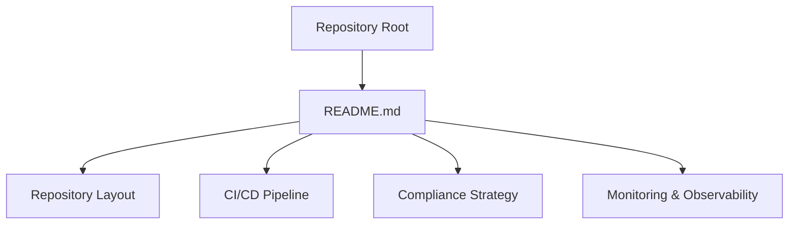
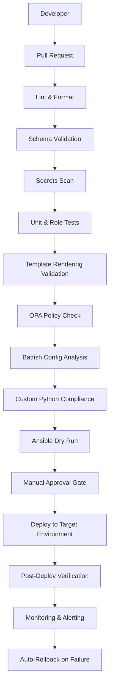
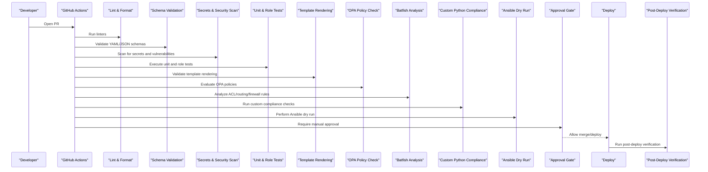
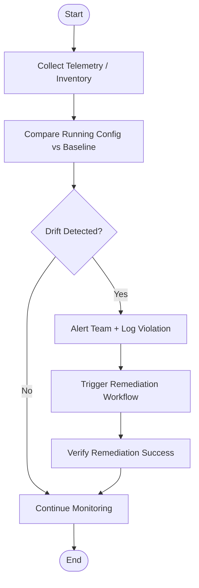
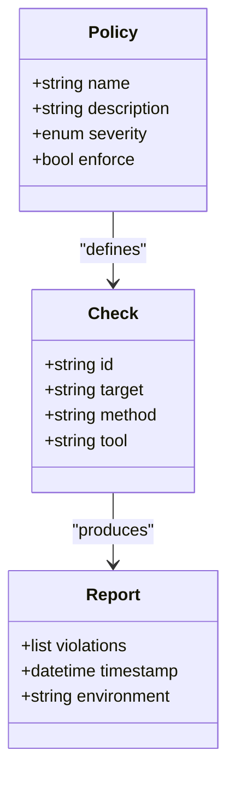
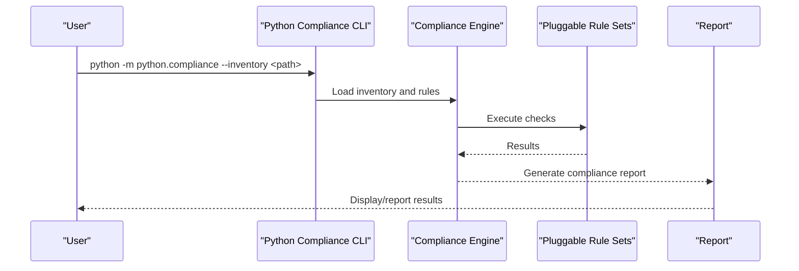
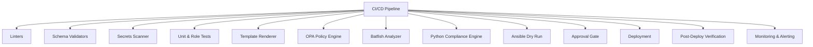

# Compliance Enforcement Stages

<cite>
**Referenced Files in This Document**
- [README.md](file://README.md)
</cite>

## Table of Contents
1. [Introduction](#introduction)
2. [Project Structure](#project-structure)
3. [Core Components](#core-components)
4. [Architecture Overview](#architecture-overview)
5. [Detailed Component Analysis](#detailed-component-analysis)
6. [Dependency Analysis](#dependency-analysis)
7. [Performance Considerations](#performance-considerations)
8. [Troubleshooting Guide](#troubleshooting-guide)
9. [Conclusion](#conclusion)

## Introduction
This document describes the multi-stage compliance enforcement pipeline for the Enterprise Network Automation Platform, covering the full lifecycle from developer push through production runtime. It explains how compliance checks are integrated at each stage: Git push validation, pull request gating, staging deployment verification, and production monitoring. It also outlines violation handling workflows, automated remediation triggers, escalation procedures for critical violations, and the relationship between compliance stages and deployment gates, approval workflows, and rollback mechanisms.

The platform enforces compliance as code across multiple layers: pre-commit hooks, CI/CD pipeline integration, OPA policy checks, Batfish configuration analysis, custom Python compliance execution, and runtime drift detection. The repository’s documentation defines the end-to-end flow and the components involved.

## Project Structure
The repository is a documentation-only snapshot that describes a comprehensive network automation platform with a strong emphasis on compliance. The documented structure includes directories for compliance policies, OPA/Sentinel policies, CI/CD workflows, Python modules (including a compliance engine), bots (including a compliance bot), tests (including compliance tests), and monitoring configurations.

**Diagram sources**
- [README.md:103-180](file://README.md#L103-L180)
- [README.md:479-514](file://README.md#L479-L514)
- [README.md:548-580](file://README.md#L548-L580)
- [README.md:583-616](file://README.md#L583-L616)

**Section sources**
- [README.md:103-180](file://README.md#L103-L180)

## Core Components
The compliance enforcement system integrates several components across development, CI/CD, and runtime:

- Pre-commit hooks: Enforce linting, formatting, and basic checks before commits.
- CI/CD pipeline: Orchestrates schema validation, secrets scanning, unit and role tests, template rendering validation, compliance policy checks, dry runs, approvals, deployments, post-deploy verification, and auto-rollback on failure.
- OPA policy checks: Validate infrastructure-as-code and configuration changes against organizational policies.
- Batfish configuration analysis: Analyze ACLs, routing, and firewall rules for correctness and risk.
- Custom Python compliance execution: Pluggable rule sets executed via a dedicated module and playbook.
- Runtime drift detection: Continuous comparison of running configurations against baselines to detect deviations.
- Compliance bot: API-driven interface to trigger scans and report violations.
- Monitoring and alerting: Dashboards and alerts for compliance posture and drift.

Key capabilities referenced by the repository include:
- A compliance engine with pluggable rule sets under the Python modules.
- A compliance bot exposing an API endpoint for scans and reporting.
- Scheduled compliance audits and integration into CI/CD workflows.
- Post-deploy verification and automatic rollback on failures.

**Section sources**
- [README.md:130-151](file://README.md#L130-L151)
- [README.md:158-170](file://README.md#L158-L170)
- [README.md:192-196](file://README.md#L192-L196)
- [README.md:266-280](file://README.md#L266-L280)
- [README.md:428-434](file://README.md#L428-L434)
- [README.md:452-456](file://README.md#L452-L456)
- [README.md:470-476](file://README.md#L470-L476)
- [README.md:479-514](file://README.md#L479-L514)
- [README.md:548-580](file://README.md#L548-L580)
- [README.md:583-616](file://README.md#L583-L616)

## Architecture Overview
The compliance architecture spans multiple stages and tools, integrating with GitOps and observability systems.

**Diagram sources**
- [README.md:479-514](file://README.md#L479-L514)
- [README.md:548-580](file://README.md#L548-L580)

## Detailed Component Analysis

### Stage 1: Git Push Validation (Pre-commit Hooks)
- Purpose: Prevent non-compliant or low-quality changes from entering the repository.
- Checks: Linting, formatting, basic schema validation, and secrets scanning.
- Integration: Installed locally; enforced before commit.
- Outcome: Early feedback to developers; blocks commits that fail checks.

**Section sources**
- [README.md:257-262](file://README.md#L257-L262)
- [README.md:479-514](file://README.md#L479-L514)

### Stage 2: Pull Request Gating (CI/CD Pipeline)
- Purpose: Comprehensive validation before merging changes.
- Flow: Lint → YAML schema validation → secrets scan → security scan → unit tests → Molecule role tests → template rendering validation → compliance policy check → Ansible dry run → manual approval gate → deploy.
- Compliance Integration:
  - OPA policy checks validate IaC and configuration changes.
  - Batfish analyzes ACLs, routing, and firewall rules.
  - Custom Python compliance executes pluggable rule sets against generated configs.
- Outcome: Merge blocked if any compliance or validation step fails; requires manual approval for production.

**Diagram sources**
- [README.md:479-514](file://README.md#L479-L514)
- [README.md:548-580](file://README.md#L548-L580)

**Section sources**
- [README.md:479-514](file://README.md#L479-L514)
- [README.md:548-580](file://README.md#L548-L580)

### Stage 3: Staging Deployment Verification
- Purpose: Validate compliance and stability in a staging environment prior to production.
- Activities:
  - Automated deployment triggered by merge to staging branch.
  - Post-deploy verification ensures configurations match expected state.
  - Compliance checks continue to run against staged artifacts.
- Outcome: If verification fails, automatic rollback is triggered to revert to last known good state.

**Section sources**
- [README.md:508-514](file://README.md#L508-L514)
- [README.md:624-630](file://README.md#L624-L630)

### Stage 4: Production Monitoring and Drift Detection
- Purpose: Maintain ongoing compliance posture in production.
- Mechanisms:
  - Scheduled compliance audits run daily.
  - Monitoring dashboards track compliance overview, inventory drift, and automation metrics.
  - Alerts notify teams of violations and drift events.
- Outcome: Continuous visibility and rapid response to compliance deviations.

**Diagram sources**
- [README.md:583-616](file://README.md#L583-L616)
- [README.md:508-514](file://README.md#L508-L514)

**Section sources**
- [README.md:508-514](file://README.md#L508-L514)
- [README.md:583-616](file://README.md#L583-L616)

### Compliance Policies and Rules
- Policy categories include SSH-only access, NTP configuration, AAA enablement, SNMPv3 enforcement, logging, approved ciphers, approved firmware versions, password policy, ACL standards, firewall rule hygiene, and unused object detection.
- Severity levels range from Critical to Low, guiding prioritization and escalation.

[No diagram sources needed since this diagram shows conceptual relationships not tied to specific source files]

**Section sources**
- [README.md:554-567](file://README.md#L554-L567)

### Custom Python Compliance Execution
- The platform provides a Python module for compliance checks with pluggable rule sets.
- Local execution is supported via a command-line entry point using an inventory file.
- Playbooks can orchestrate compliance scans across devices.

**Diagram sources**
- [README.md:277-280](file://README.md#L277-L280)
- [README.md:452-456](file://README.md#L452-L456)

**Section sources**
- [README.md:277-280](file://README.md#L277-L280)
- [README.md:452-456](file://README.md#L452-L456)

### Compliance Bot and API Integration
- The compliance bot exposes an API endpoint to trigger scans and retrieve reports.
- Integrates with GitHub for workflow automation and notifications.

**Section sources**
- [README.md:470-476](file://README.md#L470-L476)

### Violation Handling Workflows
- Violations are reported during CI/CD and runtime monitoring.
- Critical violations block merges and may trigger immediate escalation.
- Automated remediation workflows can be triggered based on violation type and severity.
- Escalation procedures involve notifying stakeholders and potentially invoking change advisory board (CAB) review for high-risk changes.

**Section sources**
- [README.md:548-580](file://README.md#L548-L580)
- [README.md:624-630](file://README.md#L624-L630)

### Automated Remediation Triggers
- Remediation can be initiated by bots or scheduled jobs when violations are detected.
- Post-remediation verification ensures successful correction.

**Section sources**
- [README.md:470-476](file://README.md#L470-L476)
- [README.md:583-616](file://README.md#L583-L616)

### Escalation Procedures for Critical Violations
- Critical violations halt deployment and require manual intervention.
- Notifications are sent via Slack, Teams, PagerDuty, and GitHub.
- CAB review may be required for production changes impacting critical services.

**Section sources**
- [README.md:583-616](file://README.md#L583-L616)
- [README.md:624-630](file://README.md#L624-L630)

### Relationship Between Compliance Stages and Deployment Gates
- Each stage acts as a gate:
  - Pre-commit: Blocks non-compliant commits.
  - PR gating: Blocks merge until all checks pass and approvals are granted.
  - Staging verification: Ensures compliance holds in a realistic environment.
  - Production monitoring: Continuously validates compliance and triggers rollback if necessary.
- Approval workflows integrate with ChatOps and GitHub Actions for transparency and auditability.

**Section sources**
- [README.md:479-514](file://README.md#L479-L514)
- [README.md:619-630](file://README.md#L619-L630)

## Dependency Analysis
The compliance pipeline depends on multiple tools and services:

**Diagram sources**
- [README.md:479-514](file://README.md#L479-L514)
- [README.md:548-580](file://README.md#L548-L580)

**Section sources**
- [README.md:479-514](file://README.md#L479-L514)

## Performance Considerations
- Parallelize independent checks (linting, schema validation, secrets scanning) to reduce pipeline duration.
- Cache dependencies and test environments to speed up repeated runs.
- Use incremental analysis where possible (e.g., only analyze changed configurations).
- Optimize Batfish snapshots and OPA policy evaluation by limiting scope to affected resources.
- Schedule heavy compliance audits off-peak hours to minimize impact on CI throughput.

[No sources needed since this section provides general guidance]

## Troubleshooting Guide
Common issues and resolutions related to compliance and automation:

- Ansible connection timeout: Verify SSH reachability and credentials.
- Template rendering error: Debug Jinja2 syntax and variables.
- Compliance check failure: Review compliance policies and device running config diffs.
- CI pipeline failure: Inspect GitHub Actions logs for actionable errors.
- Vault authentication failure: Verify OIDC token or AppRole credentials and Vault policies.
- Molecule test failure: Ensure Docker/Podman is running and molecule configuration is correct.
- Batfish analysis error: Validate snapshots and input configurations.

**Section sources**
- [README.md:674-685](file://README.md#L674-L685)

## Conclusion
The Enterprise Network Automation Platform implements a robust, multi-stage compliance enforcement pipeline that integrates seamlessly with GitOps practices. By enforcing compliance at every stage—from pre-commit hooks through production monitoring—the platform ensures secure, stable, and auditable network operations. Automated remediation and clear escalation procedures further strengthen resilience and operational efficiency.

[No sources needed since this section summarizes without analyzing specific files]