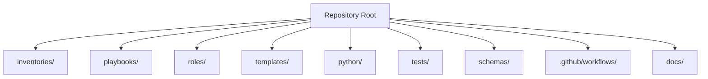
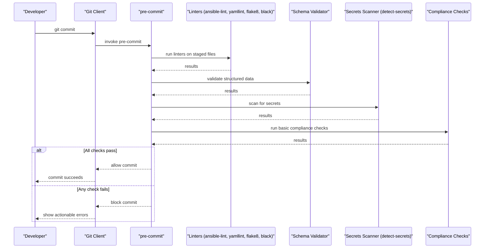
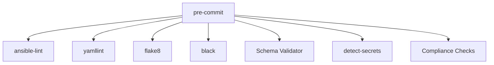
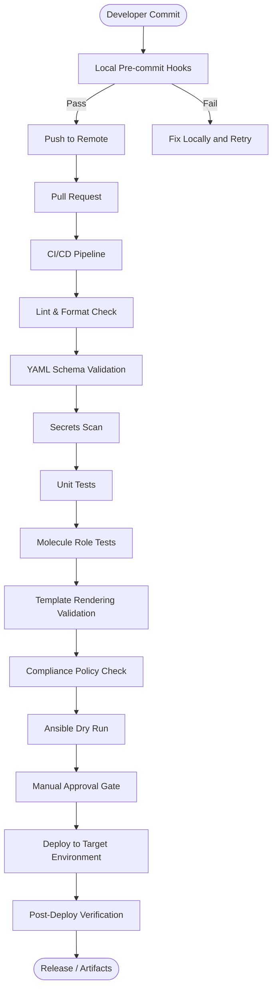

# Pre-Commit Hooks

<cite>
**Referenced Files in This Document**
- [README.md](file://README.md)
</cite>

## Table of Contents
1. [Introduction](#introduction)
2. [Project Structure](#project-structure)
3. [Core Components](#core-components)
4. [Architecture Overview](#architecture-overview)
5. [Detailed Component Analysis](#detailed-component-analysis)
6. [Dependency Analysis](#dependency-analysis)
7. [Performance Considerations](#performance-considerations)
8. [Troubleshooting Guide](#troubleshooting-guide)
9. [Conclusion](#conclusion)
10. [Appendices](#appendices)

## Introduction
This document explains how pre-commit hooks provide early, local validation for the Enterprise Network Automation Platform. It covers the set of checks enforced before commits (linting, schema validation, secrets scanning, and basic compliance), how to configure and customize them, how they integrate with IDEs, and how they relate to CI/CD pipeline stages to deliver fast feedback to developers.

The platform’s documentation specifies that pre-commit hooks are part of the development workflow and that PRs must pass linting, schema validation, secrets scanning, and compliance checks. These same checks are intended to run locally via pre-commit to catch issues before pushing code.

**Section sources**
- [README.md:191-192](file://README.md#L191-L192)
- [README.md:256-258](file://README.md#L256-L258)
- [README.md:701-730](file://README.md#L701-L730)

## Project Structure
The repository is a large, modular network automation platform. While this document focuses on pre-commit hooks, it references the broader structure where relevant (e.g., inventories, playbooks, schemas, tests). The project layout and technology stack indicate the presence of Ansible content, Python modules, YAML configuration, and CI/CD workflows.

[No sources needed since this diagram shows conceptual structure]

**Section sources**
- [README.md:103-180](file://README.md#L103-L180)

## Core Components
Pre-commit hooks in this platform are designed to enforce quality and security at commit time. Based on the repository documentation, the following components are expected to be configured as pre-commit hooks:

- Linting and formatting
  - ansible-lint for Ansible playbooks, roles, and related files
  - yamllint for YAML syntax and style
  - flake8 for Python style and basic errors
  - black for Python formatting
- Schema validation
  - Validation of inventory, group_vars, host_vars, and other structured data against JSON/YAML schemas
- Secrets scanning
  - detect-secrets to prevent accidental secret commits
- Basic compliance checks
  - Lightweight policy checks aligned with the platform’s compliance strategy (e.g., SSH-only, NTP, AAA, SNMPv3, cipher standards)

These hooks mirror the checks required by pull requests and CI/CD pipelines, ensuring consistent enforcement across local development and remote automation.

**Section sources**
- [README.md:517-529](file://README.md#L517-L529)
- [README.md:724-729](file://README.md#L724-L729)

## Architecture Overview
Pre-commit hooks act as the first line of defense in the GitOps workflow. They run locally before a commit is created, providing immediate feedback and preventing problematic changes from entering version control.

[No sources needed since this diagram shows conceptual workflow]

## Detailed Component Analysis

### Linting and Formatting
- ansible-lint: Enforces Ansible best practices and style rules for playbooks, roles, and related files.
- yamllint: Validates YAML syntax and enforces style guidelines for all YAML files.
- flake8: Checks Python code for style and potential errors.
- black: Formats Python code consistently.

Configuration guidance:
- Define hook entries for each tool, specifying file patterns (e.g., *.yml, *.yaml, *.py, Ansible-specific paths).
- Use per-tool configuration files (e.g., .ansible-lint, .yamllint, setup.cfg or pyproject.toml for flake8/black) to tailor behavior.
- Exclude generated or third-party directories to reduce runtime overhead.

Integration notes:
- Ensure your virtual environment includes these tools so pre-commit can locate them.
- If using an IDE, enable “run pre-commit on save” or “format on save” to align editor behavior with hook expectations.

**Section sources**
- [README.md:517-529](file://README.md#L517-L529)
- [README.md:724-729](file://README.md#L724-L729)

### Schema Validation
- Purpose: Validate structured data such as inventories, group_vars, and host_vars against defined JSON/YAML schemas.
- Scope: Focus on files under inventories/, group_vars/, host_vars/, and any additional structured data directories.
- Benefits: Catches structural mistakes early, prevents invalid configurations from reaching CI/CD.

Implementation tips:
- Map schema files to input directories and define strictness levels.
- Fail fast on missing required fields or incorrect types.
- Keep schemas versioned alongside the data they validate.

**Section sources**
- [README.md:103-180](file://README.md#L103-L180)
- [README.md:517-529](file://README.md#L517-L529)

### Secrets Scanning with detect-secrets
- Purpose: Prevent accidental inclusion of secrets (passwords, tokens, keys) in the repository.
- Behavior: Scans staged files for known secret patterns; blocks commit if violations are found.
- Configuration: Maintain a baseline and ignore list for false positives; update regularly.

Operational guidance:
- Initialize and train the scanner baseline during bootstrap.
- Configure exclusions for intentionally non-secret examples or test fixtures.
- Integrate with IDEs to surface warnings before committing.

**Section sources**
- [README.md:479-501](file://README.md#L479-L501)
- [README.md:724-729](file://README.md#L724-L729)

### Basic Compliance Checks
- Purpose: Enforce core security and operational policies early (e.g., SSH-only, NTP, AAA, SNMPv3, approved ciphers).
- Scope: Lightweight checks suitable for local execution; deeper analysis may occur in CI/CD.
- Integration: Align with the platform’s compliance strategy and reporting.

Implementation tips:
- Provide rule definitions and severity levels.
- Generate concise reports pointing to specific violations and remediation steps.
- Allow bypass only for exceptional cases with documented justification.

**Section sources**
- [README.md:548-579](file://README.md#L548-L579)

### Custom Hook Development
When adding custom hooks:
- Create a small executable script or Python module that performs the desired check.
- Register the hook in the pre-commit configuration with appropriate file patterns and arguments.
- Ensure the hook exits with a non-zero status on failure and provides clear error messages.
- Add tests for the hook to verify correctness and stability.

IDE integration:
- Many editors support running pre-commit on save or on demand.
- Configure your IDE to use the same virtual environment and settings as the repository.

**Section sources**
- [README.md:701-730](file://README.md#L701-L730)

## Dependency Analysis
Pre-commit hooks depend on the developer’s local environment and the repository’s configuration. The following diagram illustrates typical dependencies among tools and files.

[No sources needed since this diagram shows conceptual dependencies]

**Section sources**
- [README.md:517-529](file://README.md#L517-L529)
- [README.md:724-729](file://README.md#L724-L729)

## Performance Considerations
- Keep hook sets focused on staged files to minimize runtime.
- Exclude large or generated directories from scanning.
- Cache tool installations and outputs where supported.
- Prefer lightweight checks locally; defer heavy analysis to CI/CD.
- Parallelize independent hooks when possible.

[No sources needed since this section provides general guidance]

## Troubleshooting Guide
Common issues and resolutions:
- Hook not installed: Run the installation command to register hooks in the repository.
- Tool not found: Ensure the virtual environment is activated and contains required packages.
- False positives in secrets scanning: Update ignore lists and retrain the baseline.
- Linter failures: Review tool output and fix style or syntax issues; consider adjusting per-tool configs.
- Schema validation errors: Inspect structured data against schema definitions and correct mismatches.
- Compliance check failures: Address flagged policy violations and re-run hooks.

Additional context:
- The repository documents troubleshooting topics such as connection timeouts, template rendering errors, Vault authentication, and Molecule/Batfish issues. While not directly about pre-commit, these insights help diagnose downstream problems once hooks pass.

**Section sources**
- [README.md:256-258](file://README.md#L256-L258)
- [README.md:674-685](file://README.md#L674-L685)

## Conclusion
Pre-commit hooks provide essential, fast feedback for the Enterprise Network Automation Platform by enforcing linting, formatting, schema validation, secrets scanning, and basic compliance checks locally. They complement CI/CD pipelines by catching issues early, reducing review cycles, and improving overall code quality and security posture.

[No sources needed since this section summarizes without analyzing specific files]

## Appendices

### Relationship Between Pre-Commit Hooks and CI/CD Stages
Pre-commit hooks mirror the checks executed in CI/CD to ensure consistency between local development and automated pipelines. The repository outlines a CI/CD flow that includes linting, schema validation, secrets scanning, unit tests, role tests, template rendering validation, compliance checks, dry runs, approval gates, deployment, and post-deploy verification.

**Section sources**
- [README.md:479-501](file://README.md#L479-L501)
- [README.md:517-529](file://README.md#L517-L529)
- [README.md:724-729](file://README.md#L724-L729)