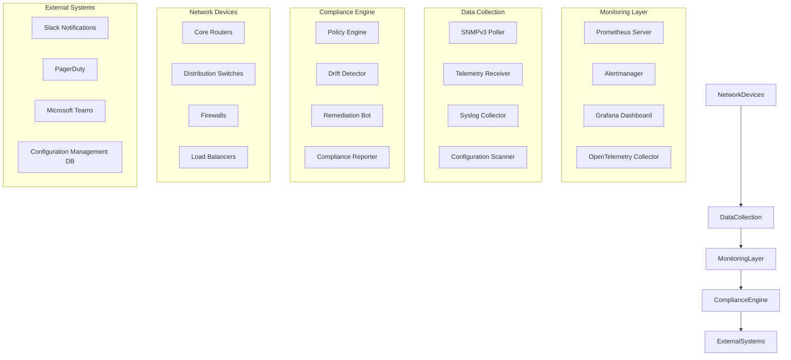
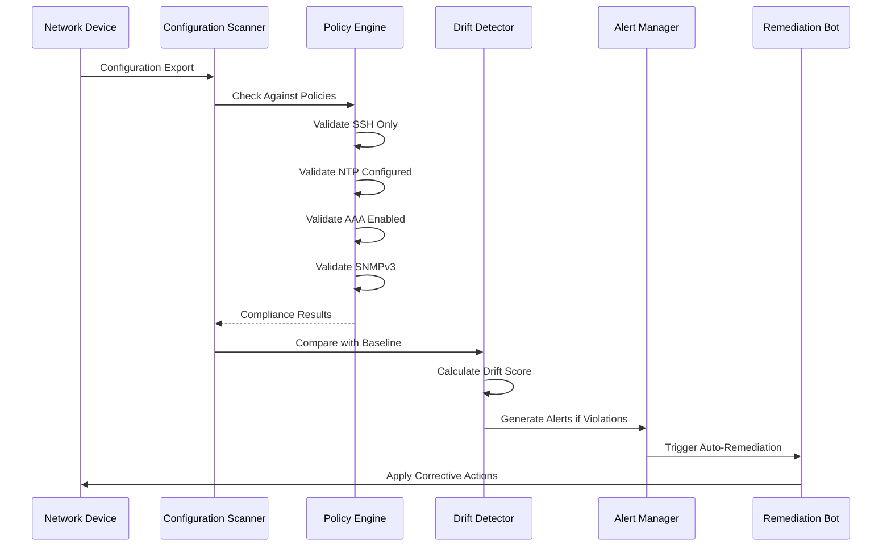
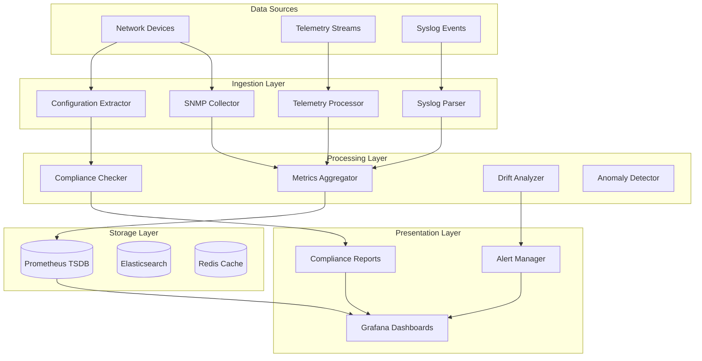
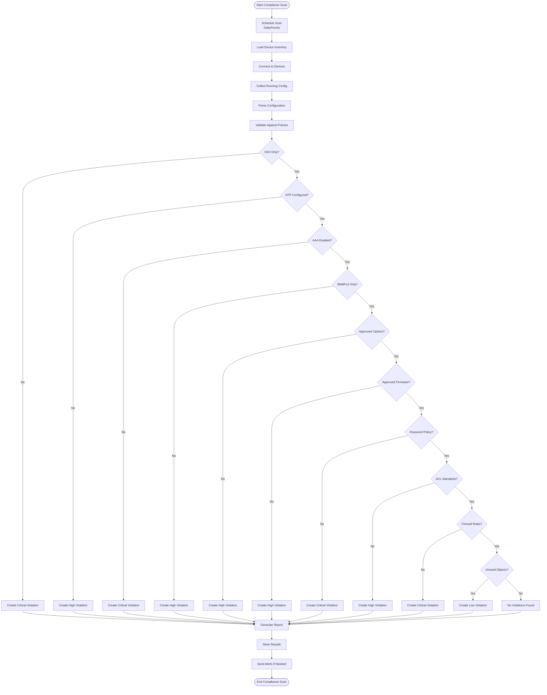
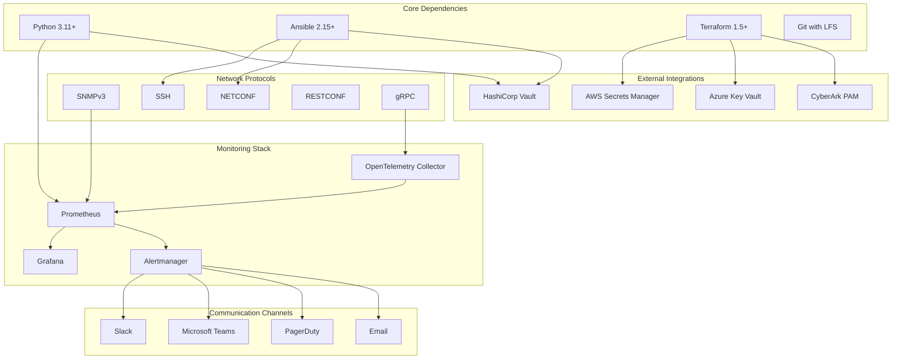

# Production Runtime Monitoring

<cite>
**Referenced Files in This Document**
- [README.md](file://README.md)
</cite>

## Table of Contents
1. [Introduction](#introduction)
2. [Project Structure](#project-structure)
3. [Core Components](#core-components)
4. [Architecture Overview](#architecture-overview)
5. [Detailed Component Analysis](#detailed-component-analysis)
6. [Dependency Analysis](#dependency-analysis)
7. [Performance Considerations](#performance-considerations)
8. [Troubleshooting Guide](#troubleshooting-guide)
9. [Conclusion](#conclusion)
10. [Appendices](#appendices)

## Introduction

This document provides comprehensive guidance for implementing production runtime monitoring and continuous compliance enforcement for enterprise network devices. It covers periodic compliance scans, real-time drift detection, automated remediation triggers, alerting mechanisms, and integration with Prometheus metrics collection, Grafana dashboards, and Alertmanager notifications.

The approach described here aligns with modern DevOps practices and ensures that network configurations remain compliant with organizational policies while providing real-time visibility into device health and configuration drift.

## Project Structure

The monitoring and compliance system follows a modular architecture designed for scalability and maintainability:



**Diagram sources**
- [README.md:583-604](file://README.md#L583-L604)

**Section sources**
- [README.md:103-180](file://README.md#L103-L180)

## Core Components

### Monitoring Architecture

The monitoring system collects data from network devices through multiple protocols and channels:

| Component | Purpose | Protocol/Method |
|-----------|---------|-----------------|
| **SNMP Poller** | Collects device metrics via SNMPv3 | SNMPv3 polling |
| **Telemetry Receiver** | Receives model-driven telemetry streams | gRPC, NETCONF streaming |
| **Syslog Collector** | Aggregates device logs and events | UDP/TCP syslog |
| **Configuration Scanner** | Periodically scans device configurations | SSH, NETCONF, RESTCONF |
| **Prometheus Server** | Stores time-series metrics | HTTP scraping |
| **Alertmanager** | Processes alerts and sends notifications | Webhook integrations |
| **Grafana** | Visualizes metrics and creates dashboards | HTTP API |

### Compliance Enforcement Pipeline

The compliance system operates at multiple stages to ensure continuous adherence to policies:



**Diagram sources**
- [README.md:548-579](file://README.md#L548-L579)

**Section sources**
- [README.md:583-616](file://README.md#L583-L616)

## Architecture Overview

### Real-Time Monitoring Flow

The system implements a comprehensive monitoring architecture that captures both operational metrics and compliance status:



**Diagram sources**
- [README.md:583-604](file://README.md#L583-L604)

### Compliance Scanning Workflow

The compliance scanning system performs continuous validation against organizational policies:



**Diagram sources**
- [README.md:552-566](file://README.md#L552-L566)

**Section sources**
- [README.md:548-579](file://README.md#L548-L579)

## Detailed Component Analysis

### Prometheus Integration

The system integrates with Prometheus for metrics collection and storage:

#### Key Metrics Collected

| Metric Name | Type | Description | Labels |
|-------------|------|-------------|--------|
| `device_up` | Gauge | Device reachability status | device, vendor, platform, region |
| `device_cpu_usage` | Gauge | CPU utilization percentage | device, vendor, platform |
| `device_memory_usage` | Gauge | Memory utilization percentage | device, vendor, platform |
| `interface_errors_total` | Counter | Interface error count | device, interface, error_type |
| `compliance_violations_total` | Counter | Total compliance violations | policy, severity, device |
| `drift_score` | Gauge | Configuration drift score | device, baseline_version |
| `scan_duration_seconds` | Histogram | Compliance scan duration | scan_type, target_group |
| `remediation_success_rate` | Gauge | Automated remediation success rate | action_type, device_group |

#### Prometheus Configuration Example

The system uses Prometheus service discovery and scrape configurations to collect metrics from various sources:

```yaml
# Prometheus scrape configuration
scrape_configs:
  - job_name: 'network_devices'
    static_configs:
      - targets: ['snmp-collector:9116', 'telemetry-receiver:9117']
    metrics_path: '/metrics'
    scrape_interval: 30s
    
  - job_name: 'compliance_scanner'
    static_configs:
      - targets: ['compliance-scanner:8080']
    metrics_path: '/metrics'
    scrape_interval: 60s
    
  - job_name: 'drift_detector'
    static_configs:
      - targets: ['drift-detector:8081']
    metrics_path: '/metrics'
    scrape_interval: 120s
```

### Grafana Dashboard Configuration

The system provides comprehensive Grafana dashboards for monitoring and visualization:

#### Dashboard Categories

| Dashboard | Purpose | Key Panels | Refresh Interval |
|-----------|---------|------------|------------------|
| **Network Health Overview** | Overall network device health | Device status, CPU/memory usage, interface errors | 30 seconds |
| **Compliance Status** | Real-time compliance monitoring | Violations by severity, trend analysis, policy breakdown | 1 minute |
| **Drift Detection** | Configuration drift monitoring | Drift scores, affected devices, change history | 5 minutes |
| **Automation Performance** | Automation pipeline metrics | Job success rates, execution times, failure analysis | 1 minute |
| **Alert Summary** | Active and historical alerts | Alert severity distribution, notification delivery status | 1 minute |

#### Sample Grafana Query Examples

```promql
# Device compliance violations by severity
sum by (severity) (compliance_violations_total)

# Average CPU usage across all devices
avg(device_cpu_usage) by (vendor, platform)

# Configuration drift score over time
drift_score{device="core-rtr-01"}

# Compliance scan success rate
rate(scan_duration_seconds_count[5m]) / rate(scan_duration_seconds_sum[5m])

# Alert notification delivery failures
sum(alertmanager_notifications_failed_total) by (notification_channel)
```

### Alertmanager Integration

The system integrates with Alertmanager for intelligent alerting and notification management:

#### Alert Rules Configuration

```yaml
# Alert rules for compliance monitoring
groups:
  - name: compliance_alerts
    rules:
      - alert: CriticalComplianceViolation
        expr: compliance_violations_total{severity="critical"} > 0
        for: 5m
        labels:
          severity: critical
          category: compliance
        annotations:
          summary: "Critical compliance violation detected on {{ $labels.device }}"
          description: "Device {{ $labels.device }} has failed critical compliance check: {{ $labels.policy }}"
          
      - alert: HighDriftScore
        expr: drift_score > 0.8
        for: 10m
        labels:
          severity: high
          category: drift
        annotations:
          summary: "High configuration drift detected on {{ $labels.device }}"
          description: "Device {{ $labels.device }} has drift score {{ $value }}, exceeding threshold"
          
      - alert: ComplianceScanFailure
        expr: rate(compliance_scan_failures_total[5m]) > 0
        for: 15m
        labels:
          severity: warning
          category: automation
        annotations:
          summary: "Compliance scan failures detected"
          description: "Multiple compliance scan failures detected in the last 15 minutes"
```

#### Notification Channels

The system supports multiple notification channels for alert delivery:

| Channel | Configuration | Use Case |
|---------|---------------|----------|
| **Slack** | Webhook integration | Team notifications, chat-based response |
| **PagerDuty** | API integration | On-call escalation, incident management |
| **Microsoft Teams** | Webhook integration | Enterprise communication, channel-based alerts |
| **Email** | SMTP configuration | Audit trails, formal notifications |
| **Webhook** | Custom endpoints | Integration with external systems |

**Section sources**
- [README.md:583-616](file://README.md#L583-L616)

## Dependency Analysis

### System Dependencies

The monitoring and compliance system has well-defined dependencies between components:



**Diagram sources**
- [README.md:184-199](file://README.md#L184-L199)
- [README.md:339-357](file://README.md#L339-L357)

### Component Coupling Analysis

The system demonstrates low coupling and high cohesion through its modular design:

| Component | Internal Cohesion | External Coupling | Dependencies |
|-----------|-------------------|-------------------|--------------|
| **SNMP Collector** | High - focused on SNMP operations | Medium - depends on network connectivity | SNMP libraries, config management |
| **Telemetry Processor** | High - handles telemetry parsing | Medium - depends on protocol implementations | gRPC, NETCONF clients |
| **Compliance Engine** | High - policy evaluation logic | Low - stateless processing | Policy definitions, device configs |
| **Drift Detector** | High - comparison algorithms | Medium - requires baseline data | Configuration storage, diff tools |
| **Alert Manager** | High - notification routing | High - external integrations | Webhook APIs, notification services |
| **Dashboard Generator** | High - visualization logic | Low - reads from metrics store | Prometheus API, template engine |

**Section sources**
- [README.md:184-199](file://README.md#L184-L199)

## Performance Considerations

### Scalability Guidelines

For production deployments handling thousands of network devices:

#### Resource Requirements

| Component | Minimum Resources | Recommended Resources | Scaling Factor |
|-----------|-------------------|----------------------|----------------|
| **Prometheus** | 4 CPU, 8GB RAM | 8+ CPU, 16GB+ RAM | Per 1K devices |
| **Grafana** | 2 CPU, 4GB RAM | 4+ CPU, 8GB+ RAM | Per dashboard complexity |
| **Alertmanager** | 1 CPU, 2GB RAM | 2+ CPU, 4GB+ RAM | Per notification channel |
| **Compliance Scanner** | 2 CPU, 4GB RAM | 4+ CPU, 8GB+ RAM | Per device batch size |
| **Drift Detector** | 2 CPU, 4GB RAM | 4+ CPU, 8GB+ RAM | Per configuration size |

#### Optimization Strategies

- **Batch Processing**: Process devices in batches to avoid overwhelming network resources
- **Caching**: Implement caching for frequently accessed device configurations
- **Asynchronous Operations**: Use async processing for long-running compliance checks
- **Connection Pooling**: Maintain persistent connections to reduce authentication overhead
- **Metric Retention**: Configure appropriate retention policies for different metric types

### Monitoring Best Practices

- **Sampling Rates**: Adjust scrape intervals based on device criticality
- **Alert Thresholds**: Set dynamic thresholds based on historical baselines
- **Metric Cardinality**: Control metric label cardinality to prevent performance degradation
- **Storage Planning**: Plan Prometheus storage capacity based on expected growth
- **Backup Strategy**: Implement regular backups of monitoring data and configurations

## Troubleshooting Guide

### Common Issues and Resolutions

| Issue | Symptoms | Resolution |
|-------|----------|------------|
| **Prometheus Connection Failures** | Missing metrics, scrape errors | Verify network connectivity, check firewall rules, validate credentials |
| **Compliance Scan Timeouts** | Slow scan completion, device timeouts | Increase timeout values, implement retry logic, optimize query batching |
| **Alert Storm Conditions** | Excessive notifications, alert fatigue | Implement alert grouping, deduplication, and suppression rules |
| **Dashboard Performance Issues** | Slow loading, incomplete data | Optimize queries, increase Grafana resources, implement caching |
| **Configuration Drift False Positives** | Incorrect drift detection, noisy alerts | Refine baseline comparisons, exclude expected changes, improve parsing |

### Diagnostic Commands

```bash
# Test Prometheus connectivity
curl -s http://prometheus:9090/-/healthy

# Check compliance scanner status
curl -s http://compliance-scanner:8080/health

# Verify device connectivity
ansible all -m ping -i inventories/production/hosts.yml

# Test SNMP connectivity
snmpwalk -v3 -u monitor_user -l authPriv -a SHA -A password -x AES -X password device_ip sysUpTime

# Check Alertmanager status
curl -s http://alertmanager:9093/api/v1/status
```

### Log Analysis

Key log locations and patterns for troubleshooting:

- **Prometheus Logs**: `/var/log/prometheus/prometheus.log`
- **Compliance Scanner Logs**: Application-specific logging directory
- **Alertmanager Logs**: `/var/log/alertmanager/alertmanager.log`
- **Device Communication Logs**: Centralized logging system (ELK/Splunk)

**Section sources**
- [README.md:674-685](file://README.md#L674-L685)

## Conclusion

The production runtime monitoring and continuous compliance enforcement system provides comprehensive visibility and control over enterprise network infrastructure. By integrating Prometheus for metrics collection, Grafana for visualization, and Alertmanager for intelligent alerting, organizations can maintain strict compliance standards while ensuring optimal network performance.

The modular architecture enables scalable deployment across large device fleets, while the automated compliance checking and remediation processes reduce manual intervention and minimize security risks. The system's emphasis on Infrastructure as Code principles ensures that all monitoring and compliance configurations are version-controlled, testable, and reproducible.

Key benefits include:
- **Continuous Compliance**: Real-time validation against organizational policies
- **Proactive Monitoring**: Early detection of configuration drift and performance issues
- **Automated Response**: Intelligent remediation of common compliance violations
- **Comprehensive Visibility**: Unified dashboards for network health and compliance status
- **Scalable Architecture**: Designed to handle thousands of network devices efficiently

## Appendices

### A. Quick Start Checklist

- [ ] Deploy Prometheus and configure scrape targets
- [ ] Install and configure Grafana with pre-built dashboards
- [ ] Set up Alertmanager with notification channels
- [ ] Configure compliance scanning schedules
- [ ] Define alert rules and thresholds
- [ ] Test end-to-end monitoring and alerting workflows
- [ ] Document runbooks for common scenarios

### B. Compliance Policy Templates

Available compliance policy templates cover common regulatory requirements:
- PCI DSS Network Security Requirements
- SOX IT General Controls
- NIST Cybersecurity Framework
- CIS Network Device Benchmarks
- Organization-Specific Security Policies

### C. Integration Examples

Sample integrations with popular enterprise systems:
- ServiceNow for ticketing and change management
- Jira for issue tracking and workflow automation
- Confluence for documentation and knowledge sharing
- Splunk for advanced log analysis and correlation
- NetBox for inventory and IP address management