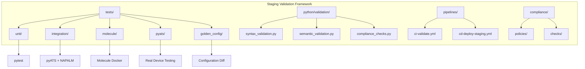
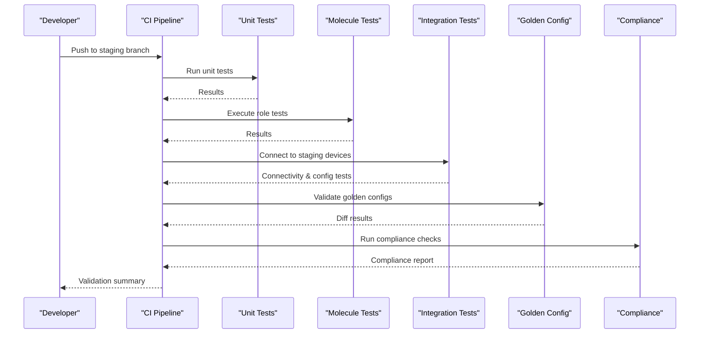
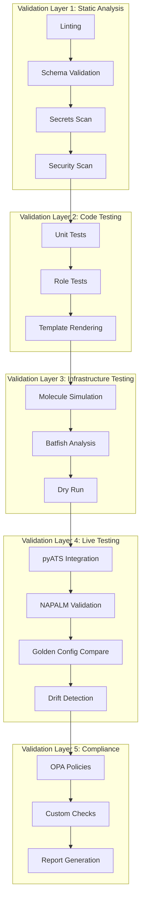
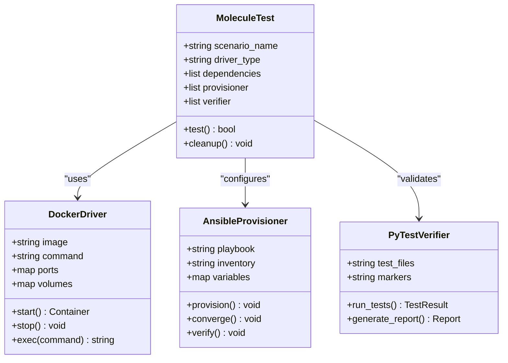
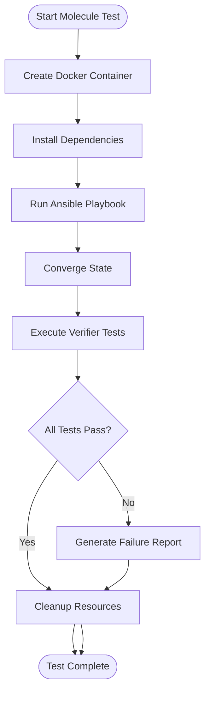
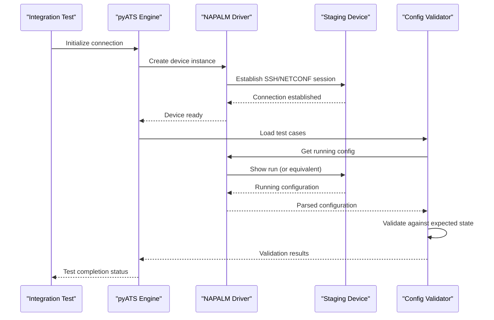
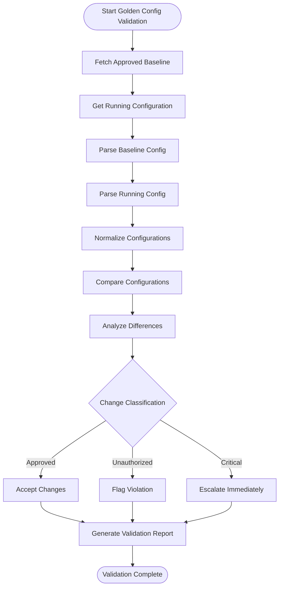
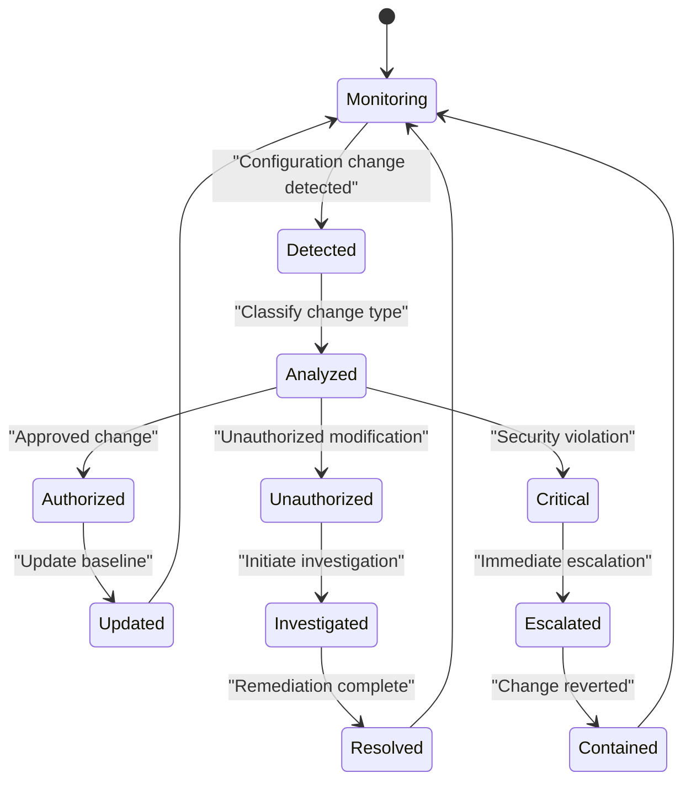
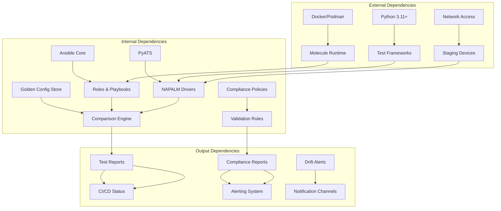

# Staging Environment Validation

<cite>
**Referenced Files in This Document**
- [README.md](file://README.md)
</cite>

## Table of Contents
1. [Introduction](#introduction)
2. [Project Structure](#project-structure)
3. [Core Components](#core-components)
4. [Architecture Overview](#architecture-overview)
5. [Detailed Component Analysis](#detailed-component-analysis)
6. [Dependency Analysis](#dependency-analysis)
7. [Performance Considerations](#performance-considerations)
8. [Troubleshooting Guide](#troubleshooting-guide)
9. [Conclusion](#conclusion)

## Introduction

This document provides comprehensive documentation for staging environment validation processes within the Enterprise Network Automation Platform's compliance enforcement pipeline. The platform implements a robust, multi-layered validation strategy that ensures configuration integrity, security compliance, and operational readiness before deployment to production environments.

The staging validation process encompasses automated testing against simulated and real staging infrastructure, including Molecule role tests, integration tests with actual devices using pyATS and NAPALM, golden configuration validation, and continuous drift detection. These validations serve as critical gates in the GitOps workflow, preventing problematic changes from reaching production while providing confidence in deployment readiness.

## Project Structure

The staging validation framework is organized around several key directories and components that work together to provide comprehensive test coverage:

**Diagram sources**
- [README.md:103-180](file://README.md#L103-L180)
- [README.md:517-545](file://README.md#L517-L545)

The validation framework follows a layered approach where each layer builds upon the previous one, providing increasingly realistic and comprehensive testing scenarios.

**Section sources**
- [README.md:103-180](file://README.md#L103-L180)
- [README.md:517-545](file://README.md#L517-L545)

## Core Components

### Test Execution Framework

The staging validation system employs multiple testing frameworks, each serving specific validation purposes:

| Test Type | Tool | Scope | Execution Context |
|-----------|------|-------|-------------------|
| Unit Tests | pytest | Python modules, Jinja2 filters | Every PR |
| Role Tests | Molecule | Individual Ansible roles | Every PR |
| Integration Tests | pyATS, NAPALM | Device connectivity, config parsing | Staging deploy |
| Golden Config Tests | Custom Python | Diff against approved baseline | Every PR, scheduled |
| Compliance Checks | Custom Python, OPA | Policy violations, security standards | Every PR, scheduled |

### Automated Testing Layers

The validation process consists of several automated testing layers that execute in sequence:

**Diagram sources**
- [README.md:479-514](file://README.md#L479-L514)
- [README.md:517-545](file://README.md#L517-L545)

**Section sources**
- [README.md:517-545](file://README.md#L517-L545)

## Architecture Overview

The staging validation architecture integrates multiple tools and frameworks to provide comprehensive testing coverage across different abstraction levels:

**Diagram sources**
- [README.md:479-514](file://README.md#L479-L514)
- [README.md:517-545](file://README.md#L517-L545)

The architecture follows a progressive testing approach, moving from fast, static analysis to slower, more resource-intensive live device testing. Each layer serves as a gate, preventing failures from progressing to subsequent stages.

## Detailed Component Analysis

### Molecule Role Tests

Molecule tests provide isolated testing environments for individual Ansible roles using Docker containers. This approach ensures role functionality without requiring actual network devices.

#### Test Configuration Structure

**Diagram sources**
- [README.md:103-180](file://README.md#L103-L180)
- [README.md:517-545](file://README.md#L517-L545)

#### Test Execution Flow

**Diagram sources**
- [README.md:517-545](file://README.md#L517-L545)

### Integration Tests with Real Devices

Integration tests utilize pyATS and NAPALM to validate configurations against actual staging network devices, providing the most realistic testing environment.

#### Device Connectivity Setup

**Diagram sources**
- [README.md:517-545](file://README.md#L517-L545)

#### Test Categories

| Test Category | Description | Tools Used | Frequency |
|---------------|-------------|------------|-----------|
| Connectivity Tests | Verify device reachability and protocol support | pyATS, NAPALM | Every staging deploy |
| Configuration Tests | Validate generated configurations match expected state | NAPALM, custom validators | Every staging deploy |
| Protocol Tests | Test routing protocols, ACLs, and network policies | pyATS, vendor-specific APIs | Weekly or after major changes |
| Performance Tests | Measure device response times and resource utilization | pyATS, monitoring APIs | Monthly or before releases |
| Failover Tests | Validate high availability and failover mechanisms | pyATS, chaos engineering | Quarterly or before major releases |

### Golden Configuration Validation

Golden configuration validation ensures that device configurations remain consistent with approved baselines and detect unauthorized changes.

#### Validation Process

**Diagram sources**
- [README.md:517-545](file://README.md#L517-L545)

#### Change Classification Rules

| Change Type | Severity | Action Required | Notification |
|-------------|----------|-----------------|--------------|
| Critical Security | High | Immediate rollback required | Security team, management |
| Unauthorized Modification | Medium | Investigation required | Security team, change manager |
| Approved Enhancement | Low | Documentation update | Team notification |
| Configuration Drift | Medium | Remediation required | Operations team |
| Template Update | Low | Validation re-run | Development team |

### Drift Detection System

Continuous drift detection monitors configuration changes between the desired state (Git) and actual device state, providing early warning of unauthorized modifications.

#### Drift Detection Workflow

**Diagram sources**
- [README.md:517-545](file://README.md#L517-L545)

**Section sources**
- [README.md:517-545](file://README.md#L517-L545)

## Dependency Analysis

The staging validation framework has well-defined dependencies between components, ensuring proper execution order and data flow:

**Diagram sources**
- [README.md:184-200](file://README.md#L184-L200)
- [README.md:517-545](file://README.md#L517-L545)

### Key Dependency Relationships

| Component | Depends On | Purpose | Failure Impact |
|-----------|------------|---------|----------------|
| Molecule Tests | Docker/Podman, Ansible | Isolated role testing | Cannot validate role functionality |
| Integration Tests | pyATS, NAPALM, Network Access | Live device validation | Cannot verify real-world behavior |
| Golden Config Validation | Git, Device APIs | Configuration consistency | Cannot detect unauthorized changes |
| Compliance Checks | Policy Engine, Device APIs | Security policy enforcement | Cannot ensure regulatory compliance |
| Drift Detection | Comparison Engine, Alerting | Continuous monitoring | Cannot identify configuration drift |

**Section sources**
- [README.md:184-200](file://README.md#L184-L200)
- [README.md:517-545](file://README.md#L517-L545)

## Performance Considerations

The staging validation framework is designed with performance optimization in mind, balancing thoroughness with execution speed:

### Parallelization Strategy

- **Independent Test Suites**: Unit tests, linting, and schema validation run in parallel
- **Resource-Constrained Integration Tests**: Live device tests are limited by available staging resources
- **Caching Mechanisms**: Golden configuration comparisons use incremental updates
- **Selective Testing**: Only affected components are tested based on change scope

### Resource Management

| Resource Type | Allocation Strategy | Optimization Technique |
|---------------|-------------------|------------------------|
| CPU/Memory | Dynamic allocation per test suite | Container-based isolation |
| Network Bandwidth | Rate limiting for device queries | Batch operations where possible |
| Storage | Temporary test artifacts with cleanup | Compression and deduplication |
| Time | Timeout enforcement per test phase | Early failure detection |

### Scaling Considerations

- **Horizontal Scaling**: Additional test runners for large device fleets
- **Queue Management**: Priority-based test execution during peak loads
- **Resource Pooling**: Shared staging device access with connection pooling
- **Fail-Fast Design**: Immediate test termination on critical failures

## Troubleshooting Guide

Common issues encountered during staging validation and their resolutions:

### Test Execution Issues

| Issue | Symptoms | Resolution |
|-------|----------|------------|
| Docker/Podman Not Available | Molecule tests fail to start | Ensure container runtime is installed and running |
| Network Connectivity Loss | Integration tests timeout | Verify staging device accessibility and credentials |
| Insufficient Permissions | Configuration read/write failures | Check service account permissions and firewall rules |
| Resource Exhaustion | Tests hang or crash | Increase container limits or reduce concurrent test count |

### Configuration Validation Problems

| Issue | Symptoms | Resolution |
|-------|----------|------------|
| Template Rendering Errors | Jinja2 syntax errors | Validate template syntax and variable definitions |
| Schema Validation Failures | YAML/JSON format errors | Check data structure against defined schemas |
| Compliance Policy Violations | Security check failures | Review and update compliance policies |
| Golden Config Mismatches | Unexpected configuration differences | Investigate authorized vs unauthorized changes |

### Performance Bottlenecks

| Issue | Symptoms | Resolution |
|-------|----------|------------|
| Slow Test Execution | Long-running validation suites | Optimize test parallelization and caching |
| Memory Leaks | Increasing memory usage over time | Implement proper resource cleanup |
| Network Latency | Timeout errors during device communication | Configure appropriate timeouts and retry logic |
| Storage Growth | Large test artifacts accumulation | Implement automated cleanup policies |

**Section sources**
- [README.md:674-685](file://README.md#L674-L685)

## Conclusion

The staging environment validation framework provides comprehensive protection against configuration errors, security vulnerabilities, and operational issues before they reach production. By implementing multiple layers of automated testing—from static analysis to live device validation—the platform ensures that only validated, compliant changes proceed through the deployment pipeline.

The framework's modular design allows for easy extension and customization while maintaining strict quality gates. The combination of Molecule role tests, pyATS/NAPALM integration tests, golden configuration validation, and continuous drift detection creates a robust safety net that significantly reduces deployment risk while maintaining development velocity.

Key benefits include:
- **Early Problem Detection**: Issues identified before production deployment
- **Automated Compliance**: Continuous security and policy enforcement
- **Configuration Consistency**: Guaranteed alignment between desired and actual states
- **Operational Confidence**: Validated deployments with comprehensive test coverage
- **Rapid Feedback**: Immediate validation results for developers and stakeholders

The staging validation process serves as the critical bridge between development and production, ensuring that network automation changes meet enterprise-grade standards for reliability, security, and maintainability.