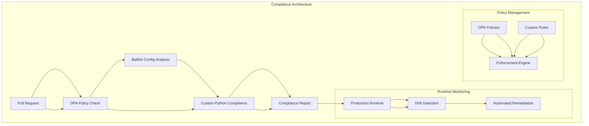
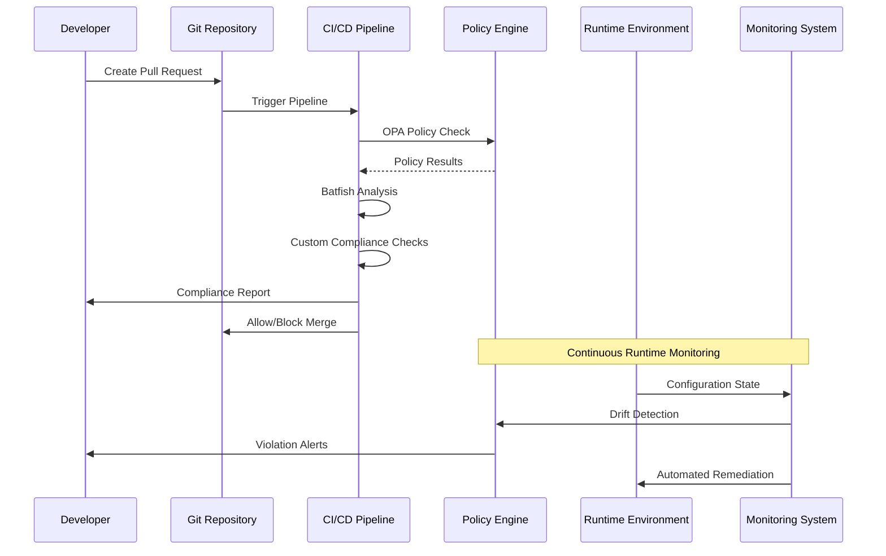
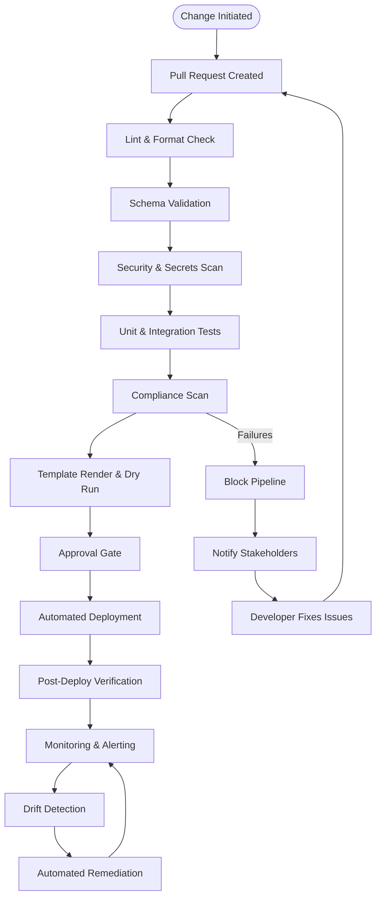
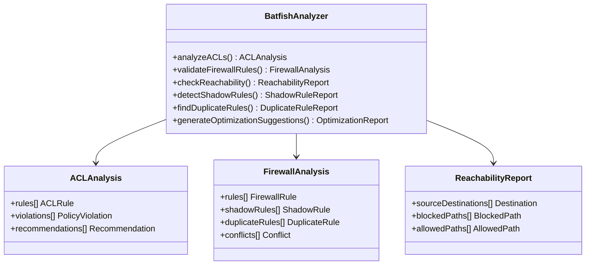
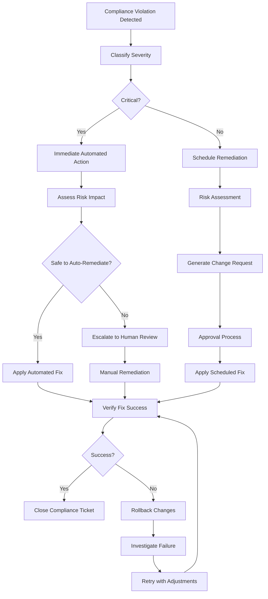
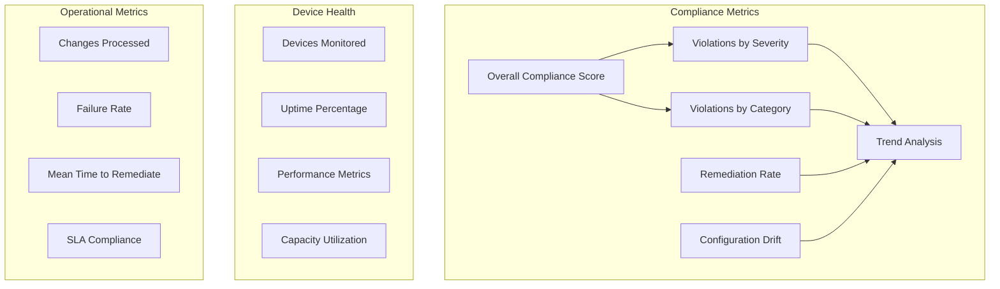
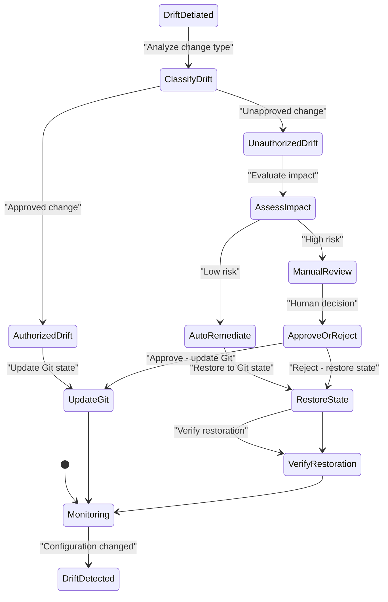
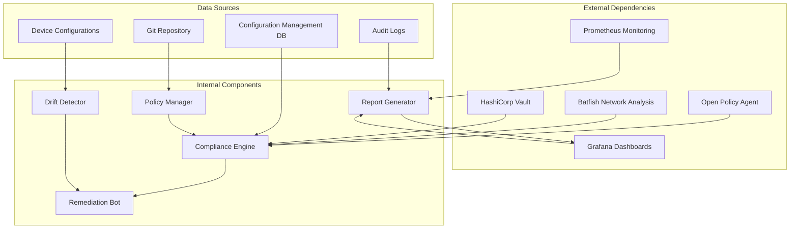

# Compliance Enforcement

<cite>
**Referenced Files in This Document**
- [README.md](file://README.md)
</cite>

## Table of Contents
1. [Introduction](#introduction)
2. [Project Structure](#project-structure)
3. [Core Components](#core-components)
4. [Architecture Overview](#architecture-overview)
5. [Detailed Component Analysis](#detailed-component-analysis)
6. [Dependency Analysis](#dependency-analysis)
7. [Performance Considerations](#performance-considerations)
8. [Troubleshooting Guide](#troubleshooting-guide)
9. [Conclusion](#conclusion)

## Introduction

The Enterprise Network Automation Platform implements a comprehensive compliance enforcement system that operates across the entire software development lifecycle, from pull request creation to production runtime. This multi-stage compliance pipeline ensures that network configurations meet organizational security policies, regulatory requirements, and operational standards through automated validation, continuous monitoring, and remediation workflows.

The platform enforces critical security controls including SSH-only access policies, NTP configuration requirements, AAA enablement mandates, SNMPv3 enforcement, logging requirements, approved cipher suites, firmware validation against approved lists, password policy enforcement, ACL standards compliance, firewall rule analysis for shadow/duplicate detection, and unused object identification.

## Project Structure

The compliance enforcement system is integrated throughout the platform architecture with dedicated modules and workflows:

**Diagram sources**
- [README.md:548-580](file://README.md#L548-L580)

**Section sources**
- [README.md:103-180](file://README.md#L103-L180)

## Core Components

The compliance enforcement system consists of several key components that work together to provide comprehensive policy validation and enforcement:

### Multi-Stage Compliance Pipeline

The platform implements a comprehensive compliance pipeline that operates at multiple stages:

| Stage | Component | Purpose | Severity Level |
|-------|-----------|---------|----------------|
| Pull Request | OPA Policy Check | Validate infrastructure as code changes | Critical/High |
| Pre-deployment | Batfish Analysis | Analyze network configuration impact | High/Medium |
| Template Validation | Custom Python Checks | Validate generated configurations | Medium/Low |
| Post-deployment | Runtime Monitoring | Continuous compliance verification | Critical/High |
| Drift Detection | Configuration Comparison | Detect deviations from baseline | High/Medium |

### Compliance Check Categories

The platform enforces twelve primary compliance categories with specific severity levels:

| Policy Category | Description | Severity | Enforcement Point |
|-----------------|-------------|----------|-------------------|
| SSH Only | No Telnet configuration allowed | Critical | All stages |
| NTP Configured | All devices must have NTP | High | Pre-deployment |
| AAA Enabled | TACACS+ or RADIUS required | Critical | All stages |
| SNMPv3 | No SNMPv1/v2c allowed | High | All stages |
| Logging Enabled | Syslog must be configured | Medium | Pre-deployment |
| Approved Ciphers | Only approved cipher suites in SSH/TLS | High | All stages |
| Approved Firmware | Device OS must be on approved list | High | Pre-deployment |
| Password Policy | Minimum length, complexity, rotation | Critical | All stages |
| ACL Standards | Default deny, explicit allow only | High | Pre-deployment |
| Firewall Rules | No any-any, shadow/duplicate detection | Critical | Pre-deployment |
| Unused Objects | Detect and flag unused ACLs, rules, objects | Low | Runtime |

**Section sources**
- [README.md:548-567](file://README.md#L548-L567)

## Architecture Overview

The compliance enforcement architecture follows a layered approach with multiple validation points and feedback loops:

**Diagram sources**
- [README.md:568-580](file://README.md#L568-L580)

### Compliance Flow Architecture

**Diagram sources**
- [README.md:483-501](file://README.md#L483-L501)

## Detailed Component Analysis

### OPA Policy Integration

Open Policy Agent (OPA) serves as the central policy decision point for infrastructure-as-code validation. The system integrates OPA policies to enforce compliance rules before deployment:

#### Policy Enforcement Points

| Policy Type | Scope | Enforcement |
|-------------|-------|-------------|
| Infrastructure Policies | Terraform configurations | Pre-deployment validation |
| Network Policies | Ansible playbooks and templates | Template rendering validation |
| Security Policies | SSH, TLS, authentication configs | Configuration validation |
| Operational Policies | Logging, monitoring, backup configs | Runtime compliance checks |

#### Policy Development Framework

The platform supports custom policy development using Rego language for OPA integration. Policies can be developed for:

- **Infrastructure as Code**: Validate Terraform configurations against organizational standards
- **Network Configuration**: Ensure device configurations meet security baselines
- **Operational Requirements**: Enforce logging, monitoring, and backup policies
- **Security Controls**: Validate authentication, authorization, and encryption settings

### Batfish Configuration Analysis

Batfish provides deep packet inspection and network behavior analysis for validating network configurations:

#### ACL and Firewall Rule Analysis

| Analysis Type | Purpose | Output |
|---------------|---------|--------|
| Shadow Detection | Identify rules never matched due to higher priority rules | Risk assessment report |
| Duplicate Detection | Find redundant rules that can be consolidated | Optimization recommendations |
| Reachability Analysis | Validate traffic flow expectations | Network connectivity matrix |
| Conflict Resolution | Identify conflicting rules and suggest resolutions | Conflict resolution guide |

#### Network Simulation Capabilities

**Diagram sources**
- [README.md:525-527](file://README.md#L525-L527)

### Custom Python Compliance Engine

The platform includes a pluggable compliance engine built with Python that supports various compliance check implementations:

#### Compliance Check Framework

| Check Type | Implementation Pattern | Use Case |
|------------|----------------------|----------|
| Configuration Validation | Parse running config and validate against policies | SSH, NTP, AAA, SNMP settings |
| Template Validation | Validate Jinja2 templates generate compliant output | Infrastructure as Code |
| Runtime Monitoring | Continuously monitor device state for violations | Drift detection |
| Historical Analysis | Analyze configuration changes over time | Trend analysis and forecasting |

#### Severity Classification System

The platform implements a four-tier severity classification system:

| Severity Level | Definition | Response Time | Escalation Path |
|----------------|------------|---------------|-----------------|
| Critical | Immediate security risk or service disruption | 15 minutes | Security team + Management |
| High | Significant security weakness or compliance violation | 1 hour | Team lead + Security team |
| Medium | Moderate risk or non-critical compliance issue | 4 hours | Team lead |
| Low | Minor issue or optimization opportunity | 24 hours | Individual developer |

### Automated Remediation Workflows

The platform supports automated remediation for common compliance violations:

#### Remediation Triggers

| Violation Type | Automated Action | Manual Review Required |
|----------------|------------------|----------------------|
| SSH Configuration | Auto-fix SSH settings | No |
| NTP Configuration | Auto-configure NTP servers | No |
| Logging Settings | Auto-enable syslog | No |
| Cipher Suites | Auto-update to approved ciphers | Yes |
| Firmware Version | Schedule upgrade window | Yes |
| ACL Changes | Generate change request | Yes |

#### Remediation Workflow

### Compliance Reporting and Dashboards

The platform generates comprehensive compliance reports and visualizations:

#### Report Types

| Report Type | Frequency | Audience | Content |
|-------------|-----------|----------|---------|
| Executive Summary | Weekly | Management | Overall compliance posture, trends |
| Technical Report | Daily | Engineering Team | Specific violations, remediation status |
| Audit Trail | Real-time | Compliance Officers | Complete change history, approvals |
| Risk Assessment | Monthly | Risk Management | Risk scoring, mitigation progress |

#### Dashboard Metrics

**Section sources**
- [README.md:583-616](file://README.md#L583-L616)

### Drift Detection Between Git State and Running Configurations

The platform continuously monitors for configuration drift between the desired state in Git and the actual running configuration:

#### Drift Detection Mechanisms

| Detection Method | Frequency | Accuracy | Resource Usage |
|------------------|-----------|----------|----------------|
| Periodic Polling | Every 5 minutes | High | Medium |
| Event-Driven | Real-time | High | Low |
| Change-Based | On configuration changes | High | Very Low |
| Baseline Comparison | Hourly | Medium | Low |

#### Drift Resolution Workflow

### Compliance Bot Integration

The platform includes specialized bots for compliance operations:

#### Compliance Bot Capabilities

| Bot Function | API Endpoint | ChatOps Support | Purpose |
|--------------|--------------|-----------------|---------|
| Compliance Scans | `/api/v1/compliance` | GitHub/Slack/Teams | Trigger and manage compliance scans |
| Violation Reports | `/api/v1/compliance/reports` | Slack/Teams | Generate and distribute compliance reports |
| Remediation Requests | `/api/v1/compliance/remediate` | Slack/Teams | Request automated remediation |
| Policy Updates | `/api/v1/compliance/policies` | GitHub | Manage compliance policies |

**Section sources**
- [README.md:460-476](file://README.md#L460-L476)

## Dependency Analysis

The compliance enforcement system has well-defined dependencies and integration points:

**Diagram sources**
- [README.md:548-580](file://README.md#L548-L580)

### Component Coupling Analysis

| Component | Internal Dependencies | External Dependencies | Coupling Level |
|-----------|----------------------|----------------------|----------------|
| Compliance Engine | Policy Manager, Drift Detector | OPA, Batfish, Vault | Medium |
| Policy Manager | Compliance Engine | Git Repository, OPA | Low |
| Drift Detector | Compliance Engine, Remediation Bot | Device APIs, Git Repository | Medium |
| Remediation Bot | Compliance Engine, Policy Manager | Device APIs, Vault | Medium |
| Report Generator | Compliance Engine, Drift Detector | Prometheus, Grafana | Low |

**Section sources**
- [README.md:548-580](file://README.md#L548-L580)

## Performance Considerations

The compliance enforcement system is designed for enterprise-scale performance:

### Scalability Characteristics

| Aspect | Current Capability | Scaling Strategy |
|--------|-------------------|------------------|
| Device Coverage | Thousands of devices | Horizontal scaling with distributed agents |
| Policy Evaluation | Millisecond response times | Caching, parallel evaluation |
| Configuration Analysis | Real-time processing | Batch processing for large datasets |
| Report Generation | Sub-minute generation | Asynchronous processing, caching |

### Optimization Techniques

- **Caching Strategies**: Policy results, device states, and analysis outputs are cached to reduce computation overhead
- **Parallel Processing**: Multiple compliance checks run concurrently to minimize total scan time
- **Incremental Analysis**: Only changed configurations are re-analyzed rather than full fleet scans
- **Resource Pooling**: Shared resources for expensive operations like Batfish analysis

## Troubleshooting Guide

Common compliance enforcement issues and their resolutions:

### Policy Development Issues

| Issue | Symptoms | Resolution |
|-------|----------|------------|
| OPA Policy Syntax Error | Policy evaluation failures | Validate Rego syntax using `opa eval` |
| Policy Logic Errors | Incorrect pass/fail decisions | Test policies with sample data using `opa test` |
| Performance Degradation | Slow policy evaluation | Optimize policy logic, add caching |

### Configuration Analysis Problems

| Issue | Symptoms | Resolution |
|-------|----------|------------|
| Batfish Analysis Failures | Incomplete network analysis | Validate configuration snapshots, check Batfish logs |
| ACL Analysis Errors | Incorrect shadow/duplicate detection | Verify ACL ordering, check for vendor-specific syntax |
| Template Rendering Issues | Non-compliant generated configs | Debug Jinja2 templates, validate variable mappings |

### Runtime Monitoring Issues

| Issue | Symptoms | Resolution |
|-------|----------|------------|
| Drift Detection Failures | Missing configuration changes | Verify device connectivity, check polling intervals |
| Remediation Failures | Automated fixes not applied | Review error logs, check device permissions |
| Report Generation Delays | Slow compliance reports | Optimize database queries, implement caching |

**Section sources**
- [README.md:674-685](file://README.md#L674-L685)

## Conclusion

The Enterprise Network Automation Platform implements a comprehensive, multi-layered compliance enforcement system that ensures network configurations maintain security, operational, and regulatory compliance throughout their lifecycle. The system's architecture combines pre-deployment validation through OPA policies and Batfish analysis with continuous runtime monitoring and automated remediation capabilities.

Key strengths of the compliance framework include its multi-stage enforcement approach, comprehensive policy coverage across twelve major compliance categories, automated remediation workflows, and extensive reporting and monitoring capabilities. The platform's design supports enterprise-scale operations while maintaining high accuracy and low false-positive rates.

The system's extensibility through custom policy development and pluggable compliance checks ensures it can adapt to evolving organizational requirements and emerging security threats. The integration with existing DevOps toolchains and support for multiple vendors makes it suitable for diverse enterprise environments.

Future enhancements focus on AI-driven anomaly detection, zero-touch provisioning integration, and advanced self-healing automation capabilities to further strengthen the platform's compliance posture and operational efficiency.