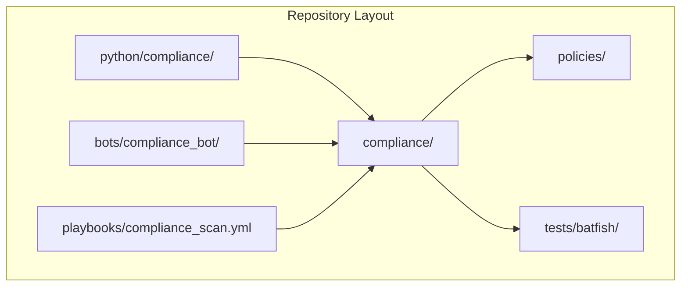
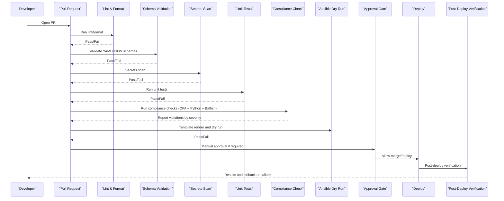
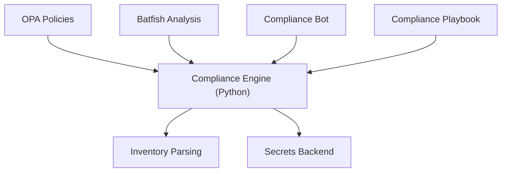

# Compliance Policies & Rules

<cite>
**Referenced Files in This Document**
- [README.md](file://README.md)
</cite>

## Table of Contents
1. [Introduction](#introduction)
2. [Project Structure](#project-structure)
3. [Core Components](#core-components)
4. [Architecture Overview](#architecture-overview)
5. [Detailed Component Analysis](#detailed-component-analysis)
6. [Dependency Analysis](#dependency-analysis)
7. [Performance Considerations](#performance-considerations)
8. [Troubleshooting Guide](#troubleshooting-guide)
9. [Conclusion](#conclusion)
10. [Appendices](#appendices)

## Introduction
This document explains the compliance policies and rule definitions for the Enterprise Network Automation Platform, focusing on how security and operational standards are enforced across the lifecycle from pull request to production. It covers:
- Policy framework and severity model
- SSH-only enforcement, NTP configuration requirements, AAA enablement mandates, SNMPv3 enforcement, logging requirements, approved cipher suites, firmware validation against approved lists, password policy enforcement, ACL standards compliance, firewall rule analysis (shadow/duplicate detection), and unused object identification
- Custom compliance rule development using Python modules
- OPA policy integration patterns
- Batfish-based network analysis rules
- The compliance rule engine architecture, pluggable rule system, and extension points for organizational-specific requirements

The repository’s README outlines the platform’s compliance strategy, including checks, severity levels, and pipeline gates.

**Section sources**
- [README.md:548-580](file://README.md#L548-L580)

## Project Structure
Compliance-related capabilities are organized under dedicated directories and modules as described in the repository layout:
- python/compliance: Pluggable compliance engine with custom Python checks
- compliance/: Compliance policies and checks
- policies/: OPA/Sentinel policies
- tests/batfish/: Batfish-based network simulation and analysis
- bots/compliance_bot/: Compliance bot exposing API endpoints for scans and reporting
- playbooks/compliance_scan.yml: Ansible playbook entry point for compliance scanning

**Diagram sources**
- [README.md:103-180](file://README.md#L103-L180)

**Section sources**
- [README.md:103-180](file://README.md#L103-L180)

## Core Components
- Compliance Engine (Python): Provides a pluggable rule system that executes custom checks against device configurations and inventory data.
- OPA Policies: Declarative policies evaluated during CI/CD to enforce code-level and configuration-level constraints.
- Batfish Integration: Analyzes ACLs, routing, and firewall rules for shadowing, duplicates, and reachability issues.
- Compliance Bot: Exposes REST endpoints to trigger scans and retrieve reports.
- Playbook Orchestration: Runs compliance scans via Ansible against target devices or simulated environments.

Key responsibilities:
- Enforce SSH-only access by disallowing Telnet
- Require NTP configuration on all devices
- Mandate AAA enablement (TACACS+/RADIUS)
- Enforce SNMPv3 only (no v1/v2c)
- Require Syslog logging destinations
- Restrict to approved cipher suites for SSH/TLS
- Validate firmware versions against an approved list
- Enforce password policy (length, complexity, rotation)
- Enforce ACL standards (default deny, explicit allow)
- Detect firewall rule anomalies (any-any, shadows, duplicates)
- Identify unused objects (ACLs, rules, objects)

Severity model and pipeline impact:
- Critical: Blocks merge/deploy until remediated
- High: Blocks merge/deploy unless explicitly waived
- Medium: Warnings; may block depending on policy
- Low: Informational; tracked but not blocking

**Section sources**
- [README.md:438-456](file://README.md#L438-L456)
- [README.md:548-580](file://README.md#L548-L580)

## Architecture Overview
The compliance workflow integrates multiple stages within the CI/CD pipeline and runtime operations.

**Diagram sources**
- [README.md:479-514](file://README.md#L479-L514)
- [README.md:548-580](file://README.md#L548-L580)

## Detailed Component Analysis

### Compliance Policy Framework
Policies define what is allowed and what constitutes a violation. Each policy has:
- Name and description
- Scope (device role, vendor, environment)
- Rule logic (SSH-only, NTP, AAA, SNMPv3, logging, ciphers, firmware, passwords, ACLs, firewall rules, unused objects)
- Severity level (Critical, High, Medium, Low)
- Remediation guidance

Examples of policy categories:
- SSH-only enforcement: Disallow Telnet configuration
- NTP configuration requirements: Ensure at least one configured NTP server
- AAA enablement mandates: Require TACACS+ or RADIUS
- SNMPv3 enforcement: Disallow SNMPv1/v2c
- Logging requirements: Configure Syslog destinations
- Approved cipher suites: Restrict SSH/TLS ciphers to approved set
- Firmware validation: Compare running OS version against approved list
- Password policy: Enforce length, complexity, and rotation intervals
- ACL standards: Default deny with explicit allows
- Firewall rule analysis: Detect any-any, shadowed, duplicate rules
- Unused object identification: Flag unused ACLs, rules, and objects

Severity impact on pipeline gates:
- Critical: Block merge/deploy
- High: Block merge/deploy unless waived
- Medium: May block based on policy
- Low: Non-blocking informational

**Section sources**
- [README.md:548-580](file://README.md#L548-L580)

### Custom Compliance Rule Development (Python Modules)
Custom rules are implemented as Python modules under python/compliance. The module provides:
- A pluggable rule interface for registering new checks
- Utilities for reading device configs, inventory, and structured data
- Reporting mechanisms for violations with severity and remediation hints

Development pattern:
- Implement a rule class/function with inputs (config/inventory) and outputs (violation report)
- Register the rule with the compliance engine
- Include unit tests under tests/unit or tests/compliance
- Integrate into the CI pipeline via the compliance check step

Example references:
- Module location: python/compliance
- CLI usage: python -m python.compliance --inventory inventories/lab/hosts.yml
- Test execution: pytest tests/compliance/ -v

**Section sources**
- [README.md:438-456](file://README.md#L438-L456)
- [README.md:277-280](file://README.md#L277-L280)
- [README.md:537-540](file://README.md#L537-L540)

### OPA Policy Integration Patterns
OPA policies reside under policies/ and are executed during CI/CD to enforce declarative constraints on code and configuration artifacts. Typical patterns include:
- Input schema validation for inventory and group/host variables
- Prohibiting insecure settings (e.g., Telnet enabled)
- Requiring mandatory fields (e.g., NTP servers, AAA servers)
- Enforcing naming conventions and tagging standards

Integration points:
- GitHub Actions workflows call OPA to evaluate policy files against PR changes
- Failures produce actionable messages indicating which policy was violated and where

**Section sources**
- [README.md:170-172](file://README.md#L170-L172)
- [README.md:479-514](file://README.md#L479-L514)

### Batfish-Based Network Analysis Rules
Batfish is used to analyze ACLs, routing, and firewall rules for correctness and safety. Key analyses include:
- Shadowed rules: Rules never matched due to earlier matches
- Duplicate rules: Redundant rules that can be removed
- Reachability issues: Unintended connectivity or blocked traffic
- Any-any rules: Overly permissive rules flagged for review

Integration points:
- Located under tests/batfish/
- Triggered when PR affects network configuration
- Reports violations with severity and remediation suggestions

**Section sources**
- [README.md:156-158](file://README.md#L156-L158)
- [README.md:524-529](file://README.md#L524-L529)

### Compliance Bot and API
The compliance bot exposes endpoints to:
- Trigger compliance scans
- Retrieve violation reports
- Integrate with ChatOps for notifications

Endpoints:
- /api/v1/compliance

Usage:
- Automated scans scheduled daily
- On-demand scans triggered by operators

**Section sources**
- [README.md:470-476](file://README.md#L470-L476)
- [README.md:509-513](file://README.md#L509-L513)

### Playbook Orchestration
The compliance scan playbook orchestrates checks across devices or simulated environments:
- Entry point: playbooks/compliance_scan.yml
- Supports dry-run mode for safe validation
- Integrates with inventory files for targeting specific devices

**Section sources**
- [README.md:266-271](file://README.md#L266-L271)
- [README.md:428-430](file://README.md#L428-L430)

### Severity Levels and Pipeline Gates
Severity levels determine whether changes are allowed to proceed:
- Critical: Immediate block; requires remediation before merge/deploy
- High: Block unless explicitly waived by approver
- Medium: Warning; may block depending on organizational policy
- Low: Informational; tracked for trend analysis

Pipeline gate behavior:
- Compliance check stage evaluates all active policies
- Violations are reported with severity and remediation guidance
- Merge/deploy proceeds only if no blocking violations exist

**Section sources**
- [README.md:548-580](file://README.md#L548-L580)

## Dependency Analysis
Compliance components depend on each other and external tools:
- Python compliance engine depends on inventory parsing and config retrieval utilities
- OPA policies depend on input artifacts validated by schema checks
- Batfish analysis depends on snapshots generated from device configurations
- Compliance bot depends on the compliance engine for executing scans
- Playbook orchestration depends on inventory and secrets backends

**Diagram sources**
- [README.md:438-456](file://README.md#L438-L456)
- [README.md:479-514](file://README.md#L479-L514)

**Section sources**
- [README.md:438-456](file://README.md#L438-L456)
- [README.md:479-514](file://README.md#L479-L514)

## Performance Considerations
- Parallelize compliance checks across device groups to reduce scan time
- Cache results for static policies and approved firmware lists
- Use incremental analysis in Batfish by limiting snapshots to changed configurations
- Optimize Python rule execution by minimizing I/O and leveraging concurrency utilities
- Schedule heavy scans off-peak hours and use batch processing for large fleets

[No sources needed since this section provides general guidance]

## Troubleshooting Guide
Common issues and resolutions:
- Ansible connection timeout: Verify SSH reachability and credentials
- Template rendering error: Debug Jinja2 templates and variable resolution
- Compliance check failure: Review policy violations and device config diffs
- CI pipeline failure: Inspect GitHub Actions logs for actionable errors
- Vault authentication failure: Verify OIDC token or AppRole credentials
- Molecule test failure: Ensure Docker/Podman is running
- Batfish analysis error: Validate snapshots and configuration inputs

**Section sources**
- [README.md:674-685](file://README.md#L674-L685)

## Conclusion
The platform enforces comprehensive compliance through a layered approach combining OPA policies, custom Python rules, and Batfish analysis. Severity-driven pipeline gates ensure critical and high-risk violations block deployment, while medium and low-severity findings inform continuous improvement. The pluggable rule system enables organizations to extend policies with domain-specific requirements, maintaining consistency and security at scale.

[No sources needed since this section summarizes without analyzing specific files]

## Appendices

### Example Policy Definitions
- SSH-only enforcement: Disallow Telnet configuration
- NTP configuration requirements: Require at least one NTP server
- AAA enablement mandates: Require TACACS+ or RADIUS
- SNMPv3 enforcement: Disallow SNMPv1/v2c
- Logging requirements: Configure Syslog destinations
- Approved cipher suites: Restrict SSH/TLS ciphers to approved set
- Firmware validation: Compare running OS version against approved list
- Password policy: Enforce length, complexity, and rotation intervals
- ACL standards: Default deny with explicit allows
- Firewall rule analysis: Detect any-any, shadowed, duplicate rules
- Unused object identification: Flag unused ACLs, rules, and objects

**Section sources**
- [README.md:548-580](file://README.md#L548-L580)

### Extending Existing Policies
To add organizational-specific requirements:
- Create a new Python rule module under python/compliance
- Register the rule with the compliance engine
- Add corresponding OPA policy under policies/ if applicable
- Include unit tests under tests/unit or tests/compliance
- Update CI workflows to include the new checks

**Section sources**
- [README.md:438-456](file://README.md#L438-L456)
- [README.md:479-514](file://README.md#L479-L514)