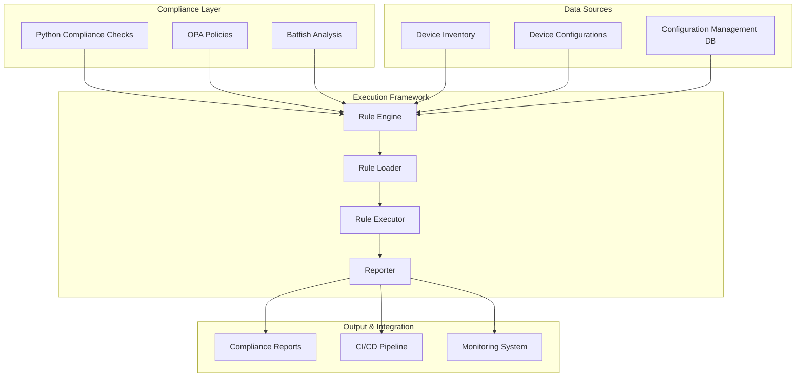
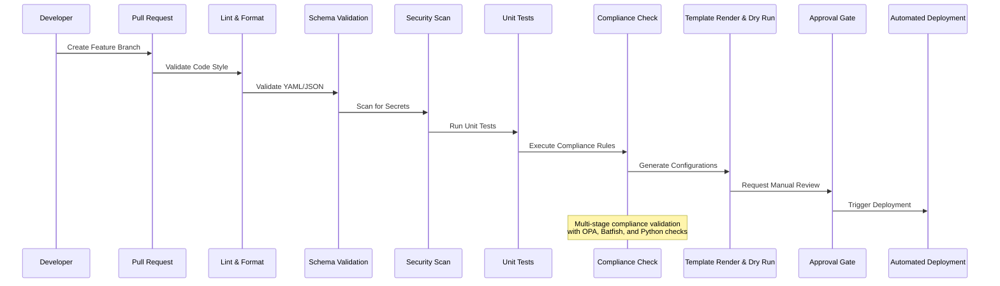
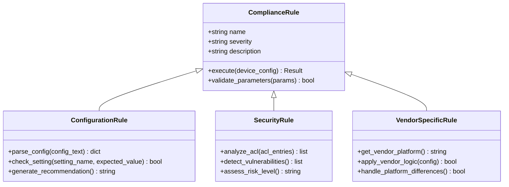
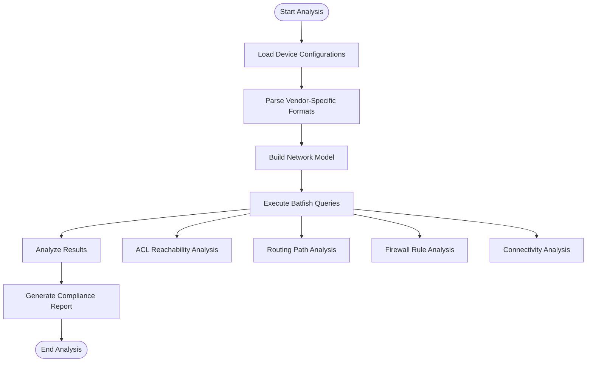
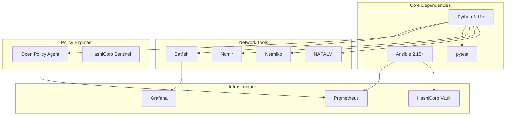

# Compliance Rule Engine Architecture

<cite>
**Referenced Files in This Document**
- [README.md](file://README.md)
</cite>

## Table of Contents
1. [Introduction](#introduction)
2. [Project Structure](#project-structure)
3. [Core Components](#core-components)
4. [Architecture Overview](#architecture-overview)
5. [Detailed Component Analysis](#detailed-component-analysis)
6. [Dependency Analysis](#dependency-analysis)
7. [Performance Considerations](#performance-considerations)
8. [Troubleshooting Guide](#troubleshooting-guide)
9. [Conclusion](#conclusion)
10. [Appendices](#appendices)

## Introduction

The Enterprise Network Automation Platform implements a sophisticated compliance rule engine designed to enforce security policies, configuration standards, and operational best practices across multi-vendor network environments. The platform follows a GitOps methodology where all compliance policies, templates, and automation scripts are version-controlled and deployed through automated pipelines.

The compliance system integrates multiple technologies including custom Python modules, Open Policy Agent (OPA), and Batfish for comprehensive network policy validation. It supports vendor-agnostic compliance checks while maintaining the flexibility to implement device-specific requirements.

## Project Structure

The compliance rule engine is organized within a modular architecture that separates concerns between different compliance domains and enforcement mechanisms.

**Diagram sources**
- [README.md:139-170](file://README.md#L139-L170)
- [README.md:438-456](file://README.md#L438-L456)

**Section sources**
- [README.md:103-180](file://README.md#L103-L180)
- [README.md:438-456](file://README.md#L438-L456)

## Core Components

The compliance rule engine consists of several key components that work together to provide comprehensive policy enforcement:

### Python Compliance Module
The `python/compliance/` directory contains the core compliance engine with pluggable rule sets. This module provides the foundation for implementing custom compliance checks using Python's extensibility features.

### OPA Policy Integration
The `policies/` directory houses Open Policy Agent policies written in Rego language. These policies define high-level governance rules and organizational compliance requirements.

### Batfish Configuration Analysis
Batfish integration enables deep packet inspection and network reachability analysis to validate ACL rules, routing policies, and firewall configurations against business requirements.

### Compliance Bot
The `bots/compliance_bot/` provides API endpoints and ChatOps integration for on-demand compliance scanning and reporting capabilities.

**Section sources**
- [README.md:139-170](file://README.md#L139-L170)
- [README.md:452-476](file://README.md#L452-L476)

## Architecture Overview

The compliance rule engine follows a layered architecture that separates policy definition from execution logic, enabling flexible rule management and scalable processing.

**Diagram sources**
- [README.md:36-50](file://README.md#L36-L50)
- [README.md:483-501](file://README.md#L483-L501)

The compliance workflow integrates multiple validation stages:

1. **Static Analysis**: Code linting and schema validation
2. **Security Scanning**: Secret detection and vulnerability assessment  
3. **Unit Testing**: Individual component validation
4. **Policy Enforcement**: OPA policy evaluation
5. **Network Simulation**: Batfish-based configuration analysis
6. **Custom Compliance**: Python-based rule execution
7. **Template Rendering**: Configuration generation and dry-run validation

**Section sources**
- [README.md:36-50](file://README.md#L36-L50)
- [README.md:483-501](file://README.md#L483-L501)

## Detailed Component Analysis

### Pluggable Rule System Design

The compliance engine implements a plugin architecture that allows developers to extend functionality without modifying core code. The system supports multiple rule types:

#### Rule Categories
- **Configuration Compliance**: Device configuration validation against standards
- **Security Policies**: Access control lists, authentication, and encryption requirements
- **Operational Standards**: Logging, monitoring, and backup configuration checks
- **Vendor-Specific Rules**: Platform-specific compliance requirements

#### Plugin Interface
The Python compliance module provides a standardized interface for implementing custom rules:

**Diagram sources**
- [README.md:452-456](file://README.md#L452-L456)

**Section sources**
- [README.md:452-456](file://README.md#L452-L456)

### Custom Python Module Development

The Python compliance framework provides extensive capabilities for implementing sophisticated compliance checks:

#### Module Architecture
- **Inventory Integration**: Direct access to device inventory and metadata
- **Configuration Parsing**: Support for multiple vendor formats and protocols
- **API Abstraction**: Unified interface for SSH, NETCONF, RESTCONF connections
- **Error Handling**: Comprehensive exception management and retry logic
- **Logging Framework**: Structured logging with correlation IDs for debugging

#### Implementation Patterns
The framework supports various implementation patterns:

1. **Declarative Rules**: Simple configuration comparisons using YAML definitions
2. **Procedural Logic**: Complex business logic implemented in Python functions
3. **External Tool Integration**: Calls to external tools like Batfish or OPA
4. **Stateful Analysis**: Multi-device correlation and dependency checking

**Section sources**
- [README.md:438-456](file://README.md#L438-L456)

### OPA (Open Policy Agent) Integration Patterns

OPA policies provide centralized governance and organizational compliance requirements:

#### Policy Structure
- **Input Data**: Device configurations, inventory data, and context information
- **Policy Rules**: Rego-based logic defining acceptable states
- **Decision Output**: Pass/fail decisions with detailed explanations
- **Audit Trail**: Complete decision history for compliance reporting

#### Integration Points
OPA policies integrate at multiple levels:

1. **Pull Request Validation**: Pre-deployment policy checks
2. **Runtime Enforcement**: Continuous compliance monitoring
3. **Remediation Guidance**: Automated suggestions for policy violations
4. **Reporting Integration**: Compliance metrics and trend analysis

**Section sources**
- [README.md:170-172](file://README.md#L170-L172)
- [README.md:571-579](file://README.md#L571-L579)

### Batfish-Based Network Analysis Rules

Batfish provides deep packet inspection and network simulation capabilities for validating network configurations:

#### Analysis Capabilities
- **ACL Reachability**: Verify access control list effectiveness
- **Routing Validation**: Ensure proper route propagation and loop prevention
- **Firewall Rule Analysis**: Detect shadowed, redundant, or conflicting rules
- **Network Topology Verification**: Validate physical and logical connectivity

#### Integration Workflow

**Diagram sources**
- [README.md:524-528](file://README.md#L524-L528)

**Section sources**
- [README.md:524-528](file://README.md#L524-L528)

### Rule Execution Framework

The rule execution framework manages the lifecycle of compliance checks:

#### Loading and Prioritization
Rules are loaded dynamically from multiple sources:
- **Built-in Rules**: Core compliance checks included with the platform
- **Custom Rules**: Organization-specific compliance requirements
- **Vendor Extensions**: Platform-specific compliance validations
- **Third-party Integrations**: External tool outputs and assessments

#### Execution Strategy
The framework implements intelligent execution strategies:
- **Parallel Processing**: Concurrent rule execution for improved performance
- **Dependency Resolution**: Order-dependent rule execution when required
- **Caching**: Results caching to avoid redundant computations
- **Timeout Management**: Prevents long-running rules from blocking execution

**Section sources**
- [README.md:452-456](file://README.md#L452-L456)

### Error Handling Strategies

The compliance engine implements comprehensive error handling:

#### Exception Management
- **Graceful Degradation**: Continue execution when individual rules fail
- **Context Preservation**: Maintain execution context for debugging
- **Retry Logic**: Automatic retry for transient failures
- **Fallback Mechanisms**: Alternative approaches when primary methods fail

#### Reporting and Diagnostics
- **Structured Error Messages**: Consistent error formatting with actionable guidance
- **Execution Traces**: Detailed logs showing rule execution flow
- **Performance Metrics**: Timing and resource usage tracking
- **Correlation IDs**: Cross-reference related errors across systems

**Section sources**
- [README.md:674-685](file://README.md#L674-L685)

### Performance Optimization Techniques

The compliance engine employs several optimization strategies:

#### Caching Strategies
- **Configuration Caching**: Store parsed configurations to avoid re-parsing
- **Result Caching**: Cache rule execution results with invalidation policies
- **Connection Pooling**: Reuse network connections for efficiency
- **Memory Management**: Efficient memory usage for large-scale deployments

#### Parallel Processing
- **Concurrent Rule Execution**: Multiple rules execute simultaneously
- **Batch Processing**: Group similar operations for efficiency
- **Resource Limiting**: Prevent resource exhaustion during bulk operations
- **Load Balancing**: Distribute workload across available resources

**Section sources**
- [README.md:438-456](file://README.md#L438-L456)

## Dependency Analysis

The compliance rule engine has well-defined dependencies between components:

**Diagram sources**
- [README.md:184-199](file://README.md#L184-L199)

**Section sources**
- [README.md:184-199](file://README.md#L184-L199)

## Performance Considerations

The compliance engine is designed for enterprise-scale deployments with thousands of devices:

### Scalability Features
- **Horizontal Scaling**: Stateless design enables easy horizontal scaling
- **Distributed Execution**: Rules can execute across multiple worker nodes
- **Incremental Processing**: Only affected devices processed after changes
- **Resource Monitoring**: Real-time resource utilization tracking

### Optimization Strategies
- **Lazy Loading**: Load rules and dependencies on demand
- **Selective Execution**: Skip unchanged configurations
- **Efficient Parsing**: Optimized configuration parsers for different vendors
- **Background Processing**: Non-blocking rule execution for time-intensive checks

## Troubleshooting Guide

Common issues and their resolutions:

### Compliance Check Failures
- **Review Policy Definitions**: Check OPA policies and Python rule implementations
- **Validate Device Connectivity**: Ensure SSH/NETCONF/RESTCONF access
- **Check Configuration Syntax**: Verify device configurations are parseable
- **Examine Execution Logs**: Review detailed logs for specific rule failures

### Performance Issues
- **Monitor Resource Usage**: Check CPU, memory, and network utilization
- **Optimize Rule Complexity**: Simplify complex rules where possible
- **Adjust Concurrency Settings**: Tune parallel execution parameters
- **Review Caching Configuration**: Ensure appropriate cache sizes and TTLs

### Integration Problems
- **Verify External Tool Availability**: Check OPA, Batfish service status
- **Validate API Credentials**: Ensure proper authentication for external services
- **Check Network Connectivity**: Verify access to target devices and services
- **Review Timeout Settings**: Adjust timeouts for slow-responding systems

**Section sources**
- [README.md:674-685](file://README.md#L674-L685)

## Conclusion

The Enterprise Network Automation Platform's compliance rule engine provides a comprehensive, scalable solution for enforcing network policies across multi-vendor environments. The pluggable architecture enables organizations to implement custom compliance checks while leveraging industry-standard tools like OPA and Batfish.

Key strengths include:
- **Extensible Design**: Easy addition of new compliance rules and integrations
- **Multi-Technology Support**: Combines Python, OPA, and Batfish for comprehensive coverage
- **Enterprise Scale**: Designed for large deployments with thousands of devices
- **GitOps Integration**: Seamless integration with CI/CD pipelines
- **Observability**: Comprehensive monitoring and reporting capabilities

The platform successfully addresses the complexity of modern network compliance requirements while maintaining operational efficiency and developer productivity.

## Appendices

### Compliance Policy Examples

The platform includes pre-built compliance policies covering common security and operational requirements:

| Policy Category | Example Requirements | Severity Level |
|----------------|---------------------|----------------|
| **Access Control** | SSH-only access, no Telnet, AAA enabled | Critical |
| **Encryption** | Approved cipher suites, TLS 1.2+ | High |
| **Logging** | Syslog configured, audit trails enabled | Medium |
| **Authentication** | Password complexity, MFA for admin access | Critical |
| **Network Security** | Default deny ACLs, no any-any rules | High |
| **Operational** | NTP configured, backups enabled, monitoring active | Medium |

### Testing Methodologies

The compliance engine supports comprehensive testing approaches:

- **Unit Testing**: Individual rule validation with mock data
- **Integration Testing**: End-to-end compliance workflows
- **Performance Testing**: Load testing with large device inventories
- **Regression Testing**: Ensuring rule updates don't break existing functionality
- **Chaos Engineering**: Testing failure scenarios and recovery procedures

### Monitoring and Observability

The compliance engine integrates with enterprise monitoring systems:

- **Metrics Collection**: Rule execution times, success rates, violation counts
- **Alerting**: Real-time notifications for critical compliance failures
- **Dashboards**: Visual representation of compliance posture over time
- **Audit Trails**: Complete history of compliance decisions and actions