# Compliance Workflows & Integration

<cite>
**Referenced Files in This Document**
- [README.md](file://README.md)
</cite>

## Table of Contents
1. [Introduction](#introduction)
2. [Compliance Architecture Overview](#compliance-architecture-overview)
3. [End-to-End Compliance Flow](#end-to-end-compliance-flow)
4. [OPA Policy Enforcement](#opa-policy-enforcement)
5. [Batfish Configuration Analysis](#batfish-configuration-analysis)
6. [Custom Python Compliance Engine](#custom-python-compliance-engine)
7. [Compliance Reporting Mechanisms](#compliance-reporting-mechanisms)
8. [Pipeline Gates and Approval Workflows](#pipeline-gates-and-approval-workflows)
9. [Violation Notification Systems](#violation-notification-systems)
10. [Remediation Automation Triggers](#remediation-automation-triggers)
11. [Audit Trail Maintenance](#audit-trail-maintenance)
12. [External System Integrations](#external-system-integrations)
13. [Compliance Policies and Standards](#compliance-policies-and-standards)
14. [Monitoring and Observability](#monitoring-and-observability)
15. [Troubleshooting Guide](#troubleshooting-guide)
16. [Conclusion](#conclusion)

## Introduction

The Enterprise Network Automation Platform implements a comprehensive compliance framework that enforces security policies, configuration standards, and regulatory requirements throughout the entire network automation lifecycle. This system ensures that all network configurations maintain compliance from initial code changes through production deployment and ongoing runtime operations.

The compliance architecture follows a "shift-left" approach, integrating policy enforcement at every stage of the development and deployment pipeline while maintaining continuous monitoring and automated remediation capabilities for production environments.

## Compliance Architecture Overview

The compliance system is built around multiple layers of validation and enforcement, each serving specific purposes in the overall governance strategy:

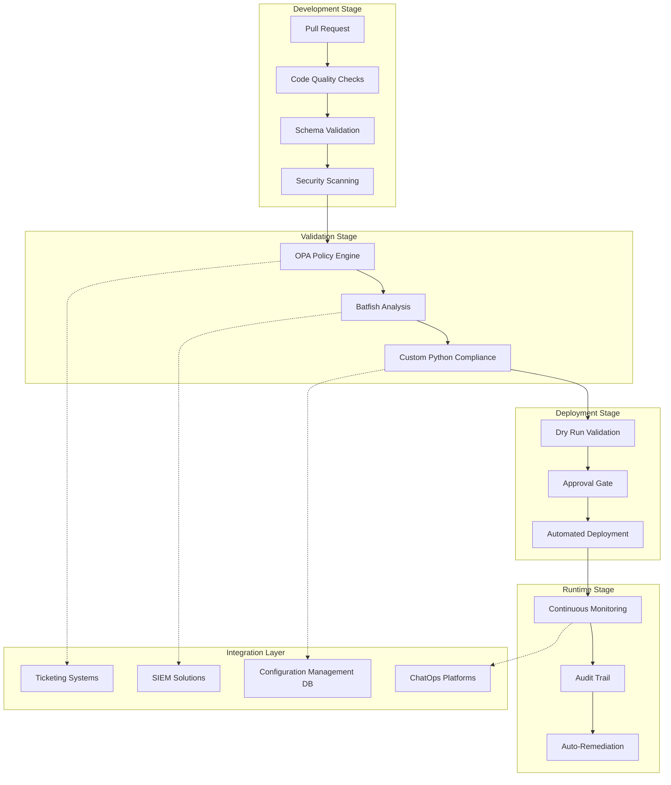

**Diagram sources**
- [README.md:548-580](file://README.md#L548-L580)

## End-to-End Compliance Flow

The complete compliance workflow spans from initial code submission through production runtime, with multiple enforcement points ensuring policy adherence:

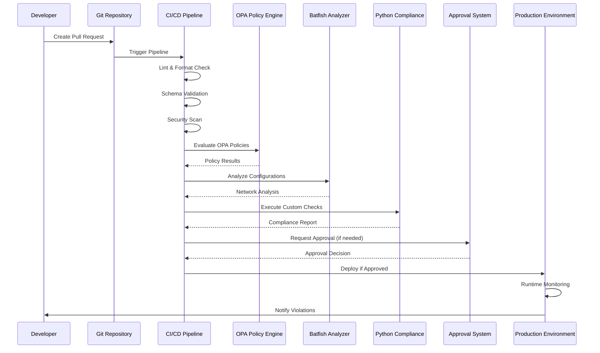

**Diagram sources**
- [README.md:479-501](file://README.md#L479-L501)
- [README.md:568-579](file://README.md#L568-L579)

## OPA Policy Enforcement

Open Policy Agent (OPA) serves as the primary policy enforcement engine, evaluating infrastructure-as-code changes against defined Rego policies before any deployment occurs.

### Policy Categories

| Policy Category | Description | Enforcement Level |
|----------------|-------------|-------------------|
| **Infrastructure Policies** | Cloud resource configuration standards | Development |
| **Network Policies** | ACL rules, routing policies, firewall rules | Pre-deployment |
| **Security Policies** | Encryption, authentication, access controls | All stages |
| **Operational Policies** | Logging, monitoring, backup requirements | Runtime |
| **Compliance Policies** | Regulatory and organizational standards | Continuous |

### Policy Evaluation Process

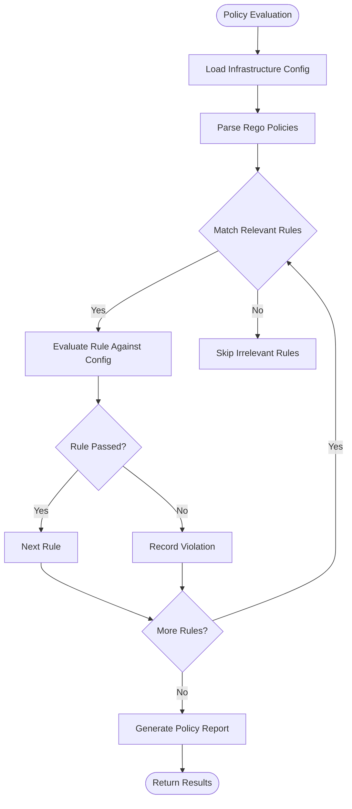

**Diagram sources**
- [README.md:548-580](file://README.md#L548-L580)

## Batfish Configuration Analysis

Batfish provides deep packet inspection and network behavior analysis to validate configuration correctness and identify potential issues before deployment.

### Analysis Capabilities

| Analysis Type | Purpose | Output |
|---------------|---------|--------|
| **ACL Analysis** | Validate access control list logic | Reachability matrix, rule conflicts |
| **Routing Analysis** | Verify routing table consistency | Path analysis, loop detection |
| **Firewall Analysis** | Test security rule effectiveness | Traffic flow simulation |
| **VLAN Analysis** | Validate VLAN configuration | Port membership, trunk status |
| **BGP Analysis** | Check BGP peering and policies | Route advertisement, path selection |

### Configuration Validation Workflow

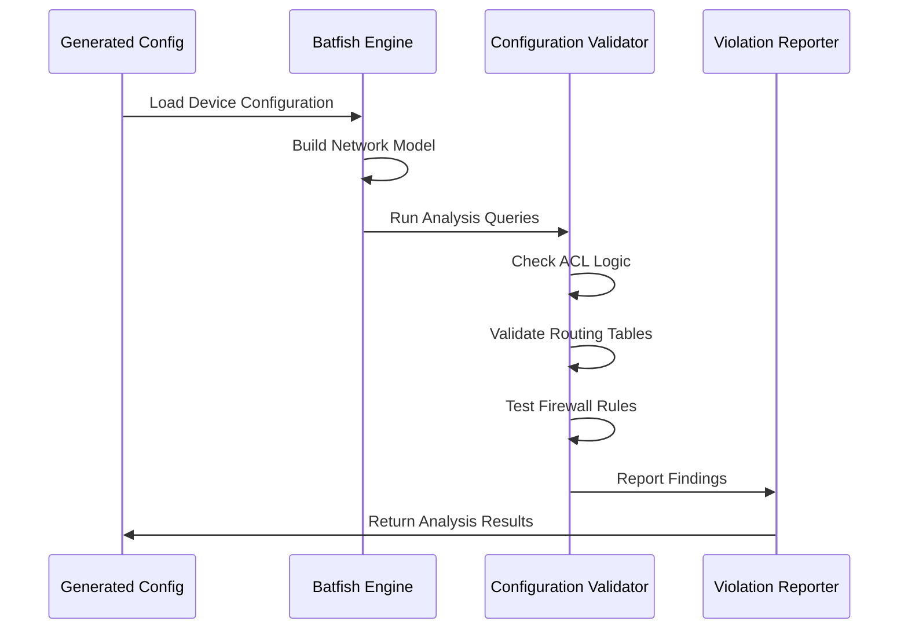

**Diagram sources**
- [README.md:517-544](file://README.md#L517-L544)

## Custom Python Compliance Engine

The custom Python compliance engine provides specialized checks that cannot be handled by generic policy engines, including vendor-specific validations and complex business logic.

### Compliance Check Categories

| Check Category | Implementation | Scope |
|----------------|----------------|-------|
| **Device-Specific Checks** | Vendor-specific configuration validation | Per-vendor modules |
| **Business Logic Checks** | Organizational policy enforcement | Business rules engine |
| **Cross-Device Validation** | Multi-device consistency checks | Network-wide policies |
| **Temporal Compliance** | Time-based policy enforcement | Scheduled checks |
| **Dependency Validation** | Configuration dependency verification | Dependency graph analysis |

### Execution Framework

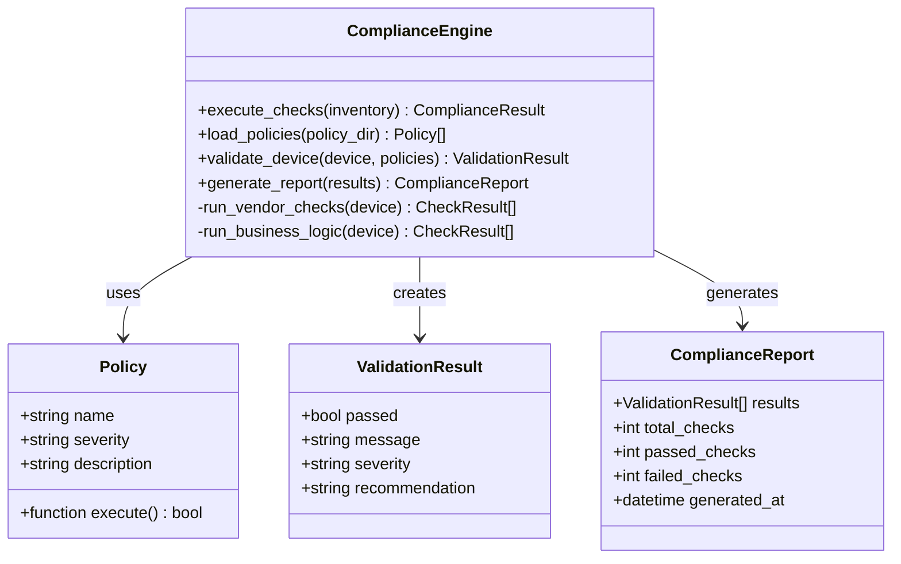

**Diagram sources**
- [README.md:438-456](file://README.md#L438-L456)

## Compliance Reporting Mechanisms

The platform generates comprehensive compliance reports at multiple levels, providing visibility into compliance status across different scopes and timeframes.

### Report Types

| Report Type | Frequency | Audience | Content |
|-------------|-----------|----------|---------|
| **PR Compliance Report** | Per pull request | Developers | Policy violations, recommendations |
| **Daily Compliance Summary** | Daily | Operations Team | Overall compliance status, trends |
| **Weekly Executive Report** | Weekly | Management | High-level metrics, risk assessment |
| **Monthly Audit Report** | Monthly | Auditors | Detailed findings, remediation status |
| **Real-time Alerts** | As needed | On-call Teams | Critical violations requiring immediate action |

### Report Generation Process

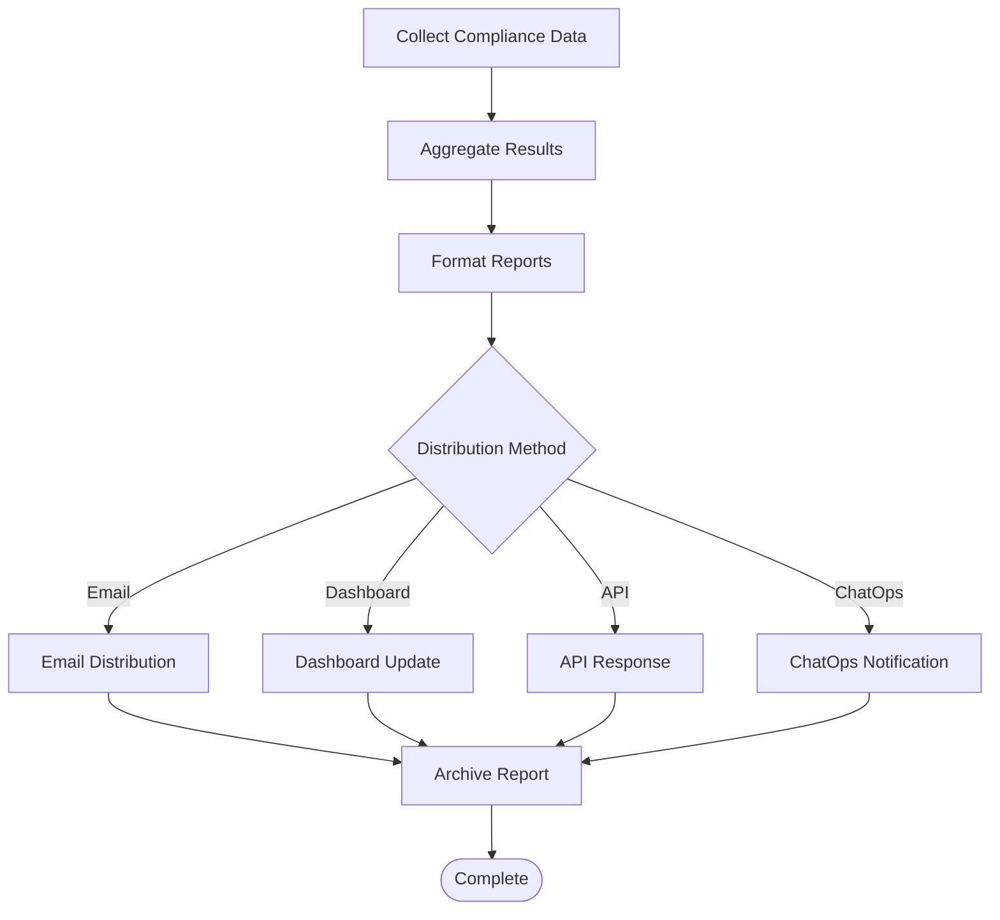

## Pipeline Gates and Approval Workflows

Compliance results directly influence pipeline progression and deployment decisions through automated gates and manual approval processes.

### Gate Criteria

| Gate Type | Condition | Action |
|-----------|-----------|--------|
| **Critical Violations** | Any critical policy failure | Block merge, require remediation |
| **High Severity Issues** | Multiple high-severity violations | Require additional review |
| **Medium/Low Issues** | Non-critical violations | Allow with warnings |
| **Performance Impact** | Significant performance degradation | Require performance testing |
| **Security Risks** | Security-related violations | Mandatory security team review |

### Approval Workflow

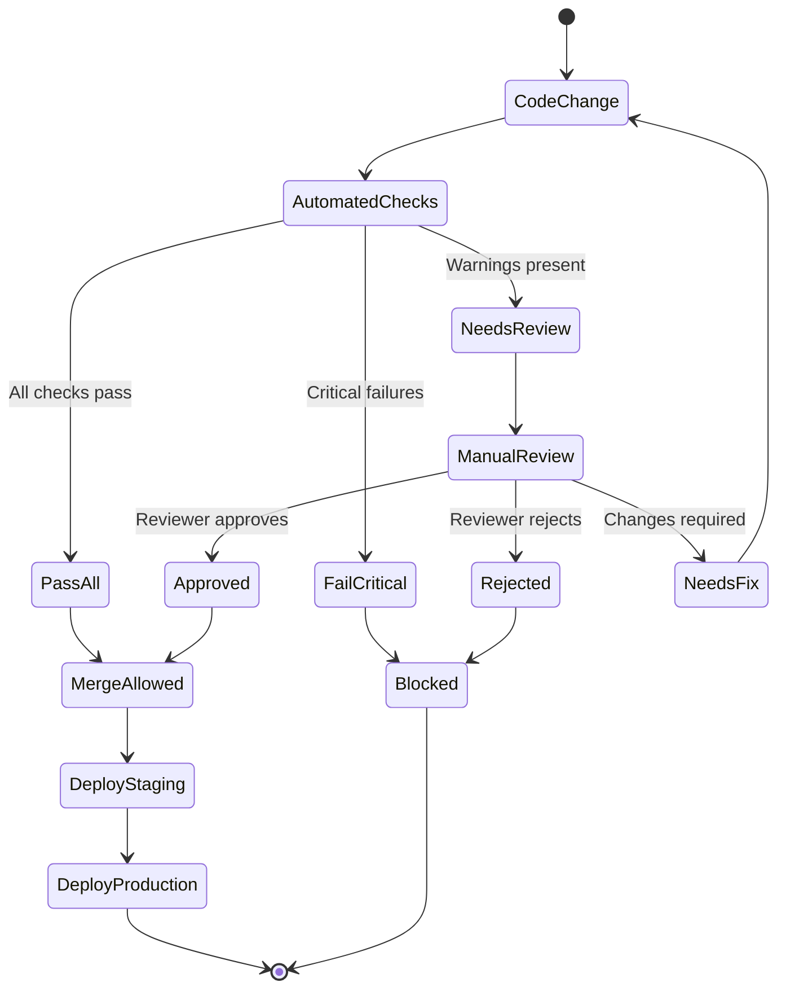

## Violation Notification Systems

The platform implements multi-channel notification systems to ensure timely awareness and response to compliance violations.

### Notification Channels

| Channel | Use Case | Response Time | Escalation |
|---------|----------|---------------|------------|
| **GitHub Comments** | PR-level violations | Immediate | Auto-mention reviewers |
| **Slack/Teams** | Real-time alerts | Immediate | @channel for critical |
| **Email** | Daily summaries | Batch processing | Priority-based routing |
| **PagerDuty** | Critical production issues | Immediate | On-call rotation |
| **Jira Tickets** | Tracking remediation | Automated creation | SLA-based escalation |

### Alert Severity Matrix

| Severity | Definition | Notification | Escalation |
|----------|------------|--------------|------------|
| **Critical** | Security breach, data loss risk | Immediate all channels | 15-minute escalation |
| **High** | Major policy violation | Immediate primary channels | 1-hour escalation |
| **Medium** | Minor policy deviation | Within 1 hour | 4-hour escalation |
| **Low** | Informational finding | Daily digest | No escalation |

## Remediation Automation Triggers

The platform supports automated remediation for common compliance violations, reducing manual intervention and accelerating resolution times.

### Remediation Strategies

| Strategy | Application | Risk Level | Rollback Support |
|----------|-------------|------------|------------------|
| **Auto-Fix** | Simple configuration corrections | Low | Full rollback |
| **Guided Fix** | Step-by-step remediation workflow | Medium | Partial rollback |
| **Template Apply** | Standardized configuration templates | Medium | Full rollback |
| **Playbook Execution** | Complex multi-step remediation | High | Full rollback |
| **Manual Override** | Human-approved exceptions | Variable | Depends on change type |

### Remediation Workflow

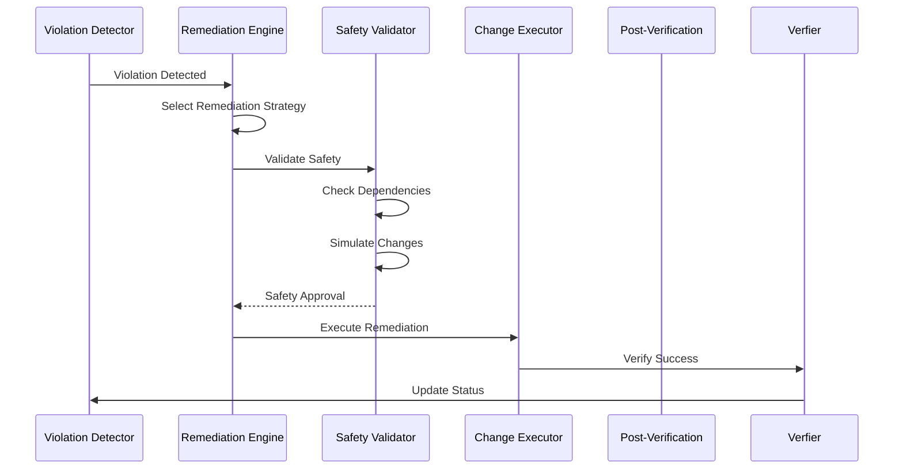

## Audit Trail Maintenance

Comprehensive audit trails capture all compliance-related activities, providing forensic capabilities and regulatory compliance support.

### Audit Data Collection

| Data Type | Source | Retention Period | Access Level |
|-----------|--------|------------------|--------------|
| **Policy Evaluations** | OPA, Python checks | 7 years | Restricted |
| **Configuration Changes** | Git, deployment logs | 7 years | Restricted |
| **User Actions** | API calls, manual changes | 3 years | Internal |
| **System Events** | Pipeline runs, notifications | 1 year | Public |
| **Remediation Actions** | Automated/manual fixes | 7 years | Restricted |

### Audit Trail Structure

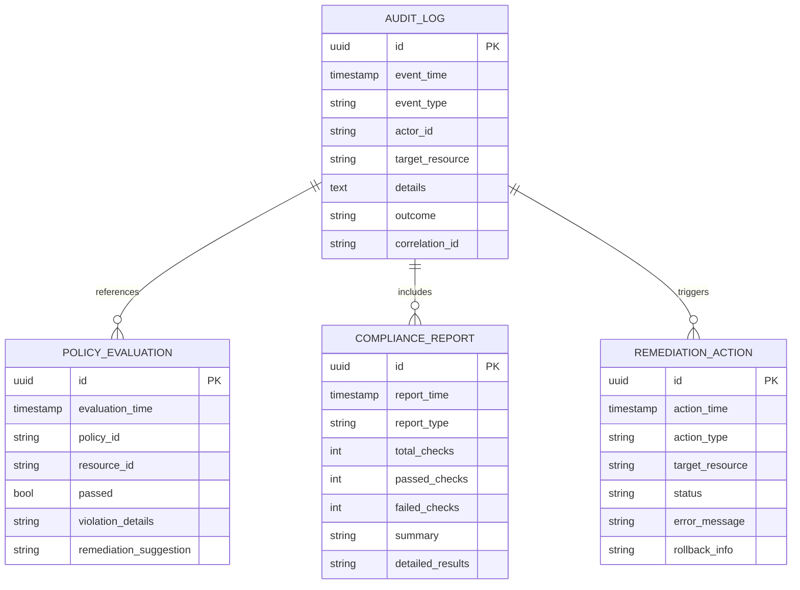

## External System Integrations

The platform integrates with various external systems to synchronize compliance data and enable cross-platform workflows.

### Integration Architecture

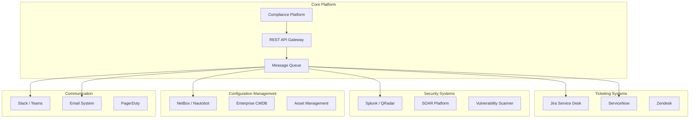

### Integration Patterns

| Integration | Pattern | Data Flow | Sync Frequency |
|-------------|---------|-----------|----------------|
| **Ticketing Systems** | Event-driven | Violation → Ticket Creation | Real-time |
| **SIEM Solutions** | Log streaming | Audit events → SIEM ingestion | Near real-time |
| **CMDB Synchronization** | Bidirectional sync | Compliance state ↔ CMDB records | Hourly |
| **ChatOps Platforms** | Webhook callbacks | Status updates → Chat channels | Real-time |
| **Vulnerability Scanners** | API polling | Compliance gaps → Vulnerability tickets | Daily |

## Compliance Policies and Standards

The platform enforces a comprehensive set of compliance policies covering security, operational, and regulatory requirements.

### Policy Categories and Examples

| Category | Policy Name | Description | Severity |
|----------|-------------|-------------|----------|
| **Access Control** | SSH Only | Telnet must be disabled | Critical |
| **Authentication** | AAA Required | TACACS+/RADIUS mandatory | Critical |
| **Encryption** | SNMPv3 Only | SNMPv1/v2c prohibited | High |
| **Logging** | Syslog Enabled | Centralized logging required | Medium |
| **Cryptography** | Approved Ciphers | Only approved cipher suites | High |
| **Firmware** | Version Control | Approved firmware versions only | High |
| **Password Policy** | Complexity Requirements | Minimum length and complexity | Critical |
| **Network Security** | Default Deny | Explicit allow only ACLs | High |
| **Firewall Rules** | Rule Optimization | No shadow/duplicate rules | Medium |
| **Documentation** | Change Documentation | Required comments and justification | Low |

### Policy Enforcement Levels

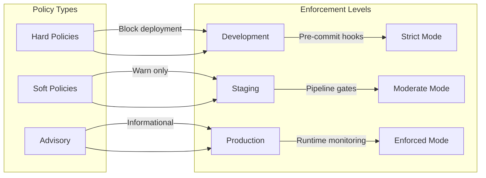

## Monitoring and Observability

Compliance monitoring provides real-time visibility into compliance status and enables proactive issue detection.

### Key Metrics

| Metric | Description | Threshold | Alert Level |
|--------|-------------|-----------|-------------|
| **Compliance Score** | Overall compliance percentage | < 95% | Warning |
| **Violation Rate** | New violations per hour | > 10/hr | Critical |
| **Mean Time to Detect** | Average detection time | > 5 minutes | Warning |
| **Mean Time to Remediate** | Average fix time | > 4 hours | High |
| **Policy Coverage** | Percentage of devices monitored | < 90% | Warning |
| **False Positive Rate** | Incorrect violation reports | > 5% | Investigation |

### Dashboard Components

```mermaid
graph TB
subgraph "Executive Dashboard"
ExecScore[Overall Compliance Score]
TrendChart[Compliance Trend]
TopViolations[Top Violations]
RiskAssessment[Risk Assessment]
end
subgraph "Operations Dashboard"
RealTime[Real-time Violations]
RemediationQueue[Remediation Queue]
PerformanceMetrics[Performance Metrics]
SystemHealth[System Health]
end
subgraph "Technical Dashboard"
PolicyStatus[Policy Status]
IntegrationHealth[Integration Health]
AuditTrail[Audit Trail]
ResourceUsage[Resource Usage]
end
ExecScore --> TrendChart
TrendChart --> TopViolations
TopViolations --> RiskAssessment
RealTime --> RemediationQueue
RemediationQueue --> PerformanceMetrics
PerformanceMetrics --> SystemHealth
PolicyStatus --> IntegrationHealth
IntegrationHealth --> AuditTrail
AuditTrail --> ResourceUsage
```

## Troubleshooting Guide

Common compliance issues and their resolutions:

### Pipeline Failures

| Issue | Symptoms | Resolution |
|-------|----------|------------|
| **OPA Policy Failure** | Pipeline blocked by policy evaluation | Review policy violations, update configuration or policy |
| **Batfish Analysis Error** | Network analysis timeout or errors | Validate configuration syntax, check network topology |
| **Python Compliance Timeout** | Custom checks taking too long | Optimize check logic, increase timeout limits |
| **Integration Connection Issues** | External system communication failures | Verify credentials, network connectivity, API endpoints |

### Runtime Compliance Issues

| Issue | Detection | Resolution |
|-------|-----------|------------|
| **Configuration Drift** | Automated drift detection | Compare with baseline, apply corrective actions |
| **Policy Violation Recurrence** | Same violation appearing repeatedly | Root cause analysis, implement preventive measures |
| **Remediation Failures** | Automated fixes not applying | Manual intervention, investigate dependencies |
| **Alert Fatigue** | Excessive non-actionable alerts | Tune alert thresholds, improve filtering |

## Conclusion

The Enterprise Network Automation Platform's compliance framework provides comprehensive protection through multi-layered enforcement, automated remediation, and extensive integrations. The system successfully balances security requirements with operational efficiency, enabling rapid deployment while maintaining strict compliance standards.

Key strengths include:

- **Shift-left compliance**: Early detection and prevention of policy violations
- **Automated remediation**: Reduced manual intervention for common issues  
- **Comprehensive reporting**: Multi-audience visibility into compliance status
- **Extensive integrations**: Seamless operation within existing enterprise toolchains
- **Continuous monitoring**: Real-time compliance assurance in production

This architecture demonstrates how modern network automation platforms can effectively enforce compliance without sacrificing agility or developer productivity.