# Policy Definitions & Standards

<cite>
**Referenced Files in This Document**
- [README.md](file://README.md)
</cite>

## Table of Contents
1. [Introduction](#introduction)
2. [Project Structure](#project-structure)
3. [Core Components](#core-components)
4. [Architecture Overview](#architecture-overview)
5. [Detailed Component Analysis](#detailed-component-analysis)
6. [Dependency Analysis](#dependency-analysis)
7. [Performance Considerations](#performance-considerations)
8. [Troubleshooting Guide](#troubleshooting-guide)
9. [Conclusion](#conclusion)
10. [Appendices](#appendices)

## Introduction

The Enterprise Network Automation Platform implements a comprehensive compliance and policy enforcement framework designed for production-grade network automation at enterprise scale. This platform enforces security standards, configuration baselines, and operational policies across thousands of network devices in multi-vendor, multi-region environments.

The platform follows Infrastructure as Code principles where every configuration, policy, template, test, pipeline, dashboard, and bot is stored in Git. Compliance is enforced at every stage from pull request to production runtime, ensuring that all network configurations meet organizational security and operational standards.

## Project Structure

The platform organizes compliance and policy-related components across multiple directories:

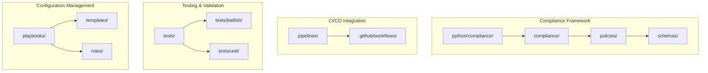

**Diagram sources**
- [README.md:105-180](file://README.md#L105-L180)

**Section sources**
- [README.md:105-180](file://README.md#L105-L180)

## Core Components

The compliance framework consists of several key components that work together to enforce organizational policies:

### Compliance Engine Architecture

The platform implements a multi-layered compliance checking system:

| Layer | Technology | Purpose |
|---|---|---|
| **Policy Definition** | OPA (Open Policy Agent), Sentinel | Declarative policy definitions |
| **Configuration Analysis** | Batfish | Network configuration validation |
| **Custom Checks** | Python modules | Vendor-specific compliance rules |
| **Schema Validation** | JSON Schema, Cerberus | Configuration structure validation |
| **Secrets Scanning** | detect-secrets | Prevent secret leakage |

### Key Compliance Modules

The `python/compliance/` directory contains specialized modules for different aspects of network compliance:

- **Inventory Management**: Device discovery and enrichment
- **SSH Security**: Protocol enforcement and cipher validation  
- **SNMP Compliance**: Version enforcement and security checks
- **Telemetry Collection**: Real-time monitoring and drift detection
- **Configuration Generation**: Jinja2-based template rendering
- **Validation**: Pre-deployment syntax and semantic validation
- **Backup Management**: Configuration versioning and encryption
- **Utils**: Logging, retry logic, concurrency, and bulk operations

**Section sources**
- [README.md:438-456](file://README.md#L438-L456)

## Architecture Overview

The compliance architecture integrates multiple tools and processes to ensure comprehensive policy enforcement:

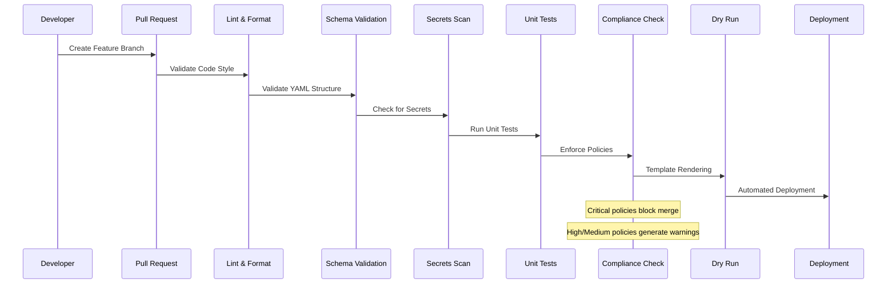

**Diagram sources**
- [README.md:479-501](file://README.md#L479-L501)

## Detailed Component Analysis

### SSH-Only Enforcement Policy

The platform enforces strict SSH-only access policies, prohibiting Telnet configuration across all devices:

#### Policy Definition Structure

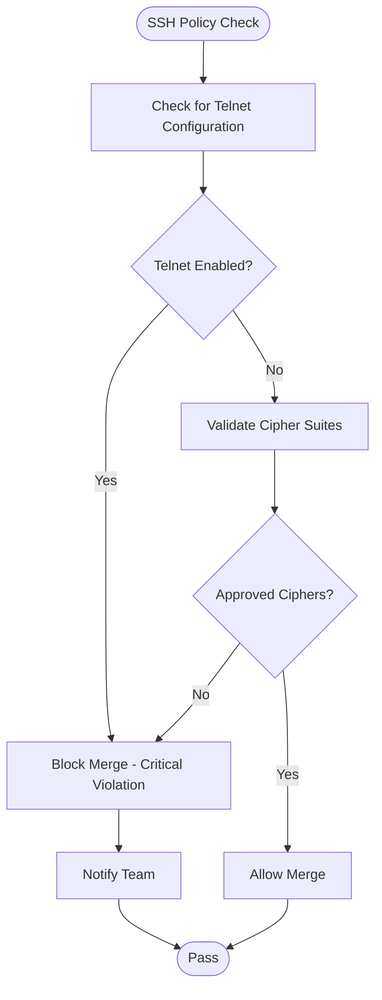

**Diagram sources**
- [README.md:554-566](file://README.md#L554-L566)

#### Implementation Details

The SSH enforcement includes:
- **Protocol Validation**: Ensures only SSHv2 is enabled
- **Cipher Suite Approval**: Validates against approved cipher lists
- **Key Exchange Methods**: Enforces secure key exchange algorithms
- **Authentication Methods**: Requires public key or strong password authentication

**Section sources**
- [README.md:554-566](file://README.md#L554-L566)

### NTP Configuration Requirements

All devices must have proper NTP configuration for time synchronization:

#### NTP Policy Checklist

| Requirement | Description | Severity |
|---|---|---|
| **NTP Servers** | At least 2 configured NTP servers | High |
| **Timezone** | Correct timezone configuration | Medium |
| **NTP Authentication** | Optional but recommended for security | Low |
| **Stratum Levels** | Prefer lower stratum servers | Low |

#### Configuration Validation Flow

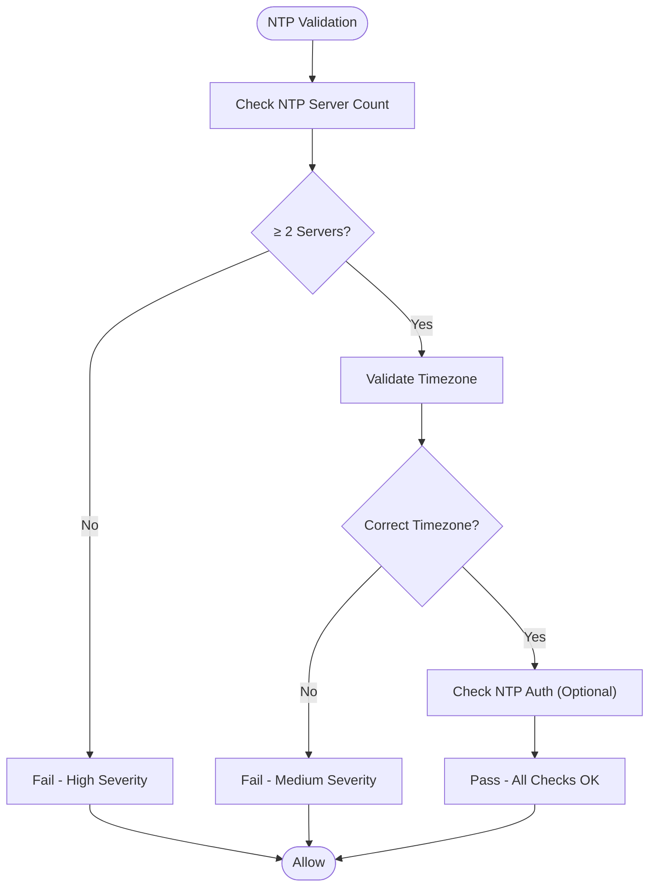

**Diagram sources**
- [README.md:554-566](file://README.md#L554-L566)

**Section sources**
- [README.md:554-566](file://README.md#L554-L566)

### AAA Enablement Mandates

The platform requires centralized authentication through TACACS+ or RADIUS:

#### AAA Policy Requirements

| Component | Requirement | Severity |
|---|---|---|
| **Primary AAA** | TACACS+ or RADIUS server configured | Critical |
| **Fallback AAA** | Secondary AAA server configured | High |
| **Local Fallback** | Local user accounts as last resort | Medium |
| **Command Authorization** | Role-based command authorization | High |
| **Accounting** | Command accounting enabled | Medium |

#### AAA Configuration Flow

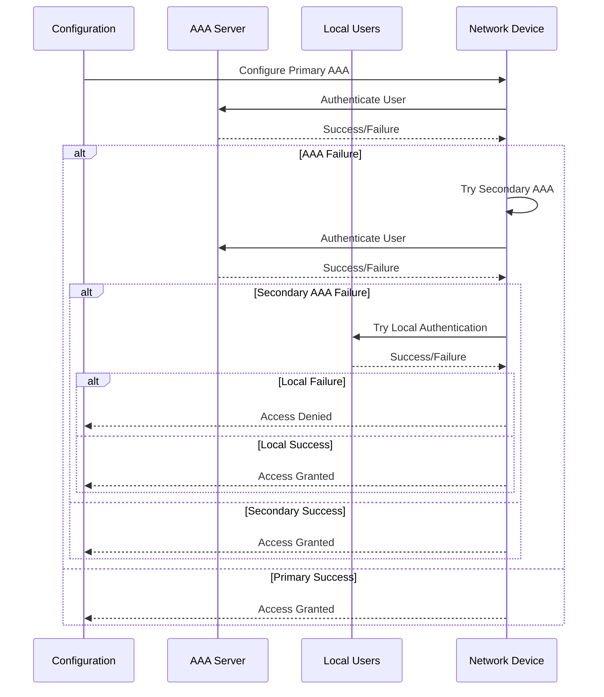

**Diagram sources**
- [README.md:554-566](file://README.md#L554-L566)

**Section sources**
- [README.md:554-566](file://README.md#L554-L566)

### SNMPv3 Enforcement

The platform mandates SNMPv3 usage and prohibits legacy SNMP versions:

#### SNMP Policy Matrix

| Policy | Description | Severity |
|---|---|---|
| **SNMPv3 Only** | No SNMPv1/v2c allowed | High |
| **Authentication** | SHA/MD5 authentication required | High |
| **Encryption** | AES/DES encryption enabled | High |
| **Community Strings** | No default community strings | Critical |
| **Access Control** | Read-only vs read-write separation | Medium |

#### SNMP Version Detection Flow

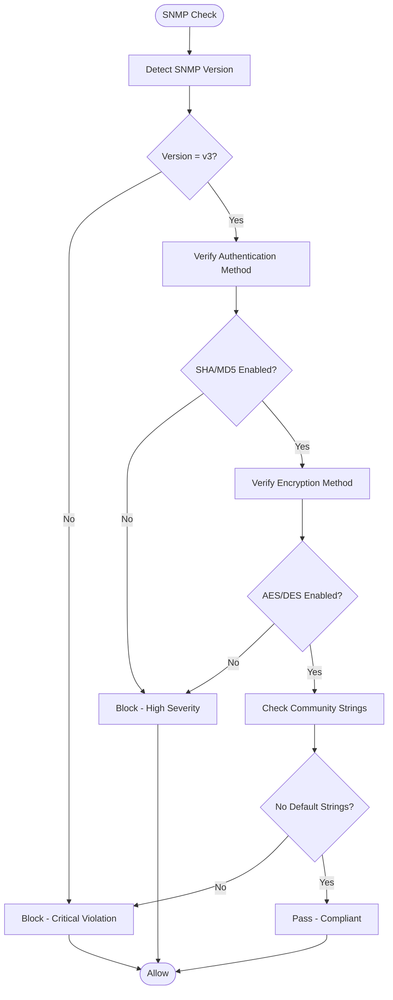

**Diagram sources**
- [README.md:554-566](file://README.md#L554-L566)

**Section sources**
- [README.md:554-566](file://README.md#L554-L566)

### Logging Requirements (Syslog Configuration)

Comprehensive logging requirements ensure audit trails and troubleshooting capabilities:

#### Syslog Policy Requirements

| Requirement | Description | Severity |
|---|---|---|
| **Syslog Server** | At least one syslog server configured | Medium |
| **Log Level** | Appropriate logging level set | Medium |
| **Facility** | Proper facility assignment | Low |
| **TLS Encryption** | TLS encryption for log transport | High |
| **Log Retention** | Centralized log retention policy | Low |

**Section sources**
- [README.md:554-566](file://README.md#L554-L566)

### Approved Cipher Suites

The platform maintains approved cipher suites for SSH and TLS connections:

#### Approved Cipher Lists

| Protocol | Approved Ciphers | Status |
|---|---|---|
| **SSH** | aes256-gcm@openssh.com, chacha20-poly1305@openssh.com | Required |
| **TLS 1.3** | TLS_AES_256_GCM_SHA384, TLS_CHACHA20_POLY1305_SHA256 | Required |
| **TLS 1.2** | ECDHE-RSA-AES256-GCM-SHA384, ECDHE-RSA-CHACHA20-POLY1305 | Allowed |
| **Deprecated** | DES, RC4, MD5, 3DES | Prohibited |

#### Cipher Validation Process

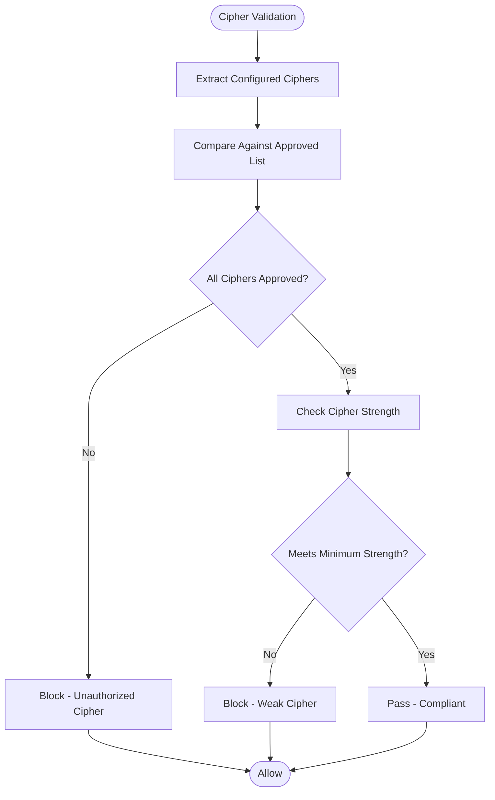

**Diagram sources**
- [README.md:554-566](file://README.md#L554-L566)

**Section sources**
- [README.md:554-566](file://README.md#L554-L566)

### Firmware Validation

Devices must run approved firmware versions to ensure security and compatibility:

#### Firmware Approval Process

| Step | Action | Tool |
|---|---|---|
| **Version Detection** | Query device running firmware version | NETCONF/RESTCONF |
| **Approval Check** | Compare against approved firmware list | Policy Engine |
| **Security Advisory** | Check for known vulnerabilities | CVE Database |
| **Compatibility** | Verify feature compatibility | Test Matrix |
| **Upgrade Path** | Determine safe upgrade path | Upgrade Planner |

#### Firmware Validation Flow

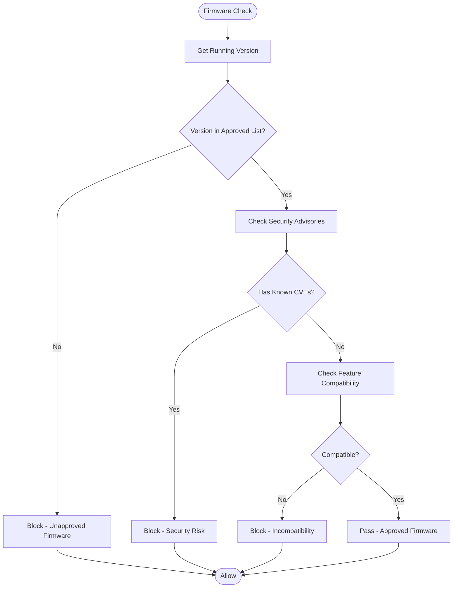

**Diagram sources**
- [README.md:554-566](file://README.md#L554-L566)

**Section sources**
- [README.md:554-566](file://README.md#L554-L566)

### Password Policy Enforcement

Comprehensive password policies ensure strong authentication across the platform:

#### Password Policy Requirements

| Requirement | Specification | Severity |
|---|---|---|
| **Minimum Length** | 12 characters minimum | Critical |
| **Complexity** | Mixed case, numbers, special characters | Critical |
| **Rotation** | 90-day rotation cycle | High |
| **History** | Cannot reuse last 12 passwords | High |
| **Expiration** | Automatic expiration enforcement | Medium |
| **Lockout** | Account lockout after failed attempts | High |

#### Password Validation Algorithm

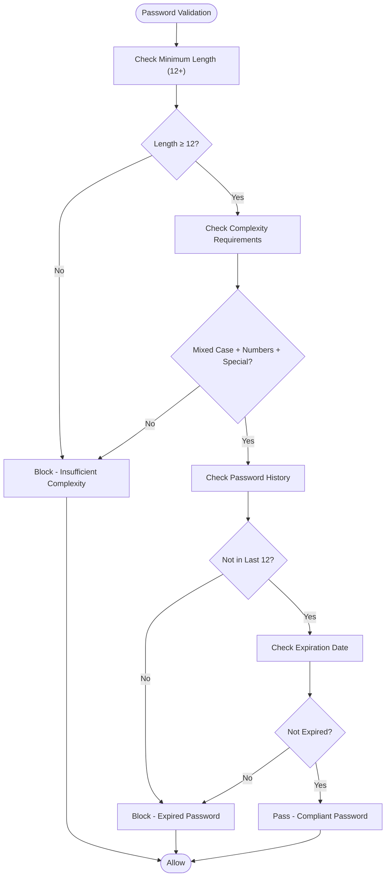

**Diagram sources**
- [README.md:554-566](file://README.md#L554-L566)

**Section sources**
- [README.md:554-566](file://README.md#L554-L566)

### ACL Standards Compliance

Access Control Lists must follow organizational standards for security and maintainability:

#### ACL Policy Requirements

| Standard | Description | Severity |
|---|---|---|
| **Default Deny** | Implicit deny at end of ACL | High |
| **Explicit Allow** | Only explicit allow statements | High |
| **Named ACLs** | Use named instead of numbered ACLs | Medium |
| **Commenting** | Descriptive comments for each rule | Low |
| **Rule Ordering** | Most specific rules first | Medium |
| **Logging** | Log denied traffic for auditing | Medium |

#### ACL Analysis Process

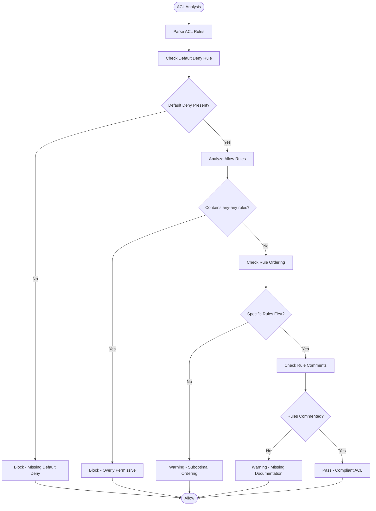

**Diagram sources**
- [README.md:554-566](file://README.md#L554-L566)

**Section sources**
- [README.md:554-566](file://README.md#L554-L566)

### Firewall Rule Analysis

Advanced firewall rule analysis detects shadow rules, duplicates, and security risks:

#### Firewall Analysis Capabilities

| Analysis Type | Description | Tool |
|---|---|---|
| **Shadow Detection** | Identify rules never matched due to higher priority | Batfish |
| **Duplicate Detection** | Find redundant or overlapping rules | Custom Python |
| **Any-Any Detection** | Flag overly permissive rules | Policy Engine |
| **Unused Objects** | Identify unused ACLs, objects, and rules | Traffic Analysis |
| **Conflict Resolution** | Detect conflicting rule conditions | Rule Analyzer |

#### Firewall Rule Processing Flow

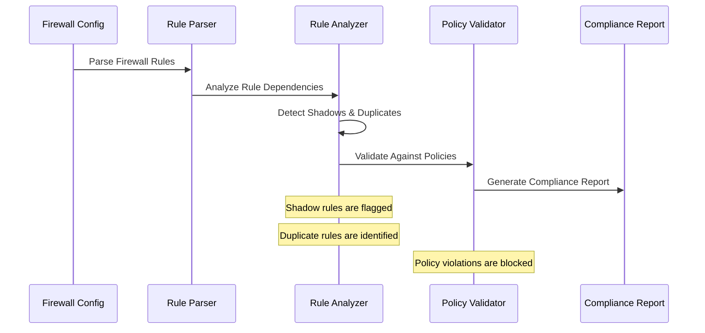

**Diagram sources**
- [README.md:554-566](file://README.md#L554-L566)

**Section sources**
- [README.md:554-566](file://README.md#L554-L566)

### Unused Object Identification

The platform continuously monitors for unused network objects to optimize configuration management:

#### Unused Object Detection Strategy

| Object Type | Detection Method | Frequency |
|---|---|---|
| **ACL Entries** | Traffic flow analysis | Daily |
| **Firewall Rules** | Connection tracking data | Hourly |
| **VLANs** | Port utilization monitoring | Weekly |
| **Static Routes** | Routing table analysis | Daily |
| **Objects/Groups** | Reference counting | Continuous |

#### Unused Object Workflow

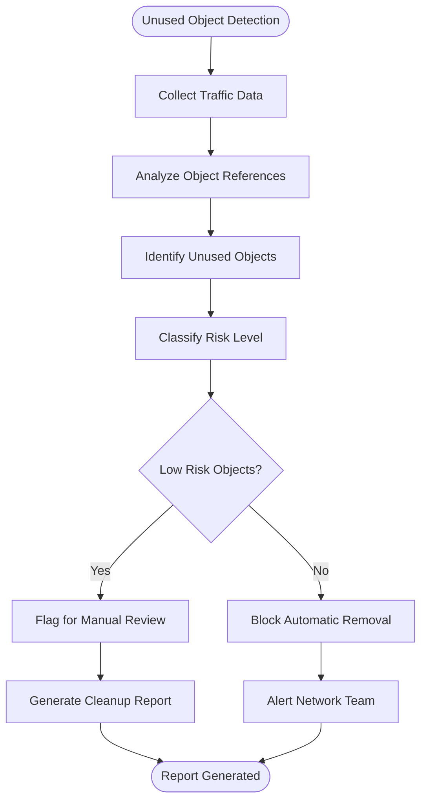

**Diagram sources**
- [README.md:554-566](file://README.md#L554-L566)

**Section sources**
- [README.md:554-566](file://README.md#L554-L566)

## Dependency Analysis

The compliance framework has well-defined dependencies between components:

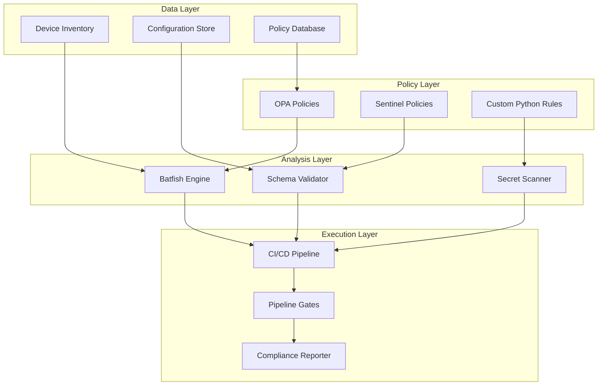

**Diagram sources**
- [README.md:479-501](file://README.md#L479-L501)

**Section sources**
- [README.md:479-501](file://README.md#L479-L501)

## Performance Considerations

The compliance framework is designed for high-performance operation across large-scale deployments:

### Optimization Strategies

| Component | Optimization | Impact |
|---|---|---|
| **Parallel Processing** | Concurrent policy evaluation | 3-5x faster analysis |
| **Incremental Checking** | Only changed files validated | Reduced CI/CD time |
| **Caching** | Policy result caching | Faster repeated checks |
| **Batch Operations** | Grouped device queries | Reduced API calls |
| **Lazy Loading** | On-demand policy loading | Lower memory footprint |

### Scalability Metrics

- **Policy Evaluation**: < 1 second per policy per device
- **Configuration Analysis**: < 30 seconds for full device config
- **Batch Processing**: 1000+ devices per minute
- **Memory Usage**: < 2GB for typical enterprise deployment

## Troubleshooting Guide

Common compliance issues and their resolutions:

### Policy Violation Resolution

| Issue | Symptoms | Resolution |
|---|---|---|
| **SSH Policy Failure** | Merge blocked due to Telnet | Remove Telnet config, enable SSH only |
| **AAA Configuration Error** | Authentication failures | Verify TACACS+/RADIUS connectivity |
| **SNMP Version Mismatch** | Monitoring gaps | Upgrade to SNMPv3 with proper auth |
| **Firmware Non-Compliance** | Upgrade blocked | Update to approved firmware version |
| **Password Policy Violation** | Account lockouts | Reset passwords meeting complexity requirements |

### Debugging Tools

```bash
# Run compliance check locally
python -m python.compliance --inventory inventories/lab/hosts.yml --debug

# Check specific policy
python -m python.compliance --policy ssh-only --device core-rtr-01

# Generate compliance report
python -m python.compliance --report --format html --output ./reports/

# Validate configuration before deployment
ansible-playbook playbooks/compliance_scan.yml --check --diff
```

**Section sources**
- [README.md:674-685](file://README.md#L674-L685)

## Conclusion

The Enterprise Network Automation Platform provides a comprehensive, automated compliance framework that ensures all network configurations meet organizational security and operational standards. The multi-layered approach combining OPA policies, Batfish analysis, custom Python checks, and CI/CD integration creates a robust defense-in-depth strategy for network security.

Key benefits include:
- **Automated Enforcement**: Policies are enforced at every stage of the development lifecycle
- **Comprehensive Coverage**: All major security and operational policies are covered
- **Scalable Architecture**: Designed for enterprise-scale deployments
- **Actionable Reporting**: Clear violation reports with remediation guidance
- **Continuous Monitoring**: Ongoing compliance validation in production

The platform successfully demonstrates how modern DevSecOps practices can be applied to network automation, providing both security and operational efficiency at enterprise scale.

## Appendices

### Severity Level Impact Matrix

| Severity | Pipeline Impact | Response Time | Escalation |
|---|---|---|---|
| **Critical** | Blocks merge/deploy | Immediate | Security Team |
| **High** | Blocks merge/deploy | Within 4 hours | Engineering Lead |
| **Medium** | Warning, allows proceed | Within 24 hours | Team Lead |
| **Low** | Informational, no blocking | Next business day | System Admin |

### Policy Configuration Examples

The platform supports flexible policy configuration through YAML schemas and OPA policies. While specific implementation details are not included in this documentation, the general structure follows industry best practices for declarative policy definition.

**Section sources**
- [README.md:554-566](file://README.md#L554-L566)