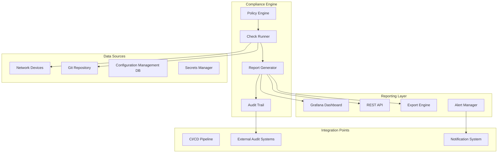
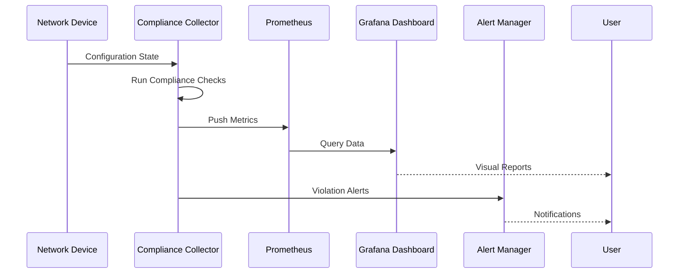
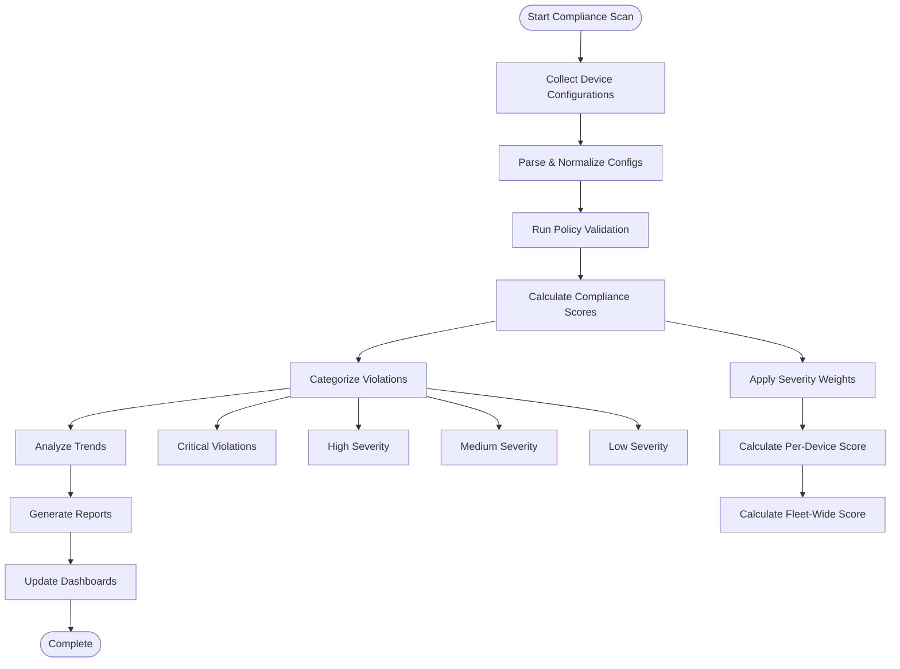
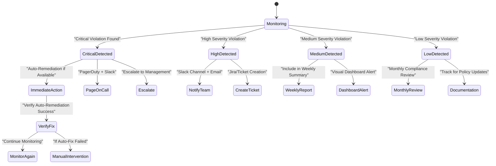
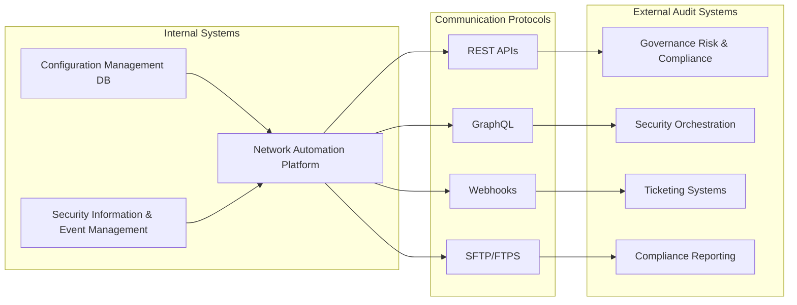

# Compliance Reporting & Auditing

<cite>
**Referenced Files in This Document**
- [README.md](file://README.md)
</cite>

## Table of Contents
1. [Introduction](#introduction)
2. [Project Structure](#project-structure)
3. [Core Components](#core-components)
4. [Architecture Overview](#architecture-overview)
5. [Detailed Component Analysis](#detailed-component-analysis)
6. [Dependency Analysis](#dependency-analysis)
7. [Performance Considerations](#performance-considerations)
8. [Troubleshooting Guide](#troubleshooting-guide)
9. [Conclusion](#conclusion)
10. [Appendices](#appendices)

## Introduction

The Enterprise Network Automation Platform provides comprehensive compliance reporting and auditing capabilities designed for enterprise-scale network management across multi-vendor, multi-region environments. This system ensures that all network configurations adhere to organizational policies, regulatory requirements, and security standards through automated compliance checks, detailed audit trails, and real-time monitoring dashboards.

The platform implements a "Compliance as Code" approach where all compliance policies, checks, and reporting mechanisms are version-controlled and integrated into the CI/CD pipeline, ensuring consistent enforcement from development through production deployment.

## Project Structure

The compliance reporting and auditing system is organized around several key architectural components:



**Diagram sources**
- [README.md:548-580](file://README.md#L548-L580)
- [README.md:583-616](file://README.md#L583-L616)

**Section sources**
- [README.md:103-180](file://README.md#L103-L180)
- [README.md:548-580](file://README.md#L548-L580)

## Core Components

### Compliance Policy Engine

The policy engine serves as the central authority for compliance rules and validation logic. It processes multiple types of compliance checks including:

- **SSH Security**: Ensures SSH-only access with proper cipher suites
- **Authentication**: Validates AAA configuration (TACACS+/RADIUS)
- **Time Synchronization**: Verifies NTP configuration
- **Monitoring**: Checks SNMPv3 and logging setup
- **Access Control**: Validates ACL standards and firewall rules
- **Firmware Compliance**: Ensures approved OS versions
- **Password Policies**: Enforces complexity and rotation requirements

### Automated Compliance Scanning

The platform implements continuous compliance scanning through multiple mechanisms:

| Scan Type | Frequency | Scope | Output |
|-----------|-----------|-------|--------|
| PR Validation | On Pull Request | Configuration changes | Pass/Fail with violations |
| Scheduled Audit | Daily (02:00 UTC) | Full fleet | Comprehensive reports |
| On-Demand | Manual trigger | Specific devices | Targeted analysis |
| Post-Deploy | After deployment | Changed devices | Verification results |

### Real-Time Monitoring Integration

Compliance metrics are seamlessly integrated with the observability stack:



**Diagram sources**
- [README.md:583-604](file://README.md#L583-L604)

**Section sources**
- [README.md:548-580](file://README.md#L548-L580)
- [README.md:583-616](file://README.md#L583-L616)

## Architecture Overview

The compliance reporting and auditing system follows a layered architecture that ensures scalability, reliability, and comprehensive coverage:

```mermaid
graph TB
subgraph "Collection Layer"
SSH[SSH Collection]
NETCONF[NETCONF Collection]
RESTCONF[RESTCONF Collection]
SNMP[SNMP Collection]
Telemetry[Telemetry Collection]
end
subgraph "Processing Layer"
Parser[Config Parser]
Validator[Policy Validator]
Analyzer[Compliance Analyzer]
Aggregator[Results Aggregator]
end
subgraph "Storage Layer"
TimeSeries[(Time Series DB)]
ConfigStore[(Config Store)]
AuditLog[(Audit Log)]
Cache[(Cache Layer)]
end
subgraph "Presentation Layer"
WebUI[Web Interface]
API[REST API]
Export[Export Engine]
Dashboard[Grafana Dashboards]
end
subgraph "Integration Layer"
CI_CD[CI/CD Integration]
ExternalAPI[External Audit APIs]
Notification[Notification Service]
Ticketing[Ticketing System]
end
Collection Layer --> Processing Layer
Processing Layer --> Storage Layer
Storage Layer --> Presentation Layer
Presentation Layer --> Integration Layer
```

**Diagram sources**
- [README.md:548-580](file://README.md#L548-L580)
- [README.md:583-616](file://README.md#L583-L616)

## Detailed Component Analysis

### Compliance Score Calculation

The platform calculates comprehensive compliance scores using a weighted scoring algorithm:



**Diagram sources**
- [README.md:548-580](file://README.md#L548-L580)

### Audit Trail Implementation

The audit trail system maintains comprehensive records of all compliance-related activities:

| Audit Event Type | Description | Retention Period |
|------------------|-------------|------------------|
| Policy Changes | Modifications to compliance rules | 7 years |
| Configuration Drift | Unauthorized configuration changes | 7 years |
| Compliance Scans | Execution results and outcomes | 3 years |
| Remediation Actions | Automated or manual fixes applied | 7 years |
| User Activities | Who made changes and when | 7 years |
| System Events | Infrastructure changes affecting compliance | 3 years |

### Dashboard Visualizations

The platform provides comprehensive dashboard visualizations for compliance monitoring:

#### Compliance Overview Dashboard
- **Overall Compliance Score**: Real-time percentage showing fleet-wide compliance
- **Violation Trends**: Historical trends showing improvement/regression over time
- **Severity Breakdown**: Pie charts showing distribution by severity level
- **Category Analysis**: Grouped violations by policy category
- **Device Status Map**: Geographic visualization of device compliance status

#### Device-Specific Reports
- **Individual Device Score**: Detailed compliance score per device
- **Violation Details**: Complete list of specific violations with remediation steps
- **Historical Performance**: Compliance trend for individual devices
- **Change Impact**: How recent changes affected compliance status

**Section sources**
- [README.md:548-580](file://README.md#L548-L580)
- [README.md:606-616](file://README.md#L606-L616)

### Alerting Mechanisms

The alerting system provides tiered notifications based on violation severity:



**Diagram sources**
- [README.md:583-604](file://README.md#L583-L604)

### Report Generation Commands

The platform supports various report generation methods:

#### CLI Commands
```bash
# Generate comprehensive compliance report
python -m python.compliance --report full --output ./reports/

# Generate device-specific compliance report
python -m python.compliance --device core-rtr-01 --report detailed

# Generate trend analysis report
python -m python.compliance --report trends --period 30d

# Export compliance data for external systems
python -m python.compliance --export json --format cisa
```

#### API Endpoints
- `GET /api/v1/compliance/reports` - List available reports
- `POST /api/v1/compliance/scans` - Trigger new compliance scan
- `GET /api/v1/compliance/devices/{id}/status` - Get device compliance status
- `POST /api/v1/compliance/export` - Export compliance data

**Section sources**
- [README.md:267-280](file://README.md#L267-L280)
- [README.md:471-475](file://README.md#L471-L475)

### Scheduled Compliance Audits

The platform supports flexible scheduling for compliance audits:

| Schedule Type | Frequency | Scope | Purpose |
|---------------|-----------|-------|---------|
| Continuous | Real-time | Configuration changes | Immediate violation detection |
| Daily | 02:00 UTC | Full fleet | Comprehensive daily audit |
| Weekly | Monday 08:00 | All devices | Weekly compliance summary |
| Monthly | 1st of month | Entire infrastructure | Monthly compliance reporting |
| Quarterly | As needed | Regulatory focus areas | Regulatory compliance verification |

### Export Formats for Regulatory Compliance

The platform supports multiple export formats for different regulatory requirements:

#### Standard Formats
- **JSON**: Machine-readable format for integration
- **CSV**: Spreadsheet-compatible format for analysis
- **PDF**: Human-readable formatted reports
- **XML**: Structured data for enterprise systems

#### Regulatory Standards
- **CISA Format**: Cybersecurity Infrastructure and Security Agency compliance
- **NIST SP 800-53**: National Institute of Standards and Technology framework
- **ISO 27001**: Information security management system compliance
- **SOC 2**: Service Organization Control reporting
- **PCI DSS**: Payment Card Industry Data Security Standard

### Integration with External Audit Systems

The platform integrates seamlessly with external audit and compliance systems:



**Diagram sources**
- [README.md:583-604](file://README.md#L583-L604)

**Section sources**
- [README.md:471-475](file://README.md#L471-L475)
- [README.md:583-604](file://README.md#L583-L604)

## Dependency Analysis

The compliance reporting system has well-defined dependencies and integration points:

```mermaid
graph TB
subgraph "Core Dependencies"
Python[Python 3.11+]
Ansible[Ansible 2.15+]
PyTest[PyTest Framework]
Jinja2[Jinja2 Templates]
end
subgraph "Network Libraries"
Netmiko[Netmiko]
NAPALM[NAPALM]
Paramiko[Paramiko]
Netconf[NETCONF Client]
end
subgraph "Compliance Tools"
OPA[Open Policy Agent]
Batfish[Batfish Analysis]
YAML[YAML Parser]
JSON[JSON Schema]
end
subgraph "Monitoring & Reporting"
Prometheus[Prometheus]
Grafana[Grafana]
OpenTelemetry[OpenTelemetry]
Syslog[Syslog Collector]
end
subgraph "External Integrations"
Vault[HashiCorp Vault]
AWS[AWS Secrets Manager]
Azure[Azure Key Vault]
Slack[Slack Integration]
PagerDuty[PagerDuty]
end
Core Dependencies --> Network Libraries
Core Dependencies --> Compliance Tools
Network Libraries --> Monitoring & Reporting
Compliance Tools --> Monitoring & Reporting
Monitoring & Reporting --> External Integrations
```

**Diagram sources**
- [README.md:184-199](file://README.md#L184-L199)
- [README.md:548-580](file://README.md#L548-L580)

**Section sources**
- [README.md:184-199](file://README.md#L184-L199)
- [README.md:548-580](file://README.md#L548-L580)

## Performance Considerations

The compliance reporting system is designed for high-performance operation at enterprise scale:

### Scalability Features
- **Parallel Processing**: Concurrent compliance checks across multiple devices
- **Incremental Scanning**: Only re-checks changed configurations
- **Caching Layer**: Reduces redundant API calls and processing
- **Batch Operations**: Groups similar compliance checks for efficiency

### Optimization Strategies
- **Connection Pooling**: Reuses network connections to devices
- **Memory Management**: Efficient handling of large configuration files
- **Database Indexing**: Optimized queries for historical compliance data
- **Asynchronous Processing**: Non-blocking operations for better throughput

### Resource Requirements
- **Minimum**: 4 CPU cores, 8GB RAM, 100GB storage
- **Recommended**: 8+ CPU cores, 16GB+ RAM, 500GB+ storage
- **Enterprise**: Kubernetes-based scaling with horizontal pod autoscaling

## Troubleshooting Guide

Common issues and their resolutions in the compliance reporting system:

### Compliance Check Failures
- **Issue**: Compliance checks timeout during execution
- **Resolution**: Increase connection timeouts and implement retry logic
- **Prevention**: Configure appropriate timeout values based on device count

### Report Generation Issues
- **Issue**: Large reports fail to generate or export
- **Resolution**: Implement pagination and streaming for large datasets
- **Prevention**: Use incremental exports and background processing

### Dashboard Performance Problems
- **Issue**: Slow dashboard loading with large datasets
- **Resolution**: Implement data aggregation and caching strategies
- **Prevention**: Use pre-computed metrics and materialized views

### Integration Connectivity Issues
- **Issue**: External system integration failures
- **Resolution**: Implement circuit breaker patterns and fallback mechanisms
- **Prevention**: Health checks and automatic retry with exponential backoff

**Section sources**
- [README.md:674-685](file://README.md#L674-L685)

## Conclusion

The Enterprise Network Automation Platform's compliance reporting and auditing system provides a comprehensive solution for maintaining regulatory compliance and security posture across enterprise network infrastructure. The system's modular architecture, extensive policy engine, and robust reporting capabilities ensure that organizations can maintain compliance while scaling their network operations.

Key strengths include:
- **Comprehensive Coverage**: Support for multiple vendors, protocols, and compliance frameworks
- **Real-Time Monitoring**: Continuous compliance checking with immediate alerting
- **Flexible Reporting**: Multiple export formats and integration points
- **Scalable Architecture**: Designed for enterprise-scale deployments
- **Automated Remediation**: Intelligent auto-fix capabilities for common violations

The platform successfully bridges the gap between technical compliance enforcement and business-level compliance reporting, providing both operational teams and management with the visibility and control needed to maintain strong security postures in complex network environments.

## Appendices

### A. Compliance Policy Examples

The platform includes pre-configured compliance policies covering common security requirements:

#### SSH Security Policies
- Disable Telnet access
- Enforce SSH protocol version 2
- Require strong cipher suites
- Implement connection rate limiting

#### Authentication Policies
- Mandate TACACS+ or RADIUS authentication
- Enforce password complexity requirements
- Implement session timeout policies
- Require multi-factor authentication for administrative access

#### Monitoring and Logging Policies
- Enable syslog forwarding
- Configure SNMPv3 with authentication
- Set up performance monitoring
- Implement audit logging

### B. Integration Configuration Examples

#### External Audit System Integration
```yaml
# External audit system configuration
audit_integration:
  target_system: "compliance_grc_platform"
  api_endpoint: "https://grc.company.com/api/v1/compliance"
  auth_method: "oauth2"
  sync_frequency: "daily"
  data_format: "json"
  encryption: "tls1.3"
```

#### Notification Configuration
```yaml
# Notification channels configuration
notifications:
  slack:
    enabled: true
    channel: "#network-compliance"
    severity_filter: ["critical", "high"]
  
  pagerduty:
    enabled: true
    service_key: "${PAGERDUTY_SERVICE_KEY}"
    severity_filter: ["critical"]
  
  email:
    enabled: true
    recipients: ["compliance-team@company.com"]
    severity_filter: ["critical", "high", "medium"]
```