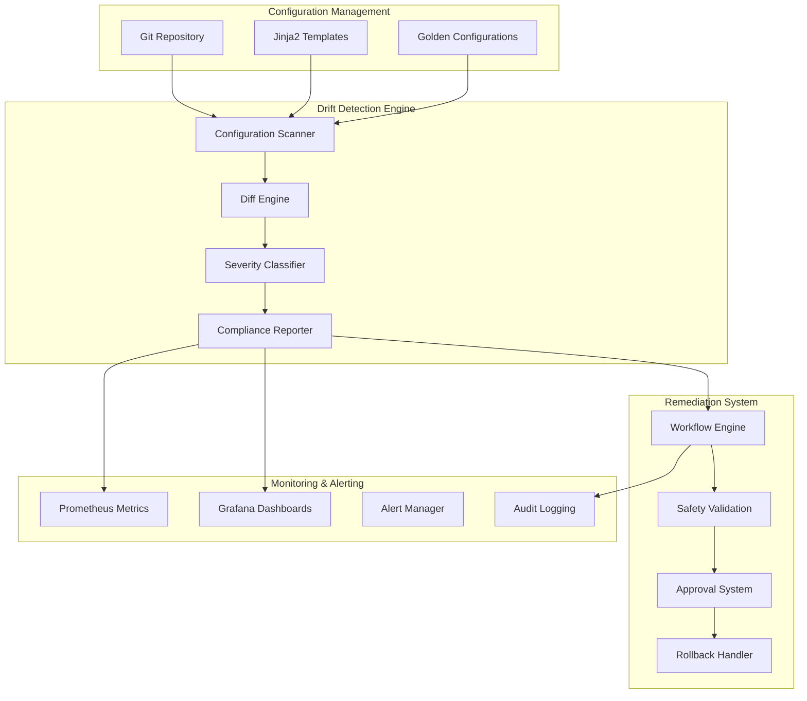
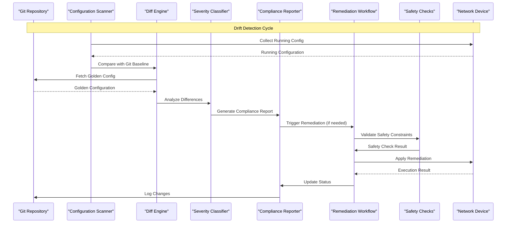
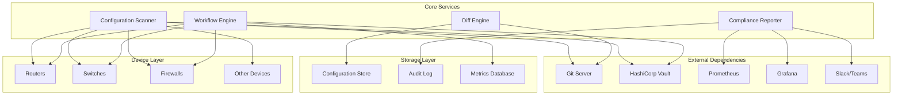
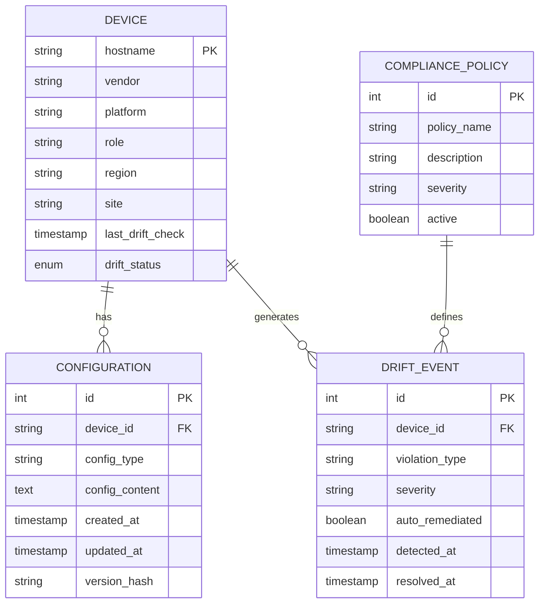

# Drift Detection & Remediation

<cite>
**Referenced Files in This Document**
- [README.md](file://README.md)
</cite>

## Table of Contents
1. [Introduction](#introduction)
2. [Project Structure](#project-structure)
3. [Core Components](#core-components)
4. [Architecture Overview](#architecture-overview)
5. [Detailed Component Analysis](#detailed-component-analysis)
6. [Dependency Analysis](#dependency-analysis)
7. [Performance Considerations](#performance-considerations)
8. [Troubleshooting Guide](#troubleshooting-guide)
9. [Conclusion](#conclusion)
10. [Appendices](#appendices)

## Introduction

The Enterprise Network Automation Platform provides comprehensive drift detection and automated remediation capabilities designed to maintain configuration consistency across thousands of network devices in multi-vendor, multi-region environments. The platform implements a GitOps-driven approach where all configurations are stored as code in Git repositories, enabling continuous monitoring and automatic correction of configuration deviations from approved baselines.

This system addresses critical enterprise requirements for configuration compliance, security posture maintenance, and operational stability by continuously comparing running device configurations against their Git-stored golden baselines and automatically remediating non-compliant states while maintaining comprehensive audit trails and safety mechanisms.

## Project Structure

The platform's drift detection and remediation capabilities are distributed across multiple architectural layers:

**Diagram sources**
- [README.md:103-180](file://README.md#L103-L180)
- [README.md:438-456](file://README.md#L438-L456)

**Section sources**
- [README.md:103-180](file://README.md#L103-L180)

## Core Components

### Configuration Baseline Management

The platform maintains golden configuration baselines through a structured approach:

- **Template-Based Generation**: Jinja2 templates generate vendor-specific configurations from structured data
- **Version Control**: All configurations tracked in Git with full history and change management
- **Multi-Vendor Support**: Separate template directories for Cisco IOS/NX-OS, Juniper SRX/MX, Arista EOS, Palo Alto, Fortinet, and other vendors
- **Environment Segmentation**: Separate baselines for production, staging, lab, and disaster recovery environments

### Drift Detection Mechanism

The drift detection system operates through several key phases:

#### Configuration Collection
- Automated collection of running configurations from all managed devices
- Support for multiple protocols: SSH, NETCONF, RESTCONF, SNMP
- Vendor-agnostic abstraction layer using NAPALM and Netmiko
- Scheduled and on-demand collection triggers

#### Comparison Algorithms
- **Line-by-line Diff**: Traditional text-based comparison for exact changes
- **Semantic Analysis**: Understanding of configuration semantics for intelligent comparison
- **Vendor-Specific Parsing**: Protocol-aware parsing for accurate comparison across different CLI formats
- **Structural Validation**: YAML/JSON schema validation for structured configurations

#### Severity Classification
The system classifies drifts into four severity levels:

| Severity Level | Description | Examples | Response Time |
|---|---|---|---|
| **Critical** | Security vulnerabilities or service-affecting changes | Unauthorized access methods, missing AAA, disabled logging | Immediate |
| **High** | Policy violations or performance impacts | Non-approved ciphers, missing NTP, incorrect ACLs | Within 1 hour |
| **Medium** | Best practice violations or minor issues | Missing banners, suboptimal settings | Within 24 hours |
| **Low** | Informational or cosmetic changes | Comment updates, formatting differences | Next business day |

**Section sources**
- [README.md:116-128](file://README.md#L116-L128)
- [README.md:438-456](file://README.md#L438-L456)
- [README.md:554-566](file://README.md#L554-L566)

## Architecture Overview

The drift detection and remediation architecture follows a layered approach with clear separation of concerns:

**Diagram sources**
- [README.md:36-50](file://README.md#L36-L50)
- [README.md:54-99](file://README.md#L54-L99)

### Key Architectural Patterns

#### GitOps Integration
- Pull request-based change management for all configuration modifications
- Automated validation pipeline including linting, testing, and compliance checks
- Approval gates for production deployments
- Automatic rollback on verification failures

#### Multi-Protocol Abstraction
- Unified interface for device communication across vendors
- Protocol negotiation and capability discovery
- Connection pooling and retry logic for reliability
- Authentication abstraction supporting multiple backends

#### Event-Driven Processing
- Real-time drift detection through scheduled scans and event triggers
- Asynchronous processing for large-scale device fleets
- Queue-based workload distribution
- Dead letter handling for failed operations

**Section sources**
- [README.md:36-50](file://README.md#L36-L50)
- [README.md:54-99](file://README.md#L54-L99)
- [README.md:479-514](file://README.md#L479-L514)

## Detailed Component Analysis

### Drift Detection Playbooks

The platform includes comprehensive Ansible playbooks for drift detection and remediation:

#### Core Detection Playbook (`drift_detection.yml`)
- Orchestrates configuration collection across all device types
- Manages parallel execution for optimal performance
- Handles connection failures and retries
- Generates standardized diff reports

#### Golden Configuration Management (`golden_config.yml`)
- Applies approved baseline configurations
- Validates template rendering before deployment
- Supports conditional configuration based on device attributes
- Maintains version history and rollback points

#### Compliance Scanning (`compliance_scan.yml`)
- Executes policy checks against running configurations
- Generates compliance reports with violation details
- Integrates with external compliance frameworks
- Supports custom policy development

### Remediation Strategies

The platform implements tiered remediation strategies based on violation severity and risk assessment:

#### Critical Violations - Immediate Auto-Remediation
- **Security Policy Enforcement**: Automatically disable unauthorized access methods
- **Service Restoration**: Re-enable critical services like logging and authentication
- **Emergency Fixes**: Apply emergency patches for known vulnerabilities

#### High Priority Violations - Conditional Auto-Remediation
- **Policy Compliance**: Enforce approved cipher suites and authentication methods
- **Configuration Standards**: Apply standard network configurations
- **Performance Optimization**: Tune device parameters for optimal performance

#### Medium/Low Priority Violations - Manual Review Required
- **Best Practice Enforcement**: Flag deviations from recommended configurations
- **Documentation Updates**: Ensure proper documentation of intentional changes
- **Change Request Integration**: Route to change management workflow

### Safety Checks and Approval Gates

#### Pre-Remediation Safety Validation
- **Impact Assessment**: Analyze potential impact of proposed changes
- **Dependency Checking**: Verify no conflicts with existing configurations
- **Rollback Readiness**: Ensure backup exists and rollback procedures are tested
- **Resource Availability**: Confirm sufficient device resources for changes

#### Multi-Level Approval Workflow
- **Automated Approvals**: For low-risk, well-defined remediations
- **Peer Review**: For medium-risk changes requiring human oversight
- **CAB Approval**: For high-risk changes affecting critical infrastructure
- **Emergency Override**: For critical security incidents with post-approval process

### Rollback Mechanisms

#### Automated Rollback Triggers
- **Post-Deployment Verification Failures**: Automatic rollback when health checks fail
- **Performance Degradation**: Rollback if metrics indicate performance issues
- **Error Rate Spikes**: Automatic rollback on increased error rates
- **Connectivity Loss**: Immediate rollback if device becomes unreachable

#### Rollback Procedures
- **Configuration Versioning**: Maintain complete history of all configuration changes
- **Atomic Operations**: Ensure all-or-nothing change application
- **Partial Rollback Support**: Ability to roll back specific configuration sections
- **Cross-Device Coordination**: Synchronized rollback across related devices

**Section sources**
- [README.md:422-434](file://README.md#L422-L434)
- [README.md:642-670](file://README.md#L642-L670)

### Monitoring and Alerting Integration

#### Real-Time Drift Alerts
- **Prometheus Metrics**: Export drift detection metrics for monitoring
- **Grafana Dashboards**: Visualize drift trends and compliance status
- **Alertmanager Integration**: Configure alerts for critical drift events
- **Slack/Teams Notifications**: Real-time notifications for immediate attention

#### Audit Trail and Compliance Reporting
- **Change History**: Complete audit trail of all configuration changes
- **Compliance Reports**: Generate periodic compliance reports
- **Regulatory Compliance**: Support for SOX, PCI-DSS, and other regulatory requirements
- **Forensic Analysis**: Detailed logs for incident investigation

**Section sources**
- [README.md:583-616](file://README.md#L583-L616)

## Dependency Analysis

The drift detection and remediation system has well-defined dependencies between components:

**Diagram sources**
- [README.md:54-99](file://README.md#L54-L99)
- [README.md:343-357](file://README.md#L343-L357)

### Component Coupling Analysis

#### Low Coupling Areas
- **Device Abstraction Layer**: Clean separation between protocol implementations and core logic
- **Template Engine**: Independent Jinja2 processing with minimal dependencies
- **Reporting Module**: Decoupled from remediation logic for flexible output formats

#### High Coupling Areas
- **Workflow Engine**: Central coordination point with dependencies on multiple subsystems
- **Safety Validation**: Tight integration with device state and dependency information
- **Audit Trail**: Comprehensive logging throughout the entire remediation process

#### External Service Dependencies
- **Secrets Management**: HashiCorp Vault integration for credential management
- **Monitoring Stack**: Prometheus and Grafana for observability
- **Communication Channels**: Slack/Teams for notifications and ChatOps integration

**Section sources**
- [README.md:54-99](file://README.md#L54-L99)
- [README.md:343-357](file://README.md#L343-L357)

## Performance Considerations

### Scalability Architecture
- **Parallel Processing**: Concurrent device scanning and remediation across large fleets
- **Connection Pooling**: Efficient reuse of device connections to minimize overhead
- **Batch Operations**: Group similar changes to reduce API calls and processing time
- **Distributed Execution**: Horizontal scaling for large-scale deployments

### Optimization Strategies
- **Incremental Scans**: Focus on changed devices rather than full fleet scans
- **Intelligent Caching**: Cache device capabilities and supported features
- **Priority Queuing**: Process critical violations before lower-priority issues
- **Resource Throttling**: Prevent overwhelming device management interfaces

### Monitoring and Observability
- **Performance Metrics**: Track scan duration, remediation success rates, and resource utilization
- **Bottleneck Identification**: Monitor slow-performing devices and network segments
- **Capacity Planning**: Historical trend analysis for capacity planning
- **Health Monitoring**: Continuous monitoring of automation platform health

## Troubleshooting Guide

### Common Issues and Resolutions

| Issue Category | Symptoms | Diagnostic Steps | Resolution |
|---|---|---|---|
| **Connection Failures** | Timeout errors, authentication failures | Check device reachability, verify credentials, review firewall rules | Update connection parameters, rotate credentials, adjust timeouts |
| **Template Rendering Errors** | Jinja2 syntax errors, missing variables | Validate template syntax, check variable definitions, review device attributes | Fix template syntax, add missing variables, update device inventory |
| **Compliance Check Failures** | Policy violations, unexpected drift | Review policy definitions, examine device configurations, check policy versions | Update policies, correct device configurations, synchronize policy versions |
| **Remediation Failures** | Partial application, rollback triggers | Check device logs, review change history, analyze error messages | Investigate device state, fix configuration conflicts, adjust remediation logic |
| **Performance Issues** | Slow scans, high resource usage | Monitor system metrics, identify bottlenecks, review queue depths | Optimize queries, increase resources, implement caching strategies |

### Debugging Tools and Techniques

#### Configuration Diff Analysis
- Use `ansible-playbook` with `--check --diff` flags for dry-run analysis
- Examine generated configuration files for understanding actual changes
- Compare baseline vs. current configuration using standard diff tools

#### Compliance Investigation
- Review compliance reports for detailed violation information
- Check individual device configurations against policy requirements
- Validate policy definitions and rule logic

#### Performance Profiling
- Monitor system resource utilization during scans and remediation
- Analyze query performance and database interactions
- Review network latency and device response times

**Section sources**
- [README.md:674-685](file://README.md#L674-L685)

## Conclusion

The Enterprise Network Automation Platform provides a comprehensive solution for configuration drift detection and automated remediation at enterprise scale. The system successfully addresses critical requirements for configuration compliance, security enforcement, and operational stability through its GitOps-driven approach, multi-layered safety mechanisms, and robust monitoring capabilities.

Key strengths include:

- **Comprehensive Coverage**: Support for multiple vendors, platforms, and protocols
- **Intelligent Classification**: Sophisticated severity classification and prioritization
- **Robust Safety**: Multi-level approval gates and comprehensive rollback mechanisms
- **Operational Excellence**: Extensive monitoring, alerting, and audit trail capabilities
- **Scalable Architecture**: Designed for large-scale enterprise deployments

The platform's modular design and extensible architecture enable organizations to customize and extend functionality while maintaining the core safety and reliability guarantees essential for production network environments.

## Appendices

### A. Configuration Example Structure

The platform supports structured configuration management with clear separation of concerns:

**Diagram sources**
- [README.md:311-335](file://README.md#L311-L335)

### B. API Endpoints Reference

The platform exposes REST APIs for integration with external systems:

| Endpoint | Method | Purpose | Authentication |
|---|---|---|---|
| `/api/v1/drift/status` | GET | Get current drift status for devices | JWT Token |
| `/api/v1/drift/detect` | POST | Trigger manual drift detection | JWT Token + Admin |
| `/api/v1/remediation/queue` | GET | View pending remediation tasks | JWT Token |
| `/api/v1/compliance/report` | GET | Generate compliance report | JWT Token |
| `/api/v1/config/history` | GET | View configuration change history | JWT Token |
| `/api/v1/approvals/pending` | GET | List pending approval requests | JWT Token |

### C. Integration Points

The platform integrates with various enterprise systems:

- **CMDB Integration**: Sync device information with configuration management databases
- **Ticketing Systems**: Create tickets for manual intervention requirements
- **SIEM Integration**: Forward security events and audit logs
- **LDAP/Active Directory**: User authentication and authorization
- **CI/CD Pipelines**: GitHub Actions integration for automated workflows