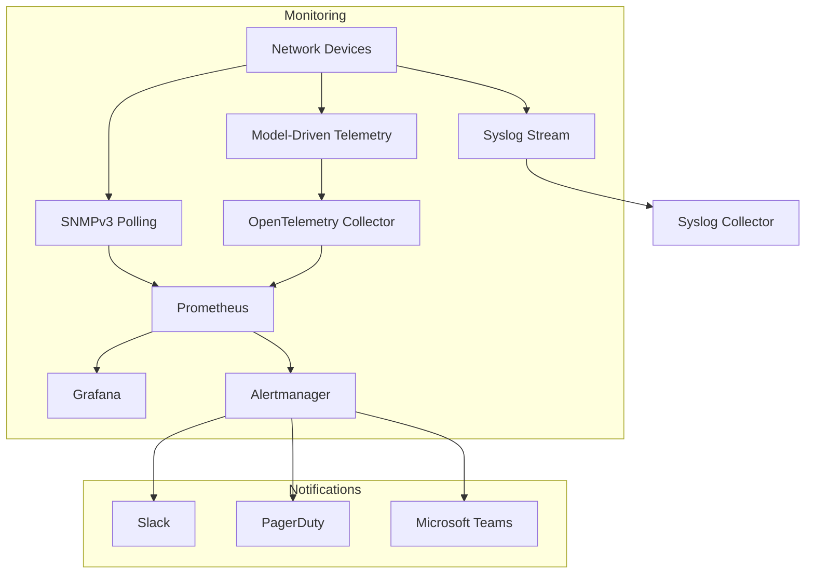
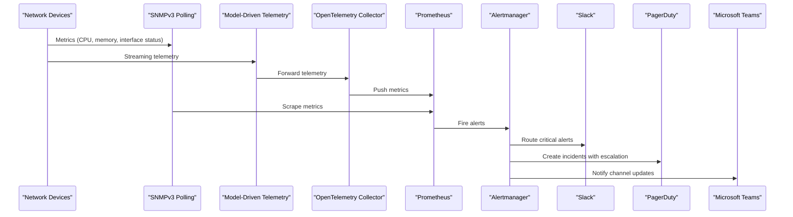
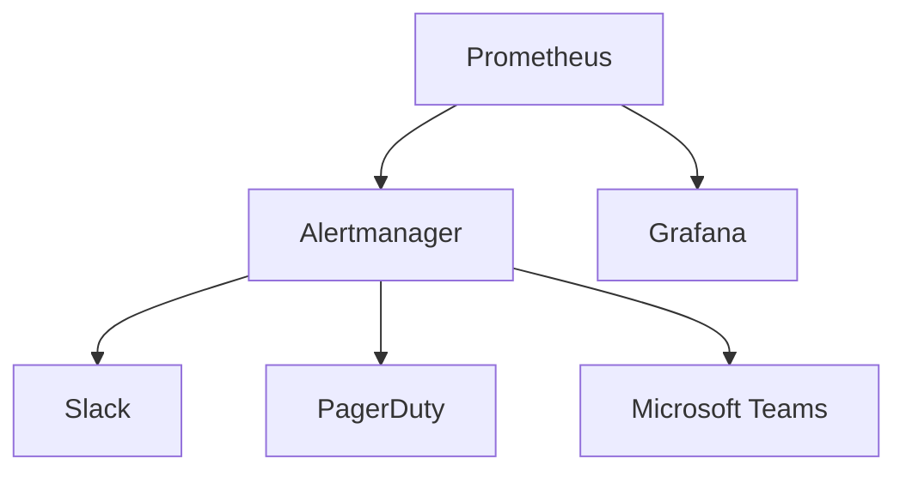

# Alerting & Notifications

<cite>
**Referenced Files in This Document**
- [README.md](file://README.md)
</cite>

## Table of Contents
1. [Introduction](#introduction)
2. [Project Structure](#project-structure)
3. [Core Components](#core-components)
4. [Architecture Overview](#architecture-overview)
5. [Detailed Component Analysis](#detailed-component-analysis)
6. [Dependency Analysis](#dependency-analysis)
7. [Performance Considerations](#performance-considerations)
8. [Troubleshooting Guide](#troubleshooting-guide)
9. [Conclusion](#conclusion)
10. [Appendices](#appendices)

## Introduction
This document provides a comprehensive guide to the alerting and notification system for the Enterprise Network Automation Platform. It focuses on how alerts are produced, routed, grouped, inhibited, and delivered to channels such as Slack, PagerDuty, and Microsoft Teams. It also covers severity levels, deduplication strategies, alert fatigue prevention techniques, network-specific alert examples, and guidance for testing and debugging notifications.

The platform’s monitoring stack includes Prometheus, Grafana, OpenTelemetry, Syslog collection, and Alertmanager. Alerts flow from device telemetry and metrics into Prometheus, then through Alertmanager routing and inhibition before being dispatched to multiple notification channels.

## Project Structure
The repository documents a monitoring and observability architecture that integrates with Alertmanager and multiple notification channels. The relevant structure is described in the project overview and monitoring sections.

**Diagram sources**
- [README.md:587-604](file://README.md#L587-L604)

**Section sources**
- [README.md:583-618](file://README.md#L583-L618)

## Core Components
- Prometheus: Collects metrics from devices via SNMP and model-driven telemetry; evaluates recording rules and alerting rules.
- Alertmanager: Receives alerts from Prometheus, applies grouping, inhibition, and routing, then dispatches notifications.
- Notification Channels:
  - Slack: Webhook-based messaging for team visibility and collaboration.
  - PagerDuty: Incident management with escalation policies and on-call rotation.
  - Microsoft Teams: Connector-based messaging for enterprise teams.
- Grafana: Visualization and dashboards for operational insights.
- OpenTelemetry Collector: Aggregates and forwards telemetry data to Prometheus or other backends.
- Syslog Collector: Ingests device logs for correlation and alerting.

These components are explicitly shown in the monitoring architecture diagram.

**Section sources**
- [README.md:583-618](file://README.md#L583-L618)

## Architecture Overview
The alerting pipeline begins with device telemetry and metrics ingestion, followed by evaluation and alert generation in Prometheus. Alertmanager then processes these alerts using route trees, grouping strategies, and inhibition rules before sending notifications to Slack, PagerDuty, and Microsoft Teams.

**Diagram sources**
- [README.md:587-604](file://README.md#L587-L604)

## Detailed Component Analysis

### Alertmanager Configuration Strategy
- Route Trees:
  - Define hierarchical routes to match alerts by labels such as environment, region, device role, and vendor.
  - Use group_by to cluster related alerts (e.g., per site or per device).
  - Apply continue flags sparingly to avoid duplicate notifications.
- Grouping Strategies:
  - Group by device and region to reduce noise during outages.
  - Use wait and interval settings to batch alerts effectively.
- Inhibition Rules:
  - Suppress lower-severity alerts when higher-severity root causes exist (e.g., suppress interface flaps when device down).
  - Match on common labels like device_id, site, and region to ensure precise suppression.
- Routing Examples:
  - Critical alerts for core routers and firewalls route to PagerDuty and Slack.
  - High-severity capacity thresholds route to Slack and Teams.
  - Low-severity compliance warnings route to Teams only.

[No sources needed since this section provides general configuration guidance]

### Notification Channel Setups
- Slack Webhooks:
  - Configure webhook URLs securely via secrets management.
  - Use channel routing based on alert severity and domain (network vs automation).
  - Include structured messages with context (device, site, metric, link to dashboard).
- PagerDuty Integration:
  - Map Alertmanager services to PagerDuty services.
  - Leverage escalation policies for on-call rotations.
  - Use auto-resolve and deduplication keys to prevent incident storms.
- Microsoft Teams Connectors:
  - Configure incoming webhooks for specific channels.
  - Route non-critical alerts and informational updates to Teams.
  - Ensure message formatting supports quick triage.

[No sources needed since this section provides general setup guidance]

### Alert Severity Levels
- Critical: Immediate action required (e.g., device down, BGP session loss, firewall rule violation).
- High: Significant impact but not immediate outage (e.g., CPU/memory near threshold, high error rates).
- Medium: Operational concerns requiring attention (e.g., compliance violations, minor drift).
- Low: Informational or advisory (e.g., unused objects, scheduled maintenance reminders).

Severity mapping should align with business impact and response SLAs.

[No sources needed since this section provides general guidance]

### Deduplication Strategies
- Use unique alert names and labels to generate stable deduplication keys.
- Coalesce repeated alerts within a time window to reduce noise.
- Correlate related alerts using shared labels (device_id, site, region).
- Implement inhibition rules to suppress derived symptoms when root causes are present.

[No sources needed since this section provides general guidance]

### Alert Fatigue Prevention Techniques
- Hierarchical routing to ensure only relevant teams receive alerts.
- Effective grouping and batching to reduce alert volume.
- Clear severity definitions and strict adherence to them.
- Post-incident reviews to refine rules and inhibit unnecessary noise.
- Regular audits of active alerts and routes to remove stale or redundant ones.

[No sources needed since this section provides general guidance]

### Network-Specific Alert Examples
- Device Failures:
  - Device unreachable or down (critical).
  - Interface flapping or link down (high).
  - OSPF/BGP neighbor state changes (critical/high depending on topology).
- Capacity Thresholds:
  - CPU utilization exceeding defined thresholds (high).
  - Memory usage nearing limits (high).
  - Interface bandwidth saturation (medium/high).
- Security Violations:
  - Unauthorized access attempts or ACL violations (critical).
  - Non-compliant cipher suites or protocols enabled (high/medium).
- Automation Pipeline Issues:
  - CI/CD job failures affecting deployment or validation (high).
  - Template rendering errors or schema validation failures (medium).
  - Compliance scan regressions (medium/high).

[No sources needed since this section provides general examples]

### Testing Alerting Configurations
- Unit Tests:
  - Validate Alertmanager configuration syntax and route tree logic.
  - Test inhibition rules with synthetic alerts.
- Integration Tests:
  - Simulate Prometheus firing alerts and verify delivery to Slack, PagerDuty, and Teams.
  - Use test environments with isolated channels and service accounts.
- Chaos Testing:
  - Inject device failures and telemetry gaps to validate alert behavior.
  - Verify PagerDuty escalation policies trigger correctly.
- Dry Runs:
  - Run Alertmanager in dry-run mode to preview routing decisions without sending notifications.

[No sources needed since this section provides general guidance]

### Debugging Notification Delivery Problems
- Check connectivity and credentials for each channel (webhooks, API tokens).
- Review Alertmanager logs for errors and routing decisions.
- Validate Prometheus alert firing and label consistency.
- Inspect Slack/PagerDuty/Teams inbound logs for rejected payloads.
- Use targeted tests to isolate issues (e.g., send a single alert to one channel).

[No sources needed since this section provides general guidance]

## Dependency Analysis
The alerting system depends on upstream telemetry sources and downstream notification channels. Proper separation of concerns ensures scalability and maintainability.

**Diagram sources**
- [README.md:587-604](file://README.md#L587-L604)

**Section sources**
- [README.md:583-618](file://README.md#L583-L618)

## Performance Considerations
- Optimize Prometheus query performance to reduce alert evaluation latency.
- Tune Alertmanager grouping intervals to balance responsiveness and noise reduction.
- Avoid overly broad route matches to minimize processing overhead.
- Monitor notification channel throughput and implement retries/backoff where supported.

[No sources needed since this section provides general guidance]

## Troubleshooting Guide
Common issues and resolutions include:
- Missing or invalid webhook URLs: Verify secrets and permissions.
- Incorrect routing: Inspect route trees and label matching.
- Duplicate alerts: Adjust grouping and deduplication keys.
- Escalation policy misconfiguration: Confirm PagerDuty service mappings.
- Message formatting problems: Validate payload structures for Slack and Teams.

[No sources needed since this section provides general guidance]

## Conclusion
The alerting and notification system integrates Prometheus and Alertmanager to deliver timely, actionable alerts across Slack, PagerDuty, and Microsoft Teams. By applying robust routing, grouping, and inhibition strategies, the platform minimizes alert fatigue while ensuring critical network events reach the right responders quickly. Continuous testing and refinement keep the system reliable and effective at scale.

## Appendices

### Example Alert Definitions (Conceptual)
- Device Down:
  - Labels: device_id, site, region, severity=critical
  - Route: PagerDuty + Slack
- Interface Flap:
  - Labels: device_id, interface, severity=high
  - Route: Slack
- CPU Overload:
  - Labels: device_id, metric=cpu_usage, severity=high
  - Route: Slack + Teams
- BGP Session Loss:
  - Labels: device_id, peer_ip, severity=critical
  - Route: PagerDuty + Slack
- Compliance Violation:
  - Labels: policy_id, severity=medium
  - Route: Teams

[No sources needed since this section provides conceptual examples]