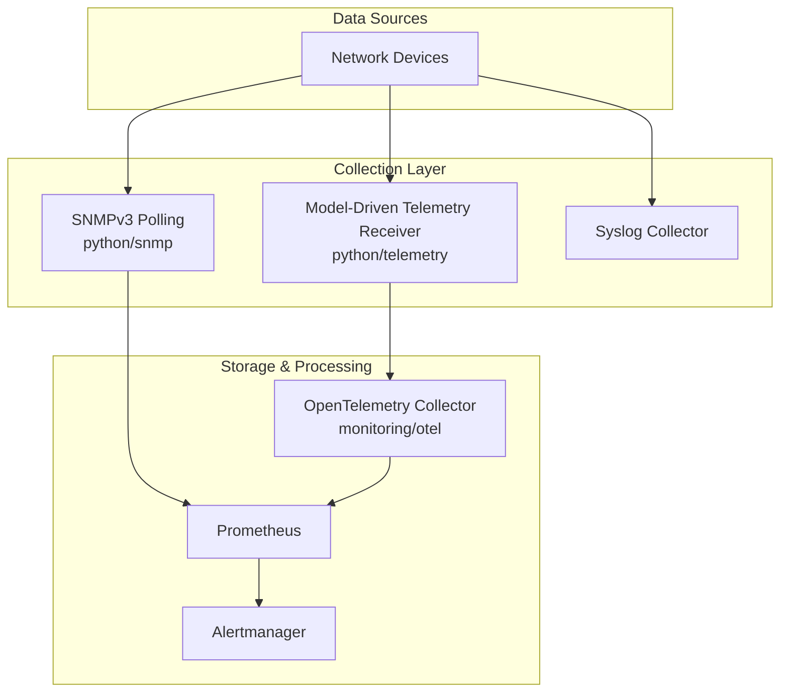
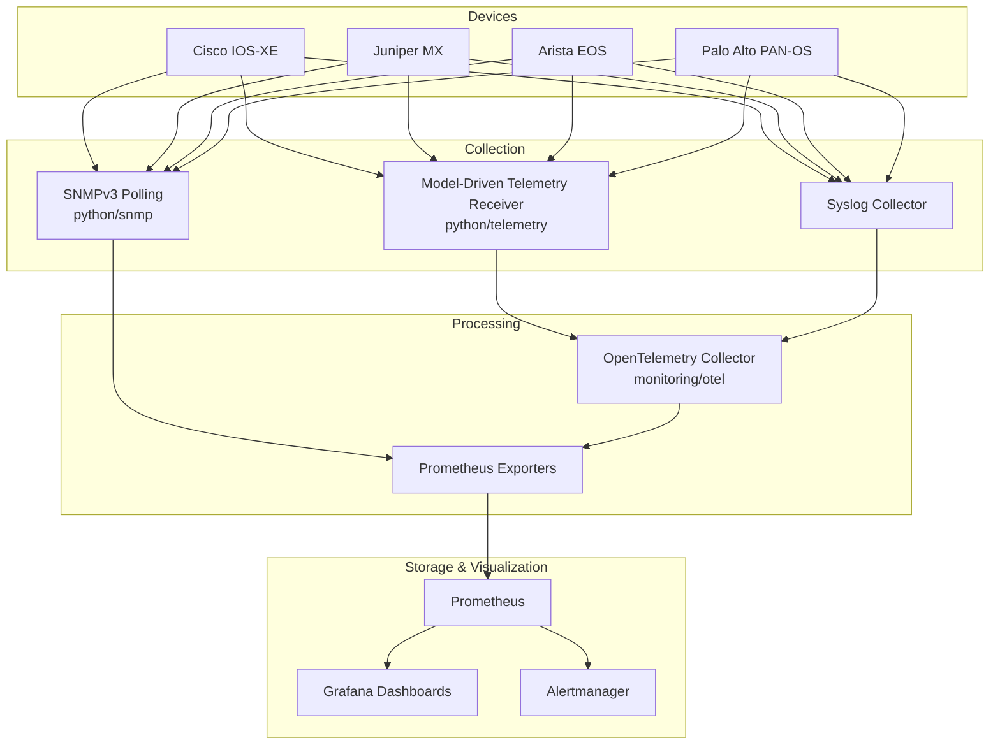
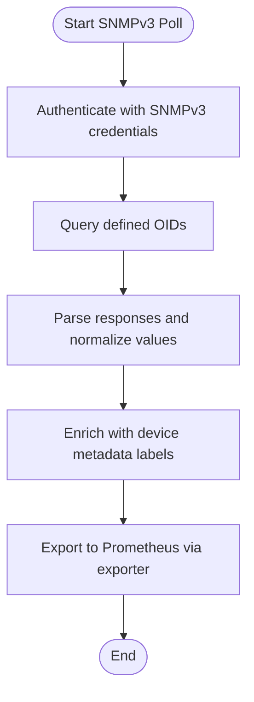
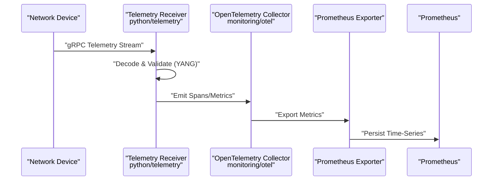
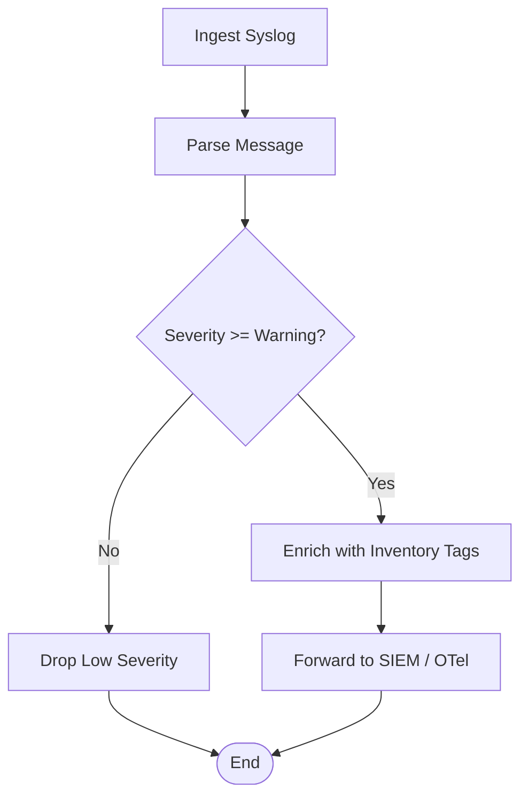
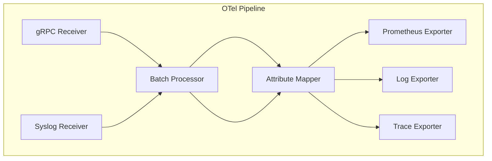
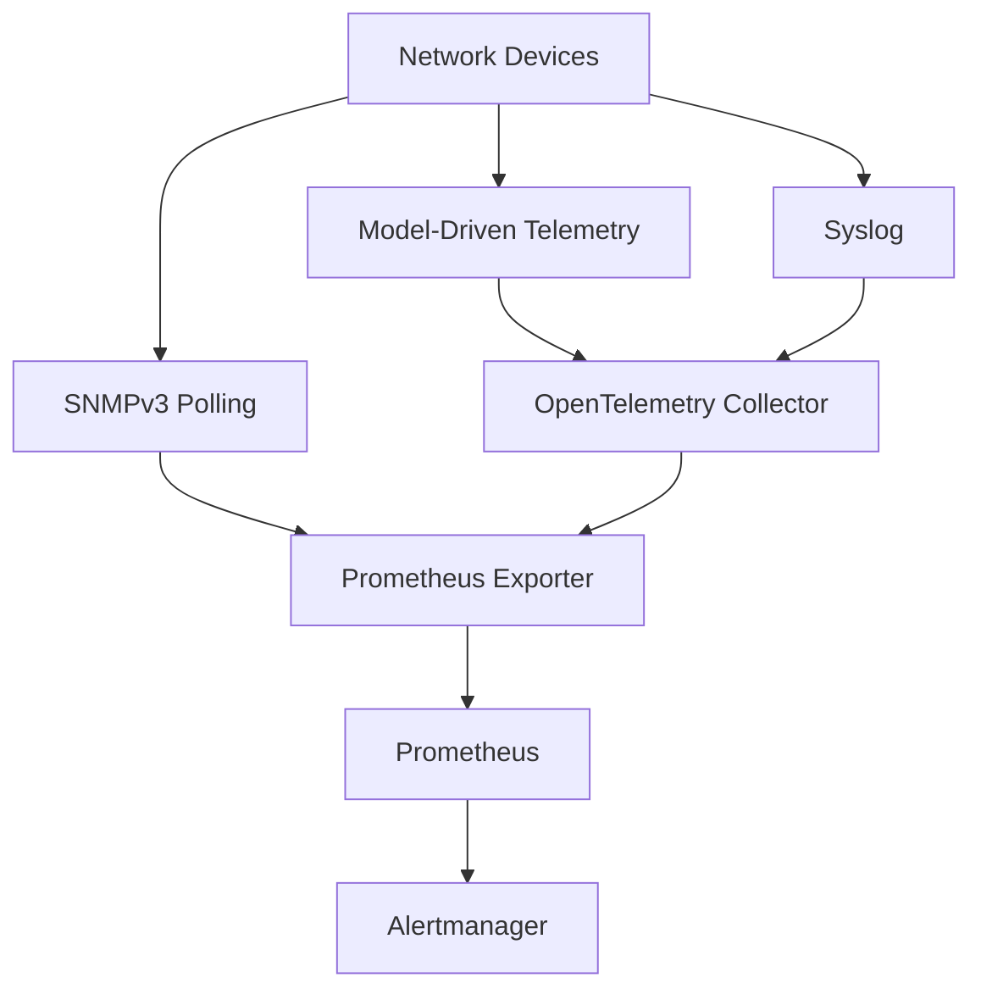

# Data Collection & Telemetry

<cite>
**Referenced Files in This Document**
- [README.md](file://README.md)
</cite>

## Table of Contents
1. [Introduction](#introduction)
2. [Project Structure](#project-structure)
3. [Core Components](#core-components)
4. [Architecture Overview](#architecture-overview)
5. [Detailed Component Analysis](#detailed-component-analysis)
6. [Dependency Analysis](#dependency-analysis)
7. [Performance Considerations](#performance-considerations)
8. [Troubleshooting Guide](#troubleshooting-guide)
9. [Conclusion](#conclusion)

## Introduction
This document describes the data collection and telemetry architecture for the Enterprise Network Automation Platform. It covers multi-source collection strategies including SNMPv3 polling, model-driven telemetry streaming via gRPC with YANG models, and syslog processing with parsing and enrichment. It also documents Prometheus metrics exporters for network devices, OpenTelemetry collector configuration for distributed tracing, and custom Python telemetry receivers. Device-specific telemetry implementations are outlined for Cisco IOS-XE, Juniper MX, Arista EOS, and Palo Alto PAN-OS platforms. The document includes metric definitions, sampling intervals, retention policies, and troubleshooting guidance for telemetry collection issues.

## Project Structure
The platform organizes automation and observability assets under a modular layout. Relevant directories for data collection and telemetry include:
- python/snmp: SNMPv3 polling and trap handling
- python/telemetry: Model-driven telemetry receiver and parser
- monitoring/prometheus: Prometheus scrape targets and exporters
- monitoring/otel: OpenTelemetry collector configuration
- monitoring/alertmanager: Alerting rules and routing
- templates/cisco_iosxe, templates/juniper_mx, templates/arista_eos, templates/paloalto: Vendor-specific configurations that enable telemetry features on devices

**Diagram sources**
- [README.md:103-180](file://README.md#L103-L180)
- [README.md:583-618](file://README.md#L583-L618)

**Section sources**
- [README.md:103-180](file://README.md#L103-L180)
- [README.md:438-456](file://README.md#L438-L456)
- [README.md:583-618](file://README.md#L583-L618)

## Core Components
- SNMPv3 Polling Module
  - Purpose: Collects device metrics via SNMPv3 using secure authentication and encryption.
  - Responsibilities: OID discovery, credential management, retry/backoff, error classification, and metric normalization.
  - Integration: Exposes metrics to Prometheus via an exporter or push gateway.

- Model-Driven Telemetry Receiver
  - Purpose: Receives streaming telemetry over gRPC using YANG-defined models.
  - Responsibilities: Stream ingestion, message decoding, schema validation, enrichment (device metadata), and forwarding to storage systems.
  - Integration: Emits OpenTelemetry traces/metrics; can export to Prometheus.

- Syslog Collector
  - Purpose: Ingests syslog streams from devices and central collectors.
  - Responsibilities: Parsing, log level classification, enrichment (tags, labels), deduplication, and forwarding to SIEM or time-series stores.

- Prometheus Exporters
  - Purpose: Provide standardized metrics endpoints for scraping by Prometheus.
  - Responsibilities: Metric registry, label management, cardinality control, and health endpoints.

- OpenTelemetry Collector
  - Purpose: Centralized telemetry pipeline for traces, metrics, and logs.
  - Responsibilities: Receivers (gRPC, syslog), processors (batching, filtering, enrichment), exporters (Prometheus, Loki, Jaeger).

- Custom Python Telemetry Receivers
  - Purpose: Implement vendor-specific telemetry handlers and protocol adapters.
  - Responsibilities: Protocol decoders, model mappers, and integration hooks into the OTel pipeline.

**Section sources**
- [README.md:438-456](file://README.md#L438-L456)
- [README.md:583-618](file://README.md#L583-L618)

## Architecture Overview
The telemetry architecture integrates multiple data sources and pipelines to provide comprehensive observability across the network fleet.

**Diagram sources**
- [README.md:103-180](file://README.md#L103-L180)
- [README.md:583-618](file://README.md#L583-L618)

## Detailed Component Analysis

### SNMPv3 Polling with OID Definitions
- Authentication and Security
  - Uses SNMPv3 with authPriv for confidentiality and integrity.
  - Credentials sourced from secrets backends; rotated per policy.
- OID Strategy
  - Standard MIBs for CPU, memory, interface counters, BGP/OSPF neighbor states.
  - Vendor-specific OIDs for hardware sensors and module status.
- Sampling Intervals
  - Critical metrics: 15–30 seconds.
  - Non-critical metrics: 1–5 minutes.
- Cardinality Control
  - Labels limited to device_id, region, site, role, interface_name.
- Error Handling
  - Timeouts, auth failures, and unreachable devices handled with retries and circuit breakers.
- Metrics Exported
  - cpu_utilization_percent, memory_usage_percent, interface_in_errors_total, interface_out_errors_total, bgp_neighbor_state, ospf_neighbor_state.

**Diagram sources**
- [README.md:438-456](file://README.md#L438-L456)
- [README.md:583-618](file://README.md#L583-L618)

**Section sources**
- [README.md:438-456](file://README.md#L438-L456)
- [README.md:583-618](file://README.md#L583-L618)

### Model-Driven Telemetry Streaming via gRPC and YANG Models
- Protocols and Models
  - gRPC-based streaming telemetry with YANG models for structured data.
  - Supports subscription-based streaming and delta updates.
- Receiver Implementation
  - Custom Python telemetry receiver handles connection lifecycle, stream multiplexing, and message decoding.
- Processing Pipeline
  - Validates against YANG schemas, enriches with inventory tags, batches records, and forwards to OTel.
- Metrics and Traces
  - Emits metrics for stream throughput, decode errors, and latency.
  - Generates spans for ingestion, validation, and export phases.

**Diagram sources**
- [README.md:438-456](file://README.md#L438-L456)
- [README.md:583-618](file://README.md#L583-L618)

**Section sources**
- [README.md:438-456](file://README.md#L438-L456)
- [README.md:583-618](file://README.md#L583-L618)

### Syslog Processing with Log Parsing and Enrichment
- Ingestion
  - Receives syslog messages via UDP/TCP or centralized collectors.
- Parsing
  - Regex-based parsers for vendor-specific formats; normalizes fields (timestamp, severity, facility, message).
- Enrichment
  - Adds device context (vendor, platform, role, region, site) from inventory.
- Forwarding
  - Routes to SIEM, logging store, or OTel for correlation with metrics/traces.

**Diagram sources**
- [README.md:583-618](file://README.md#L583-L618)

**Section sources**
- [README.md:583-618](file://README.md#L583-L618)

### Prometheus Metrics Exporters for Network Devices
- Exporter Design
  - Lightweight HTTP server exposing /metrics endpoint.
  - Registry manages metric types, labels, and value updates.
- Metric Categories
  - Device Health: CPU, memory, fan/temp sensors.
  - Interface Stats: In/out bytes, packets, errors, drops.
  - Protocol State: BGP/OSPF neighbor states, session uptime.
  - Compliance Signals: SNMPv3 enabled, NTP configured, AAA active.
- Scraping Configuration
  - Targets defined per environment; job names include device role and region.
- Retention Policies
  - Short-term high-resolution retention for hot metrics; long-term downsampling for cold storage.

**Section sources**
- [README.md:583-618](file://README.md#L583-L618)

### OpenTelemetry Collector Configuration for Distributed Tracing
- Receivers
  - gRPC for telemetry streams, syslog for logs, Prometheus remote write for metrics.
- Processors
  - Batch aggregation, attribute mapping, redaction of sensitive fields.
- Exporters
  - Prometheus for metrics, Jaeger/Zipkin for traces, Loki for logs.
- Pipeline Topology
  - Separate pipelines for metrics, traces, and logs with cross-correlation via trace IDs and device labels.

**Diagram sources**
- [README.md:583-618](file://README.md#L583-L618)

**Section sources**
- [README.md:583-618](file://README.md#L583-L618)

### Custom Python Telemetry Receivers
- Responsibilities
  - Handle vendor-specific encodings, implement subscription management, and map raw payloads to canonical models.
- Concurrency and Backpressure
  - Async I/O with bounded queues; graceful degradation under load.
- Testing
  - Unit tests for decoders; integration tests with simulated device streams.

**Section sources**
- [README.md:438-456](file://README.md#L438-L456)

### Device-Specific Telemetry Implementations

#### Cisco IOS-XE
- SNMPv3
  - OID sets for CPU utilization, memory usage, interface counters, BGP/OSPF neighbors.
- Telemetry Streaming
  - gRPC subscriptions for system resources, interfaces, and routing protocols.
- Syslog
  - Standard Cisco syslog format; parsers handle %SYS, %LINEPROTO, %BGP events.
- Key Metrics
  - cpu_utilization_percent, memory_usage_percent, interface_in_errors_total, bgp_neighbor_state.

**Section sources**
- [README.md:103-180](file://README.md#L103-L180)
- [README.md:438-456](file://README.md#L438-L456)
- [README.md:583-618](file://README.md#L583-L618)

#### Juniper MX
- SNMPv3
  - MIBs for chassis health, interface statistics, and routing table sizes.
- Telemetry Streaming
  - YANG models for system information, interfaces, and protocols.
- Syslog
  - Juniper syslog format; parsers capture link flaps, routing changes, and alarms.
- Key Metrics
  - chassis_temperature_celsius, interface_in_errors_total, routing_table_size.

**Section sources**
- [README.md:103-180](file://README.md#L103-L180)
- [README.md:438-456](file://README.md#L438-L456)
- [README.md:583-618](file://README.md#L583-L618)

#### Arista EOS
- SNMPv3
  - MIBs for switch fabric stats, port counters, and power supplies.
- Telemetry Streaming
  - eAPI/gRPC telemetry for interfaces, ACL hits, and QoS counters.
- Syslog
  - Arista syslog format; parsers detect link state changes and ACL denials.
- Key Metrics
  - acl_hit_count_total, qos_drop_packets_total, interface_in_errors_total.

**Section sources**
- [README.md:103-180](file://README.md#L103-L180)
- [README.md:438-456](file://README.md#L438-L456)
- [README.md:583-618](file://README.md#L583-L618)

#### Palo Alto PAN-OS
- SNMPv3
  - MIBs for session counts, threat events, and HA status.
- Telemetry Streaming
  - API-based telemetry for traffic flows, security events, and license usage.
- Syslog
  - PAN-OS syslog format; parsers extract threat categories and session details.
- Key Metrics
  - session_count_active, threat_events_total, ha_status_code.

**Section sources**
- [README.md:103-180](file://README.md#L103-L180)
- [README.md:438-456](file://README.md#L438-L456)
- [README.md:583-618](file://README.md#L583-L618)

## Dependency Analysis
The telemetry components depend on device capabilities, protocol support, and configuration readiness.

**Diagram sources**
- [README.md:583-618](file://README.md#L583-L618)

**Section sources**
- [README.md:583-618](file://README.md#L583-L618)

## Performance Considerations
- Sampling Intervals
  - Align intervals with device capacity and alerting needs; avoid excessive cardinality.
- Batching and Backpressure
  - Use batch processors in OTel to reduce overhead; apply backpressure to prevent queue overflow.
- Label Management
  - Limit label cardinality; prefer dimensions like device_id, region, site, role.
- Downsampling and Retention
  - Configure short retention for high-frequency metrics; downsample for long-term storage.
- Resource Limits
  - Set CPU/memory limits for exporters and receivers; monitor resource utilization.

[No sources needed since this section provides general guidance]

## Troubleshooting Guide
Common telemetry collection issues and resolutions:
- SNMPv3 Authentication Failures
  - Verify credentials and access lists; ensure SNMPv3 is enabled on devices.
- Telemetry Stream Drops
  - Check gRPC connectivity, TLS certificates, and subscription filters; review receiver logs for decode errors.
- Syslog Parsing Errors
  - Update regex parsers for new message formats; validate enrichment tags against inventory.
- High Cardinality Alerts
  - Reduce label dimensions; aggregate metrics where possible.
- Prometheus Scrape Failures
  - Confirm exporter health endpoints; check target reachability and firewall rules.
- OTel Pipeline Latency
  - Tune batch sizes and processor timeouts; monitor exporter throughput.

**Section sources**
- [README.md:674-685](file://README.md#L674-L685)
- [README.md:583-618](file://README.md#L583-L618)

## Conclusion
The Enterprise Network Automation Platform implements a robust, multi-source data collection and telemetry architecture. By combining SNMPv3 polling, model-driven telemetry streaming, and syslog processing with centralized processing via OpenTelemetry and Prometheus, the platform achieves comprehensive observability across diverse vendor platforms. Careful attention to metric definitions, sampling intervals, retention policies, and troubleshooting practices ensures reliable and scalable operations at enterprise scale.

[No sources needed since this section summarizes without analyzing specific files]