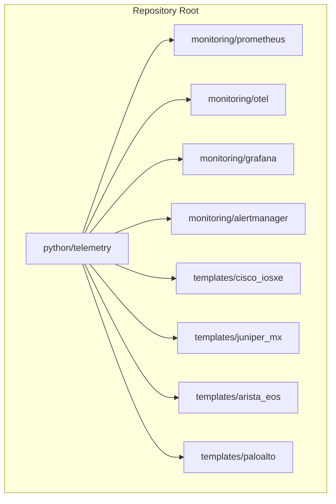
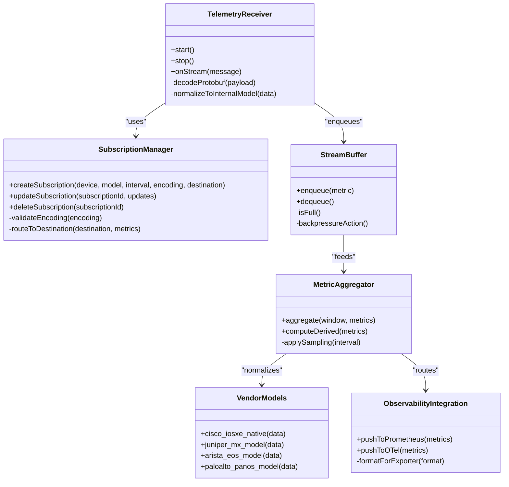
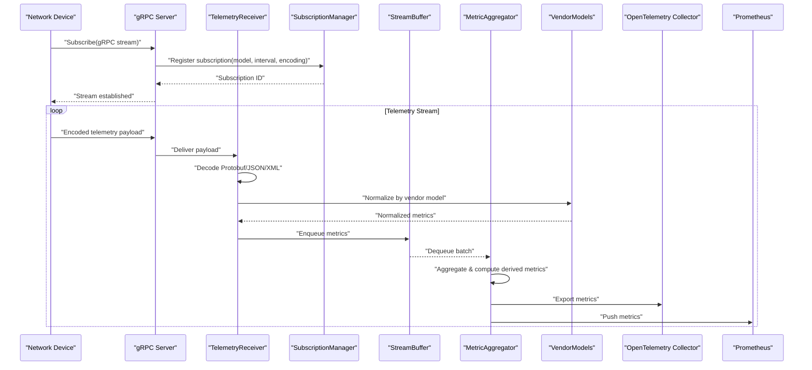
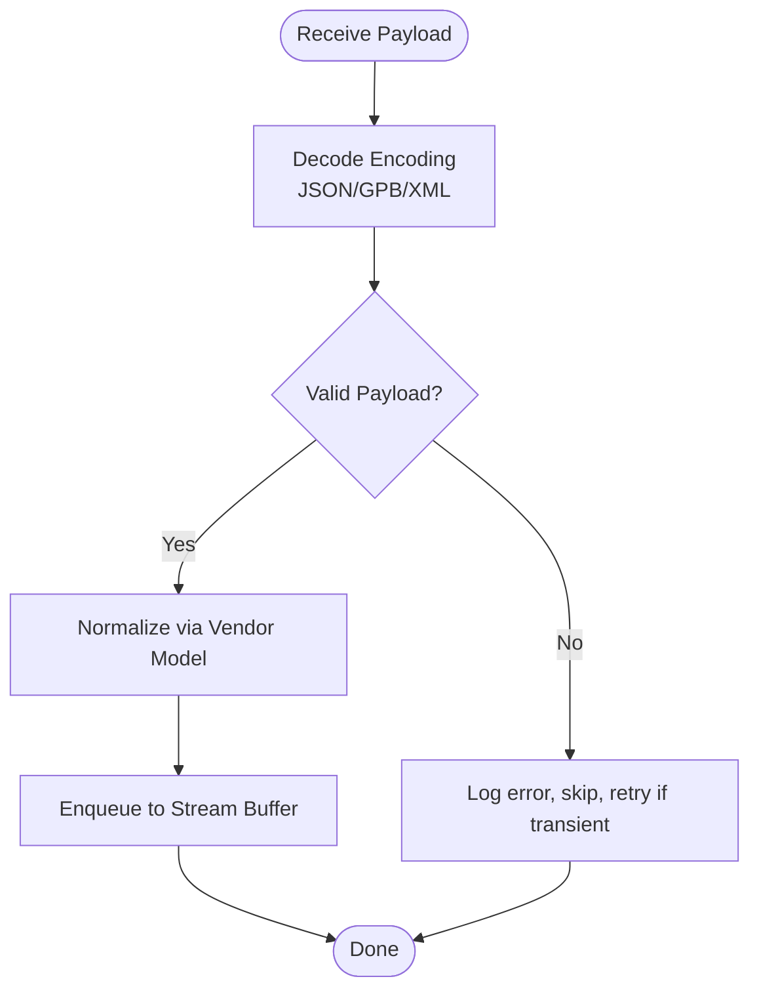
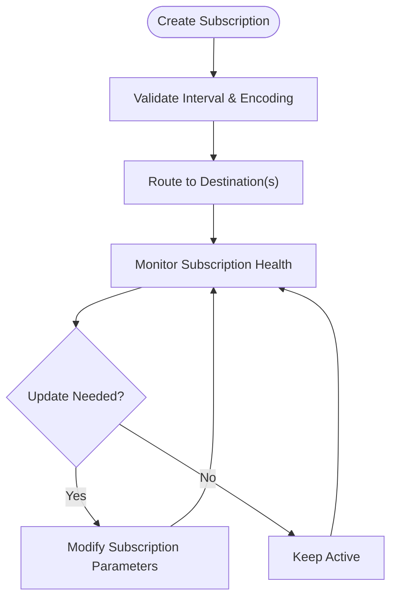
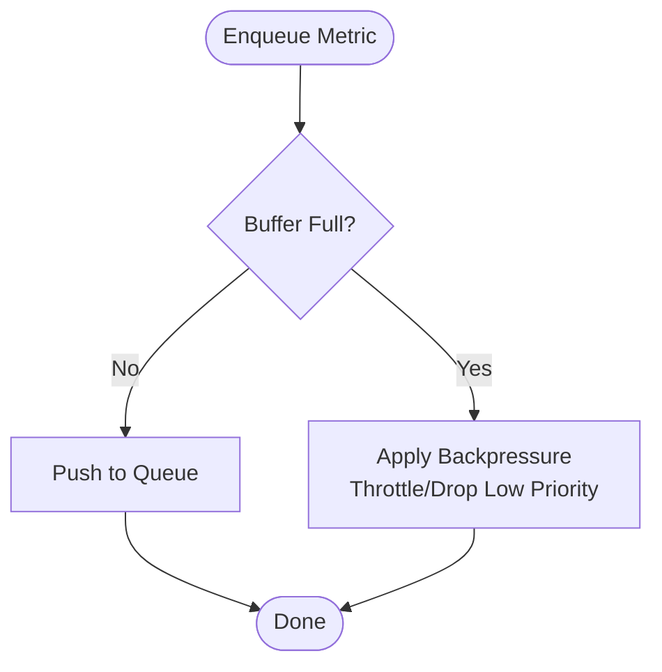
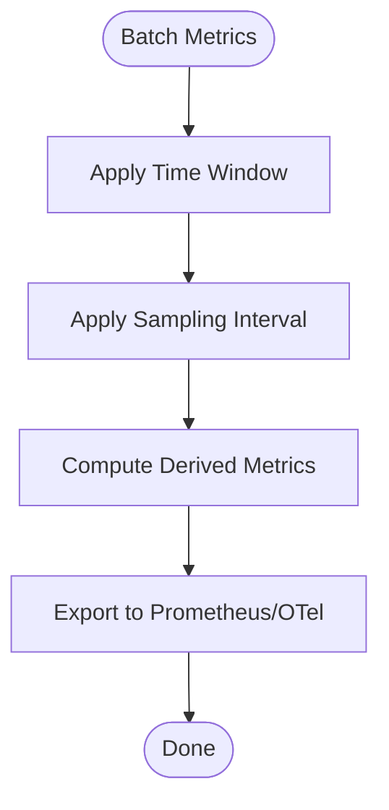
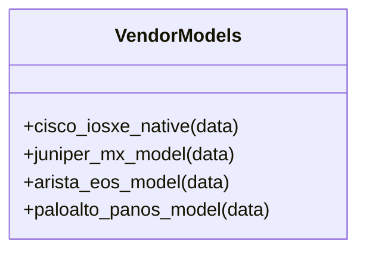
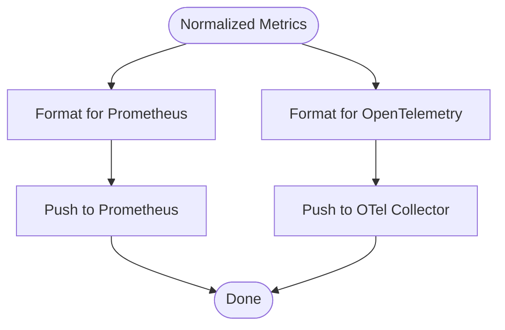
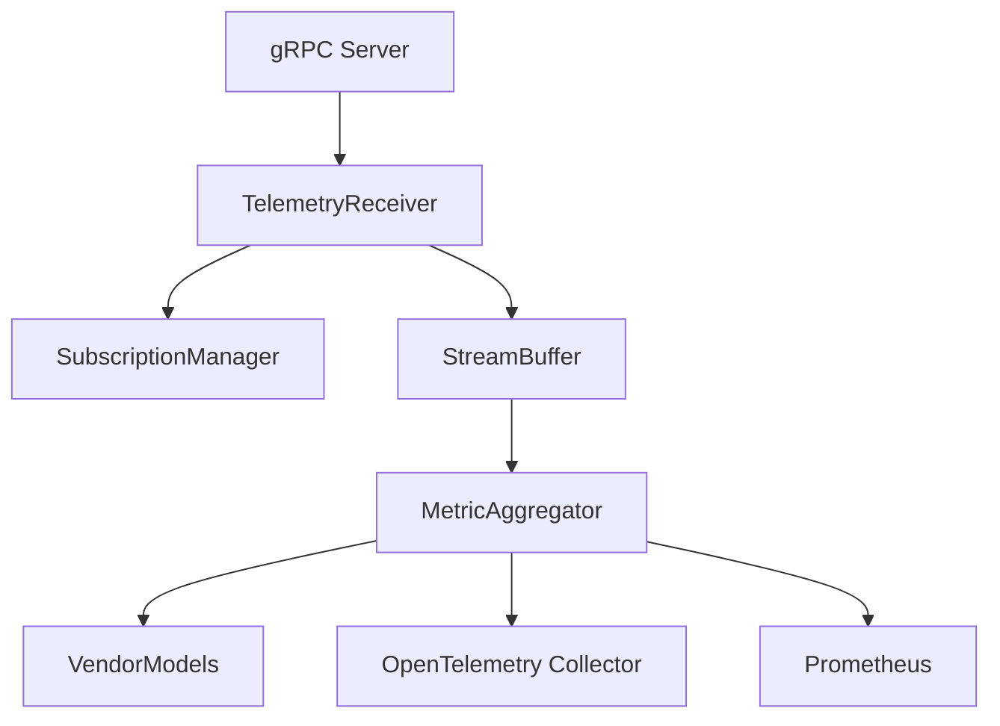

# Model-Driven Telemetry Streaming

<cite>
**Referenced Files in This Document**
- [README.md](file://README.md)
</cite>

## Table of Contents
1. [Introduction](#introduction)
2. [Project Structure](#project-structure)
3. [Core Components](#core-components)
4. [Architecture Overview](#architecture-overview)
5. [Detailed Component Analysis](#detailed-component-analysis)
6. [Dependency Analysis](#dependency-analysis)
7. [Performance Considerations](#performance-considerations)
8. [Troubleshooting Guide](#troubleshooting-guide)
9. [Conclusion](#conclusion)
10. [Appendices](#appendices)

## Introduction

This document describes the model-driven telemetry streaming implementation for the Enterprise Network Automation Platform. It covers gRPC-based telemetry subscriptions using YANG schemas for real-time data streaming from multi-vendor network devices, including Cisco IOS-XE, Juniper MX, Arista EOS, and Palo Alto PAN-OS. It also documents the telemetry receiver architecture with protobuf message parsing, stream buffering, metric aggregation, subscription management (sampling intervals, encoding formats), destination routing to Prometheus or OpenTelemetry collectors, vendor-specific model implementations, stream monitoring, backpressure handling, and performance optimization techniques for high-volume ingestion.

## Project Structure

The platform’s repository defines a modular layout where telemetry-related functionality is organized under a dedicated Python module. The overall structure includes inventories, playbooks, templates, bots, tests, compliance, pipelines, monitoring, terraform, packer, policies, schemas, examples, scripts, docs, images, and CI/CD workflows. Telemetry is part of the Python modules layer and integrates with observability components such as Prometheus and OpenTelemetry.

**Diagram sources**
- [README.md:103-180](file://README.md#L103-L180)
- [README.md:583-616](file://README.md#L583-L616)

**Section sources**
- [README.md:103-180](file://README.md#L103-L180)
- [README.md:438-456](file://README.md#L438-L456)
- [README.md:583-616](file://README.md#L583-L616)

## Core Components

- Telemetry Receiver: Receives gRPC telemetry streams from devices, decodes protobuf messages, and normalizes data into internal models.
- Subscription Manager: Manages device subscriptions, sampling intervals, encoding formats (JSON, GPB, XML), and destinations (Prometheus/OpenTelemetry).
- Stream Buffer: Provides backpressure-aware buffering for high-throughput ingestion.
- Metric Aggregator: Aggregates metrics over time windows and computes derived metrics.
- Vendor Models: Implements vendor-specific telemetry models for Cisco IOS-XE (Cisco-IOS-XE-native), Juniper MX (JUNOS-MODEL), Arista EOS (ARISTA-EOS-MODEL), and Palo Alto PAN-OS.
- Observability Integration: Routes normalized metrics to Prometheus and/or OpenTelemetry collectors.

Key responsibilities and interactions are illustrated below.

[No sources needed since this diagram shows conceptual component relationships]

## Architecture Overview

The telemetry pipeline ingests streaming telemetry from network devices via gRPC, decodes payloads according to selected encodings, normalizes them through vendor-specific models, aggregates metrics, and exports to Prometheus and/or OpenTelemetry. Backpressure mechanisms ensure stability under high load.

**Diagram sources**
- [README.md:583-616](file://README.md#L583-L616)

## Detailed Component Analysis

### Telemetry Receiver
- Responsibilities: Accept gRPC streams, decode payloads per encoding format, normalize data using vendor models, and forward to buffer.
- Key behaviors:
  - Protocol decoding supports JSON, GPB (protobuf), and XML.
  - Normalization maps raw fields to internal metric schema.
  - Error handling includes malformed payload recovery and retry strategies.

[No sources needed since this diagram shows conceptual workflow]

### Subscription Manager
- Responsibilities: Create/update/delete subscriptions; validate sampling intervals and encoding formats; route metrics to destinations.
- Key behaviors:
  - Sampling intervals control frequency of telemetry samples.
  - Encoding formats include JSON, GPB, XML.
  - Destinations include Prometheus and OpenTelemetry collectors.

[No sources needed since this diagram shows conceptual workflow]

### Stream Buffer
- Responsibilities: Provide backpressure-aware buffering for high-throughput ingestion.
- Key behaviors:
  - Fixed-size queue with overflow protection.
  - Backpressure action triggers throttling or dropping lowest-priority metrics when full.
  - Batch dequeue to reduce overhead.

[No sources needed since this diagram shows conceptual workflow]

### Metric Aggregator
- Responsibilities: Aggregate metrics over time windows and compute derived metrics.
- Key behaviors:
  - Applies sampling intervals to align with subscription parameters.
  - Computes counters, gauges, histograms, and summaries.
  - Exports aggregated results to destinations.

[No sources needed since this diagram shows conceptual workflow]

### Vendor-Specific Telemetry Models
- Cisco IOS-XE (Cisco-IOS-XE-native): Maps native IOS-XE telemetry paths to normalized metrics.
- Juniper MX (JUNOS-MODEL): Translates JUNOS telemetry nodes to normalized schema.
- Arista EOS (ARISTA-EOS-MODEL): Converts EOS telemetry fields to normalized metrics.
- Palo Alto PAN-OS: Adapts PAN-OS telemetry structures to normalized schema.

[No sources needed since this diagram shows conceptual component relationships]

### Observability Integration
- Responsibilities: Export normalized metrics to Prometheus and OpenTelemetry collectors.
- Key behaviors:
  - Formats metrics appropriately for each exporter.
  - Handles connection retries and error reporting.

[No sources needed since this diagram shows conceptual workflow]

**Section sources**
- [README.md:438-456](file://README.md#L438-L456)
- [README.md:583-616](file://README.md#L583-L616)

## Dependency Analysis

The telemetry subsystem depends on:
- gRPC server for receiving streams from devices.
- Subscription manager for lifecycle and routing.
- Stream buffer for backpressure and throughput control.
- Metric aggregator for windowed aggregation and derived metrics.
- Vendor models for normalization across Cisco IOS-XE, Juniper MX, Arista EOS, and Palo Alto PAN-OS.
- Observability exporters for Prometheus and OpenTelemetry.

[No sources needed since this diagram shows conceptual dependency relationships]

## Performance Considerations

- High-throughput ingestion: Use batch processing and asynchronous queues to minimize latency.
- Backpressure handling: Implement adaptive throttling and priority-based dropping to protect system stability.
- Sampling intervals: Tune per-device and per-model to balance fidelity and resource usage.
- Encoding selection: Prefer GPB for compactness and speed; fallback to JSON/XML when required by device capabilities.
- Aggregation windows: Choose appropriate windows to reduce cardinality and storage pressure.
- Exporter tuning: Configure batching and compression for Prometheus and OTel exporters.

[No sources needed since this section provides general guidance]

## Troubleshooting Guide

Common issues and resolutions:
- gRPC connection failures: Verify device telemetry configuration and network reachability; check authentication and TLS settings.
- Decoding errors: Ensure correct encoding format matches subscription; validate protobuf schemas and XML/YAML parsers.
- Buffer overflow: Increase buffer size or adjust backpressure policy; review sampling intervals and aggregation windows.
- Exporter connectivity: Confirm Prometheus/OTel endpoints and credentials; monitor exporter health metrics.
- Vendor model mismatches: Update vendor-specific mappings when device firmware changes telemetry paths.

[No sources needed since this section provides general guidance]

## Conclusion

The model-driven telemetry streaming design enables scalable, vendor-agnostic real-time observability across multi-vendor networks. By leveraging gRPC subscriptions, YANG-based models, robust buffering and aggregation, and flexible export to Prometheus and OpenTelemetry, the platform achieves high-performance ingestion while maintaining operational stability and extensibility.

[No sources needed since this section summarizes without analyzing specific files]

## Appendices

### Supported Vendors and Models
- Cisco IOS-XE: Cisco-IOS-XE-native
- Juniper MX: JUNOS-MODEL
- Arista EOS: ARISTA-EOS-MODEL
- Palo Alto PAN-OS: PAN-OS telemetry mapping

[No sources needed since this section lists conceptual vendor support]