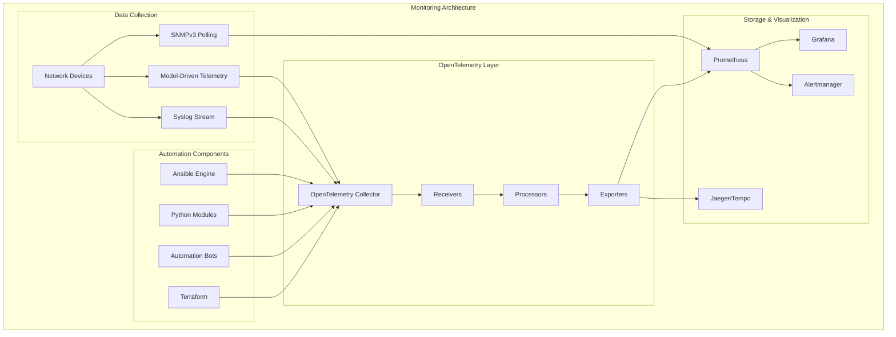
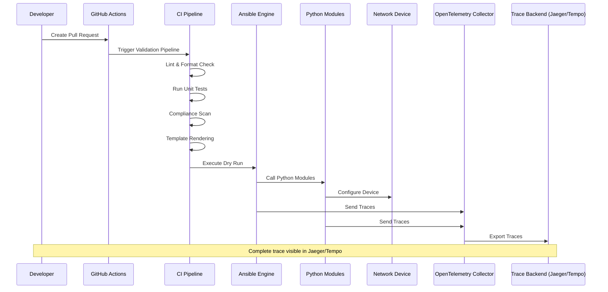
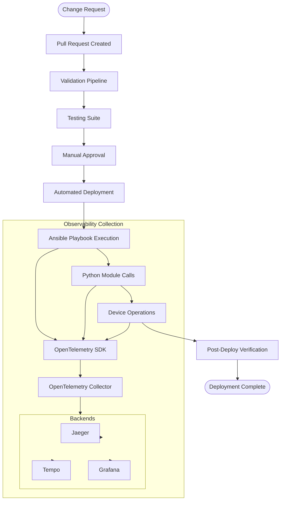
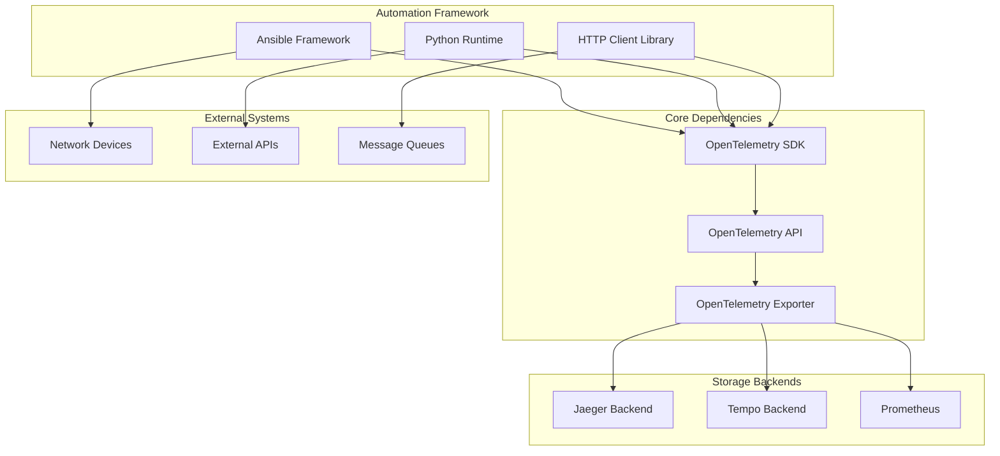

# OpenTelemetry Collector & Distributed Tracing

<cite>
**Referenced Files in This Document**
- [README.md](file://README.md)
</cite>

## Table of Contents
1. [Introduction](#introduction)
2. [Project Structure](#project-structure)
3. [Core Components](#core-components)
4. [Architecture Overview](#architecture-overview)
5. [Detailed Component Analysis](#detailed-component-analysis)
6. [Dependency Analysis](#dependency-analysis)
7. [Performance Considerations](#performance-considerations)
8. [Troubleshooting Guide](#troubleshooting-guide)
9. [Conclusion](#conclusion)
10. [Appendices](#appendices)

## Introduction

This document provides comprehensive guidance for implementing OpenTelemetry collector integration and distributed tracing capabilities within the Enterprise Network Automation Platform. The platform is designed to manage thousands of network devices across multi-vendor, multi-region environments with full observability and end-to-end visibility into change operations.

The OpenTelemetry integration enables comprehensive monitoring of automation workflows from pull request creation through device deployment, providing trace propagation across all automation components including Ansible playbooks, Python modules, and external API interactions.

## Project Structure

The platform follows a modular architecture with dedicated directories for monitoring and observability components:

**Diagram sources**
- [README.md:583-604](file://README.md#L583-L604)

**Section sources**
- [README.md:103-180](file://README.md#L103-L180)
- [README.md:583-618](file://README.md#L583-L618)

## Core Components

### OpenTelemetry Collector Configuration

The OpenTelemetry collector serves as the central observability hub, collecting telemetry data from multiple sources and routing it to appropriate backends.

#### Receivers
- **OTLP Receiver**: For receiving traces, metrics, and logs from instrumentation
- **Prometheus Receiver**: For scraping metrics from Prometheus exporters
- **Syslog Receiver**: For ingesting syslog messages from network devices
- **SNMP Receiver**: For polling SNMP-enabled devices
- **Filelog Receiver**: For reading log files from automation components

#### Processors
- **Batch Processor**: For efficient batching of telemetry data
- **Resource Processor**: For enriching telemetry with resource attributes
- **Span Processor**: For filtering, sampling, and transforming spans
- **Metrics Transform Processor**: For transforming and aggregating metrics
- **Filter Processor**: For filtering unwanted telemetry data

#### Exporters
- **Prometheus Remote Write**: For exporting metrics to Prometheus
- **Jaeger gRPC**: For exporting traces to Jaeger backend
- **Tempo HTTP**: For exporting traces to Tempo backend
- **Grafana Cloud**: For direct export to Grafana Cloud
- **File Exporter**: For local debugging and testing

**Section sources**
- [README.md:583-604](file://README.md#L583-L604)

### Trace Propagation Across Automation Workflows

The platform implements comprehensive trace propagation across the entire automation lifecycle:

#### Pull Request to Deployment Flow
1. **Pull Request Creation**: Trace context initialized when PR is opened
2. **CI Pipeline Execution**: Trace propagated through linting, testing, and validation stages
3. **Approval Workflow**: Trace maintained during manual approval gates
4. **Automated Deployment**: Trace continues through Ansible playbook execution
5. **Device Configuration**: Trace spans created for each device operation
6. **Verification Phase**: Post-deploy verification tracked within same trace
7. **Rollback Handling**: Rollback operations maintain trace continuity

#### Cross-Component Context Propagation
- **GitHub Actions → Ansible**: Trace context passed via environment variables
- **Ansible → Python Modules**: Context propagation using OpenTelemetry SDK
- **Python Modules → External APIs**: HTTP headers injected with trace context
- **Bots → Automation Engine**: REST API calls include trace headers

**Section sources**
- [README.md:34-50](file://README.md#L34-L50)
- [README.md:479-514](file://README.md#L479-L514)

## Architecture Overview

The distributed tracing architecture provides end-to-end visibility across the entire network automation pipeline:

**Diagram sources**
- [README.md:36-50](file://README.md#L36-L50)
- [README.md:583-604](file://README.md#L583-L604)

### Data Flow Architecture

**Diagram sources**
- [README.md:36-50](file://README.md#L36-L50)
- [README.md:583-604](file://README.md#L583-L604)

## Detailed Component Analysis

### OpenTelemetry Collector Deployment

#### Containerized Deployment Strategy

The OpenTelemetry collector should be deployed as a containerized service with the following configuration structure:

##### Collector Configuration File
- **Receivers Section**: Define input sources for telemetry data
- **Processors Section**: Configure data transformation and enrichment
- **Exporters Section**: Specify output destinations for processed data
- **Service Section**: Orchestrate receiver-processor-exporter pipelines

##### Environment-Specific Configurations
- **Development**: Local file-based storage for debugging
- **Staging**: Centralized backend with enhanced logging
- **Production**: High-availability setup with multiple backends

#### Kubernetes Deployment Pattern

For production deployments, use Kubernetes manifests or Helm charts with:
- Horizontal Pod Autoscaling based on CPU/memory usage
- Persistent volume claims for local buffering
- Service accounts with minimal required permissions
- Resource limits and requests for QoS guarantees

**Section sources**
- [README.md:583-604](file://README.md#L583-L604)

### Span Creation for Automation Components

#### Ansible Playbook Instrumentation

Implement OpenTelemetry instrumentation in Ansible playbooks through custom roles and filters:

##### Key Spans to Create
- **Playbook Execution**: Root span for entire playbook run
- **Task Execution**: Individual spans for each Ansible task
- **Role Invocation**: Spans for reusable role executions
- **Variable Resolution**: Spans for complex variable processing
- **Template Rendering**: Spans for Jinja2 template processing

##### Span Attributes
- Device inventory information
- Playbook metadata (name, version, author)
- Execution context (environment, target hosts)
- Performance metrics (duration, memory usage)

#### Python Module Instrumentation

Instrument Python automation modules with comprehensive tracing:

##### Critical Function Spans
- **Configuration Generation**: Spans for config generation functions
- **Device Communication**: Spans for SSH/NETCONF/RESTCONF calls
- **Data Processing**: Spans for data transformation operations
- **Error Handling**: Spans for exception handling and recovery

##### Context Propagation
- Maintain trace context across function calls
- Inject correlation IDs for request tracking
- Propagate baggage for cross-cutting concerns

#### External API Integration

Instrument external API calls with proper error handling and retry logic:

##### API Call Patterns
- **HTTP Client Wrappers**: Automatic span creation for API calls
- **Authentication Flows**: Spans for authentication and token management
- **Retry Logic**: Spans for retry attempts with exponential backoff
- **Error Tracking**: Comprehensive error attribute collection

**Section sources**
- [README.md:438-456](file://README.md#L438-L456)

### Context Propagation and Baggage Management

#### Cross-Service Context Propagation

Implement context propagation across different automation components:

##### HTTP Header Propagation
- **W3C Trace Context**: Standard traceparent and tracestate headers
- **Custom Headers**: Additional correlation identifiers
- **Request ID Generation**: Unique identifiers for each automation request

##### Message Queue Propagation
- **Event Bus Integration**: Context propagation through message queues
- **Async Processing**: Maintaining context in asynchronous operations
- **Batch Processing**: Context handling for batch operations

#### Baggage for Request Correlation

Use OpenTelemetry baggage for carrying additional context:

##### Common Baggage Items
- **User Identity**: Who initiated the automation request
- **Change Ticket**: Associated change management ticket number
- **Environment**: Target deployment environment
- **Priority**: Request priority level for resource allocation

##### Security Considerations
- **Sensitive Data Filtering**: Prevent sensitive data in baggage
- **Size Limits**: Enforce baggage size constraints
- **Propagation Scope**: Control baggage propagation scope

**Section sources**
- [README.md:460-476](file://README.md#L460-L476)

### Error Tracking and Exception Handling

#### Comprehensive Error Instrumentation

Implement structured error tracking throughout the automation pipeline:

##### Error Classification
- **Transient Errors**: Network timeouts, temporary unavailability
- **Permanent Errors**: Invalid configurations, permission issues
- **System Errors**: Infrastructure failures, resource exhaustion

##### Error Attribute Collection
- **Stack Traces**: Full error context for debugging
- **Environment State**: System state at time of error
- **Related Resources**: Affected devices and configurations
- **Recovery Actions**: Suggested remediation steps

#### Automated Error Recovery

Implement intelligent error recovery mechanisms:

##### Retry Strategies
- **Exponential Backoff**: Progressive delay between retries
- **Circuit Breaker**: Prevent cascading failures
- **Fallback Mechanisms**: Alternative execution paths

##### Alerting and Notification
- **Real-time Alerts**: Immediate notification of critical errors
- **Trend Analysis**: Detection of recurring error patterns
- **Escalation Policies**: Automated escalation procedures

**Section sources**
- [README.md:674-685](file://README.md#L674-L685)

## Dependency Analysis

### Component Interdependencies

**Diagram sources**
- [README.md:583-604](file://README.md#L583-L604)

### External Dependencies

#### Required Libraries and Packages
- **OpenTelemetry Python SDK**: Core tracing functionality
- **OpenTelemetry Contrib**: Additional exporters and processors
- **HTTP Instrumentation**: Automatic HTTP client/server tracing
- **Database Instrumentation**: Database query tracing
- **Message Queue Instrumentation**: Async processing tracing

#### Version Compatibility Matrix
- **Python 3.11+**: Required runtime version
- **OpenTelemetry SDK 1.x**: Stable API compatibility
- **Protocol Buffers**: For gRPC communication with collectors
- **JSON/YAML Parsers**: For configuration file parsing

**Section sources**
- [README.md:184-199](file://README.md#L184-L199)

## Performance Considerations

### Sampling Strategies

Implement intelligent sampling to balance observability with performance:

#### Adaptive Sampling
- **Error-Based Sampling**: Always sample failed requests
- **Latency-Based Sampling**: Sample slow requests above threshold
- **Traffic-Based Sampling**: Dynamic sampling rates based on load
- **Business Logic Sampling**: Sample specific business-critical operations

#### Resource Optimization
- **Batch Export**: Efficient batching of telemetry data
- **Compression**: Enable compression for network transmission
- **Memory Management**: Configure buffer sizes and cleanup policies
- **CPU Usage**: Monitor and optimize instrumentation overhead

### Scalability Patterns

#### Horizontal Scaling
- **Stateless Collectors**: Multiple collector instances behind load balancer
- **Distributed Tracing**: Proper correlation across distributed systems
- **Load Distribution**: Even distribution of telemetry traffic
- **Failover Handling**: Graceful degradation during component failures

#### Monitoring Collector Health
- **Internal Metrics**: Collector performance and health metrics
- **Queue Depth Monitoring**: Buffer overflow prevention
- **Export Failure Tracking**: Backend connectivity monitoring
- **Resource Utilization**: CPU, memory, and disk usage tracking

**Section sources**
- [README.md:583-618](file://README.md#L583-L618)

## Troubleshooting Guide

### Common Issues and Resolutions

#### Collector Connectivity Problems
- **Network Connectivity**: Verify collector endpoint accessibility
- **Authentication Failures**: Check credentials and certificate validity
- **TLS Handshake Issues**: Validate certificate chains and protocols
- **Rate Limiting**: Monitor and adjust export rates

#### Trace Ingestion Issues
- **Missing Spans**: Verify instrumentation coverage in application code
- **Context Propagation**: Check header injection and extraction
- **Sampling Issues**: Review sampling configuration and rules
- **Buffer Overflow**: Monitor collector queue depths and adjust sizing

#### Backend Query Problems
- **Index Performance**: Optimize trace indexing strategies
- **Query Timeout**: Adjust query timeout settings for large datasets
- **Storage Capacity**: Monitor and expand storage as needed
- **Retention Policies**: Configure appropriate data retention periods

### Debugging Tools and Techniques

#### Local Development Setup
- **Local Collector**: Run collector locally for development
- **Mock Backends**: Use mock backends for testing without real infrastructure
- **Verbose Logging**: Enable detailed logging for troubleshooting
- **Performance Profiling**: Profile instrumentation overhead

#### Production Diagnostics
- **Health Endpoints**: Monitor collector health endpoints
- **Metrics Export**: Export collector internal metrics
- **Log Aggregation**: Centralize collector logs for analysis
- **Alerting Rules**: Set up alerts for collector anomalies

**Section sources**
- [README.md:674-685](file://README.md#L674-L685)

## Conclusion

The OpenTelemetry collector integration provides comprehensive distributed tracing capabilities for the Enterprise Network Automation Platform. By implementing the patterns and configurations outlined in this document, organizations can achieve end-to-end visibility into their network automation workflows, from initial change requests through device deployment and verification.

Key benefits include:
- **Complete Observability**: Full visibility into automation workflows and device operations
- **Performance Profiling**: Identification of bottlenecks and optimization opportunities
- **Error Tracking**: Comprehensive error detection and automated recovery
- **Operational Insights**: Data-driven decisions for automation improvements
- **Compliance Support**: Audit trails and compliance reporting capabilities

The modular architecture ensures scalability and maintainability while providing the flexibility to adapt to evolving observability requirements.

## Appendices

### A. Configuration Templates

#### Basic Collector Configuration
Standard configuration structure for OpenTelemetry collector deployment with common receivers, processors, and exporters.

#### Environment-Specific Settings
Templates for development, staging, and production environments with appropriate scaling and security settings.

### B. Query Examples

#### Jaeger Query Patterns
Common queries for debugging automation failures and analyzing performance trends.

#### Tempo LogQL Queries
Queries for correlating traces with logs and metrics for comprehensive troubleshooting.

### C. Dashboard Templates

#### Grafana Dashboard Definitions
Pre-built dashboard templates for monitoring automation pipeline health and performance.

#### Alerting Rules
Recommended alerting rules for detecting automation failures and performance degradation.