# Prometheus Exporters & Metrics Architecture

<cite>
**Referenced Files in This Document**
- [README.md](file://README.md)
</cite>

## Table of Contents
1. [Introduction](#introduction)
2. [Project Structure](#project-structure)
3. [Core Components](#core-components)
4. [Architecture Overview](#architecture-overview)
5. [Detailed Component Analysis](#detailed-component-analysis)
6. [Dependency Analysis](#dependency-analysis)
7. [Performance Considerations](#performance-considerations)
8. [Troubleshooting Guide](#troubleshooting-guide)
9. [Conclusion](#conclusion)
10. [Appendices](#appendices)

## Introduction

This document provides comprehensive guidance for implementing Prometheus exporters and metrics architecture within the Enterprise Network Automation Platform. The platform supports large-scale network device monitoring through custom Python exporters, built-in automation metrics, and advanced observability features including alerting, recording rules, and Grafana dashboards.

The architecture follows modern observability best practices with support for multi-vendor network devices, automated compliance scanning, and real-time health monitoring across distributed environments.

## Project Structure

The monitoring architecture is organized into distinct layers supporting different types of metrics collection:

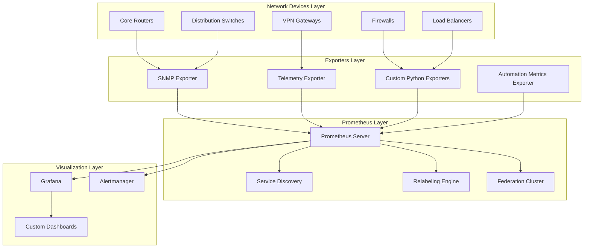

**Diagram sources**
- [README.md:587-604](file://README.md#L587-L604)

**Section sources**
- [README.md:160-165](file://README.md#L160-L165)
- [README.md:587-604](file://README.md#L587-L604)

## Core Components

### Custom Python Exporters for Network Device Metrics

The platform implements specialized Python exporters designed to collect metrics from diverse network equipment using multiple protocols:

#### Interface Counters Exporter
- **Protocol Support**: SNMPv3, NETCONF, RESTCONF
- **Metrics Collected**: 
  - Interface traffic (bytes in/out, packets dropped/errors)
  - Interface status and utilization
  - Buffer utilization and queue depths
  - Error rates and collision counts

#### Routing Protocol State Exporter
- **Protocol Support**: SSH, NETCONF, vendor-specific APIs
- **Metrics Collected**:
  - BGP peer states and session durations
  - OSPF neighbor relationships and adjacency states
  - IS-IS adjacency metrics and LSP flooding statistics
  - Route table sizes and convergence times

#### Firewall Session Exporter
- **Protocol Support**: Vendor REST APIs, SSH CLI parsing
- **Metrics Collected**:
  - Active session counts by protocol and zone
  - Connection establishment and teardown rates
  - NAT translation table utilization
  - Policy match statistics and denied connections

#### Hardware Health Exporter
- **Protocol Support**: SNMPv3, IPMI, vendor telemetry
- **Metrics Collected**:
  - CPU and memory utilization per component
  - Temperature sensors and fan speeds
  - Power supply status and redundancy state
  - Module health indicators and error logs

### Built-in Automation Platform Metrics

The automation engine exposes comprehensive metrics for operational visibility:

#### Job Execution Metrics
- **Job Duration**: Time taken for configuration deployments
- **Success/Failure Rates**: Per-playbook and per-device success ratios
- **Resource Utilization**: Memory and CPU usage during job execution
- **Queue Depth**: Pending jobs waiting for execution slots

#### Compliance Scan Results
- **Policy Violation Counts**: By severity level and policy category
- **Scan Duration**: Time required for full fleet compliance checks
- **Drift Detection**: Configuration changes detected since last scan
- **Remediation Success**: Automated fix application rates

#### Bot API Performance Metrics
- **Request Latency**: P50, P95, P99 response times per endpoint
- **Throughput**: Requests per second by bot type
- **Error Rates**: HTTP status codes and internal errors
- **Authentication Failures**: Failed login attempts and token validation errors

**Section sources**
- [README.md:438-456](file://README.md#L438-L456)
- [README.md:460-476](file://README.md#L460-L476)

## Architecture Overview

The monitoring architecture follows a layered approach with clear separation of concerns:

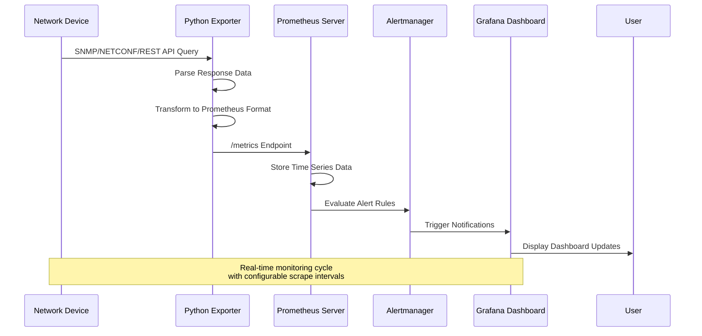

**Diagram sources**
- [README.md:587-604](file://README.md#L587-L604)

### Data Flow Architecture

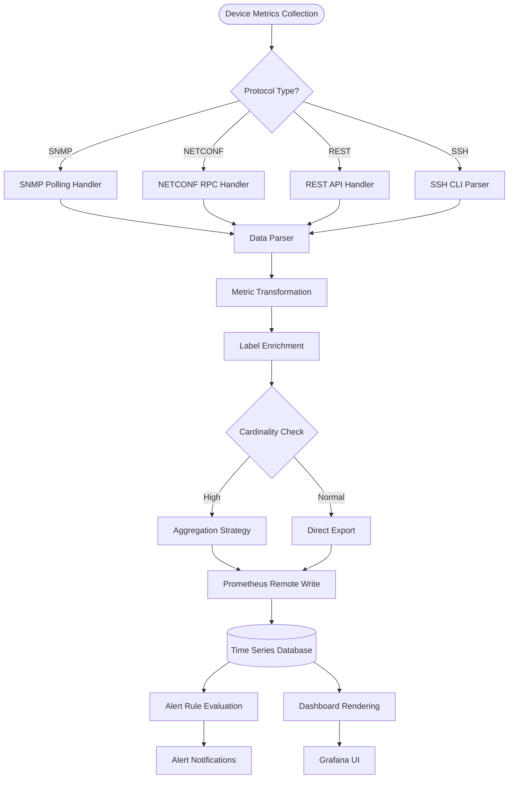

**Diagram sources**
- [README.md:587-604](file://README.md#L587-L604)

## Detailed Component Analysis

### Custom Python Exporter Framework

The exporter framework provides a standardized approach for collecting metrics from heterogeneous network devices:

#### Exporter Base Class Architecture

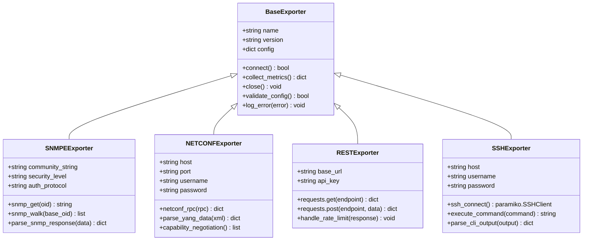

**Diagram sources**
- [README.md:438-456](file://README.md#L438-L456)

#### Metric Collection Pipeline

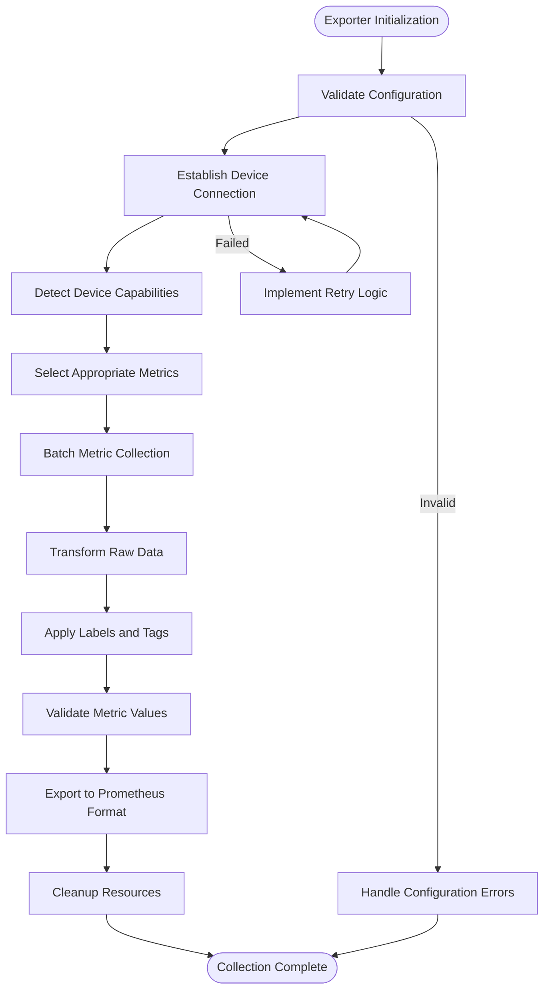

**Diagram sources**
- [README.md:438-456](file://README.md#L438-L456)

### Prometheus Configuration Management

#### Service Discovery Integration

The platform supports multiple service discovery mechanisms for dynamic target management:

| Discovery Method | Use Case | Configuration Scope |
|------------------|----------|-------------------|
| File-based SD | Static device inventories | Environment-specific targets |
| Consul SD | Dynamic cloud-native devices | Auto-scaling workloads |
| Kubernetes SD | Containerized exporters | Orchestration-managed pods |
| DNS SD | Legacy infrastructure | SRV record-based discovery |
| EC2/Azure/GCP SD | Cloud networking resources | Provider-specific metadata |

#### Scrape Target Configuration

Scrape configurations are organized by device type and environment:

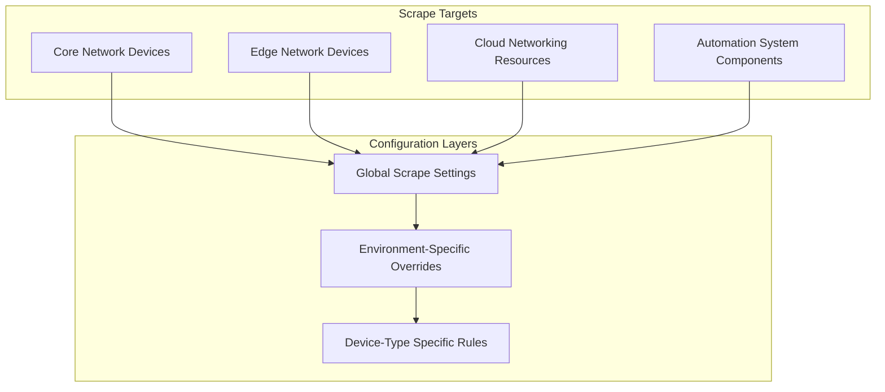

**Diagram sources**
- [README.md:587-604](file://README.md#L587-L604)

#### Metric Relabeling Rules

Relabeling strategies ensure consistent metric naming and efficient storage:

| Relabeling Stage | Purpose | Example Application |
|------------------|---------|-------------------|
| Pre-scrape | Target filtering | Exclude maintenance windows |
| Post-scrape | Metric transformation | Normalize interface names |
| Storage optimization | Cardinality reduction | Aggregate high-cardinality labels |
| Security masking | Sensitive data protection | Remove device credentials from labels |

### Metric Naming Conventions and Label Strategies

#### Standardized Naming Schema

The platform follows Prometheus best practices for metric naming:

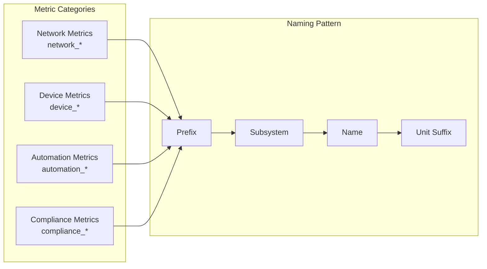

#### Label Strategy Guidelines

Labels are applied strategically to balance query flexibility with cardinality control:

| Label Category | Examples | Cardinality Control |
|----------------|----------|-------------------|
| Identity | `device_name`, `device_role`, `vendor` | Low cardinality (< 1000) |
| Location | `region`, `datacenter`, `rack` | Medium cardinality (< 10000) |
| Temporal | `deployment_version`, `config_hash` | High cardinality (aggregated) |
| Operational | `status`, `health_state` | Low cardinality (< 100) |

### Alert Rule Definitions

#### Critical Infrastructure Alerts

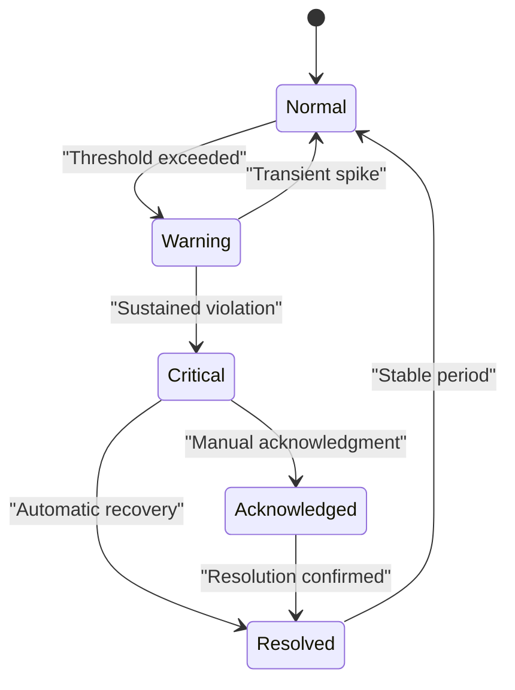

#### Alert Severity Classification

| Severity Level | Response Time | Escalation Path | Notification Channels |
|----------------|---------------|-----------------|----------------------|
| Critical | 5 minutes | On-call engineer → Team lead | PagerDuty, Slack, SMS |
| High | 15 minutes | On-call engineer → Manager | Slack, Email |
| Medium | 1 hour | Next business day review | Email, Ticket creation |
| Low | 24 hours | Weekly report inclusion | Dashboard, Report generation |

### Recording Rules for Complex Calculations

Recording rules optimize frequently used complex queries:

#### Performance Metrics Pre-computation

| Recording Rule | Calculation | Refresh Interval |
|----------------|-------------|------------------|
| `job_duration_seconds_summary` | Percentile calculations for job execution times | 30 seconds |
| `compliance_violation_rates` | Rate of new violations per time window | 1 minute |
| `api_latency_percentiles` | P50/P95/P99 latency calculations | 1 minute |
| `device_health_score` | Composite health index calculation | 5 minutes |

### Grafana Dashboard Data Sources

#### Dashboard Architecture

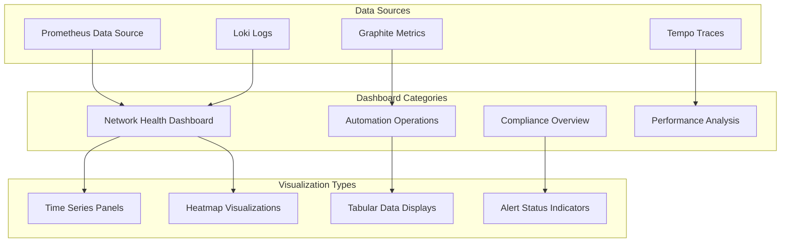

**Diagram sources**
- [README.md:587-604](file://README.md#L587-L604)

## Dependency Analysis

### Component Coupling and Relationships

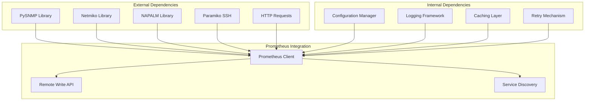

### External Integration Points

| Integration Point | Technology | Purpose | Failure Handling |
|-------------------|------------|---------|------------------|
| Device Protocols | SNMPv3, NETCONF, REST | Metrics collection | Retry with exponential backoff |
| Secrets Management | HashiCorp Vault, AWS SM | Credential access | Fallback to cached credentials |
| Service Discovery | Consul, Kubernetes | Target management | Graceful degradation |
| Alerting | Alertmanager, PagerDuty | Incident notification | Queue-based delivery |
| Logging | Structured logging, centralized | Audit trail | Local buffering |

**Section sources**
- [README.md:438-456](file://README.md#L438-L456)
- [README.md:587-604](file://README.md#L587-L604)

## Performance Considerations

### Scalability Architecture

For large-scale deployments supporting thousands of network devices:

#### Horizontal Scaling Strategies

| Component | Scaling Approach | Capacity Planning |
|-----------|------------------|-------------------|
| Exporters | Stateless horizontal scaling | 1 exporter per 500 devices |
| Prometheus | Federation and sharding | 1 server per 10K series |
| Alertmanager | Clustering with deduplication | 3 nodes minimum |
| Grafana | Read replicas for dashboards | Scale based on concurrent users |

#### Resource Optimization Techniques

- **Connection Pooling**: Reuse device connections across metric collections
- **Batch Processing**: Aggregate multiple metric requests into single operations
- **Caching Layer**: Cache stable device metadata and capability information
- **Lazy Loading**: Defer expensive metric collection until requested
- **Compression**: Enable compression for remote write operations

### Federation Setup

Multi-cluster federation architecture for global observability:

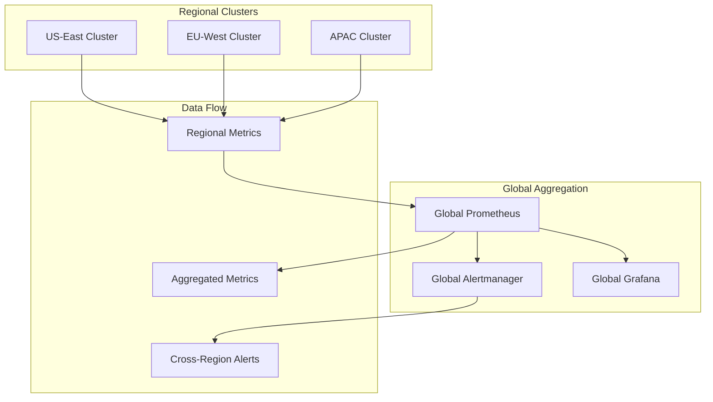

## Troubleshooting Guide

### Common Collection Issues

| Issue Category | Symptoms | Diagnostic Steps | Resolution |
|----------------|----------|------------------|------------|
| Connection Failures | Timeout errors, authentication failures | Verify network reachability, check credentials | Update connection parameters, verify firewall rules |
| Metric Gaps | Missing time series, inconsistent data | Check exporter logs, validate scrape intervals | Adjust scrape timing, implement retry logic |
| High Cardinality | Storage growth, query performance issues | Analyze label distribution, identify hotspots | Apply relabeling rules, aggregate metrics |
| Performance Degradation | Slow scraping, resource exhaustion | Monitor exporter resource usage, profile collection | Optimize queries, implement caching |

### Debugging Utilities

#### Exporter Health Checks

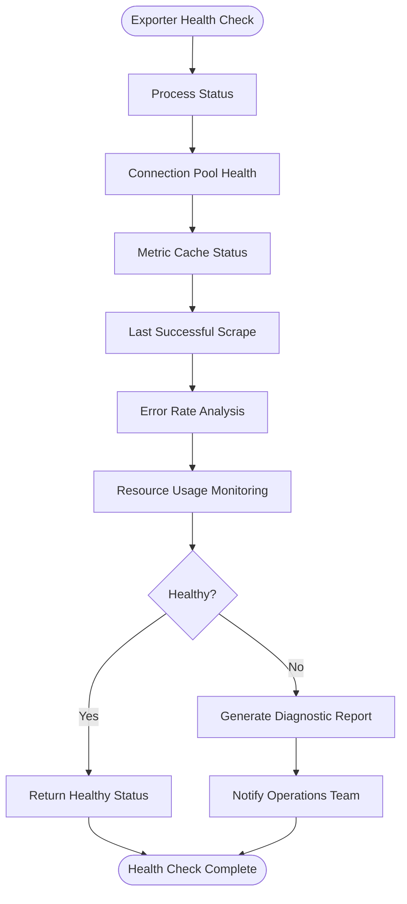

**Diagram sources**
- [README.md:674-685](file://README.md#L674-L685)

### Log Analysis Patterns

Key log patterns for troubleshooting:

- **Connection Lifecycle**: Track connection establishment, authentication, and teardown
- **Metric Collection**: Monitor collection start/end times and result processing
- **Error Propagation**: Follow error paths from device communication to metric export
- **Resource Utilization**: Track memory usage, CPU consumption, and connection pool status

## Conclusion

The Prometheus exporters and metrics architecture provides comprehensive observability for enterprise network automation at scale. The modular design supports diverse network technologies while maintaining consistent metric formats and operational procedures. Key strengths include:

- **Extensible Exporter Framework**: Pluggable architecture supporting multiple protocols
- **Intelligent Metric Management**: Sophisticated labeling and cardinality control
- **Robust Alerting**: Multi-tier alerting with intelligent escalation
- **Operational Excellence**: Comprehensive troubleshooting and monitoring tools

The architecture scales effectively from small deployments to enterprise-wide implementations, providing the foundation for data-driven network operations and automated remediation workflows.

## Appendices

### A. Implementation Checklist

- [ ] Configure device connectivity and credentials
- [ ] Deploy custom Python exporters for each device type
- [ ] Set up Prometheus with appropriate scrape configurations
- [ ] Implement service discovery for dynamic target management
- [ ] Configure alerting rules and notification channels
- [ ] Create Grafana dashboards for operational visibility
- [ ] Establish monitoring for the monitoring system itself
- [ ] Document runbooks for common operational scenarios

### B. Reference Architectures

The platform supports multiple deployment patterns:

- **Single Cluster**: Small to medium deployments (< 1000 devices)
- **Multi-Cluster**: Regional deployments with global aggregation
- **Hybrid Cloud**: On-premises and cloud networking integration
- **Edge Computing**: Distributed collectors for remote locations