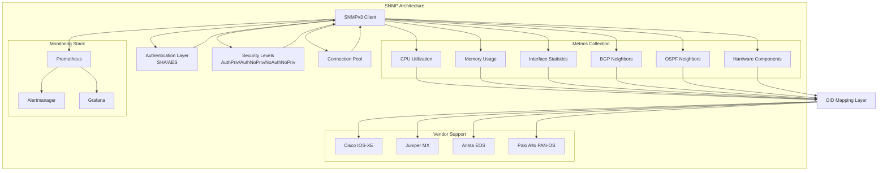
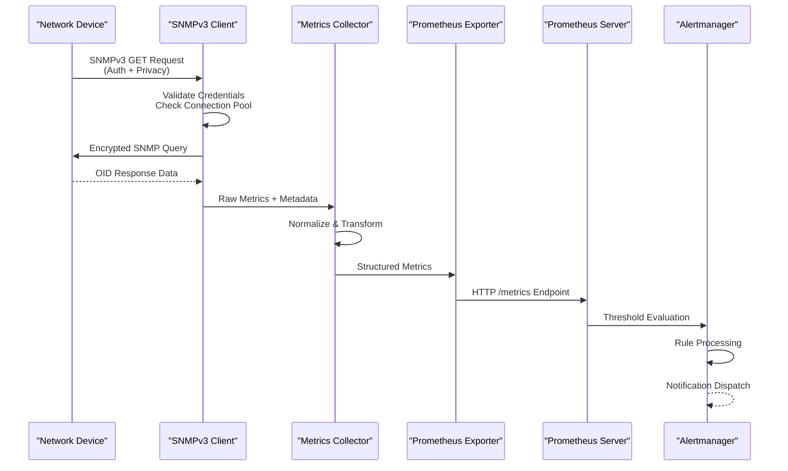
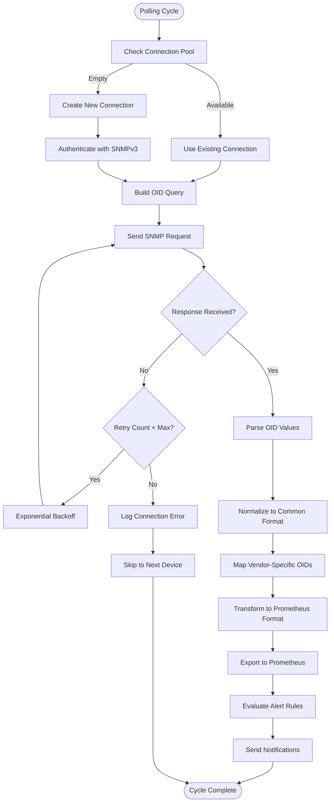
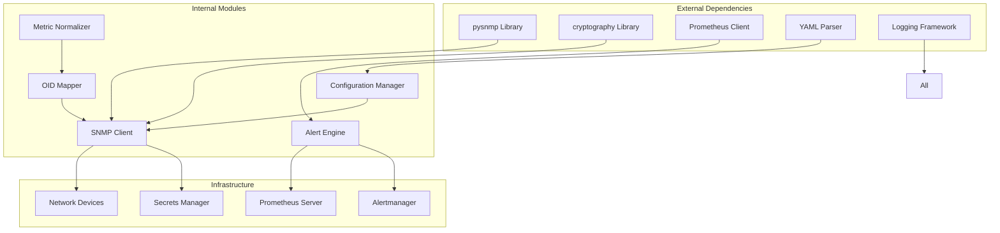

# SNMPv3 Polling & Metrics Collection

<cite>
**Referenced Files in This Document**
- [README.md](file://README.md)
</cite>

## Table of Contents
1. [Introduction](#introduction)
2. [Project Structure](#project-structure)
3. [Core Components](#core-components)
4. [Architecture Overview](#architecture-overview)
5. [Detailed Component Analysis](#detailed-component-analysis)
6. [Dependency Analysis](#dependency-analysis)
7. [Performance Considerations](#performance-considerations)
8. [Troubleshooting Guide](#troubleshooting-guide)
9. [Conclusion](#conclusion)

## Introduction

This document provides comprehensive coverage of SNMPv3 polling and metrics collection within the Enterprise Network Automation Platform. The platform implements a production-grade, vendor-agnostic approach to network monitoring using SNMPv3 with authentication (SHA/AES), encryption, and security levels. It supports multi-vendor environments including Cisco IOS-XE, Juniper MX, Arista EOS, and Palo Alto PAN-OS platforms, integrating seamlessly with Prometheus for metrics collection and alerting.

The system follows Infrastructure as Code principles, with all monitoring configurations defined in Git and managed through automated CI/CD pipelines. SNMPv3 compliance is enforced as part of the platform's security posture, ensuring secure network device communication across enterprise-scale deployments.

## Project Structure

The Enterprise Network Automation Platform organizes SNMP-related functionality within a modular architecture:

**Diagram sources**
- [README.md:583-604](file://README.md#L583-L604)
- [README.md:438-456](file://README.md#L438-L456)

**Section sources**
- [README.md:103-180](file://README.md#L103-L180)
- [README.md:438-456](file://README.md#L438-L456)

## Core Components

### SNMPv3 Client Architecture

The SNMP client architecture implements a robust, scalable solution for network device monitoring:

#### Authentication and Security
- **Authentication**: SHA (Secure Hash Algorithm) for message integrity
- **Encryption**: AES (Advanced Encryption Standard) for data confidentiality  
- **Security Levels**: 
  - `noAuthNoPriv`: No authentication or encryption
  - `authNoPriv`: Authentication only (message integrity)
  - `authPriv`: Authentication and encryption (recommended)

#### Connection Management
- **Connection Pooling**: Reusable connections to reduce overhead
- **Retry Logic**: Configurable retry attempts with exponential backoff
- **Timeout Handling**: Per-request timeout configuration
- **Error Recovery**: Automatic reconnection and failover mechanisms

#### OID Abstraction Layer
- **Vendor-Specific Mappings**: Abstracts vendor differences behind unified interfaces
- **Standard OIDs**: Uses standard MIB-II and enterprise-specific OIDs
- **Dynamic Discovery**: Auto-detection of supported OIDs per device type

**Section sources**
- [README.md:438-456](file://README.md#L438-L456)
- [README.md:559](file://README.md#L559)

### Metrics Collection Framework

The platform collects comprehensive device health metrics across multiple categories:

#### System Health Metrics
- **CPU Utilization**: Process-level and overall CPU usage percentages
- **Memory Usage**: RAM utilization, buffer memory, and swap space
- **Temperature Sensors**: Hardware temperature monitoring
- **Power Supply Status**: PSU health and redundancy status

#### Interface Statistics
- **Traffic Metrics**: Inbound/outbound bytes, packets, errors, drops
- **Interface Status**: Up/down state, speed, duplex settings
- **Quality Metrics**: CRC errors, frame errors, collision counts
- **Utilization Rates**: Bandwidth usage percentage over time windows

#### Protocol State Monitoring
- **BGP Neighbors**: Peer status, uptime, route counts, session states
- **OSPF Neighbors**: Adjacency states, area membership, LSA counts
- **VRRP/HSRP**: High availability group status and priorities
- **STP**: Spanning tree topology changes and port states

#### Hardware Component Monitoring
- **Fan Status**: Rotation speed and failure detection
- **Module Health**: Line card status and component health
- **License Status**: Feature license validity and expiration
- **Boot Flash**: Storage utilization and filesystem health

**Section sources**
- [README.md:606-616](file://README.md#L606-L616)

## Architecture Overview

The SNMPv3 monitoring architecture follows a layered approach with clear separation of concerns:

**Diagram sources**
- [README.md:583-604](file://README.md#L583-L604)

### Data Flow Architecture

**Diagram sources**
- [README.md:583-604](file://README.md#L583-L604)

## Detailed Component Analysis

### SNMP Client Implementation

The SNMP client module provides a high-level interface for secure network device communication:

#### Security Configuration
- **User-Based Security Model (USM)**: Implements RFC 3414 for user-based security
- **Authentication Protocol**: SHA-1 or SHA-256 for message authentication
- **Privacy Protocol**: AES-128 or AES-256 for data encryption
- **Engine ID**: Unique device identification for security context

#### Connection Pool Management
- **Pool Size**: Configurable maximum concurrent connections
- **Idle Timeout**: Automatic cleanup of unused connections
- **Health Checking**: Periodic connection validation
- **Load Balancing**: Round-robin distribution across pool members

#### Error Handling Strategy
- **Transient Errors**: Network timeouts, temporary unavailability
- **Permanent Errors**: Authentication failures, unsupported OIDs
- **Circuit Breaker**: Prevent cascading failures during outages
- **Graceful Degradation**: Continue monitoring with reduced metric set

**Section sources**
- [README.md:438-456](file://README.md#L438-L456)

### Vendor-Specific OID Mappings

The platform abstracts vendor differences through a comprehensive OID mapping layer:

#### Cisco IOS-XE Support
- **System Information**: `1.3.6.1.2.1.1` (MIB-II system group)
- **CPU Utilization**: `1.3.6.1.4.1.9.9.109.1.1.1.1.6` (process CPU)
- **Memory Usage**: `1.3.6.1.4.1.9.9.48.1.1.1.5` (memory utilization)
- **Interface Stats**: `1.3.6.1.2.1.2.2.1` (IF-MIB)
- **BGP Status**: `1.3.6.1.4.1.9.9.143.1.1.1.1.13` (BGP peer state)

#### Juniper MX Support
- **System Info**: `1.3.6.1.4.1.2636.3.1.13` (JUNIPER-MIB)
- **CPU Usage**: `1.3.6.1.4.1.2636.3.1.13.1.1.1.1` (system CPU)
- **Memory Stats**: `1.3.6.1.4.1.2636.3.1.13.1.1.1.2` (memory utilization)
- **Interface Metrics**: `1.3.6.1.4.1.2636.3.1.13.1.1.1.3` (interface counters)
- **Routing Protocols**: `1.3.6.1.4.1.2636.3.4.1` (routing protocol stats)

#### Arista EOS Support
- **System Details**: `1.3.6.1.4.1.30065.3.1.1` (ARISTA-MIB)
- **Process CPU**: `1.3.6.1.4.1.30065.3.1.1.1.1` (process CPU utilization)
- **Memory Info**: `1.3.6.1.4.1.30065.3.1.1.1.2` (memory statistics)
- **Interface Counters**: `1.3.6.1.4.1.30065.3.1.1.1.3` (interface metrics)
- **Protocol Status**: `1.3.6.1.4.1.30065.3.1.1.1.4` (protocol statistics)

#### Palo Alto PAN-OS Support
- **System Health**: `1.3.6.1.4.1.25461.2.1.2.1` (PAN-MIB)
- **CPU Load**: `1.3.6.1.4.1.25461.2.1.2.1.1.1` (system CPU load)
- **Memory Usage**: `1.3.6.1.4.1.25461.2.1.2.1.1.2` (memory utilization)
- **Session Stats**: `1.3.6.1.4.1.25461.2.1.2.1.1.3` (session statistics)
- **HA Status**: `1.3.6.1.4.1.25461.2.1.2.1.1.4` (high availability status)

**Section sources**
- [README.md:203-217](file://README.md#L203-L217)

### Prometheus Integration

The platform integrates seamlessly with Prometheus for metrics collection and alerting:

#### Exporter Configuration
- **HTTP Endpoint**: `/metrics` endpoint serving Prometheus-formatted metrics
- **Metric Labels**: Device hostname, IP address, vendor, platform, region
- **Metric Types**: Counters, gauges, histograms for different metric categories
- **Scrape Configuration**: Target discovery and scrape interval management

#### Alert Rule Definitions
- **Threshold-Based Alerts**: CPU > 90%, Memory > 85%, Interface errors > threshold
- **State-Based Alerts**: Device down, BGP neighbor down, OSPF adjacency lost
- **Trend-Based Alerts**: Rapidly increasing error rates, capacity approaching limits
- **Composite Alerts**: Multi-condition alerts combining several metrics

#### Dashboard Integration
- **Network Health Dashboard**: Real-time device status and performance overview
- **Capacity Planning Dashboard**: Trend analysis and resource utilization forecasting
- **Compliance Dashboard**: Security policy enforcement and audit trail
- **Automation Metrics**: Pipeline success rates and deployment tracking

**Section sources**
- [README.md:583-616](file://README.md#L583-L616)

## Dependency Analysis

The SNMP monitoring system has well-defined dependencies and integration points:

**Diagram sources**
- [README.md:438-456](file://README.md#L438-L456)
- [README.md:583-604](file://README.md#L583-L604)

### Module Coupling Analysis

- **Low Coupling**: SNMP client operates independently from other automation modules
- **High Cohesion**: Related SNMP functionality grouped within dedicated modules
- **Clear Interfaces**: Well-defined APIs between components
- **Dependency Injection**: External services injected for testability

**Section sources**
- [README.md:438-456](file://README.md#L438-L456)

## Performance Considerations

### Polling Optimization Strategies

#### Interval Management
- **Adaptive Polling**: Dynamic adjustment based on device criticality
- **Staggered Scheduling**: Avoid simultaneous polling of large device groups
- **Batch Operations**: Group related OID queries for efficiency
- **Caching**: Cache stable values like device inventory and capabilities

#### Resource Management
- **Connection Pooling**: Reuse TCP connections to minimize overhead
- **Asynchronous Processing**: Non-blocking I/O for concurrent device polling
- **Memory Management**: Stream processing for large OID responses
- **CPU Throttling**: Limit concurrent operations to prevent resource exhaustion

#### Scalability Patterns
- **Horizontal Scaling**: Multiple collector instances for large deployments
- **Sharding**: Distribute devices across collector nodes by region/vendor
- **Load Balancing**: Even distribution of polling workload
- **Failover**: Automatic failover to backup collectors

### Error Handling and Resilience

#### Retry Logic
- **Exponential Backoff**: Progressive delay between retry attempts
- **Circuit Breaker**: Temporarily stop polling failing devices
- **Fallback Mechanisms**: Alternative polling methods when primary fails
- **Graceful Degradation**: Continue operation with reduced functionality

#### Monitoring and Observability
- **Health Checks**: Regular self-monitoring of collector health
- **Performance Metrics**: Track polling latency and success rates
- **Error Tracking**: Comprehensive logging and error categorization
- **Alerting**: Proactive notification of collector issues

**Section sources**
- [README.md:583-616](file://README.md#L583-L616)

## Troubleshooting Guide

### Common SNMP Connectivity Issues

#### Authentication Failures
- **Symptoms**: Authentication errors, invalid credentials
- **Causes**: Incorrect username, password, or security parameters
- **Resolution**: Verify SNMPv3 user configuration, check authentication protocols
- **Prevention**: Centralized credential management, regular rotation

#### Network Connectivity Problems
- **Symptoms**: Timeouts, connection refused, unreachable devices
- **Causes**: Firewall rules, routing issues, device maintenance
- **Resolution**: Check network reachability, verify SNMP port access
- **Prevention**: Network monitoring, connectivity testing

#### OID Access Issues
- **Symptoms**: Unknown OID, insufficient privileges, no such object
- **Causes**: Missing MIBs, incorrect community strings, unsupported features
- **Resolution**: Install required MIBs, verify OID accessibility
- **Prevention**: Pre-deployment validation, MIB synchronization

#### Performance Degradation
- **Symptoms**: Slow polling, high CPU usage, memory leaks
- **Causes**: Excessive polling frequency, large OID trees, inefficient queries
- **Resolution**: Optimize polling intervals, use targeted OID queries
- **Prevention**: Performance monitoring, capacity planning

### Debugging Tools and Techniques

#### Diagnostic Commands
- **SNMP Walk**: Test OID accessibility and response times
- **Packet Capture**: Analyze SNMP traffic for protocol issues
- **Log Analysis**: Review collector logs for error patterns
- **Health Checks**: Monitor collector internal metrics

#### Testing Strategies
- **Unit Tests**: Mock SNMP responses for reliable testing
- **Integration Tests**: Validate end-to-end monitoring workflows
- **Chaos Engineering**: Simulate network failures and device outages
- **Load Testing**: Validate scalability under various conditions

**Section sources**
- [README.md:674-685](file://README.md#L674-L685)

## Conclusion

The Enterprise Network Automation Platform provides a comprehensive, production-ready SNMPv3 monitoring solution that addresses the complex requirements of modern network operations. The architecture emphasizes security through SNMPv3 authentication and encryption, scalability through connection pooling and asynchronous processing, and reliability through robust error handling and monitoring.

Key strengths include vendor-agnostic OID abstraction, seamless Prometheus integration, and adherence to Infrastructure as Code principles. The platform successfully balances security requirements with operational needs, providing enterprise-grade monitoring capabilities while maintaining flexibility for diverse network environments.

Future enhancements may include machine learning-based anomaly detection, expanded protocol support beyond SNMP, and deeper integration with cloud-native monitoring ecosystems. The modular architecture ensures these enhancements can be implemented without disrupting existing functionality.