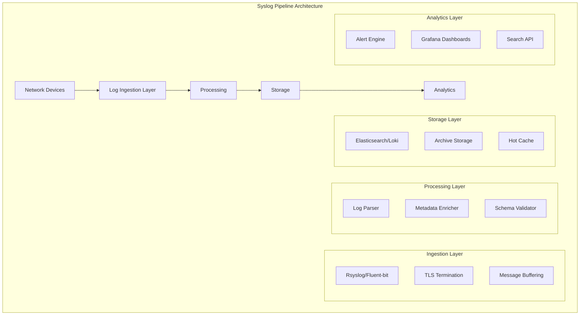
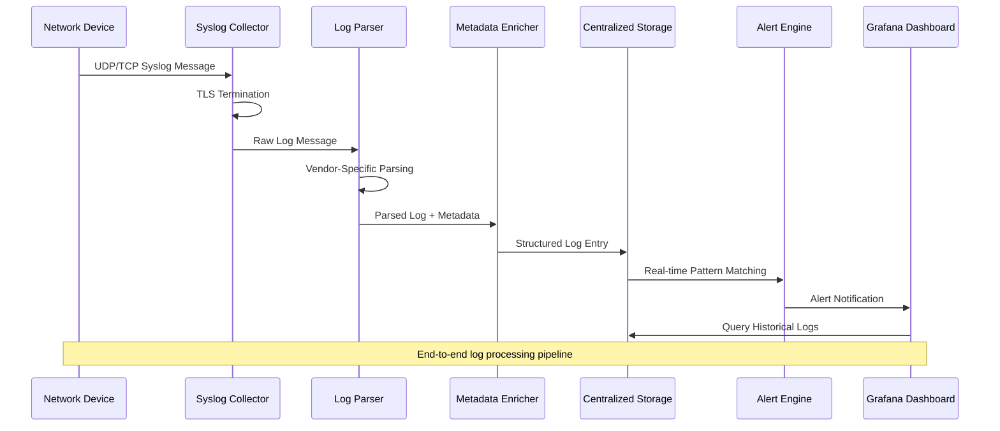
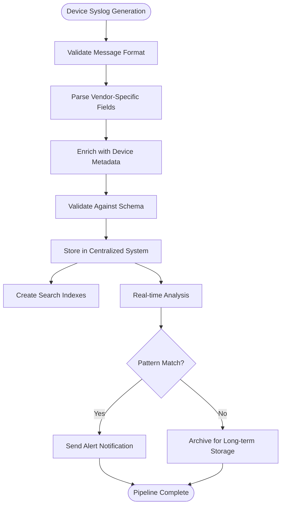
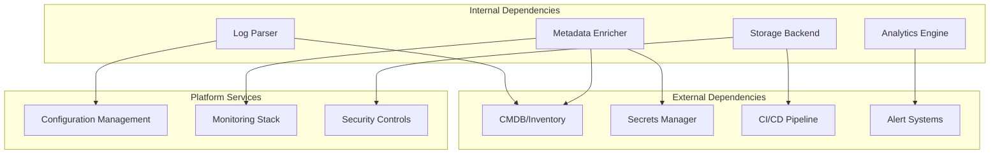

# Syslog Collection & Log Processing

<cite>
**Referenced Files in This Document**
- [README.md](file://README.md)
</cite>

## Table of Contents
1. [Introduction](#introduction)
2. [Project Structure](#project-structure)
3. [Core Components](#core-components)
4. [Architecture Overview](#architecture-overview)
5. [Detailed Component Analysis](#detailed-component-analysis)
6. [Dependency Analysis](#dependency-analysis)
7. [Performance Considerations](#performance-considerations)
8. [Troubleshooting Guide](#troubleshooting-guide)
9. [Conclusion](#conclusion)
10. [Appendices](#appendices)

## Introduction

This document provides comprehensive guidance for implementing a high-throughput syslog collection and processing pipeline within the Enterprise Network Automation Platform. The platform supports thousands of network devices across multi-vendor environments, requiring robust log ingestion, parsing, enrichment, and analysis capabilities to maintain operational visibility and compliance.

The syslog pipeline integrates seamlessly with the existing observability stack, including Prometheus, Grafana, and OpenTelemetry, while providing structured logging formats suitable for centralized logging systems like Elasticsearch or Loki. This implementation follows GitOps principles, ensuring all configurations are version-controlled and reproducible.

## Project Structure

The syslog collection and processing components integrate with the existing platform architecture, leveraging the modular design patterns established throughout the codebase. The implementation spans multiple directories following the established organizational structure:

**Diagram sources**
- [README.md:583-604](file://README.md#L583-L604)

**Section sources**
- [README.md:103-180](file://README.md#L103-L180)
- [README.md:583-618](file://README.md#L583-L618)

## Core Components

### High-Throughput Log Ingestion

The ingestion layer handles millions of syslog messages per second from diverse network device vendors using rsyslog or fluent-bit as the primary collectors. The system implements connection pooling, message buffering, and backpressure mechanisms to ensure reliable delivery under high load conditions.

### Multi-Vendor Log Parsing

The parsing engine supports vendor-specific syslog message formats through regex-based pattern matching and structured data extraction. Each vendor's syslog format is defined as a separate parser configuration, enabling easy addition of new device types without modifying core parsing logic.

### Metadata Enrichment

Logs are enriched with device metadata including inventory information, geographic location, business context, and automation event correlation. This enrichment process leverages the existing CMDB integration and real-time automation event streams to provide comprehensive context for each log entry.

### Structured Logging Format

All parsed logs are converted to a standardized JSON schema that includes timestamp, severity, source device, facility, message content, and enriched metadata fields. This format ensures consistency across all logging sources and enables efficient querying and analysis.

**Section sources**
- [README.md:438-456](file://README.md#L438-L456)
- [README.md:583-604](file://README.md#L583-L604)

## Architecture Overview

The syslog pipeline architecture follows a microservices pattern with clear separation of concerns and horizontal scalability at each layer:

**Diagram sources**
- [README.md:583-604](file://README.md#L583-L604)

### Data Flow Architecture

The data flow follows a producer-consumer pattern with guaranteed delivery semantics:

**Diagram sources**
- [README.md:583-604](file://README.md#L583-L604)

## Detailed Component Analysis

### Syslog Collector Implementation

The collector component implements high-performance syslog reception using either rsyslog or fluent-bit, depending on deployment requirements. Both options support TLS termination, message validation, and intelligent routing based on source device characteristics.

#### Rsyslog Configuration Strategy

Rsyslog provides native syslog protocol support with excellent performance characteristics for high-volume environments. The configuration includes rate limiting, message queuing, and conditional routing based on syslog headers and content patterns.

#### Fluent-bit Alternative

Fluent-bit offers superior resource efficiency and plugin ecosystem for complex transformation scenarios. It excels in containerized deployments and cloud-native architectures with built-in support for various output formats and destinations.

**Section sources**
- [README.md:583-604](file://README.md#L583-L604)

### Multi-Vendor Log Parsing Engine

The parsing engine uses a rule-based approach with regex patterns optimized for performance and maintainability. Each vendor's syslog format is encapsulated in separate configuration files, enabling independent testing and deployment.

#### Cisco IOS/IOS-XE/NX-OS Parsing

Cisco devices generate highly structured syslog messages with consistent formatting across platforms. The parser extracts interface names, error codes, and contextual information using optimized regex patterns.

#### Juniper SRX/MX Parsing

Juniper syslog messages follow RFC 3164 with vendor-specific extensions. The parser handles both traditional and modern syslog formats, extracting security events, routing changes, and hardware status updates.

#### Arista EOS Parsing

Arista devices produce detailed operational logs with rich metadata. The parser captures switch fabric events, BGP state changes, and ACL hits with precise timing information.

#### Palo Alto/Fortinet Firewall Parsing

Firewall vendors generate security-focused syslog messages with threat intelligence data. The parser extracts attack signatures, policy decisions, and user authentication events for security analytics.

**Section sources**
- [README.md:203-227](file://README.md#L203-L227)

### Metadata Enrichment Service

The enrichment service correlates incoming log entries with device inventory data, automation events, and external systems to provide comprehensive context. This service maintains real-time synchronization with the CMDB and automation event bus.

#### Device Inventory Integration

Each log entry is automatically enriched with device attributes including hostname, IP address, location, role, vendor, platform, and business criticality. This enrichment occurs in-memory using cached device profiles for optimal performance.

#### Automation Event Correlation

Logs are correlated with recent automation events such as configuration changes, firmware upgrades, and maintenance activities. This correlation enables root cause analysis by linking operational events with resulting log patterns.

#### Geographic and Business Context

Location-based enrichment adds data center, region, and availability zone information. Business context enrichment includes application ownership, SLA tier, and compliance requirements for prioritized alerting and reporting.

**Section sources**
- [README.md:438-456](file://README.md#L438-L456)

### Structured Logging Format

The platform defines a comprehensive JSON schema for all processed log entries, ensuring consistency and enabling efficient querying across the entire fleet. The schema includes standard syslog fields plus platform-specific enhancements.

#### Core Schema Definition

Every log entry contains mandatory fields including timestamp (UTC), severity level, source device identifier, facility code, and message content. Optional fields include structured data objects for parsed vendor-specific information and enrichment metadata.

#### Vendor-Specific Extensions

Each supported vendor defines additional fields in their specific schema extension. These extensions maintain compatibility with the core schema while providing rich, queryable data for vendor-specific analytics and troubleshooting.

#### Compliance and Audit Fields

All log entries include audit trail information including processing timestamps, enrichment sources, and data lineage. This information supports compliance requirements and debugging of the processing pipeline itself.

**Section sources**
- [README.md:438-456](file://README.md#L438-L456)

### Centralized Logging Integration

The pipeline supports multiple centralized logging backends with automatic failover and load balancing. The storage layer abstracts backend differences through a unified API, enabling seamless migration between different logging systems.

#### Elasticsearch Integration

Elasticsearch provides powerful search and analytics capabilities with full-text search, aggregations, and machine learning integrations. The integration includes index lifecycle management, shard optimization, and automated retention policies.

#### Loki Integration

Loki offers cost-effective long-term storage with Grafana-native integration. The integration leverages label-based indexing for efficient querying and supports compression for reduced storage costs.

#### Hybrid Architecture Support

The system supports hybrid deployments where hot data resides in Elasticsearch for real-time analytics while cold data archives to object storage via Loki or S3-compatible APIs. This approach optimizes both performance and cost.

**Section sources**
- [README.md:583-604](file://README.md#L583-L604)

## Dependency Analysis

The syslog pipeline maintains loose coupling with other platform components while providing clear integration points for extensibility:

**Diagram sources**
- [README.md:583-604](file://README.md#L583-L604)

### Component Coupling Analysis

The syslog pipeline exhibits low coupling with external systems through well-defined interfaces and asynchronous communication patterns. Internal dependencies follow the dependency inversion principle, allowing for flexible implementation swapping.

### Error Handling and Resilience

The pipeline implements comprehensive error handling with retry logic, circuit breakers, and dead letter queues. Failed messages are captured for manual inspection and reprocessing, ensuring no data loss during transient failures.

**Section sources**
- [README.md:583-604](file://README.md#L583-L604)

## Performance Considerations

### Throughput Optimization

The syslog pipeline is designed for high-throughput scenarios supporting millions of messages per second. Key optimizations include connection pooling, batch processing, memory-mapped files, and zero-copy operations where possible.

### Memory Management

Efficient memory usage is achieved through object pooling, streaming processing, and configurable buffer sizes. The system implements backpressure mechanisms to prevent memory exhaustion during traffic spikes.

### CPU Efficiency

CPU-intensive operations like regex parsing are optimized through compiled patterns, parallel processing, and SIMD instructions where available. The system dynamically scales worker processes based on CPU utilization and queue depth.

### Storage Optimization

Storage layer optimizations include compression algorithms tuned for log data characteristics, deduplication for repeated patterns, and tiered storage strategies based on access frequency and retention requirements.

**Section sources**
- [README.md:583-604](file://README.md#L583-L604)

## Troubleshooting Guide

### Common Collection Issues

| Issue | Symptoms | Resolution |
|-------|----------|------------|
| Connection Failures | Dropped connections, timeout errors | Verify network connectivity, firewall rules, and certificate validity |
| High Latency | Delayed log delivery, queue buildup | Monitor buffer utilization, adjust worker threads, check downstream bottlenecks |
| Parsing Errors | Unstructured logs, missing fields | Review vendor-specific patterns, update regex definitions, validate input format |
| Memory Leaks | Increasing memory usage, OOM kills | Profile memory allocation, check for unclosed resources, tune garbage collection |
| Disk Space Exhaustion | Write failures, storage warnings | Implement retention policies, enable compression, monitor disk utilization |

### Log Quality Validation

Regular validation checks ensure log quality and completeness:

- **Completeness**: Verify all expected fields are present in processed logs
- **Accuracy**: Cross-validate parsed values against known device states
- **Timeliness**: Monitor processing latency and delivery delays
- **Consistency**: Check for duplicate messages and ordering issues

### Performance Monitoring

Key metrics for pipeline health include:

- Messages processed per second
- Average processing latency
- Queue depth and backlog size
- Error rates and failure reasons
- Resource utilization (CPU, memory, disk, network)

**Section sources**
- [README.md:674-685](file://README.md#L674-L685)

## Conclusion

The syslog collection and processing pipeline provides a robust, scalable foundation for network observability within the Enterprise Network Automation Platform. By implementing high-throughput ingestion, intelligent parsing, comprehensive enrichment, and flexible storage backends, the system delivers actionable insights while maintaining reliability and performance at scale.

The modular architecture enables continuous evolution as new vendors, protocols, and analytical requirements emerge. GitOps integration ensures all configurations remain version-controlled, auditable, and reproducible across environments.

Future enhancements include AI-driven anomaly detection, automated log format discovery, and advanced correlation engines for predictive maintenance and security threat detection.

## Appendices

### Vendor Support Matrix

| Vendor | Platforms | Status | Features |
|--------|-----------|--------|----------|
| Cisco | IOS, IOS-XE, NX-OS | Production | Full parsing, enrichment, alerts |
| Juniper | SRX, MX, EX | Production | Security events, routing changes |
| Arista | EOS | Production | Switch fabric, BGP, ACL tracking |
| Palo Alto | PAN-OS | Production | Threat intelligence, policy decisions |
| Fortinet | FortiOS | Beta | Security events, VPN status |
| F5 | BIG-IP | Development | Load balancer metrics, health checks |

### Retention Policies

| Data Tier | Retention Period | Storage Type | Access Pattern |
|-----------|------------------|--------------|----------------|
| Hot | 7 days | Elasticsearch SSD | Real-time queries |
| Warm | 30 days | Elasticsearch HDD | Recent trend analysis |
| Cold | 1 year | Object Storage | Compliance, audits |
| Archive | 7 years | Glacier/Coldline | Regulatory requirements |

### Alerting Rules Framework

The alerting system supports pattern-based rules with configurable thresholds, cooldown periods, and escalation policies. Rules are defined in YAML format and integrated with the existing alerting infrastructure for unified notification management.