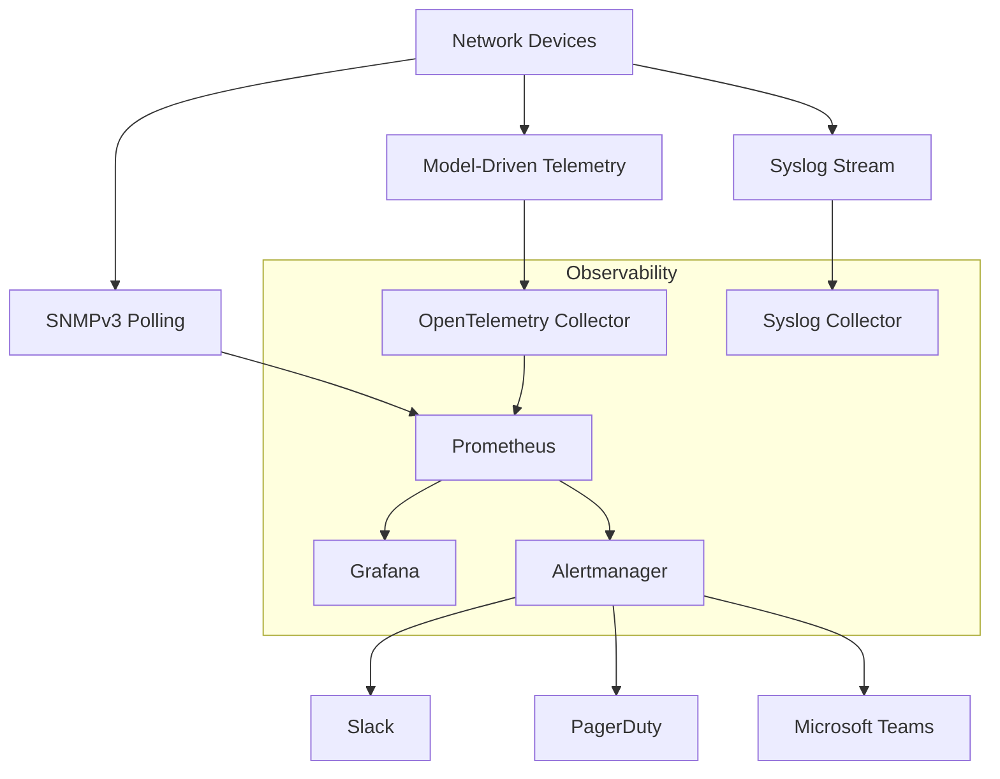
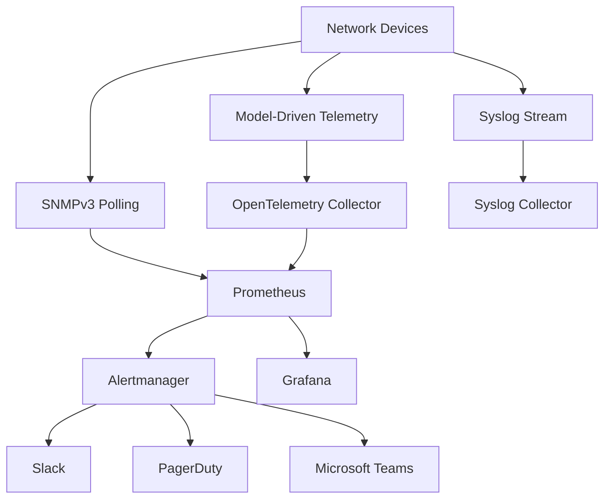

# Metrics Storage & Processing

<cite>
**Referenced Files in This Document**
- [README.md](file://README.md)
</cite>

## Table of Contents
1. [Introduction](#introduction)
2. [Project Structure](#project-structure)
3. [Core Components](#core-components)
4. [Architecture Overview](#architecture-overview)
5. [Detailed Component Analysis](#detailed-component-analysis)
6. [Dependency Analysis](#dependency-analysis)
7. [Performance Considerations](#performance-considerations)
8. [Troubleshooting Guide](#troubleshooting-guide)
9. [Conclusion](#conclusion)

## Introduction
This document describes the metrics storage and processing infrastructure for the Enterprise Network Automation Platform, focusing on Prometheus-based collection, Alertmanager routing and notifications, recording rules and aggregation patterns, federation for large-scale deployments, performance tuning, backup strategies, and monitoring the monitoring stack itself. It synthesizes the repository’s stated observability architecture with production-grade guidance to help operators implement a robust, scalable, and reliable metrics pipeline.

## Project Structure
The repository outlines an observability layer that includes Prometheus, Grafana, OpenTelemetry, and Alertmanager, integrated with network devices via SNMPv3 polling, model-driven telemetry, and syslog. The high-level layout indicates dedicated directories for monitoring configurations under a monitoring folder (prometheus, grafana, otel, alertmanager), aligning with GitOps practices where all monitoring definitions are version-controlled.

**Diagram sources**
- [README.md:587-604](file://README.md#L587-L604)

**Section sources**
- [README.md:103-180](file://README.md#L103-L180)
- [README.md:583-616](file://README.md#L583-L616)

## Core Components
- Prometheus Server
  - Collects metrics from network devices via SNMPv3 and model-driven telemetry (through OpenTelemetry).
  - Stores time-series data locally; supports retention policies and HA configuration for resilience.
- Alertmanager
  - Receives alerts from Prometheus, applies routing rules, deduplicates, groups, and routes notifications to Slack, PagerDuty, and Microsoft Teams.
- Grafana
  - Visualizes metrics and dashboards for network health, automation metrics, compliance overview, upgrade tracking, API performance, and inventory drift.
- OpenTelemetry Collector
  - Ingests telemetry streams and forwards them to Prometheus for unified time-series storage.
- Syslog Collector
  - Captures device logs and integrates into the observability pipeline.

Key responsibilities:
- Scrape targets: SNMP exporters, telemetry receivers, and internal service endpoints.
- Retention policies: Configurable local storage duration based on scale and cost constraints.
- High availability: Multiple Prometheus instances with shared storage or federation/remote write strategies.
- Alerting strategy: Network KPI-based thresholds and composite conditions routed to multiple channels.

**Section sources**
- [README.md:583-616](file://README.md#L583-L616)

## Architecture Overview
The platform’s observability architecture emphasizes multi-source ingestion (SNMP, telemetry, syslog), centralized time-series storage (Prometheus), alerting (Alertmanager), and visualization (Grafana). Notifications integrate with Slack, PagerDuty, and Microsoft Teams to ensure timely incident response across teams.

**Diagram sources**
- [README.md:587-604](file://README.md#L587-L604)

## Detailed Component Analysis

### Prometheus Configuration
- Scrape Targets
  - SNMPv3 polling targets for routers, switches, firewalls, load balancers, VPN gateways, and cloud networking components.
  - Model-driven telemetry endpoints exposed by devices and ingested via OpenTelemetry Collector.
  - Internal services (automation bots, CI/CD runners) exposing HTTP metrics for operational visibility.
- Retention Policies
  - Local retention tuned to workload size and storage budget; consider downsampling older data or offloading to long-term storage if needed.
- High Availability Setup
  - Run multiple Prometheus instances with consistent scrape configs and target discovery.
  - Use remote write or federation to aggregate metrics across regions or clusters.
  - Ensure unique external labels per instance to avoid metric collisions.

Operational considerations:
- Target discovery via file_sd or service discovery mechanisms aligned with the platform’s GitOps workflow.
- Relabeling to normalize labels (region, site, role, vendor) for consistent querying and alerting.
- Security: TLS for scraping, authentication for telemetry endpoints, and secrets managed via Vault or cloud secret managers.

**Section sources**
- [README.md:583-616](file://README.md#L583-L616)

### Alertmanager Routing Rules and Notification Channels
- Routing Strategy
  - Route alerts by severity, region, and component (e.g., core routers vs access switches).
  - Group similar alerts to reduce noise and enable focused remediation.
- Notification Channels
  - Slack: Operational channels for real-time awareness and collaboration.
  - PagerDuty: On-call escalation for critical incidents requiring immediate action.
  - Microsoft Teams: Enterprise communication integration for broader team visibility.
- Alerting Strategy Based on Network KPIs
  - Interface errors/drops, link flaps, CPU/memory saturation, BGP session state changes, latency spikes, packet loss, and queue utilization.
  - Composite conditions combining multiple metrics to reduce false positives (e.g., sustained error rate plus increased latency).

Best practices:
- Deduplicate and inhibit noisy alerts during maintenance windows.
- Include contextual labels (device hostname, interface name, region, site) in alerts for rapid triage.
- Maintain separate routing for warnings vs criticals to balance urgency and attention.

**Section sources**
- [README.md:583-616](file://README.md#L583-L616)

### Metrics Aggregation and Recording Rules
- Recording Rules
  - Precompute complex queries such as average error rates over time windows, percentiles for latency, and aggregated KPIs per device group.
  - Reduce query load on Prometheus by materializing expensive calculations.
- Aggregation Patterns
  - Summarize metrics by region/site/role/vendor to support dashboards and alerts at higher levels of abstraction.
  - Normalize counters and gauges to consistent units and label schemas.

Implementation tips:
- Version control recording rules alongside other monitoring assets.
- Test rule expressions in staging environments before promotion.
- Monitor recording rule evaluation latency and adjust intervals accordingly.

**Section sources**
- [README.md:583-616](file://README.md#L583-L616)

### Federation for Large-Scale Deployments
- Federation Topology
  - Regional Prometheus instances collect local metrics and expose federated endpoints.
  - Global Prometheus aggregates federated metrics for cross-region dashboards and alerts.
- Data Consistency
  - Ensure unique external labels per instance to prevent duplicate series.
  - Apply relabeling to standardize labels across federated sources.
- Scaling Considerations
  - Partition scrape targets by region or domain to distribute load.
  - Use remote write to back up or archive metrics for long-term analysis.

Operational notes:
- Secure federation endpoints with mutual TLS and token-based authentication.
- Monitor federation lag and handle partial failures gracefully.

**Section sources**
- [README.md:583-616](file://README.md#L583-L616)

### Monitoring the Monitoring Stack
- Dashboards
  - Network Health: Device up/down status, CPU/memory usage, interface states.
  - Automation Metrics: Job success/failure rates, execution times, drift counts.
  - Compliance Overview: Policy violations by severity and trends.
  - Upgrade Tracker: Firmware versions and upgrade progress across the fleet.
  - API Performance: Bot endpoint latency, error rates, throughput.
  - Inventory Drift: Differences between Git baseline and running configurations.
- Self-Monitoring
  - Track Prometheus uptime, scrape durations, rule evaluation latency, and storage growth.
  - Alert on Alertmanager delivery failures and Grafana connectivity issues.

**Section sources**
- [README.md:606-616](file://README.md#L606-L616)

## Dependency Analysis
The observability stack depends on device capabilities and protocols:
- SNMPv3 polling requires compatible agents and credentials.
- Model-driven telemetry requires device support and collector configuration.
- Syslog forwarding must be enabled on devices and routed to the collector.

**Diagram sources**
- [README.md:587-604](file://README.md#L587-L604)

**Section sources**
- [README.md:583-616](file://README.md#L583-L616)

## Performance Considerations
- Scrape Intervals
  - Tune intervals per target type; longer intervals for stable metrics, shorter for volatile ones.
- Downsampling and Retention
  - Downsample older data to reduce storage footprint while preserving trend visibility.
- Query Optimization
  - Use recording rules for heavy computations; limit cardinality of labels to avoid high memory usage.
- Resource Sizing
  - Size Prometheus instances based on series count and ingestion rate; monitor TSDB compaction and WAL growth.
- Federation Efficiency
  - Minimize redundant metrics in federated endpoints; apply selective relabeling.

[No sources needed since this section provides general guidance]

## Troubleshooting Guide
Common issues and resolutions:
- Ansible connection timeout: Verify SSH reachability using ping against inventory hosts.
- Template rendering error: Check Jinja2 syntax and debug output for config generation.
- Compliance check failure: Review compliance policies and diffs against running configurations.
- CI pipeline failure: Inspect GitHub Actions logs for actionable error messages.
- Vault authentication failure: Validate OIDC tokens or AppRole credentials and policy permissions.
- Molecule test failure: Ensure Docker/Podman is running and inspect molecule configuration.
- Batfish analysis error: Validate snapshots and configuration inputs.

**Section sources**
- [README.md:674-685](file://README.md#L674-L685)

## Conclusion
The platform’s observability architecture centers on Prometheus for time-series storage, Alertmanager for alert routing and notifications, and Grafana for visualization. By implementing robust scrape targets, recording rules, federation, and performance tuning, operators can achieve scalable and resilient monitoring across large, multi-vendor networks. Integrating Slack, PagerDuty, and Microsoft Teams ensures timely incident response, while self-monitoring keeps the monitoring stack healthy and trustworthy.