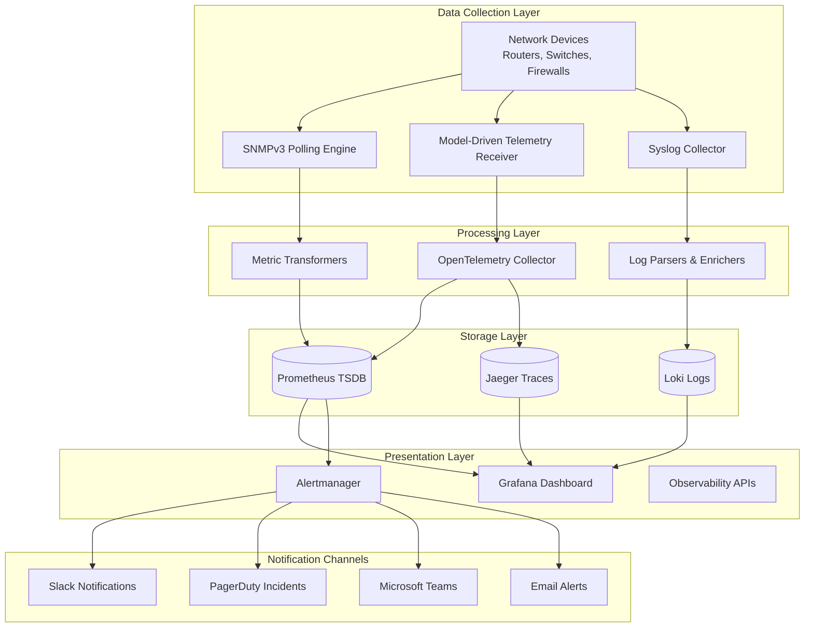
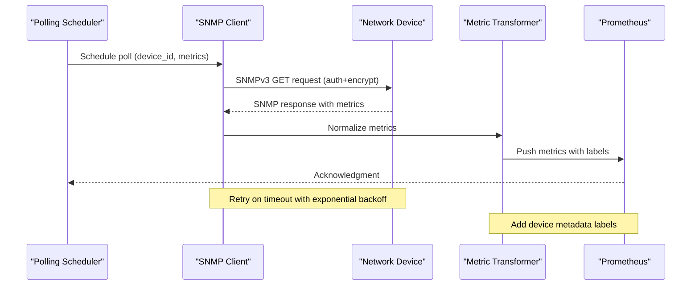
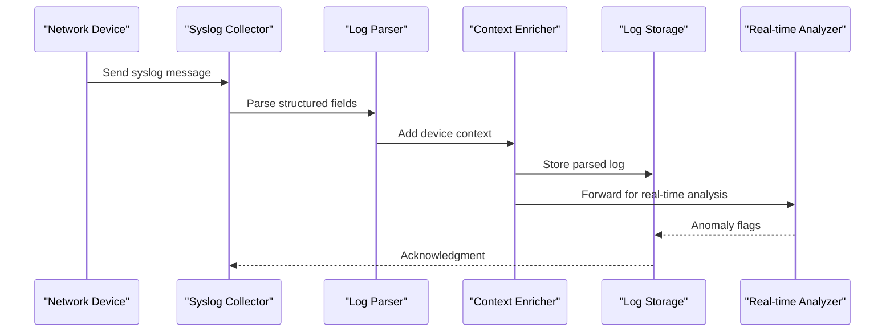
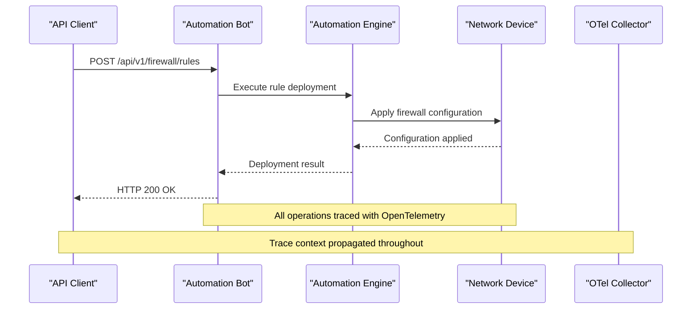
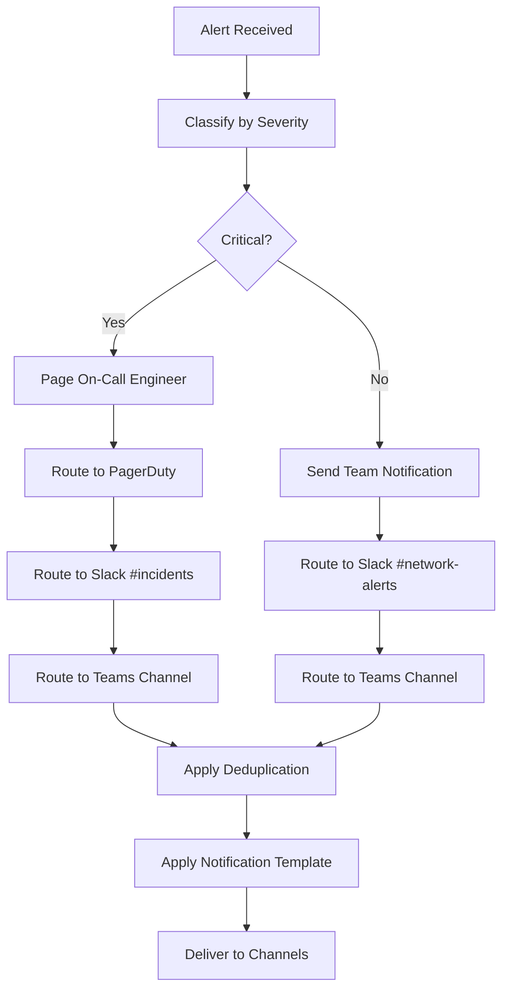
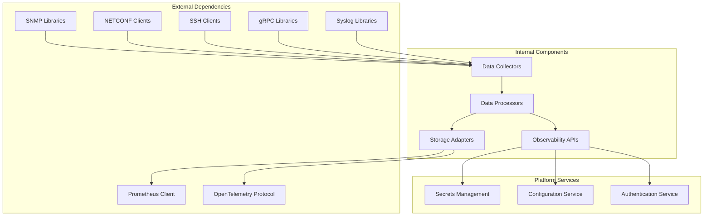

# Monitoring & Observability

<cite>
**Referenced Files in This Document**
- [README.md](file://README.md)
</cite>

## Table of Contents
1. [Introduction](#introduction)
2. [Project Structure](#project-structure)
3. [Core Components](#core-components)
4. [Architecture Overview](#architecture-overview)
5. [Detailed Component Analysis](#detailed-component-analysis)
6. [Dependency Analysis](#dependency-analysis)
7. [Performance Considerations](#performance-considerations)
8. [Troubleshooting Guide](#troubleshooting-guide)
9. [Conclusion](#conclusion)

## Introduction

The Enterprise Network Automation Platform implements a comprehensive monitoring and observability architecture designed for production-grade network automation at enterprise scale. This system provides multi-source data collection, real-time metrics aggregation, distributed tracing, alerting, and visualization capabilities to ensure reliable operation across thousands of network devices in multi-vendor, multi-region environments.

The monitoring architecture follows modern DevOps principles with "Monitoring as Code" practices, where all dashboards, alerts, and configurations are version-controlled and deployed through GitOps workflows. The platform supports SNMPv3 polling, model-driven telemetry streaming, syslog processing, Prometheus metrics collection, OpenTelemetry integration, and comprehensive alerting to multiple notification channels including Slack, PagerDuty, and Microsoft Teams.

## Project Structure

The monitoring and observability components are organized within a dedicated `monitoring/` directory structure that follows industry best practices for separation of concerns:

```mermaid
graph TB
subgraph "Monitoring Architecture"
Monitoring[monitoring/] --> Prometheus[prometheus/]
Monitoring --> Grafana[grafana/]
Monitoring --> OTEL[otel/]
Monitoring --> Alertmanager[alertmanager/]
Prometheus --> Configs[Configuration Files]
Prometheus --> Rules[Alert Rules]
Grafana --> Dashboards[Dashboard Definitions]
Grafana --> Datasources[Data Source Configs]
OTEL --> Collector[Collector Config]
OTEL --> Exporters[Exporter Configs]
Alertmanager --> Routes[Notification Routes]
Alertmanager --> Templates[Alert Templates]
end
subgraph "Data Collection Layers"
Devices[Network Devices] --> SNMP[SNMPv3 Polling]
Devices --> Telemetry[Model-Driven Telemetry]
Devices --> Syslog[Syslog Stream]
SNMP --> Prometheus
Telemetry --> OTEL
Syslog --> SyslogCollector[Syslog Collector]
end
end
```

**Diagram sources**
- [README.md:161-165](file://README.md#L161-L165)
- [README.md:587-604](file://README.md#L587-L604)

**Section sources**
- [README.md:103-180](file://README.md#L103-L180)
- [README.md:161-165](file://README.md#L161-L165)

## Core Components

The monitoring architecture consists of several key components that work together to provide comprehensive observability:

### Multi-Source Data Collection

The platform collects data from three primary sources:

1. **SNMPv3 Polling**: Secure Simple Network Management Protocol v3 polling for device metrics, interface statistics, and health indicators
2. **Model-Driven Telemetry Streaming**: High-frequency gRPC-based telemetry streams for real-time performance metrics
3. **Syslog Processing**: Centralized log aggregation and parsing for event correlation and troubleshooting

### Metrics Collection and Storage

Prometheus serves as the central time-series database for all collected metrics, providing efficient storage, querying, and alerting capabilities. The system uses custom exporters and collectors to normalize data from different sources into a unified metric schema.

### Distributed Tracing

OpenTelemetry integration enables end-to-end distributed tracing across the entire automation pipeline, from API requests through configuration generation to device deployment and verification.

### Visualization and Dashboards

Grafana provides rich visualization capabilities with six specialized dashboards covering different aspects of network operations and automation workflows.

### Alerting and Notification

Alertmanager handles alert routing and notification delivery to multiple channels including Slack, PagerDuty, and Microsoft Teams, ensuring appropriate escalation and response workflows.

**Section sources**
- [README.md:583-616](file://README.md#L583-L616)
- [README.md:195](file://README.md#L195)

## Architecture Overview

The monitoring and observability architecture follows a layered approach with clear separation between data collection, processing, storage, and presentation layers:



**Diagram sources**
- [README.md:587-604](file://README.md#L587-L604)

The architecture ensures high availability through redundant collectors, scalable storage backends, and distributed processing capabilities. All components support horizontal scaling to handle large-scale network environments with thousands of devices.

**Section sources**
- [README.md:583-616](file://README.md#L583-L616)

## Detailed Component Analysis

### SNMPv3 Polling System

The SNMPv3 polling engine provides secure, authenticated metrics collection from network devices using the latest SNMP security model. Key features include:

- **Security Model**: Full SNMPv3 support with authentication and encryption
- **Polling Strategy**: Intelligent polling intervals based on device criticality and change frequency
- **Metric Normalization**: Vendor-specific metrics normalized to common schemas
- **Error Handling**: Comprehensive retry logic with exponential backoff
- **Resource Management**: Connection pooling and rate limiting to prevent device overload

#### SNMP Polling Flow



**Diagram sources**
- [README.md:447](file://README.md#L447)
- [README.md:381](file://README.md#L381)

### Model-Driven Telemetry Streaming

The telemetry subsystem implements high-frequency, low-latency data collection using model-driven approaches:

- **Protocol Support**: gRPC-based streaming with YANG model definitions
- **Subscription Management**: Dynamic subscription creation and lifecycle management
- **Data Processing**: Real-time stream processing with Apache Kafka or similar message brokers
- **Schema Evolution**: Backward-compatible schema evolution for telemetry models
- **Compression**: Efficient data compression for high-volume telemetry streams

#### Telemetry Subscription Flow


**Diagram sources**
- [README.md:448](file://README.md#L448)

### Syslog Processing Pipeline

The centralized syslog processing system handles high-volume log ingestion and analysis:

- **Ingestion**: Scalable log collectors supporting UDP/TCP syslog protocols
- **Parsing**: Structured log parsing with regex and template-based extractors
- **Enrichment**: Contextual enrichment with device metadata and topology information
- **Storage**: Optimized storage with retention policies and tiered archiving
- **Analysis**: Real-time pattern matching and anomaly detection

#### Syslog Processing Flow



**Diagram sources**
- [README.md:382](file://README.md#L382)

### Prometheus Metrics Architecture

The Prometheus integration provides comprehensive metrics collection and alerting:

- **Custom Exporters**: Purpose-built exporters for network device metrics
- **Service Discovery**: Automated target discovery based on inventory state
- **Relabeling**: Dynamic metric relabeling for tenant isolation and filtering
- **Recording Rules**: Pre-computed aggregations for complex queries
- **Alert Rules**: Comprehensive alerting rules with severity levels

#### Key Metric Categories

| Category | Description | Examples |
|----------|-------------|----------|
| Device Health | Overall device status and resource utilization | `device_up`, `cpu_usage_percent`, `memory_usage_bytes` |
| Interface Metrics | Network interface performance and errors | `interface_rx_bytes_total`, `interface_errors_total` |
| Routing Metrics | Protocol adjacency and route counts | `bgp_adjacencies`, `ospf_neighbors` |
| Compliance Metrics | Policy compliance status and violations | `compliance_violations_count`, `policy_status` |
| Automation Metrics | Job execution and success rates | `automation_job_duration_seconds`, `job_success_rate` |
| API Performance | Bot endpoint latency and throughput | `api_request_duration_seconds`, `api_requests_total` |

### OpenTelemetry Integration

The OpenTelemetry collector provides distributed tracing across the automation pipeline:

- **Span Propagation**: End-to-end trace propagation from API calls to device operations
- **Context Enrichment**: Automatic injection of device and job context into spans
- **Sampling Strategies**: Adaptive sampling based on traffic patterns and cost considerations
- **Export Configuration**: Multiple backend support including Jaeger, Zipkin, and cloud providers

#### Trace Flow Example



**Diagram sources**
- [README.md:464-475](file://README.md#L464-L475)

### Alertmanager Notification Routing

The alerting system provides intelligent routing and notification delivery:

- **Multi-Channel Routing**: Configurable routing to Slack, PagerDuty, Microsoft Teams, and email
- **Severity-Based Escalation**: Automatic escalation based on alert severity and duration
- **Deduplication**: Alert deduplication and grouping to reduce noise
- **Silencing**: Temporary silencing for maintenance windows and known issues
- **Templates**: Customizable notification templates with contextual information

#### Alert Routing Logic



**Diagram sources**
- [README.md:598-604](file://README.md#L598-L604)

### Grafana Dashboard Configurations

The platform includes six specialized dashboards for different operational perspectives:

#### Network Health Dashboard
- **Purpose**: Real-time visibility into device status and resource utilization
- **Key Metrics**: Device up/down status, CPU/memory usage, interface error rates
- **Visualizations**: Status overview maps, trend charts, threshold indicators
- **Alerts**: Device down, high CPU/memory, interface errors exceeding thresholds

#### Automation Metrics Dashboard
- **Purpose**: Track automation job performance and success rates
- **Key Metrics**: Job execution times, success/failure rates, drift detection counts
- **Visualizations**: Job timeline views, success rate trends, failure analysis
- **Alerts**: Job failures, slow execution times, increasing drift counts

#### Compliance Overview Dashboard
- **Purpose**: Monitor policy compliance status and violation trends
- **Key Metrics**: Violation counts by severity, compliance scores, remediation progress
- **Visualizations**: Compliance score trends, violation breakdowns, remediation tracking
- **Alerts**: New critical violations, compliance score drops, overdue remediations

#### Upgrade Tracker Dashboard
- **Purpose**: Manage firmware versions and upgrade progress across the fleet
- **Key Metrics**: Version distribution, upgrade completion rates, rollback incidents
- **Visualizations**: Version matrix, upgrade timelines, rollback history
- **Alerts**: Outdated firmware versions, failed upgrades, rollback requirements

#### API Performance Dashboard
- **Purpose**: Monitor bot endpoint performance and reliability
- **Key Metrics**: Request latency, error rates, throughput, concurrent connections
- **Visualizations**: Latency percentiles, error rate trends, throughput graphs
- **Alerts**: High latency, elevated error rates, capacity warnings

#### Inventory Drift Dashboard
- **Purpose**: Detect and track configuration drift between Git and running configs
- **Key Metrics**: Drift count, drift severity, remediation status
- **Visualizations**: Drift heatmaps, trend analysis, detailed diff views
- **Alerts**: Significant drift detected, drift accumulation, failed remediation attempts

**Section sources**
- [README.md:606-615](file://README.md#L606-L615)

## Dependency Analysis

The monitoring architecture exhibits careful dependency management with clear separation of concerns:



**Diagram sources**
- [README.md:184-199](file://README.md#L184-L199)

### Component Coupling Analysis

- **Low Coupling**: Data collectors operate independently with well-defined interfaces
- **High Cohesion**: Related functionality grouped within logical modules
- **Clear Boundaries**: Explicit API contracts between components
- **Scalable Design**: Stateless components enabling horizontal scaling

### External Integration Points

- **Secrets Management**: Integration with HashiCorp Vault, AWS Secrets Manager, Azure Key Vault
- **Authentication**: OAuth2/OIDC integration for API access control
- **Configuration**: Centralized configuration management with hot reload support
- **Logging**: Structured logging with correlation IDs for distributed tracing

**Section sources**
- [README.md:184-199](file://README.md#L184-L199)
- [README.md:339-368](file://README.md#L339-L368)

## Performance Considerations

The monitoring architecture is designed for high-performance operation at enterprise scale:

### Data Collection Optimization

- **Connection Pooling**: Reuse connections to minimize overhead
- **Batch Operations**: Group related requests to reduce protocol overhead
- **Intelligent Polling**: Adaptive polling intervals based on change frequency
- **Rate Limiting**: Respect device capabilities and avoid overwhelming targets

### Storage Efficiency

- **Time-Series Compression**: Efficient compression algorithms for time-series data
- **Retention Policies**: Tiered retention with automatic data aging
- **Aggregation**: Pre-computed aggregations for common query patterns
- **Indexing**: Optimized indexing strategies for fast query performance

### Query Performance

- **Recording Rules**: Pre-compute complex aggregations
- **Query Caching**: Cache frequently accessed results
- **Partitioning**: Horizontal partitioning for large datasets
- **Materialized Views**: Pre-computed views for dashboard performance

### Scalability Patterns

- **Horizontal Scaling**: Stateless components enable easy horizontal scaling
- **Load Balancing**: Distribute load across multiple collector instances
- **Sharding**: Shard data across multiple storage nodes
- **Caching**: Multi-level caching strategy for optimal performance

## Troubleshooting Guide

Common monitoring and observability issues and their resolutions:

### Data Collection Issues

| Issue | Symptoms | Resolution |
|-------|----------|------------|
| SNMPv3 Authentication Failure | Authentication errors in logs, missing metrics | Verify SNMPv3 credentials, check user permissions, validate security settings |
| Telemetry Stream Disconnections | Intermittent data gaps, connection refused errors | Check network connectivity, verify gRPC endpoints, review TLS certificates |
| Syslog Ingestion Delays | High latency in log processing, queue buildup | Increase collector resources, optimize parsing rules, check storage performance |
| Metric Scrape Failures | Missing metrics, scrape timeout errors | Adjust scrape intervals, increase timeouts, verify target accessibility |

### Storage and Query Performance

| Issue | Symptoms | Resolution |
|-------|----------|------------|
| Slow Dashboard Loading | High latency in Grafana queries, timeout errors | Optimize recording rules, add query caching, review dashboard complexity |
| High Memory Usage | Prometheus memory growth, OOM kills | Tune retention policies, optimize query patterns, consider vertical scaling |
| Disk Space Exhaustion | Storage full, write failures | Implement data retention policies, archive old data, expand storage capacity |
| Index Corruption | Query failures, data inconsistencies | Rebuild indexes, restore from backup, investigate corruption source |

### Alerting and Notification Issues

| Issue | Symptoms | Resolution |
|-------|----------|------------|
| Alert Storms | Excessive notifications, alert fatigue | Implement alert grouping, adjust thresholds, add inhibition rules |
| Missed Alerts | No notifications for critical events | Verify alert routing configuration, check notification channel connectivity |
| False Positives | Non-actionable alerts, alert fatigue | Refine alert conditions, add context validation, implement smart thresholds |
| Notification Delivery Failures | Unread messages, failed webhook calls | Check channel credentials, verify endpoint availability, implement retry logic |

### Distributed Tracing Issues

| Issue | Symptoms | Resolution |
|-------|----------|------------|
| Missing Spans | Incomplete traces, broken span chains | Verify trace context propagation, check sampling configuration |
| High Trace Volume | Storage bloat, performance degradation | Adjust sampling rates, implement trace filtering, configure retention |
| Context Loss | Broken correlation between services | Ensure proper context injection, verify middleware configuration |
| Backend Connectivity | Trace export failures, data loss | Check backend connectivity, verify authentication, monitor export queues |

**Section sources**
- [README.md:674-685](file://README.md#L674-L685)

## Conclusion

The Enterprise Network Automation Platform's monitoring and observability architecture provides comprehensive visibility into network operations and automation workflows. The multi-layered approach ensures reliable data collection from diverse sources, efficient processing and storage, and actionable insights through advanced visualization and alerting capabilities.

Key strengths of the architecture include:

- **Comprehensive Coverage**: Multi-source data collection supporting SNMPv3, telemetry streaming, and syslog processing
- **Enterprise Scale**: Designed for thousands of devices with horizontal scalability and high availability
- **Modern Standards**: Built on open standards like Prometheus, OpenTelemetry, and standard protocols
- **Operational Excellence**: Advanced alerting, distributed tracing, and comprehensive dashboards
- **GitOps Integration**: All monitoring configurations managed as code with version control and automated deployment

The architecture successfully balances comprehensive observability with operational efficiency, providing the foundation for reliable network automation at enterprise scale. The modular design enables continuous evolution and adaptation to changing operational requirements while maintaining backward compatibility and operational stability.