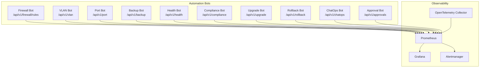
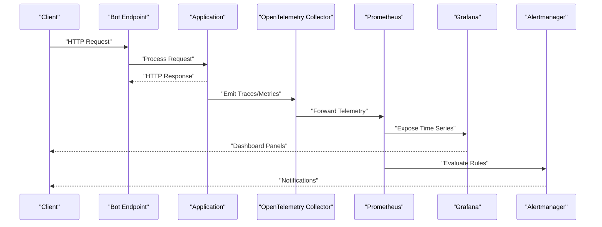
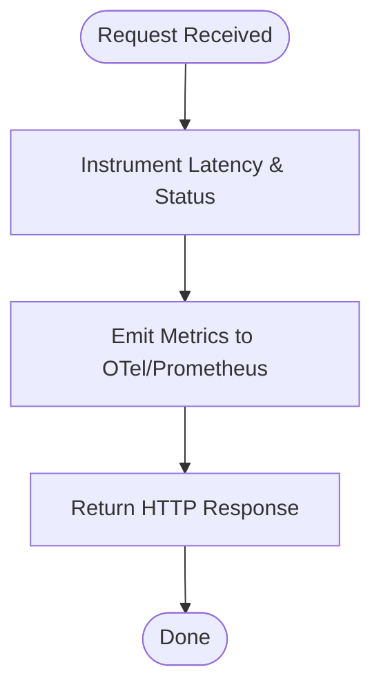
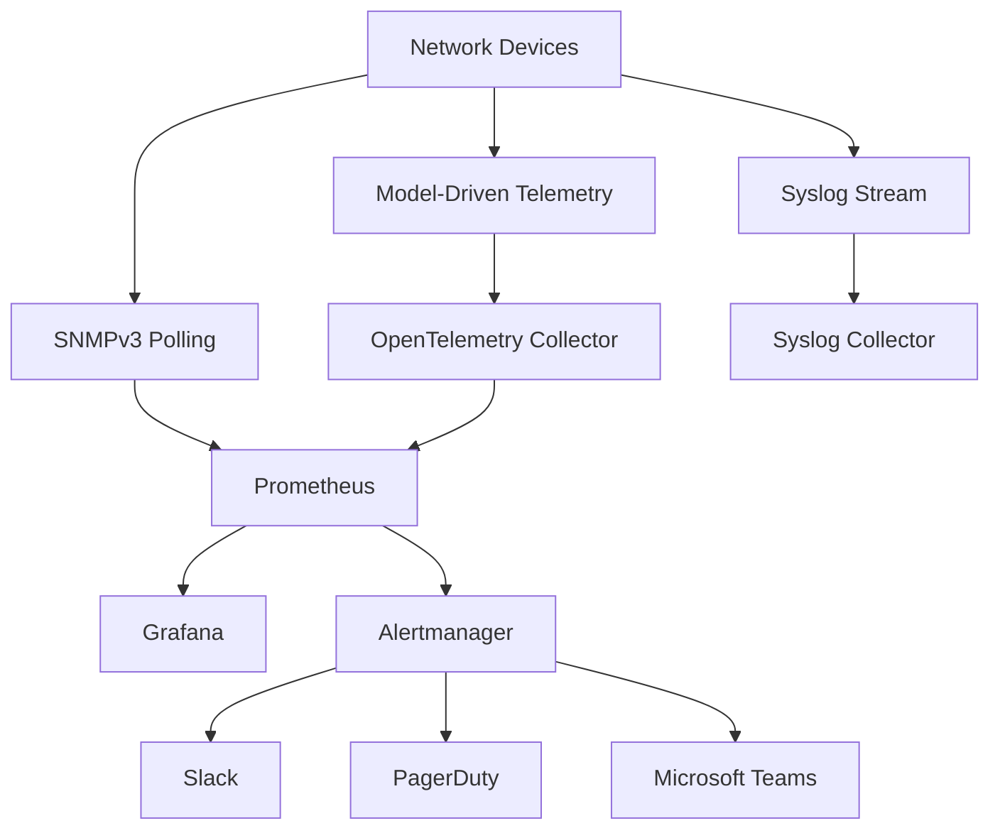
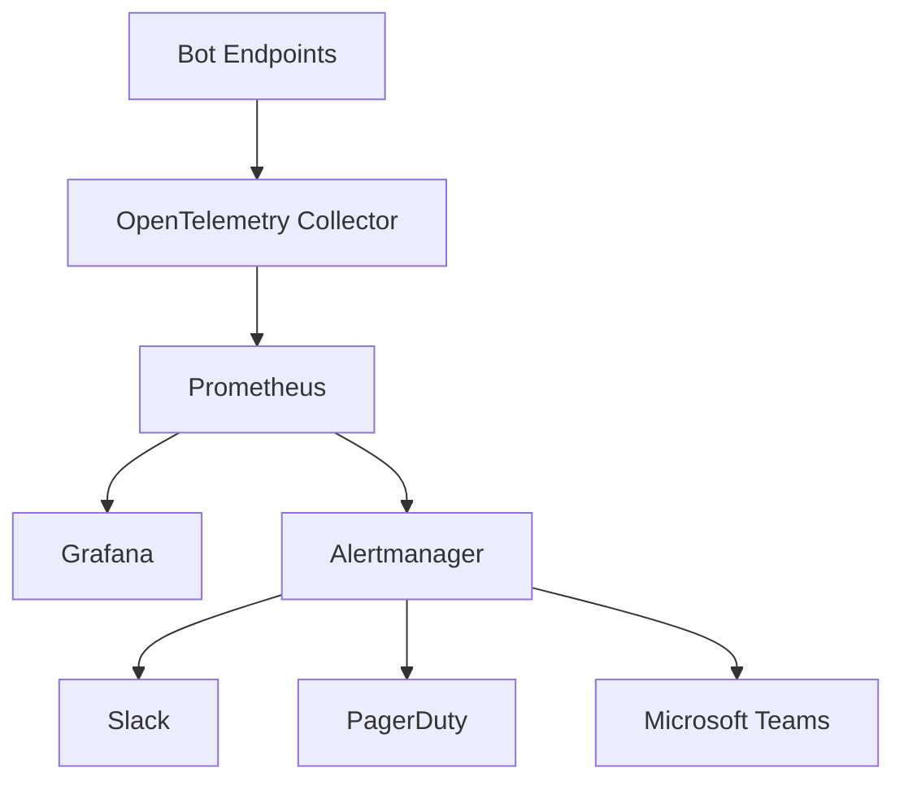

# API Performance Dashboard

<cite>
**Referenced Files in This Document**
- [README.md](file://README.md)
</cite>

## Table of Contents
1. [Introduction](#introduction)
2. [Project Structure](#project-structure)
3. [Core Components](#core-components)
4. [Architecture Overview](#architecture-overview)
5. [Detailed Component Analysis](#detailed-component-analysis)
6. [Dependency Analysis](#dependency-analysis)
7. [Performance Considerations](#performance-considerations)
8. [Troubleshooting Guide](#troubleshooting-guide)
9. [Conclusion](#conclusion)
10. [Appendices](#appendices)

## Introduction
This document describes the API Performance dashboard for monitoring bot endpoints across the Enterprise Network Automation Platform. It focuses on latency, error rates, throughput, and request volume analysis, with guidance for establishing baselines, detecting anomalies, and alerting on degradation. The platform’s automation bots expose REST APIs that are observed via Prometheus and Grafana, with OpenTelemetry integration for distributed tracing and performance profiling.

## Project Structure
The repository is a modular, Git-driven platform with dedicated sections for monitoring and observability. The README outlines an “API Performance” dashboard among others, indicating that bot endpoint metrics (latency, errors, throughput) are collected and visualized.

**Diagram sources**
- [README.md:460-476](file://README.md#L460-L476)
- [README.md:583-604](file://README.md#L583-L604)

**Section sources**
- [README.md:460-476](file://README.md#L460-L476)
- [README.md:583-604](file://README.md#L583-L604)

## Core Components
- Bot Endpoints: Each bot exposes REST endpoints used by operators and systems. These endpoints generate request/response telemetry suitable for latency, error rate, and throughput measurement.
- Metrics Pipeline: Prometheus scrapes application metrics; OpenTelemetry Collector forwards traces/metrics to Prometheus.
- Visualization: Grafana hosts dashboards including the “API Performance” view for real-time insights.
- Alerting: Alertmanager routes alerts to Slack, PagerDuty, and Teams based on thresholds.

Key performance indicators (KPIs) for the dashboard:
- Response time percentiles: p50, p95, p99
- Error categorization by HTTP status codes (e.g., 4xx vs 5xx)
- Throughput: requests per second (RPS)
- Request volume: total requests over time windows
- Concurrent requests: active/in-flight requests at any moment

**Section sources**
- [README.md:460-476](file://README.md#L460-L476)
- [README.md:583-604](file://README.md#L583-L604)
- [README.md:606-616](file://README.md#L606-L616)

## Architecture Overview
The API Performance dashboard integrates bot endpoints, metrics collection, visualization, and alerting.

**Diagram sources**
- [README.md:583-604](file://README.md#L583-L604)
- [README.md:606-616](file://README.md#L606-L616)

## Detailed Component Analysis

### Bot Endpoints and Metrics Emission
- Endpoints: The bots expose REST endpoints such as /api/v1/firewall/rules, /api/v1/vlan, /api/v1/port, /api/v1/backup, /api/v1/health, /api/v1/compliance, /api/v1/upgrade, /api/v1/rollback, /api/v1/chatops, and /api/v1/approvals.
- Metrics emission: Application code should instrument these endpoints to record:
  - Latency histograms or summary buckets for p50/p95/p99
  - Counter metrics for total requests and errors by HTTP status class
  - Gauge metrics for concurrent requests
  - Labels for bot name, endpoint path, method, and region

[No sources needed since this diagram shows conceptual workflow, not actual code structure]

**Section sources**
- [README.md:460-476](file://README.md#L460-L476)

### Observability Stack Integration
- Data sources: SNMPv3 polling, model-driven telemetry, and syslog feed into Prometheus and OpenTelemetry Collector.
- Visualization: Grafana dashboards include “API Performance” for bot endpoints.
- Alerting: Alertmanager sends notifications to Slack, PagerDuty, and Teams.

**Diagram sources**
- [README.md:583-604](file://README.md#L583-L604)

**Section sources**
- [README.md:583-604](file://README.md#L583-L604)
- [README.md:606-616](file://README.md#L606-L616)

### Grafana Panel Configurations
Recommended panels for the “API Performance” dashboard:
- Latency Percentiles
  - Metrics: histogram_quantile(0.50), histogram_quantile(0.95), histogram_quantile(0.99) over bot endpoint latency
  - Group by: bot, endpoint, method, region
  - Units: milliseconds
- Error Rate
  - Metrics: sum(rate(http_requests_total{status=~"5.."})) and sum(rate(http_requests_total{status=~"4.."}))
  - Group by: bot, endpoint, status_class
  - Units: requests per second
- Throughput
  - Metrics: sum(rate(http_requests_total))
  - Group by: bot, endpoint, method
  - Units: requests per second
- Request Volume
  - Metrics: sum(increase(http_requests_total))
  - Group by: bot, endpoint, day/hour
  - Units: count
- Concurrent Requests
  - Metrics: gauge for in-flight requests
  - Group by: bot, endpoint
  - Units: count

[No sources needed since this section provides general guidance]

### Load Testing Results Correlation
- Use load testing tools (e.g., locust) to simulate realistic traffic patterns against bot endpoints.
- Correlate test runs with dashboard panels to validate:
  - Target p95/p99 latency under expected concurrency
  - Error rate stability under peak load
  - Throughput saturation points
- Record baseline results and compare post-deployment to detect regressions.

[No sources needed since this section provides general guidance]

### Capacity Planning Insights
- Track trends in:
  - Average and tail latencies
  - Error rates by category
  - Sustained throughput
  - Peak concurrent requests
- Use capacity planning to:
  - Right-size bot instances
  - Plan autoscaling policies
  - Identify bottlenecks in downstream dependencies (device reachability, timeouts)

[No sources needed since this section provides general guidance]

### Distributed Tracing and Profiling
- Integrate OpenTelemetry Collector to forward traces and metrics from bot applications.
- Use trace IDs to correlate latency spikes with specific request flows.
- Profile hot paths using sampling-based profilers to identify CPU/memory hotspots.

[No sources needed since this section provides general guidance]

## Dependency Analysis
The API Performance dashboard depends on:
- Bot endpoints emitting metrics and traces
- OpenTelemetry Collector forwarding telemetry
- Prometheus scraping and storing metrics
- Grafana querying Prometheus for visualization
- Alertmanager evaluating rules and notifying channels

**Diagram sources**
- [README.md:583-604](file://README.md#L583-L604)

**Section sources**
- [README.md:583-604](file://README.md#L583-L604)

## Performance Considerations
- Instrumentation overhead: Use efficient histograms and avoid excessive labels to keep cardinality manageable.
- Sampling: Apply appropriate sampling for traces to reduce storage costs while retaining visibility.
- Retention: Align Prometheus retention with SLO requirements and cost constraints.
- Label hygiene: Keep labels stable and bounded (bot, endpoint, method, region).
- Backpressure: Monitor concurrent requests and queue depths to prevent overload.

[No sources needed since this section provides general guidance]

## Troubleshooting Guide
Common issues and resolutions:
- High latency spikes
  - Check p95/p99 latency panels for affected endpoints
  - Correlate with trace spans to identify slow downstream calls
  - Review device connectivity and timeout settings
- Elevated error rates
  - Inspect 4xx vs 5xx breakdown
  - Validate authentication and authorization flows
  - Confirm downstream service health
- Throughput drops
  - Analyze RPS and concurrent request gauges
  - Verify autoscaling events and resource utilization
- Missing metrics/traces
  - Ensure OTel collector is reachable and configured
  - Confirm Prometheus scrape targets are healthy
  - Validate instrumentation in bot endpoints

[No sources needed since this section provides general guidance]

## Conclusion
The API Performance dashboard provides comprehensive visibility into bot endpoint behavior, enabling teams to monitor latency percentiles, error categories, throughput, and request volumes. By integrating Prometheus, Grafana, and OpenTelemetry, the platform supports real-time visualization, load testing correlation, capacity planning, and proactive alerting to maintain high availability and performance.

[No sources needed since this section summarizes without analyzing specific files]

## Appendices

### KPI Definitions and Thresholds
- Response Time Percentiles
  - p50: median latency target
  - p95: upper-bound latency target
  - p99: tail latency target
- Error Rates
  - 5xx threshold: critical
  - 4xx threshold: warning
- Throughput
  - Minimum sustained RPS target
- Concurrent Requests
  - Max concurrent threshold before scaling triggers

[No sources needed since this section provides general guidance]

### Alerting Rules Examples
- Latency SLO Violation
  - Condition: p95 latency > target for 5 minutes
  - Severity: warning/critical depending on duration
- Error Rate Spike
  - Condition: 5xx rate > threshold for 5 minutes
  - Severity: critical
- Throughput Degradation
  - Condition: RPS < minimum sustained for 10 minutes
  - Severity: warning
- Excessive Concurrency
  - Condition: In-flight requests > max threshold for 5 minutes
  - Severity: warning

[No sources needed since this section provides general guidance]