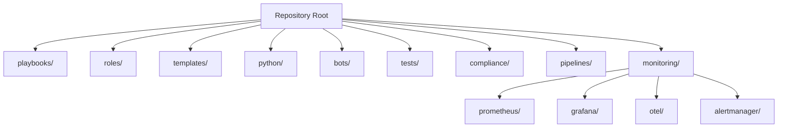
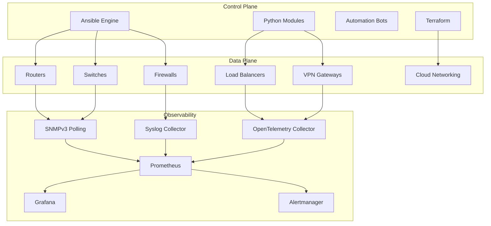
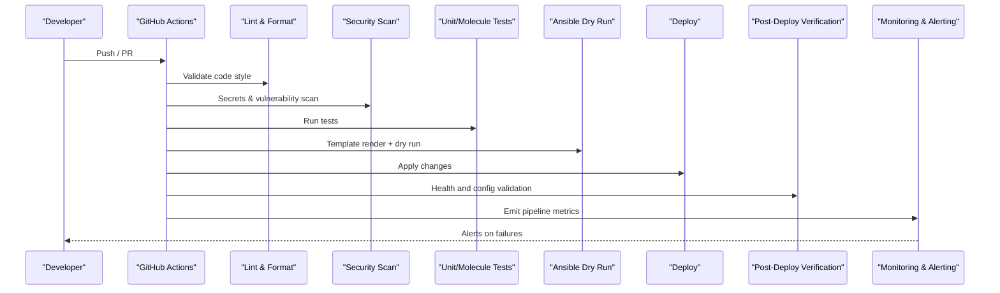
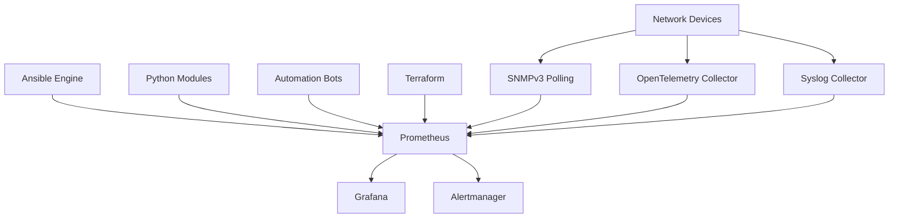

# Automation Metrics Dashboard

<cite>
**Referenced Files in This Document**
- [README.md](file://README.md)
</cite>

## Table of Contents
1. [Introduction](#introduction)
2. [Project Structure](#project-structure)
3. [Core Components](#core-components)
4. [Architecture Overview](#architecture-overview)
5. [Detailed Component Analysis](#detailed-component-analysis)
6. [Dependency Analysis](#dependency-analysis)
7. [Performance Considerations](#performance-considerations)
8. [Troubleshooting Guide](#troubleshooting-guide)
9. [Conclusion](#conclusion)
10. [Appendices](#appendices)

## Introduction
This document defines the Automation Metrics dashboard for the Enterprise Network Automation Platform. It focuses on:
- Job success/failure rates
- Execution time tracking
- Drift count monitoring
- Automation pipeline performance
- Playbook execution duration and task completion rates
- Error categorization and resource utilization during automation runs
- Grafana panel layouts for efficiency trends, failure analysis, and bottleneck identification
- Integration with CI/CD metrics, Ansible execution logs correlation, and custom metric collection from Python automation modules
- Alerting configuration examples for failures and performance degradation

The platform’s observability stack includes Prometheus, Grafana, OpenTelemetry, and Alertmanager, with dashboards defined as code.

**Section sources**
- [README.md:583-618](file://README.md#L583-L618)

## Project Structure
The repository organizes automation, testing, compliance, pipelines, and monitoring under a clear layout. Monitoring configurations are stored under monitoring/prometheus, monitoring/grafana, monitoring/otel, and monitoring/alertmanager. The Automation Metrics dashboard is one of the listed dashboards.

**Diagram sources**
- [README.md:103-180](file://README.md#L103-L180)

**Section sources**
- [README.md:103-180](file://README.md#L103-L180)

## Core Components
- Automation Engine: Ansible, Python modules, bots, and Terraform orchestrate device and cloud operations.
- Observability: Prometheus scrapes metrics; OpenTelemetry Collector normalizes telemetry; Syslog collector ingests logs; Grafana visualizes; Alertmanager routes alerts.
- Dashboards: Includes an “Automation Metrics” dashboard covering job success/failure rates, execution time, and drift count.

Key responsibilities:
- Collect automation metrics (job outcomes, durations, drift counts).
- Correlate CI/CD pipeline results with automation run outcomes.
- Provide Grafana panels to analyze efficiency, failures, and bottlenecks.
- Support alerting on failures and performance regressions.

**Section sources**
- [README.md:52-99](file://README.md#L52-L99)
- [README.md:583-618](file://README.md#L583-L618)

## Architecture Overview
The end-to-end flow for automation metrics:
- Control plane components (Ansible, Python, Bots, Terraform) execute automation tasks against devices and cloud resources.
- Telemetry and logs are collected via SNMP, model-driven telemetry, and syslog.
- OpenTelemetry Collector and Prometheus normalize and store metrics.
- Grafana provides dashboards including Automation Metrics.
- Alertmanager triggers notifications on thresholds.

**Diagram sources**
- [README.md:52-99](file://README.md#L52-L99)
- [README.md:583-604](file://README.md#L583-L604)

## Detailed Component Analysis

### Automation Metrics Data Model
This section outlines the key metrics and dimensions used by the Automation Metrics dashboard. These align with the platform’s automation engine and observability architecture.

- Job Outcomes
  - job_status{job_id, playbook, role, target_group, environment}
  - job_result{success|failure|skipped|error}
  - job_error_category{connection|authentication|syntax|validation|timeout|resource_unavailable|other}
- Execution Time
  - playbook_duration_seconds{playbook, target_group, environment}
  - task_duration_seconds{task_name, role, target_group, environment}
  - total_tasks{count per job}
  - completed_tasks{count per job}
  - failed_tasks{count per job}
  - skipped_tasks{count per job}
- Drift Count
  - drift_count{device_group, region, site, baseline_version}
  - drift_severity{critical|high|medium|low}
- Resource Utilization During Runs
  - runner_cpu_percent{runner_id, environment}
  - runner_memory_bytes{runner_id, environment}
  - io_wait_percent{runner_id, environment}
  - network_latency_ms{target_device, protocol}
- Pipeline Integration
  - ci_pipeline_duration_seconds{workflow, branch, commit_sha}
  - ci_job_status{step, status}
  - correlation_id{links CI job to automation job}

Panel Layout Recommendations
- Efficiency Trends
  - Panel: Playbook Duration Trend (histogram or line over time)
  - Panel: Task Completion Rate (percentage of completed vs total tasks)
  - Panel: Automation Throughput (jobs per hour/day)
- Failure Rate Analysis
  - Panel: Job Success/Failure Rate (stacked area or bar)
  - Panel: Error Category Distribution (pie or horizontal bar)
  - Panel: Top Failing Playbooks/Roles (table)
- Bottleneck Identification
  - Panel: Slowest Tasks (top N by duration)
  - Panel: Runner Resource Saturation (CPU/memory over time)
  - Panel: Target Device Latency Heatmap (by vendor/platform)
- Drift Monitoring
  - Panel: Drift Count Over Time (line chart)
  - Panel: Drift by Severity (stacked bar)
  - Panel: Drift Hotspots (devices/groups with highest drift)

[No sources needed since this section describes conceptual panel design]

### CI/CD Pipeline Metrics Integration
The CI/CD pipeline stages include linting, schema validation, security scanning, unit tests, Molecule role tests, template rendering validation, compliance checks, dry runs, approval gates, deployment, post-deploy verification, documentation generation, release, artifacts publishing, and rollback on failure.

**Diagram sources**
- [README.md:479-515](file://README.md#L479-L515)

**Section sources**
- [README.md:479-515](file://README.md#L479-L515)

### Ansible Execution Logs Correlation
- Use correlation IDs to link CI jobs to automation runs.
- Tag logs with playbook name, role, target group, environment, and commit SHA.
- Store structured logs alongside metrics for drill-down from Grafana to log entries.
- Map error categories to Ansible event types (e.g., connection errors, authentication failures, syntax issues).

[No sources needed since this section provides general guidance]

### Custom Metric Collection from Python Automation Modules
- Instrument Python modules to emit Prometheus-compatible metrics for:
  - Operation counters (success/failure)
  - Durations (latency histograms)
  - Resource usage (CPU/memory)
  - Business KPIs (drift counts, validation results)
- Ensure consistent labels (environment, target_group, region, site, vendor, platform).
- Expose metrics endpoints or push to a sidecar exporter if required.

[No sources needed since this section provides general guidance]

### Alerting Configuration Examples
Define alerts for:
- High failure rate: job_result=failure exceeds threshold over a window.
- Performance degradation: playbook_duration_seconds p95 exceeds SLO.
- Drift spikes: drift_count increases beyond baseline.
- Resource saturation: runner CPU/memory above thresholds.
- CI/CD regression: ci_job_status=failed or ci_pipeline_duration_seconds exceeds SLA.

Routing:
- Alertmanager routes to Slack, PagerDuty, and Teams based on severity and team ownership.

[No sources needed since this section provides general guidance]

## Dependency Analysis
The following diagram shows how automation components depend on observability services and how metrics flow into Grafana and Alertmanager.

**Diagram sources**
- [README.md:52-99](file://README.md#L52-L99)
- [README.md:583-604](file://README.md#L583-L604)

**Section sources**
- [README.md:52-99](file://README.md#L52-L99)
- [README.md:583-604](file://README.md#L583-L604)

## Performance Considerations
- Sampling and Retention
  - Adjust scrape intervals and retention policies to balance cost and visibility.
- Label Cardinality
  - Keep label cardinality low to avoid high memory usage in Prometheus.
- Aggregation Windows
  - Use appropriate windows for SLO calculations (e.g., 5m, 1h, 24h).
- Exporter Efficiency
  - Prefer client-side instrumentation in Python modules to reduce overhead.
- Log Correlation
  - Use structured logging and correlation IDs to minimize query latency in dashboards.

[No sources needed since this section provides general guidance]

## Troubleshooting Guide
Common issues and resolutions:
- Ansible connection timeout
  - Verify SSH reachability using inventory ping.
- Template rendering error
  - Check Jinja2 syntax and debug output from config generation.
- Compliance check failure
  - Review compliance policies and device running config diffs.
- CI pipeline failure
  - Inspect GitHub Actions logs for actionable error messages.
- Vault authentication failure
  - Verify OIDC token or AppRole credentials and Vault policies.
- Molecule test failure
  - Ensure Docker/Podman is running and check molecule configuration.
- Batfish analysis error
  - Validate snapshots and configuration inputs.

**Section sources**
- [README.md:674-685](file://README.md#L674-L685)

## Conclusion
The Automation Metrics dashboard integrates automation execution data, CI/CD pipeline metrics, and device telemetry to provide comprehensive insights into automation efficiency, reliability, and performance. By standardizing metrics, correlating logs, and configuring targeted alerts, teams can proactively manage automation health and continuously improve operational outcomes.

[No sources needed since this section summarizes without analyzing specific files]

## Appendices

### Appendix A: Key Playbooks and Operations
- Operations playbooks include backup, restore, firmware upgrade/rollback, golden config, drift detection, compliance scan, health check, inventory collection, neighbor discovery, license validation, and monitoring agents.

**Section sources**
- [README.md:418-435](file://README.md#L418-L435)

### Appendix B: Python Modules Overview
- Reusable modules cover inventory, NETCONF, RESTCONF, SSH, SNMP, telemetry, config generation, validation, backup, compliance, and utilities.

**Section sources**
- [README.md:438-456](file://README.md#L438-L456)

### Appendix C: Monitoring Stack and Dashboards
- Monitoring architecture includes SNMP polling, model-driven telemetry, syslog collection, Prometheus, OpenTelemetry Collector, Grafana, and Alertmanager.
- Dashboards include Network Health, Automation Metrics, Compliance Overview, Upgrade Tracker, API Performance, and Inventory Drift.

**Section sources**
- [README.md:583-618](file://README.md#L583-L618)