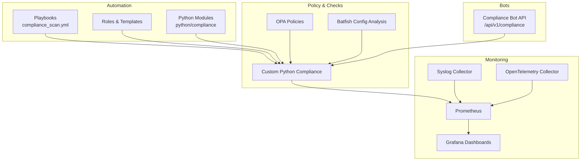
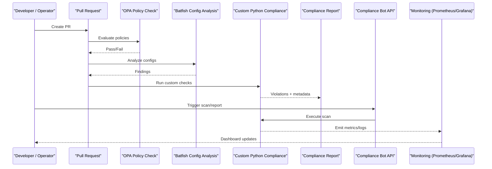
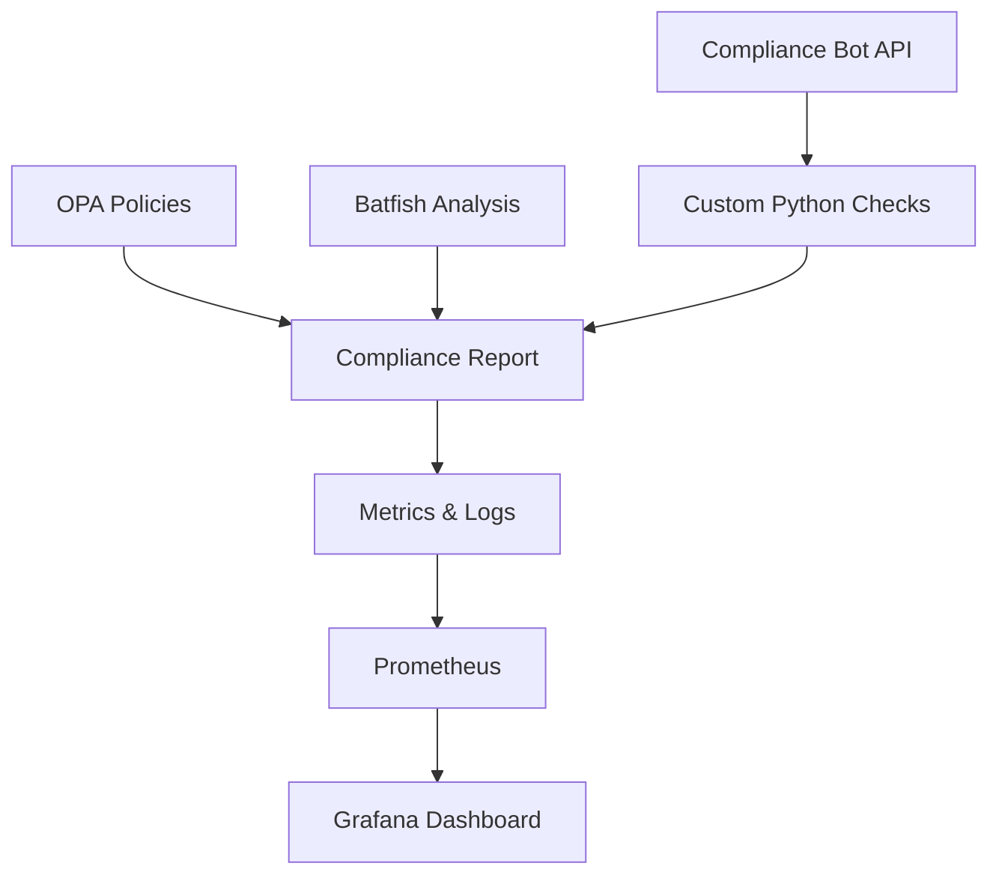

# Compliance Overview Dashboard

<cite>
**Referenced Files in This Document**
- [README.md](file://README.md)
</cite>

## Table of Contents
1. [Introduction](#introduction)
2. [Project Structure](#project-structure)
3. [Core Components](#core-components)
4. [Architecture Overview](#architecture-overview)
5. [Detailed Component Analysis](#detailed-component-analysis)
6. [Dependency Analysis](#dependency-analysis)
7. [Performance Considerations](#performance-considerations)
8. [Troubleshooting Guide](#troubleshooting-guide)
9. [Conclusion](#conclusion)
10. [Appendices](#appendices)

## Introduction
This document describes the Compliance Overview dashboard, which visualizes policy violations by severity levels (critical, high, medium, low), trend analysis over time, compliance score calculations, and remediation tracking. It also covers how to configure dashboards for adherence percentages, violation hotspots, and improvement trends; how it integrates with the compliance engine results, automated policy checks, and audit trail visualization; and provides examples of scoring algorithms, alerting thresholds, and drill-down capabilities for investigating specific violations.

The platform’s documentation defines a “Compliance Overview” dashboard purpose and shows how compliance is enforced across CI/CD and runtime via OPA policies, Batfish configuration analysis, and custom Python compliance checks. The dashboard aggregates these outputs to present actionable insights for operators and auditors.

**Section sources**
- [README.md:548-582](file://README.md#L548-L582)
- [README.md:606-616](file://README.md#L606-L616)

## Project Structure
The repository organizes automation, testing, compliance, monitoring, and bots under clearly named directories. The Compliance Overview dashboard consumes data from multiple layers:
- Compliance engine outputs (OPA, Batfish, custom Python checks)
- Automation playbooks that run scans and collect device state
- Monitoring stack (Prometheus, Grafana, OpenTelemetry) for time-series and logs
- Bots exposing APIs for on-demand scans and reporting

[No sources needed since this diagram shows conceptual workflow, not actual code structure]

## Core Components
- Compliance Policy Catalog: A set of policies mapped to severity levels (critical, high, medium, low). Examples include SSH-only enforcement, NTP configuration, AAA enablement, SNMPv3 usage, logging, approved ciphers/firmware, password policy, ACL standards, firewall rules, and unused object detection.
- Compliance Flow: Pull request–driven checks using OPA policy evaluation, followed by Batfish configuration analysis and custom Python compliance checks, culminating in a report used by the dashboard.
- Monitoring Stack: Devices poll via SNMPv3, telemetry streaming, and syslog streams into Prometheus and OpenTelemetry, then surfaced in Grafana dashboards including the Compliance Overview.
- Automation Bots: The Compliance Bot exposes an API endpoint to trigger scans and retrieve reports, enabling interactive investigation and drill-downs.

Key responsibilities:
- Ingest and normalize violation data from multiple sources
- Aggregate counts by severity and group (device groups, environments)
- Compute compliance scores and track trends over time
- Surface remediation status and audit trails

**Section sources**
- [README.md:552-582](file://README.md#L552-L582)
- [README.md:583-616](file://README.md#L583-L616)
- [README.md:460-476](file://README.md#L460-L476)

## Architecture Overview
The Compliance Overview dashboard integrates with the compliance pipeline and observability stack to provide real-time and historical views of compliance posture.

**Diagram sources**
- [README.md:568-582](file://README.md#L568-L582)
- [README.md:583-616](file://README.md#L583-L616)
- [README.md:460-476](file://README.md#L460-L476)

## Detailed Component Analysis

### Severity-Based Violation Visualization
- Dimensions:
  - Severity levels: critical, high, medium, low
  - Device groups: core routers, distribution/access switches, firewalls, WAN edge, VPN gateways, load balancers, wireless controllers
  - Environments: production, staging, lab, disaster recovery
- Visualizations:
  - Stacked bar or pie charts showing violation counts per severity
  - Heatmaps highlighting hotspots by device group and environment
  - Trend lines showing total violations over time
- Data sources:
  - Compliance reports generated after OPA/Batfish/custom checks
  - Metrics emitted to Prometheus and logs forwarded to collectors

Configuration tips:
- Use filters for environment and device group to isolate hotspots
- Apply time-range selectors to compare pre/post remediation periods
- Enable drill-down to list affected devices and specific policy references

**Section sources**
- [README.md:552-566](file://README.md#L552-L566)
- [README.md:284-335](file://README.md#L284-L335)
- [README.md:606-616](file://README.md#L606-L616)

### Trend Analysis Over Time
- Purpose: Track improvements or regressions in compliance posture across days/weeks/months
- Metrics:
  - Total violations by severity over time
  - New vs resolved violations
  - Mean time to remediate (MTTR) per severity
- Sources:
  - Time-series metrics in Prometheus
  - Audit logs from compliance runs and bot invocations
- Visualization:
  - Multi-line charts with severity breakdown
  - Cumulative compliance score trend

**Section sources**
- [README.md:583-616](file://README.md#L583-L616)

### Compliance Score Calculations
- Conceptual algorithm example:
  - Weighted sum of violations by severity: e.g., critical=10, high=5, medium=2, low=1
  - Normalize by total number of applicable checks to produce a percentage
  - Adjust for recency: recent violations may carry higher weight
- Inputs:
  - Violation counts per severity
  - Applicable check inventory per device group/environment
- Outputs:
  - Overall compliance score (percentage)
  - Sub-scores by device group and environment
- Integration:
  - Scores computed from compliance reports and persisted as metrics for trending

Note: Implement details are not provided in the repository; use the conceptual formula above to guide implementation.

**Section sources**
- [README.md:552-566](file://README.md#L552-L566)
- [README.md:606-616](file://README.md#L606-L616)

### Remediation Tracking
- Statuses: open, in-progress, resolved, closed
- Fields:
  - Violation ID, policy reference, severity, device/group, environment
  - Assigned owner, due date, last updated timestamp
  - Evidence links (diffs, logs, snapshots)
- Workflow:
  - Auto-create tickets from critical/high violations
  - Link remediation actions to Git commits/playbooks
  - Update dashboard when resolution is verified by post-deploy verification

**Section sources**
- [README.md:479-514](file://README.md#L479-L514)
- [README.md:606-616](file://README.md#L606-L616)

### Dashboard Configurations
- Adherence Percentages:
  - Show % compliant per device group and environment
  - Filter by severity threshold (e.g., show only critical/high)
- Violation Hotspots:
  - Map violations to device groups/environments
  - Highlight top offenders and recurring patterns
- Improvement Trends:
  - Compare current period vs previous period
  - Annotate major changes (policy updates, firmware upgrades)

**Section sources**
- [README.md:606-616](file://README.md#L606-L616)

### Integration With Compliance Engine Results
- Pipeline integration:
  - OPA policy checks block merges on failures
  - Batfish config analysis identifies risky configurations
  - Custom Python compliance checks validate device-specific baselines
- Output consumption:
  - Reports feed metrics and logs into monitoring stack
  - Compliance Bot API triggers ad-hoc scans and returns structured results

**Section sources**
- [README.md:568-582](file://README.md#L568-L582)
- [README.md:460-476](file://README.md#L460-L476)

### Automated Policy Check Outputs
- Playbook-driven scans:
  - Use compliance scan playbook against target inventories
  - Generate reports consumed by the dashboard
- Scheduling:
  - Daily scheduled compliance scans ensure up-to-date metrics

**Section sources**
- [README.md:420-435](file://README.md#L420-L435)
- [README.md:503-514](file://README.md#L503-L514)

### Audit Trail Visualization
- What to visualize:
  - Who triggered scans (bots, users)
  - When scans ran and their outcomes
  - Changes to policies and templates leading to new violations
- Where data comes from:
  - Logs from compliance runs and bot endpoints
  - Git history for policy/template changes
  - Post-deploy verification results

**Section sources**
- [README.md:583-616](file://README.md#L583-L616)
- [README.md:479-514](file://README.md#L479-L514)

### Alerting Thresholds
- Example thresholds:
  - Critical violations > 0 → immediate alert
  - High violations > threshold per environment → alert
  - Compliance score below target → alert
- Channels:
  - Slack, Microsoft Teams, PagerDuty via Alertmanager

**Section sources**
- [README.md:583-616](file://README.md#L583-L616)

### Drill-Down Capabilities
- From dashboard to specifics:
  - Click a severity slice to see affected devices
  - Expand a device to view violated policies and diffs
  - Navigate to related logs and snapshots for context
- Actions:
  - One-click remediation via bots or playbooks
  - Link to change requests and approvals

**Section sources**
- [README.md:460-476](file://README.md#L460-L476)
- [README.md:606-616](file://README.md#L606-L616)

## Dependency Analysis
The Compliance Overview dashboard depends on:
- Compliance engine outputs (OPA, Batfish, custom checks)
- Automation playbooks and roles
- Monitoring stack (Prometheus, Grafana, OpenTelemetry, Syslog)
- Compliance Bot API for on-demand operations

**Diagram sources**
- [README.md:568-582](file://README.md#L568-L582)
- [README.md:583-616](file://README.md#L583-L616)
- [README.md:460-476](file://README.md#L460-L476)

**Section sources**
- [README.md:568-582](file://README.md#L568-L582)
- [README.md:583-616](file://README.md#L583-L616)
- [README.md:460-476](file://README.md#L460-L476)

## Performance Considerations
- Batch scanning:
  - Group devices by environment and role to reduce connection overhead
- Caching:
  - Cache compliance reports between scheduled runs to avoid redundant work
- Incremental checks:
  - Focus on changed devices/templates to speed up scans
- Metric aggregation:
  - Pre-aggregate violation counts by severity and group at ingestion time

[No sources needed since this section provides general guidance]

## Troubleshooting Guide
Common issues and resolutions:
- Ansible connection timeout: Verify SSH reachability and credentials
- Template rendering error: Validate Jinja2 syntax and variables
- Compliance check failure: Review policy definitions and device running config diffs
- CI pipeline failure: Inspect GitHub Actions logs for actionable errors
- Vault authentication failure: Confirm OIDC token or AppRole credentials and policies
- Molecule test failure: Ensure container runtime is available and configured
- Batfish analysis error: Validate snapshots and model compatibility

**Section sources**
- [README.md:674-685](file://README.md#L674-L685)

## Conclusion
The Compliance Overview dashboard consolidates multi-source compliance data into actionable insights, enabling teams to monitor violations by severity, track trends, compute compliance scores, and manage remediation workflows. By integrating OPA policies, Batfish analysis, custom checks, and robust monitoring, the platform ensures continuous compliance enforcement and visibility across diverse device groups and environments.

[No sources needed since this section summarizes without analyzing specific files]

## Appendices

### Example Scoring Algorithm (Conceptual)
- Inputs:
  - Vc: count of critical violations
  - Vh: count of high violations
  - Vm: count of medium violations
  - Vl: count of low violations
  - N: total applicable checks
- Formula:
  - Score = 100 − ((Vc × Wc + Vh × Wh + Vm × Wm + Vl × Wl) / N × 100)
  - Weights: Wc > Wh > Wm > Wl (e.g., 10, 5, 2, 1)
- Output:
  - Percentage-based compliance score with optional recency weighting

[No sources needed since this section provides conceptual guidance]

### Alerting Thresholds (Examples)
- Immediate alert if any critical violations exist
- Warning if high violations exceed a defined threshold per environment
- Escalation if compliance score drops below a target for consecutive periods

[No sources needed since this section provides conceptual guidance]