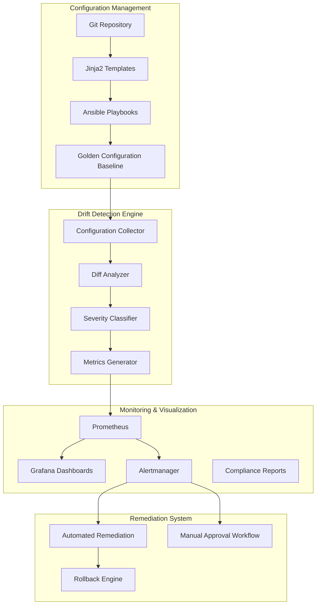
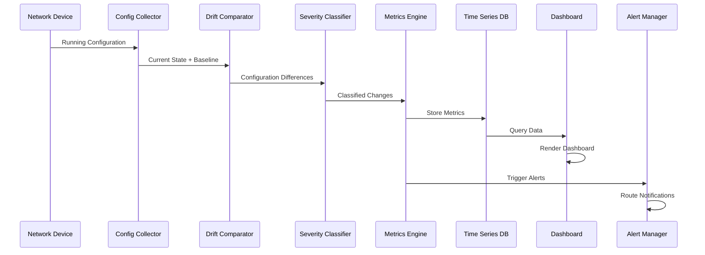
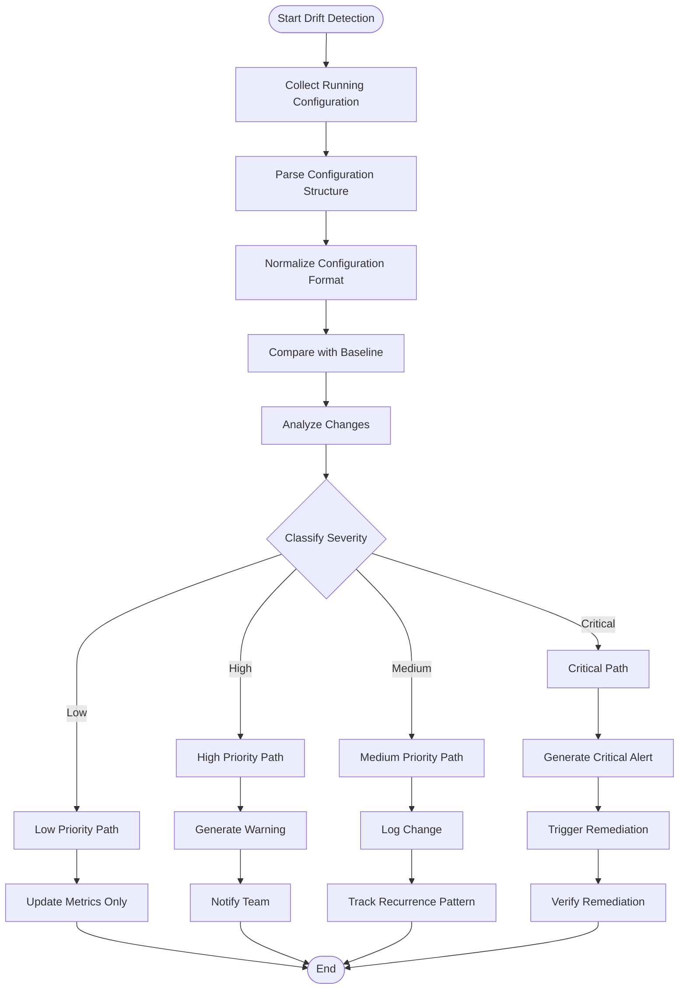
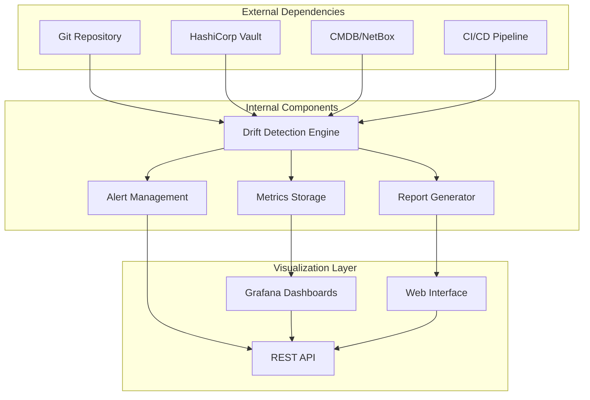

# Inventory Drift Dashboard

<cite>
**Referenced Files in This Document**
- [README.md](file://README.md)
</cite>

## Table of Contents
1. [Introduction](#introduction)
2. [Project Structure](#project-structure)
3. [Core Components](#core-components)
4. [Architecture Overview](#architecture-overview)
5. [Detailed Component Analysis](#detailed-component-analysis)
6. [Dependency Analysis](#dependency-analysis)
7. [Performance Considerations](#performance-considerations)
8. [Troubleshooting Guide](#troubleshooting-guide)
9. [Conclusion](#conclusion)
10. [Appendices](#appendices)

## Introduction

The Inventory Drift Dashboard is a critical component of the Enterprise Network Automation Platform that monitors and visualizes configuration drift between Git repository state and running device configurations. This dashboard provides comprehensive visibility into configuration compliance, unauthorized changes, and remediation effectiveness across thousands of network devices in multi-vendor, multi-region environments.

The platform implements a GitOps-driven approach where all network configurations are stored as code in Git repositories, enabling automated drift detection, compliance enforcement, and continuous monitoring of configuration integrity across the entire network infrastructure.

## Project Structure

The Enterprise Network Automation Platform follows a modular architecture designed for enterprise-scale network management:



**Diagram sources**
- [README.md:34-100](file://README.md#L34-L100)
- [README.md:583-618](file://README.md#L583-L618)

**Section sources**
- [README.md:103-180](file://README.md#L103-L180)

## Core Components

### Drift Detection Architecture

The drift detection system operates through multiple interconnected components:

#### Configuration Collection Layer
- **Multi-Protocol Support**: SSH, NETCONF, RESTCONF, SNMPv3, and model-driven telemetry
- **Vendor-Agnostic Abstraction**: Unified interface across Cisco, Juniper, Arista, Palo Alto, Fortinet, and other vendors
- **Incremental Collection**: Efficient polling strategies to minimize network overhead

#### Comparison Engine
- **Baseline Comparison**: Real-time comparison against golden configuration baselines
- **Semantic Diffing**: Intelligent diff algorithms that understand network configuration semantics
- **Change Classification**: Automated categorization of configuration changes by type and impact

#### Severity Classification System
- **Policy-Based Scoring**: Multi-dimensional severity assessment based on security, compliance, and business impact
- **Context-Aware Analysis**: Considers device role, environment, and business criticality
- **Dynamic Thresholds**: Adaptive severity levels based on organizational policies

#### Metrics and Analytics
- **Real-Time Monitoring**: Continuous drift counting and trend analysis
- **Historical Analysis**: Long-term drift pattern identification and recurrence tracking
- **Predictive Analytics**: Early warning systems for potential configuration issues

**Section sources**
- [README.md:438-456](file://README.md#L438-L456)
- [README.md:517-545](file://README.md#L517-L545)

## Architecture Overview

The Inventory Drift Dashboard integrates seamlessly with the broader observability and automation ecosystem:



**Diagram sources**
- [README.md:583-604](file://README.md#L583-L604)

### Key Integration Points

#### Configuration Management Systems
- **Ansible Integration**: Direct playbook execution for drift remediation
- **Terraform Compatibility**: Infrastructure-as-code alignment verification
- **CMDB Synchronization**: Single Source of Truth (SSoT) integration with NetBox/Nautobot

#### Automated Detection Engines
- **Golden Configuration Testing**: Custom Python-based comparison against approved baselines
- **Batfish Integration**: Advanced network behavior analysis and policy validation
- **Compliance Engine**: Pluggable rule sets for organizational policy enforcement

#### Remediation Workflows
- **Automated Remediation**: Self-healing playbooks for common drift scenarios
- **Approval Workflows**: Change advisory board (CAB) integration for production changes
- **Rollback Capabilities**: One-click restoration to last known good configuration

**Section sources**
- [README.md:460-476](file://README.md#L460-L476)
- [README.md:642-671](file://README.md#L642-L671)

## Detailed Component Analysis

### Drift Detection Algorithm

The core drift detection algorithm implements a sophisticated multi-stage process:



**Diagram sources**
- [README.md:517-545](file://README.md#L517-L545)

### Severity Classification Framework

The severity classification system evaluates configuration changes across multiple dimensions:

| Severity Level | Criteria | Response Time | Notification Method |
|---|---|---|---|
| **Critical** | Security vulnerabilities, service disruption, compliance violations | Immediate | PagerDuty, Slack, Email |
| **High** | Policy violations, performance impact, audit findings | 15 minutes | Slack, Email |
| **Medium** | Non-compliant settings, deprecated features, best practice violations | 1 hour | Email, Dashboard |
| **Low** | Cosmetic changes, informational updates, documentation drift | Next business day | Dashboard, Weekly Report |

### Dashboard Panels and Visualizations

#### Primary Drift Metrics Panel
- **Total Drift Count**: Real-time count of detected configuration differences
- **Drift by Device Group**: Breakdown by environment, region, vendor, and device role
- **Severity Distribution**: Pie chart showing distribution across severity levels
- **Trend Analysis**: 24-hour, 7-day, and 30-day drift trend visualization

#### Accuracy and Effectiveness Metrics
- **Detection Accuracy**: Percentage of true positive vs false positive detections
- **Remediation Success Rate**: Automated vs manual remediation effectiveness
- **Mean Time to Detect (MTTD)**: Average time from change occurrence to detection
- **Mean Time to Remediate (MTTR)**: Average time from detection to resolution

#### Compliance and Audit Reporting
- **Compliance Score**: Overall compliance percentage across the fleet
- **Policy Violation Trends**: Historical view of policy adherence
- **Audit Trail**: Complete change history with attribution and timestamps
- **Regulatory Reporting**: Export capabilities for compliance audits

**Section sources**
- [README.md:552-580](file://README.md#L552-L580)
- [README.md:606-616](file://README.md#L606-L616)

### Alerting Strategies

#### Unauthorized Change Detection
- **Real-Time Monitoring**: Continuous polling with configurable intervals
- **Change Attribution**: User and source identification for all modifications
- **Whitelist Management**: Approved change templates and exception handling
- **Escalation Policies**: Automatic escalation based on severity and response time

#### Business Impact Assessment
- **Service Dependency Mapping**: Correlation between configuration changes and service impact
- **Risk Scoring**: Dynamic risk assessment based on device criticality and change scope
- **Stakeholder Notification**: Role-based alerting to relevant teams and stakeholders

### Remediation Workflows

#### Automated Remediation
- **Self-Healing Playbooks**: Pre-approved remediation actions for common drift scenarios
- **Safe Execution**: Dry-run capabilities and rollback mechanisms
- **Validation Gates**: Post-remediation verification and health checks

#### Manual Intervention
- **Approval Workflows**: Multi-level approval processes for high-risk changes
- **Change Advisory Board Integration**: CAB scheduling and decision tracking
- **Documentation Generation**: Automatic creation of change records and audit trails

**Section sources**
- [README.md:642-671](file://README.md#L642-L671)

## Dependency Analysis

The Inventory Drift Dashboard has well-defined dependencies and integration points:



**Diagram sources**
- [README.md:339-357](file://README.md#L339-L357)
- [README.md:583-604](file://README.md#L583-L604)

### Component Coupling Analysis

#### High Cohesion Areas
- **Drift Detection Module**: Self-contained with clear input/output interfaces
- **Classification Engine**: Independent severity assessment logic
- **Metrics Aggregation**: Focused data collection and storage responsibilities

#### Integration Points
- **Configuration Management**: Loose coupling through standardized APIs
- **Monitoring Stack**: Standard Prometheus metrics format
- **Notification Systems**: Pluggable notification backends

**Section sources**
- [README.md:438-456](file://README.md#L438-L456)

## Performance Considerations

### Scalability Architecture
- **Horizontal Scaling**: Stateless design allows horizontal scaling of drift detection workers
- **Batch Processing**: Efficient batch operations for large device fleets
- **Incremental Updates**: Delta-based processing to minimize resource consumption

### Optimization Strategies
- **Intelligent Polling**: Adaptive polling intervals based on device change frequency
- **Caching Layer**: Local caching of baseline configurations to reduce network overhead
- **Parallel Processing**: Concurrent device polling with rate limiting

### Resource Management
- **Memory Efficiency**: Streaming processing for large configuration files
- **Network Bandwidth**: Compression and optimization for configuration transfers
- **Storage Optimization**: Time-series data retention policies and compression

## Troubleshooting Guide

### Common Issues and Resolutions

| Issue Category | Symptoms | Diagnostic Steps | Resolution |
|---|---|---|---|
| **Collection Failures** | Missing device data, timeout errors | Check device connectivity, credentials, protocol support | Verify network reachability, update credentials, validate protocols |
| **Comparison Errors** | False positives, parsing failures | Review diff output, check baseline versions | Update parsers, normalize configurations, validate baselines |
| **Performance Degradation** | Slow dashboard loading, delayed alerts | Monitor resource usage, check queue depths | Scale workers, optimize queries, adjust polling intervals |
| **Alert Storms** | Excessive notifications, alert fatigue | Review alert rules, check correlation | Tune thresholds, implement deduplication, add suppression rules |
| **Integration Issues** | Missing metrics, failed integrations | Check API endpoints, verify authentication | Validate connections, update credentials, review firewall rules |

### Diagnostic Tools and Commands

#### Health Check Procedures
```bash
# Test device connectivity
ansible all -m ping -i inventories/lab/hosts.yml

# Run compliance scan
python -m python.compliance --inventory inventories/lab/hosts.yml

# Check drift detection status
curl -X GET http://localhost:8080/api/v1/drift/status

# View recent alerts
curl -X GET http://localhost:8080/api/v1/alerts?limit=10
```

#### Log Analysis
- **Drift Detection Logs**: `/var/log/drift-detection/`
- **Alert Manager Logs**: `/var/log/alertmanager/`
- **Dashboard Logs**: `/var/log/grafana/`
- **API Server Logs**: `/var/log/api-server/`

**Section sources**
- [README.md:674-685](file://README.md#L674-L685)

## Conclusion

The Inventory Drift Dashboard represents a comprehensive solution for maintaining configuration integrity across enterprise network infrastructures. By combining automated drift detection, intelligent severity classification, real-time monitoring, and automated remediation capabilities, the platform enables organizations to maintain strict configuration compliance while reducing operational overhead.

Key benefits include:
- **Enhanced Security**: Immediate detection of unauthorized or malicious configuration changes
- **Improved Compliance**: Continuous monitoring against organizational policies and regulatory requirements
- **Operational Efficiency**: Automated remediation reduces manual intervention and mean time to resolution
- **Audit Readiness**: Comprehensive reporting and audit trails for compliance assessments
- **Scalability**: Enterprise-grade architecture supporting thousands of devices across multiple regions

The platform's modular design ensures flexibility for customization while maintaining robustness for production deployments. Integration with existing automation workflows and monitoring systems provides seamless adoption without disrupting current operations.

## Appendices

### A. Configuration Examples

#### Drift Detection Configuration
```yaml
# drift_detection_config.yaml
drift_detection:
  polling_interval: 300  # seconds
  baseline_source: git
  comparison_algorithm: semantic_diff
  severity_thresholds:
    critical: 100
    high: 75
    medium: 50
    low: 25
  notification_channels:
    - slack
    - pagerduty
    - email
  remediation:
    auto_remediate: true
    require_approval: false
    rollback_on_failure: true
```

#### Alert Rules Configuration
```yaml
# alert_rules.yaml
alert_rules:
  - name: critical_drift_detected
    condition: drift_severity == "critical"
    duration: 5m
    actions:
      - notify_pagerduty
      - notify_slack
      - trigger_automated_remediation
  
  - name: drift_spike_detected
    condition: drift_count_increase > 50% within 1h
    actions:
      - notify_team_lead
      - create_incident_ticket
```

### B. API Reference

#### Drift Detection API Endpoints
- `GET /api/v1/drift/status` - Get overall drift status
- `GET /api/v1/drift/devices/{device_id}` - Get specific device drift details
- `POST /api/v1/drift/remediate` - Trigger remediation for specified devices
- `GET /api/v1/drift/trends` - Get drift trend analysis
- `GET /api/v1/drift/compliance/report` - Generate compliance report

### C. Integration Patterns

#### Prometheus Metrics Export
```
# Drift Detection Metrics
drift_detection_total{severity="critical",device_group="core_routers"} 15
drift_detection_total{severity="high",device_group="firewalls"} 8
drift_detection_total{severity="medium",device_group="access_switches"} 23
drift_detection_total{severity="low",device_group="wireless_controllers"} 5
drift_detection_accuracy 0.95
drift_detection_mean_time_to_detect_seconds 120
drift_detection_mean_time_to_remediate_seconds 300
```