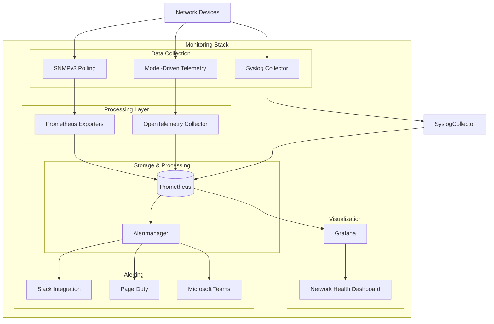
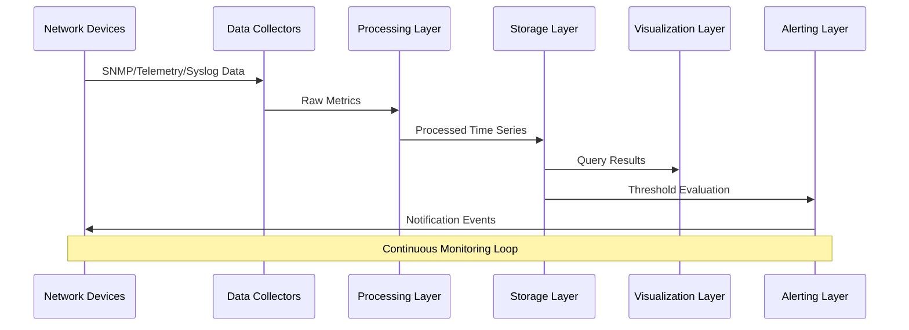
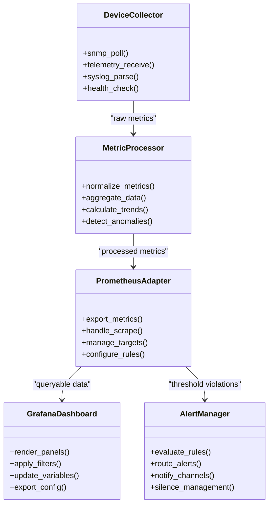
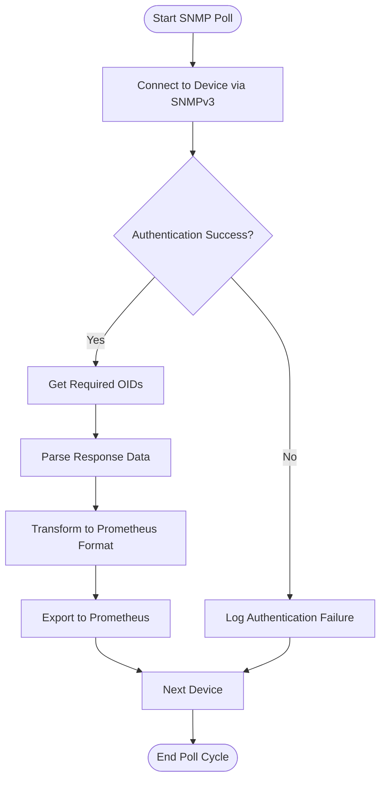
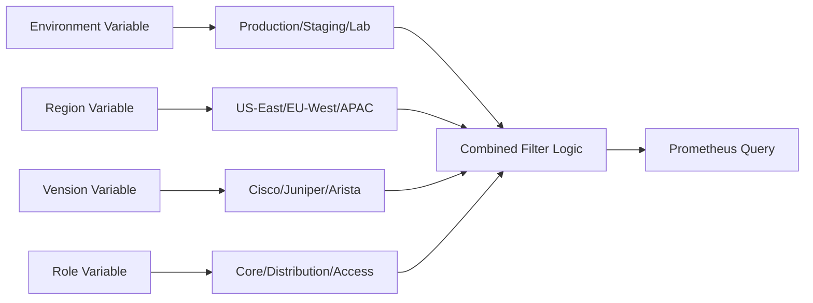
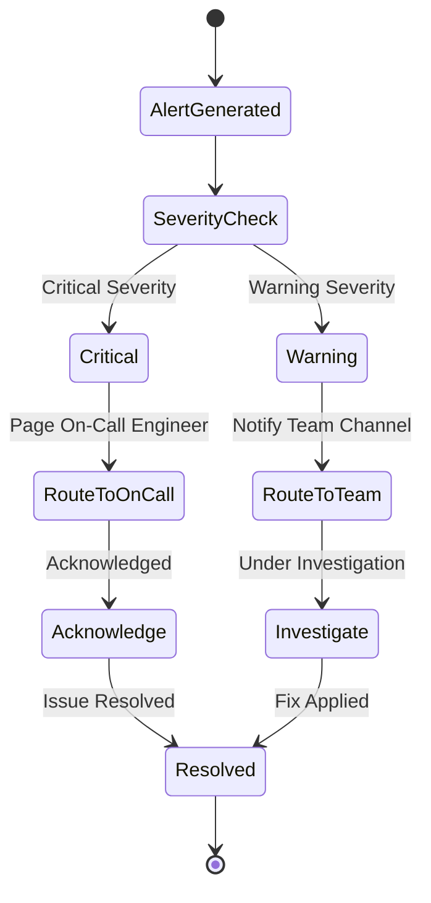
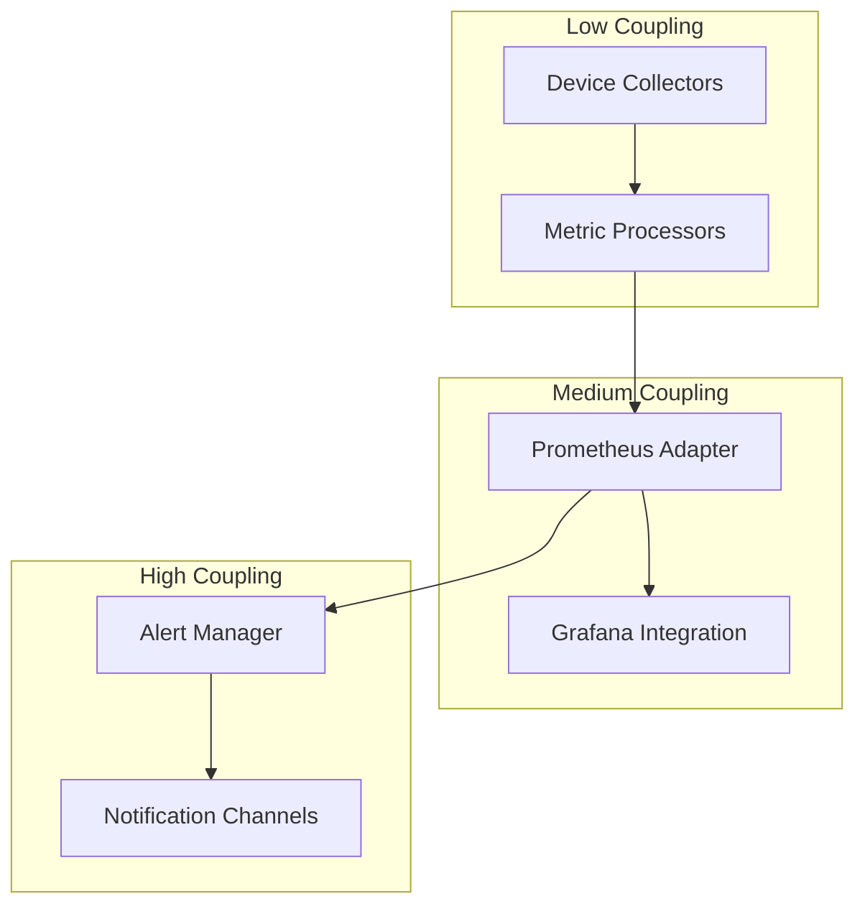

# Network Health Dashboard

<cite>
**Referenced Files in This Document**
- [README.md](file://README.md)
</cite>

## Table of Contents
1. [Introduction](#introduction)
2. [Project Structure](#project-structure)
3. [Core Components](#core-components)
4. [Architecture Overview](#architecture-overview)
5. [Detailed Component Analysis](#detailed-component-analysis)
6. [Dependency Analysis](#dependency-analysis)
7. [Performance Considerations](#performance-considerations)
8. [Troubleshooting Guide](#troubleshooting-guide)
9. [Conclusion](#conclusion)
10. [Appendices](#appendices)

## Introduction

The Network Health Dashboard is a comprehensive monitoring solution designed to provide real-time visibility into network device health, performance metrics, and operational status across multi-vendor, multi-region enterprise environments. This dashboard integrates seamlessly with the Enterprise Network Automation Platform's observability stack, leveraging Prometheus for metrics collection, Grafana for visualization, and Alertmanager for intelligent alerting.

The dashboard focuses on critical network health indicators including device availability, CPU utilization, memory usage, interface status, and resource utilization trends. It supports filtering by environment, region, vendor, and device role through dynamic template variables, enabling operators to drill down into specific segments of their network infrastructure.

## Project Structure

The monitoring architecture follows a modular design pattern with clear separation between data collection, processing, storage, and visualization layers. The system is built around the following key directories and components:

**Diagram sources**
- [README.md:587-604](file://README.md#L587-L604)

**Section sources**
- [README.md:103-180](file://README.md#L103-L180)
- [README.md:583-618](file://README.md#L583-L618)

## Core Components

### Device Status Monitoring

The device status monitoring component provides comprehensive up/down detection capabilities through multiple data sources:

- **SNMP Polling**: Uses SNMPv3 for secure polling of device reachability and basic health indicators
- **ICMP Probes**: Implements ping-based connectivity checks with configurable retry logic
- **API Health Checks**: Leverages RESTCONF/NETCONF endpoints for advanced device state verification
- **Syslog Event Processing**: Monitors device-generated events for failure notifications

Key metrics include:
- Device reachability status (up/down/partially reachable)
- Last successful poll timestamp
- Connection latency measurements
- Authentication success/failure rates

### CPU Utilization Tracking

CPU monitoring tracks processor utilization across all supported device platforms:

- **Real-time CPU Usage**: Percentage-based CPU utilization with 1-minute granularity
- **Historical Trends**: 24-hour, 7-day, and 30-day trend analysis
- **Per-CPU Breakdown**: Individual core utilization for multi-core devices
- **Threshold Alerts**: Configurable warning and critical thresholds (typically 70% and 90%)

Metrics collected:
- `device_cpu_usage_percent` - Overall CPU utilization
- `device_cpu_user_percent` - User space CPU usage
- `device_cpu_system_percent` - System space CPU usage
- `device_cpu_idle_percent` - Idle CPU percentage

### Memory Usage Metrics

Memory monitoring provides comprehensive RAM utilization tracking:

- **Total vs Used Memory**: Real-time memory consumption analysis
- **Swap Usage**: Swap partition utilization monitoring
- **Memory Leak Detection**: Trending analysis for potential memory leaks
- **Buffer/Cache Analysis**: Detailed breakdown of memory allocation types

Critical metrics:
- `device_memory_total_bytes` - Total available memory
- `device_memory_used_bytes` - Currently used memory
- `device_memory_free_bytes` - Available free memory
- `device_swap_used_bytes` - Swap partition usage

### Interface Status Monitoring

Interface monitoring covers both physical and logical interfaces:

- **Link Status**: Up/down state detection for all interfaces
- **Traffic Statistics**: Inbound/outbound bandwidth utilization
- **Error Rates**: CRC errors, collisions, and packet drops
- **Utilization Trends**: Bandwidth usage patterns and capacity planning

Interface metrics include:
- `interface_status` - Link state (up/down)
- `interface_in_octets` - Incoming traffic volume
- `interface_out_octets` - Outgoing traffic volume
- `interface_errors_total` - Error count aggregation
- `interface_utilization_percent` - Bandwidth utilization percentage

### Resource Utilization Trends

Long-term resource utilization tracking enables capacity planning and anomaly detection:

- **Trend Analysis**: Moving averages and seasonal pattern detection
- **Capacity Planning**: Growth rate calculations and projection models
- **Anomaly Detection**: Statistical outlier identification
- **Forecasting**: Predictive analytics for resource exhaustion

**Section sources**
- [README.md:438-456](file://README.md#L438-L456)
- [README.md:583-618](file://README.md#L583-L618)

## Architecture Overview

The Network Health Dashboard architecture implements a layered approach to monitoring, ensuring scalability, reliability, and maintainability across large enterprise networks.

**Diagram sources**
- [README.md:587-604](file://README.md#L587-L604)

### Data Flow Architecture

The monitoring pipeline follows a well-defined data flow pattern:

1. **Collection Phase**: Multi-protocol data ingestion from network devices
2. **Processing Phase**: Metric normalization, enrichment, and aggregation
3. **Storage Phase**: Time-series database optimization and retention management
4. **Query Phase**: Efficient metric retrieval with caching strategies
5. **Visualization Phase**: Dynamic dashboard rendering with real-time updates
6. **Alerting Phase**: Rule evaluation and notification dispatch

### Component Relationships

**Diagram sources**
- [README.md:438-456](file://README.md#L438-L456)
- [README.md:583-618](file://README.md#L583-L618)

## Detailed Component Analysis

### Prometheus Metrics Collection

The metrics collection layer implements a robust scraping architecture with support for multiple protocols and device types:

#### SNMP-Based Metrics Collection

SNMP polling provides foundational device health data through standardized MIB objects:

**Diagram sources**
- [README.md:438-456](file://README.md#L438-L456)

#### Model-Driven Telemetry Integration

Modern devices support streaming telemetry for high-frequency metrics collection:

- **gRPC Streaming**: Bidirectional communication for real-time data streams
- **JSON/YANG Models**: Structured data formats with schema validation
- **Subscription Management**: Dynamic subscription creation and lifecycle management
- **Backpressure Handling**: Rate limiting and buffer management for high-volume data

### Grafana Dashboard Configuration

The Network Health Dashboard provides comprehensive visualization capabilities through carefully designed panels and queries:

#### Panel Architecture

Each dashboard panel serves a specific monitoring purpose:

| Panel Type | Purpose | Update Interval | Time Range |
|------------|---------|----------------|------------|
| Device Status | Overall device availability | 30 seconds | Last 24 hours |
| CPU Utilization | Processor usage trends | 1 minute | Last 7 days |
| Memory Usage | RAM consumption patterns | 1 minute | Last 30 days |
| Interface Status | Link state and traffic | 30 seconds | Last 24 hours |
| Resource Trends | Long-term capacity planning | 5 minutes | Last 90 days |

#### Template Variables

Dynamic filtering enables targeted analysis across different network segments:

**Diagram sources**
- [README.md:284-335](file://README.md#L284-L335)

#### Query Optimization Techniques

Efficient query design ensures responsive dashboards even with large datasets:

- **Metric Selection**: Only query necessary metrics for each panel
- **Time Range Optimization**: Use appropriate time ranges per panel type
- **Aggregation Functions**: Leverage PromQL aggregation for pre-computed values
- **Caching Strategies**: Implement query result caching where appropriate
- **Label Indexing**: Optimize label cardinality for faster lookups

### Alerting Rules Configuration

Threshold-based alerting provides proactive issue detection and response:

#### Critical Alert Conditions

| Metric | Warning Threshold | Critical Threshold | Duration |
|--------|------------------|-------------------|----------|
| CPU Utilization | >70% | >90% | 5 minutes |
| Memory Usage | >80% | >95% | 10 minutes |
| Interface Errors | >10/min | >100/min | 5 minutes |
| Device Reachability | N/A | Down for >2 minutes | Immediate |
| Disk Space | >85% | >95% | 1 hour |

#### Alert Routing Strategy

Intelligent alert routing ensures appropriate team notification:

**Diagram sources**
- [README.md:583-618](file://README.md#L583-L618)

### Integration Points

The monitoring system integrates with existing enterprise infrastructure:

#### Secrets Management Integration

Secure credential handling through centralized secrets management:

- **Vault Integration**: HashiCorp Vault for SNMP credentials and API tokens
- **Secret Rotation**: Automated credential rotation without service interruption
- **Access Control**: Fine-grained permissions for monitoring access
- **Audit Logging**: Complete audit trail for secret access

#### CI/CD Pipeline Integration

Monitoring configuration managed through GitOps principles:

- **Infrastructure as Code**: All monitoring definitions version-controlled
- **Automated Testing**: Validation of monitoring configurations in CI pipelines
- **Blue-Green Deployment**: Zero-downtime monitoring updates
- **Rollback Capability**: Instant rollback to previous monitoring states

**Section sources**
- [README.md:339-368](file://README.md#L339-L368)
- [README.md:479-515](file://README.md#L479-L515)

## Dependency Analysis

The monitoring system exhibits careful dependency management to ensure reliability and maintainability:

### Component Coupling

### External Dependencies

The system relies on several external components:

| Component | Version | Purpose | Risk Level |
|-----------|---------|---------|------------|
| Prometheus | 2.x+ | Time-series database | Medium |
| Grafana | 9.x+ | Visualization platform | Low |
| Alertmanager | 0.25+ | Alert routing and deduplication | Medium |
| OpenTelemetry | 1.x+ | Observability framework | Low |
| SNMP Libraries | Latest | Network device communication | High |

### Circular Dependency Prevention

The architecture prevents circular dependencies through clear separation of concerns:

- **Event-Driven Communication**: Asynchronous message passing between components
- **Interface Abstraction**: Well-defined APIs between modules
- **Dependency Injection**: Loose coupling through configurable dependencies
- **Service Discovery**: Dynamic component registration and discovery

**Section sources**
- [README.md:583-618](file://README.md#L583-L618)

## Performance Considerations

### Scalability Architecture

The monitoring system is designed for horizontal scaling across large enterprise networks:

#### Horizontal Scaling Patterns

- **Sharded Prometheus**: Multiple Prometheus instances for metric sharding
- **Load-Balanced Collectors**: Distributed data collection across multiple nodes
- **Clustered Grafana**: High-availability dashboard serving
- **Distributed Alerting**: Parallel alert rule evaluation

#### Resource Optimization

Efficient resource utilization through intelligent optimization:

- **Metric Retention Policies**: Tiered storage with automatic downsampling
- **Query Optimization**: Efficient PromQL queries with proper indexing
- **Connection Pooling**: Reuse connections to reduce overhead
- **Batch Processing**: Aggregate operations for bulk metric updates

### Monitoring Performance Metrics

Key performance indicators for the monitoring system itself:

| Metric | Target | Measurement Method |
|--------|--------|-------------------|
| Scrape Latency | <1 second | Prometheus scrape duration |
| Query Response Time | <2 seconds | Grafana query timing |
| Alert Processing Time | <30 seconds | Alertmanager processing logs |
| Dashboard Load Time | <3 seconds | Browser performance metrics |
| Memory Usage | <80% of allocated | Container resource limits |

## Troubleshooting Guide

### Common Monitoring Issues

#### Device Connectivity Problems

**Symptoms**: Missing metrics, device status showing unknown
**Diagnostic Steps**:
1. Verify network connectivity: `ping <device_ip>`
2. Check SNMP configuration: `snmpwalk -v3 -u <user> -l authPriv -a SHA -A <auth_pass> -x AES -X <priv_pass> <device_ip> .1.3.6.1.2.1.1`
3. Review firewall rules and ACLs
4. Check device authentication settings

**Resolution Actions**:
- Update device credentials in secrets manager
- Adjust SNMP timeout and retry settings
- Configure alternative collection methods
- Enable detailed logging for connection attempts

#### High CPU Usage in Collectors

**Symptoms**: Slow metric collection, missed scrapes
**Diagnostic Steps**:
1. Monitor collector process CPU usage
2. Check number of active targets
3. Review metric cardinality
4. Analyze query complexity

**Resolution Actions**:
- Scale out collectors horizontally
- Reduce metric cardinality
- Optimize collection intervals
- Implement metric filtering at source

#### Dashboard Performance Issues

**Symptoms**: Slow dashboard loading, query timeouts
**Diagnostic Steps**:
1. Check Prometheus query logs
2. Analyze Grafana slow query logs
3. Review metric retention policies
4. Evaluate dashboard complexity

**Resolution Actions**:
- Optimize PromQL queries
- Implement query result caching
- Reduce dashboard panel count
- Use recording rules for complex calculations

#### Alert Storm Situations

**Symptoms**: Excessive alert notifications, alert fatigue
**Diagnostic Steps**:
1. Review alert rule configurations
2. Check alert grouping and inhibition rules
3. Analyze alert frequency patterns
4. Evaluate threshold sensitivity

**Resolution Actions**:
- Implement alert grouping and deduplication
- Add cooldown periods for flapping alerts
- Refine threshold values based on historical data
- Configure alert routing by severity and impact

### Debugging Tools and Techniques

#### Log Analysis

Centralized log collection enables comprehensive troubleshooting:

- **Structured Logging**: JSON-formatted logs with consistent fields
- **Correlation IDs**: Trace requests across system boundaries
- **Log Aggregation**: Centralized log storage and search
- **Real-time Monitoring**: Live log streaming for active incidents

#### Metrics Exploration

Interactive metrics exploration for root cause analysis:

- **Prometheus UI**: Direct metric inspection and testing
- **Grafana Explore**: Ad-hoc query development and debugging
- **Metric Diffing**: Compare metric behavior across time periods
- **Anomaly Detection**: Statistical analysis for unusual patterns

**Section sources**
- [README.md:674-685](file://README.md#L674-L685)

## Conclusion

The Network Health Dashboard represents a comprehensive, enterprise-grade monitoring solution that provides deep visibility into network device health and performance. Built on proven technologies like Prometheus and Grafana, it offers scalable, reliable monitoring capabilities suitable for large-scale enterprise environments.

Key strengths of the implementation include:

- **Multi-Protocol Support**: Comprehensive coverage of SNMP, telemetry, and syslog data sources
- **Advanced Analytics**: Trend analysis, anomaly detection, and predictive insights
- **Intelligent Alerting**: Sophisticated alerting with noise reduction and intelligent routing
- **Scalable Architecture**: Horizontal scaling capabilities for growing network infrastructures
- **Operational Excellence**: Robust troubleshooting tools and comprehensive documentation

The dashboard successfully addresses the critical need for real-time network visibility while maintaining operational efficiency through automation and intelligent monitoring practices. Its modular design ensures adaptability to evolving network architectures and monitoring requirements.

## Appendices

### Appendix A: Sample Dashboard JSON Structure

The dashboard configuration follows Grafana's standard JSON format with comprehensive panel definitions, template variables, and query specifications.

### Appendix B: Prometheus Alert Rules Reference

Complete reference for alert rule syntax, functions, and best practices for network monitoring scenarios.

### Appendix C: SNMP OID Reference

Comprehensive list of supported SNMP OIDs for different vendor platforms and device types.

### Appendix D: Capacity Planning Guidelines

Guidelines for sizing monitoring infrastructure based on network size and metric volume expectations.