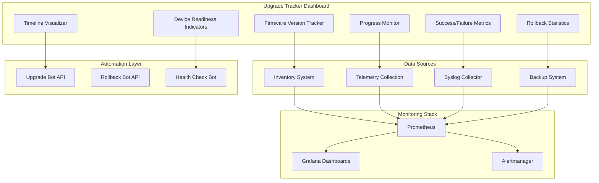
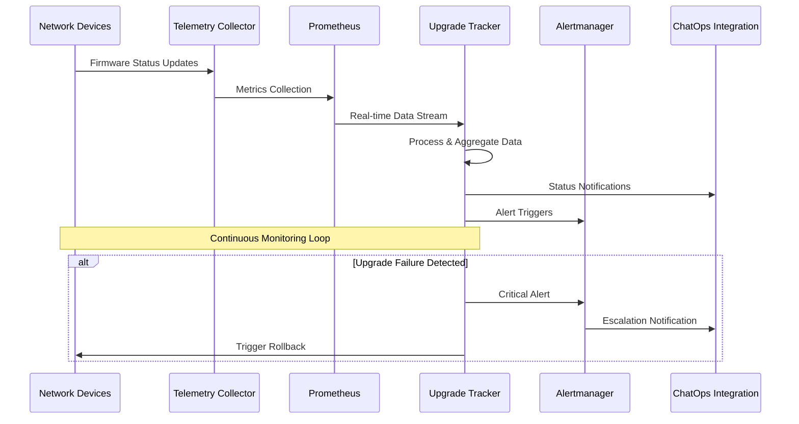
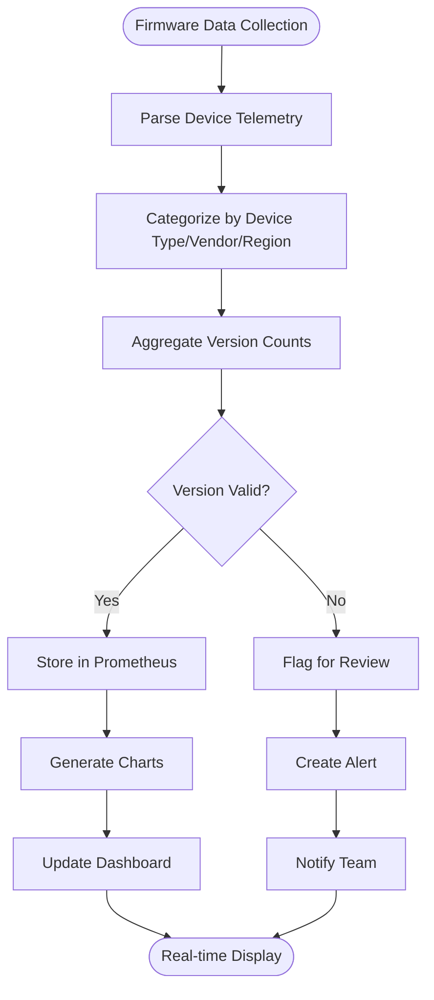
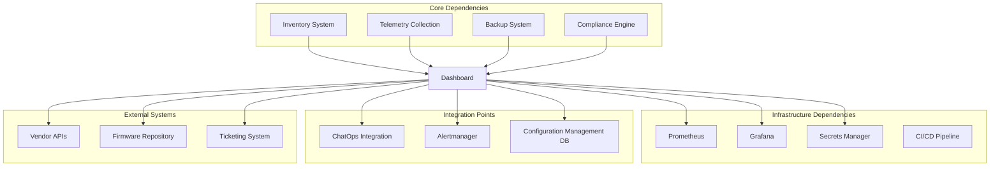

# Upgrade Tracker Dashboard

<cite>
**Referenced Files in This Document**
- [README.md](file://README.md)
</cite>

## Table of Contents
1. [Introduction](#introduction)
2. [Project Structure](#project-structure)
3. [Core Components](#core-components)
4. [Architecture Overview](#architecture-overview)
5. [Detailed Component Analysis](#detailed-component-analysis)
6. [Dependency Analysis](#dependency-analysis)
7. [Performance Considerations](#performance-considerations)
8. [Troubleshooting Guide](#troubleshooting-guide)
9. [Conclusion](#conclusion)
10. [Appendices](#appendices)

## Introduction

The Upgrade Tracker Dashboard is a comprehensive monitoring and visualization system designed to manage firmware version management across enterprise network fleets. This dashboard provides real-time visibility into firmware deployment status, upgrade progress tracking, rollback statistics, and success/failure rates across multi-vendor, multi-region environments.

The system integrates seamlessly with the Enterprise Network Automation Platform's existing infrastructure, leveraging Prometheus for metrics collection, Grafana for visualization, and automated workflows for safe firmware operations with built-in backup and rollback mechanisms.

## Project Structure

The Upgrade Tracker Dashboard is part of the broader Enterprise Network Automation Platform architecture, which follows a modular, Git-driven approach to network automation. The dashboard components integrate with multiple subsystems including inventory management, automation bots, monitoring systems, and backup services.

**Diagram sources**
- [README.md:583-618](file://README.md#L583-L618)
- [README.md:460-476](file://README.md#L460-L476)

**Section sources**
- [README.md:103-180](file://README.md#L103-L180)
- [README.md:583-618](file://README.md#L583-L618)

## Core Components

The Upgrade Tracker Dashboard consists of several interconnected components that work together to provide comprehensive firmware management visibility and control.

### Firmware Version Management

The core component tracks current firmware versions across all devices in the fleet, organized by device type, vendor, and region. This component leverages the inventory system to maintain accurate device metadata and uses telemetry data to collect real-time firmware version information.

### Progress Tracking Engine

This component monitors ongoing upgrade campaigns, providing real-time progress updates, completion percentages, and estimated time to completion. It integrates with the automation bot layer to receive status updates from active upgrade operations.

### Rollback Statistics Module

Tracks rollback events, their frequency, reasons, and success rates. This module maintains historical data to identify patterns and potential issues in the upgrade process.

### Success/Failure Rate Analytics

Provides comprehensive analytics on upgrade success and failure rates, including trend analysis, failure categorization, and performance metrics across different device types and vendors.

**Section sources**
- [README.md:438-459](file://README.md#L438-L459)
- [README.md:460-476](file://README.md#L460-L476)

## Architecture Overview

The Upgrade Tracker Dashboard follows a distributed architecture pattern with clear separation between data collection, processing, visualization, and alerting layers.

**Diagram sources**
- [README.md:583-604](file://README.md#L583-L604)
- [README.md:460-476](file://README.md#L460-L476)

### Data Flow Architecture

The system implements a multi-layered data flow architecture:

1. **Collection Layer**: SNMP polling, model-driven telemetry, and syslog collection gather firmware status data from network devices
2. **Processing Layer**: Python modules process raw telemetry data, perform validation, and aggregate metrics
3. **Storage Layer**: Prometheus stores time-series metrics while backup systems maintain configuration snapshots
4. **Visualization Layer**: Grafana dashboards render real-time visualizations and historical trends
5. **Action Layer**: Automated bots execute upgrades, rollbacks, and remediation actions

**Section sources**
- [README.md:583-618](file://README.md#L583-L618)
- [README.md:438-459](file://README.md#L438-L459)

## Detailed Component Analysis

### Firmware Version Distribution Visualization

The dashboard provides comprehensive visualization of firmware versions across the network fleet through multiple chart types and filtering options.

#### Device Type Breakdown

The system displays firmware version distribution by device type (routers, switches, firewalls, load balancers), allowing administrators to quickly identify version inconsistencies within specific device categories.

#### Vendor-Specific Analysis

Vendor-specific views enable comparison of firmware adoption rates across different manufacturers (Cisco, Juniper, Arista, Palo Alto, Fortinet, etc.), helping identify vendor-specific upgrade challenges or compatibility issues.

#### Regional Deployment Tracking

Regional breakdowns show firmware deployment progress across geographic locations (US-East, US-West, EU-West, APAC), supporting coordinated rollout strategies and regional compliance requirements.

**Diagram sources**
- [README.md:583-604](file://README.md#L583-L604)
- [README.md:438-459](file://README.md#L438-L459)

### Upgrade Progress Tracking

The progress tracking system provides real-time visibility into ongoing upgrade campaigns with granular detail at device, group, and campaign levels.

#### Campaign Management

Each upgrade campaign is tracked independently with start/end times, target devices, success criteria, and rollback triggers. Campaigns support phased rollouts with approval gates between phases.

#### Device-Level Status Monitoring

Individual device status includes pre-upgrade health checks, download progress, installation status, reboot state, and post-upgrade validation results.

#### Bottleneck Identification

The system identifies bottlenecks in the upgrade process, such as slow firmware downloads, device connectivity issues, or resource constraints during installation.

**Section sources**
- [README.md:642-670](file://README.md#L642-L670)

### Rollback Statistics and Analytics

Comprehensive rollback tracking provides insights into upgrade reliability and helps identify problematic firmware versions or device types.

#### Rollback Frequency Analysis

Historical rollback data reveals patterns in upgrade failures, including common error conditions, affected device models, and environmental factors contributing to failures.

#### Rollback Success Rates

Tracks the effectiveness of rollback procedures, measuring time-to-recovery and successful restoration rates across different scenarios.

#### Root Cause Correlation

Correlates rollback events with pre-upgrade health metrics, configuration complexity, and device age to identify risk factors for upgrade failures.

### Upgrade Success/Failure Rate Metrics

Advanced analytics provide deep insights into upgrade performance and reliability across the entire fleet.

#### Success Rate Trends

Time-series analysis of upgrade success rates helps identify degradation in upgrade reliability over time, potentially indicating infrastructure issues or firmware quality problems.

#### Failure Classification

Automated classification of upgrade failures into categories (network timeout, checksum mismatch, insufficient resources, compatibility issues) enables targeted remediation efforts.

#### Performance Benchmarking

Compares upgrade performance across different device types, vendors, and regions to establish baseline expectations and identify outliers requiring investigation.

**Section sources**
- [README.md:460-476](file://README.md#L460-L476)
- [README.md:583-618](file://README.md#L583-L618)

### Dashboard Panels and Visualizations

The dashboard provides multiple specialized panels for different aspects of firmware management.

#### Firmware Version Distribution Charts

Interactive charts showing firmware version adoption rates, with drill-down capabilities to examine specific device groups or time periods. Supports both pie charts and bar graphs for different analytical perspectives.

#### Upgrade Timeline Visualizations

Gantt-style timeline views showing upgrade campaign schedules, execution windows, and completion status across multiple concurrent campaigns. Includes dependency mapping and resource utilization indicators.

#### Device Readiness Indicators

Color-coded readiness indicators showing device preparation status, including backup completion, health check results, capacity verification, and maintenance window availability.

#### Alert and Notification Panel

Centralized view of upgrade-related alerts, warnings, and notifications with escalation status and response tracking. Integrates with ChatOps platforms for team coordination.

**Section sources**
- [README.md:606-616](file://README.md#L606-L616)

## Dependency Analysis

The Upgrade Tracker Dashboard has well-defined dependencies on various system components, ensuring reliable operation and comprehensive functionality.

**Diagram sources**
- [README.md:583-618](file://README.md#L583-L618)
- [README.md:438-459](file://README.md#L438-L459)

### Component Coupling Analysis

The dashboard exhibits low coupling with external systems through well-defined interfaces and high cohesion within its own components. Key integration points include:

- **Inventory System**: Provides device metadata and grouping information
- **Telemetry Collection**: Supplies real-time firmware status data
- **Backup System**: Maintains configuration snapshots for rollback operations
- **Compliance Engine**: Validates firmware versions against approved baselines
- **Secrets Management**: Securely handles authentication credentials for device access

**Section sources**
- [README.md:438-459](file://README.md#L438-L459)
- [README.md:583-618](file://README.md#L583-L618)

## Performance Considerations

The Upgrade Tracker Dashboard is designed for enterprise-scale operations with thousands of devices across multiple regions. Key performance considerations include:

### Scalability Architecture

The system employs horizontal scaling for data collection and processing components, with sharded Prometheus instances for metrics storage and distributed Grafana deployments for dashboard rendering.

### Data Retention Policies

Configurable retention policies balance storage costs with historical analysis needs. Short-term high-resolution data (30 days) supports real-time monitoring, while long-term aggregated data (2 years) enables trend analysis and compliance reporting.

### Resource Optimization

Efficient data aggregation reduces storage overhead while maintaining query performance. Pre-computed summaries and materialized views accelerate dashboard loading times for complex queries.

### Network Efficiency

Batched telemetry collection and intelligent polling intervals minimize network overhead while maintaining timely firmware status updates.

## Troubleshooting Guide

Common issues and resolution strategies for the Upgrade Tracker Dashboard:

### Data Collection Issues

| Issue | Symptoms | Resolution |
|-------|----------|------------|
| Telemetry Collection Failures | Missing firmware data, stale timestamps | Verify SNMP/telemetry connectivity, check device credentials |
| Inventory Synchronization Problems | Incorrect device grouping, missing metadata | Re-run inventory sync, validate source data integrity |
| Backup System Connectivity | Rollback failures, missing snapshots | Check backup service health, verify storage permissions |

### Dashboard Performance Issues

| Issue | Symptoms | Resolution |
|-------|----------|------------|
| Slow Dashboard Loading | High latency, timeouts | Optimize queries, increase cache TTL, scale Grafana instances |
| Missing Visualizations | Blank charts, incomplete data | Verify metric availability, check dashboard permissions |
| Alert Delays | Late notifications, missed escalations | Review Alertmanager configuration, check notification channels |

### Integration Problems

| Issue | Symptoms | Resolution |
|-------|----------|------------|
| ChatOps Integration Failures | No Slack/Teams notifications | Verify webhook URLs, check API rate limits |
| CI/CD Pipeline Disconnections | Failed automated upgrades | Review pipeline logs, validate environment variables |
| Compliance Engine Errors | False positives/negatives | Update policy definitions, refresh compliance baselines |

**Section sources**
- [README.md:674-685](file://README.md#L674-L685)

## Conclusion

The Upgrade Tracker Dashboard provides comprehensive firmware management capabilities for enterprise network automation environments. Its modular architecture, robust monitoring integration, and automated rollback mechanisms ensure safe and efficient firmware operations across diverse device fleets.

The system's emphasis on observability, compliance, and automation aligns with modern DevOps practices while maintaining the reliability and security requirements essential for production network environments. Through continuous monitoring, automated workflows, and comprehensive analytics, the dashboard enables proactive firmware management that minimizes downtime and maximizes operational efficiency.

## Appendices

### Configuration Examples

#### Upgrade Campaign Configuration

Campaign configurations define target devices, firmware versions, scheduling, and safety parameters for automated upgrade operations.

#### Monitoring Metrics Definition

Custom Prometheus metrics capture upgrade-specific KPIs including success rates, duration metrics, and failure categorization.

#### Alert Rules Configuration

Threshold-based alerting rules trigger notifications for upgrade failures, delays, and anomalies in upgrade performance.

### Best Practices

- Implement phased rollouts with gradual device population increases
- Maintain comprehensive backup strategies before any firmware changes
- Establish clear rollback criteria and automated recovery procedures
- Monitor upgrade performance metrics continuously for early anomaly detection
- Regularly review and update firmware approval baselines based on field experience