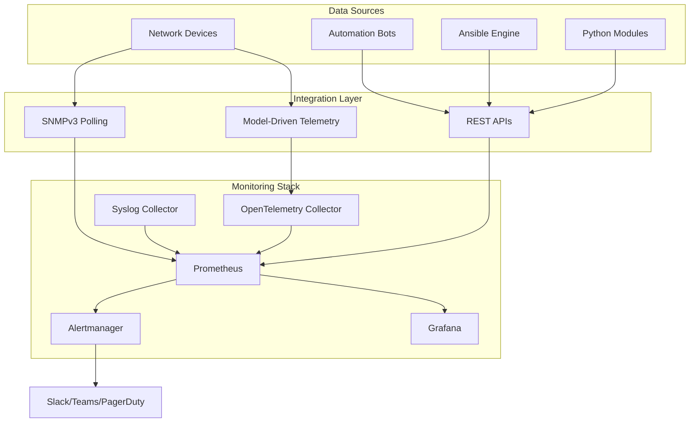
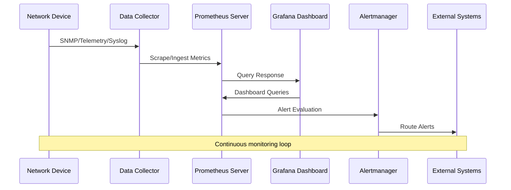
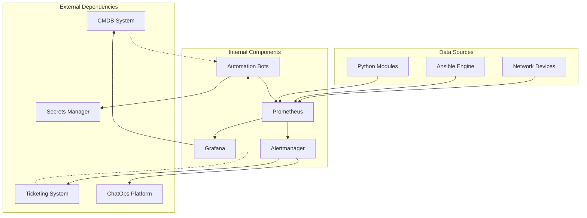

# Visualization & Dashboards

<cite>
**Referenced Files in This Document**
- [README.md](file://README.md)
</cite>

## Table of Contents
1. [Introduction](#introduction)
2. [Project Structure](#project-structure)
3. [Core Components](#core-components)
4. [Architecture Overview](#architecture-overview)
5. [Detailed Component Analysis](#detailed-component-analysis)
6. [Dependency Analysis](#dependency-analysis)
7. [Performance Considerations](#performance-considerations)
8. [Troubleshooting Guide](#troubleshooting-guide)
9. [Conclusion](#conclusion)
10. [Appendices](#appendices)

## Introduction

This document provides comprehensive guidance for implementing and managing Grafana dashboards within the Enterprise Network Automation Platform. The platform follows a "Monitoring as Code" approach where all monitoring configurations, including Grafana dashboards, are version-controlled and managed through GitOps principles.

The platform implements six critical dashboards designed to provide complete visibility into network operations, automation workflows, compliance status, firmware management, API performance, and configuration drift detection. These dashboards integrate seamlessly with Prometheus, OpenTelemetry, and Alertmanager to deliver real-time insights and proactive alerting capabilities.

## Project Structure

The monitoring infrastructure follows a modular architecture with clear separation of concerns:

**Diagram sources**
- [README.md:587-604](file://README.md#L587-L604)

The monitoring stack integrates multiple data collection methods to ensure comprehensive observability across the entire network automation ecosystem.

**Section sources**
- [README.md:160-165](file://README.md#L160-L165)
- [README.md:583-604](file://README.md#L583-L604)

## Core Components

The monitoring system consists of several interconnected components that work together to provide comprehensive observability:

### Data Collection Layer
- **SNMPv3 Polling**: Collects device metrics including CPU utilization, memory usage, interface statistics, and hardware health indicators
- **Model-Driven Telemetry**: Real-time streaming metrics from modern network devices using gRPC and YANG models
- **Syslog Collection**: Centralized log aggregation from all network devices and automation components
- **REST API Metrics**: Performance and operational metrics from automation bots and Python modules

### Processing and Storage
- **Prometheus**: Time-series database for storing metrics with efficient querying capabilities
- **OpenTelemetry Collector**: Aggregates and processes telemetry data before forwarding to Prometheus
- **Alertmanager**: Handles alert routing, deduplication, and notification delivery

### Visualization and Alerting
- **Grafana**: Primary visualization platform with templated dashboards and dynamic filtering
- **Alertmanager Integration**: Multi-channel alerting to Slack, Teams, PagerDuty, and email

**Section sources**
- [README.md:583-604](file://README.md#L583-L604)

## Architecture Overview

The monitoring architecture follows a distributed design pattern optimized for high availability and scalability:

**Diagram sources**
- [README.md:587-604](file://README.md#L587-L604)

The architecture supports both pull-based (Prometheus scraping) and push-based (telemetry streaming) data collection methods, ensuring compatibility with legacy and modern network devices.

## Detailed Component Analysis

### Network Health Dashboard

The Network Health dashboard provides comprehensive visibility into device status and resource utilization across the entire network fleet.

#### Key Metrics and Panels

| Panel Type | Metric | Description | Threshold |
|------------|--------|-------------|-----------|
| Status Panel | Device Availability | Up/Down status with geographic distribution | < 99.9% uptime |
| Resource Utilization | CPU/Memory Usage | Per-device and aggregate resource consumption | > 80% sustained |
| Interface Statistics | Bandwidth Utilization | Ingress/egress traffic patterns per interface | > 70% capacity |
| Hardware Health | Temperature/Voltage | Environmental monitoring for critical devices | Out of spec ranges |
| Connectivity | Neighbor Discovery | CDP/LLDP neighbor relationships and topology | Missing neighbors |

#### Template Variables
- `device_group`: Filter by device role (core_routers, firewalls, switches)
- `region`: Geographic region filtering (us-east, eu-west, apac)
- `vendor`: Vendor-specific filtering (cisco, juniper, arista)
- `time_range`: Dynamic time window selection

#### Query Optimization Strategies
- Use PromQL aggregations to reduce query load
- Implement recording rules for complex calculations
- Leverage Prometheus federation for large-scale deployments
- Configure appropriate scrape intervals based on metric volatility

**Section sources**
- [README.md:609](file://README.md#L609)

### Automation Metrics Dashboard

This dashboard tracks the performance and reliability of automated network operations, providing insights into job success rates, execution times, and overall automation effectiveness.

#### Critical Metrics

| Metric Category | Specific Metrics | Business Impact |
|----------------|------------------|-----------------|
| Job Success Rate | Overall success %, failure reasons, retry rates | Automation reliability assessment |
| Execution Performance | Mean/median execution time, p95/p99 latency | Performance bottleneck identification |
| Drift Detection | Configuration drift count, drift severity levels | Compliance and stability monitoring |
| Resource Consumption | Ansible worker utilization, Python module performance | Capacity planning and optimization |

#### Advanced Visualizations
- Heat maps showing automation job performance by time of day
- Trend analysis comparing current vs historical performance
- Correlation analysis between deployment frequency and error rates
- Rollback rate tracking for change management effectiveness

**Section sources**
- [README.md:610](file://README.md#L610)

### Compliance Overview Dashboard

The Compliance Overview dashboard provides real-time visibility into policy violations, security posture, and regulatory compliance across the network estate.

#### Compliance Categories Tracked

| Policy Category | Check Type | Severity Levels | Reporting Frequency |
|----------------|------------|-----------------|-------------------|
| Security Baseline | SSH/TLS configuration, authentication methods | Critical/High/Medium | Real-time |
| Operational Standards | NTP, logging, backup procedures | High/Medium/Low | Hourly |
| Firmware Compliance | Approved OS versions, patch levels | Critical/High | Daily |
| Access Control | AAA configuration, privilege levels | Critical/High | Real-time |
| Network Policies | ACL standards, firewall rules | High/Critical | Continuous |

#### Violation Tracking Features
- Trend analysis showing violation reduction over time
- Top violators ranking by severity and frequency
- Remediation progress tracking with SLA monitoring
- Automated compliance scoring and reporting

**Section sources**
- [README.md:611](file://README.md#L611)

### Upgrade Tracker Dashboard

The Upgrade Tracker dashboard manages firmware version control and upgrade lifecycle across the entire device fleet, ensuring consistent and controlled upgrades.

#### Upgrade Management Features

| Feature | Description | Implementation |
|---------|-------------|----------------|
| Version Matrix | Current firmware versions across all devices | Grouped by vendor/platform |
| Upgrade Progress | Real-time status of active upgrade campaigns | Percentage completion tracking |
| Rollback Events | Failed upgrades and automatic rollback triggers | Failure reason categorization |
| Compatibility Matrix | Supported version combinations and dependencies | Cross-reference validation |
| Scheduled Maintenance | Planned upgrade windows and maintenance calendars | Calendar integration |

#### Upgrade Workflow Integration
- Pre-upgrade health checks and backup verification
- Post-upgrade validation and rollback triggers
- Automated notifications to stakeholders
- Audit trail for compliance and troubleshooting

**Section sources**
- [README.md:612](file://README.md#L612)

### API Performance Dashboard

This dashboard monitors the performance and reliability of automation bot endpoints, ensuring optimal response times and identifying bottlenecks in the automation pipeline.

#### API Metrics Monitored

| Metric Type | Specific Measurements | Alerting Thresholds |
|-------------|----------------------|---------------------|
| Latency | Request/response times, p50/p95/p99 percentiles | > 500ms average |
| Throughput | Requests per second, concurrent connections | Capacity limits |
| Error Rates | HTTP status codes, timeout errors, exceptions | > 1% error rate |
| Resource Usage | Bot process memory, CPU utilization | Resource exhaustion |
| Queue Depth | Pending requests, processing backlog | Queue overflow |

#### Bot Endpoint Coverage
- Firewall Bot: `/api/v1/firewall/rules`
- VLAN Bot: `/api/v1/vlan`
- Port Bot: `/api/v1/port`
- Backup Bot: `/api/v1/backup`
- Health Bot: `/api/v1/health`
- Compliance Bot: `/api/v1/compliance`
- Upgrade Bot: `/api/v1/upgrade`
- Rollback Bot: `/api/v1/rollback`

**Section sources**
- [README.md:613](file://README.md#L613)

### Inventory Drift Dashboard

The Inventory Drift dashboard detects and visualizes configuration differences between the desired state (Git repository) and actual running configurations on network devices.

#### Drift Detection Capabilities

| Drift Type | Detection Method | Resolution Priority |
|------------|------------------|-------------------|
| Configuration Drift | Config diff analysis against golden templates | High |
| Policy Violations | Compliance check failures | Critical |
| Unauthorized Changes | Manual configuration modifications | High |
| Version Mismatches | Firmware/software version deviations | Medium |
| Missing Backups | Configuration backup failures | Medium |

#### Drift Analysis Features
- Side-by-side configuration comparison views
- Change impact assessment and risk scoring
- Automated remediation workflow initiation
- Historical drift trend analysis and pattern recognition

**Section sources**
- [README.md:614](file://README.md#L614)

## Dependency Analysis

The monitoring system has well-defined dependencies and integration points:

**Diagram sources**
- [README.md:587-604](file://README.md#L587-L604)

Key integration points include CMDB synchronization for asset management, ticketing system integration for incident response, and chat platforms for real-time notifications.

**Section sources**
- [README.md:583-604](file://README.md#L583-L604)

## Performance Considerations

### Query Optimization Best Practices
- Implement appropriate retention policies for different metric types
- Use recording rules for frequently accessed complex queries
- Leverage Prometheus federation for horizontal scaling
- Optimize Grafana dashboard refresh intervals based on data volatility

### Scalability Guidelines
- Horizontal scaling of Prometheus servers for large device counts
- Vertical scaling considerations for high-cardinality metrics
- Load balancing across multiple Grafana instances
- Caching strategies for expensive dashboard queries

### Cost Optimization
- Right-size storage retention periods based on compliance requirements
- Implement metric filtering to reduce storage costs
- Use sampling for high-frequency telemetry data
- Archive historical data to cold storage when appropriate

## Troubleshooting Guide

### Common Monitoring Issues

| Issue | Symptoms | Resolution Steps |
|-------|----------|------------------|
| Missing Metrics | Empty panels, no data points | Verify scrape targets, check network connectivity |
| High Query Latency | Slow dashboard loading | Optimize PromQL queries, add recording rules |
| Alert Storms | Excessive notifications | Configure alert grouping, adjust thresholds |
| Data Gaps | Incomplete time series | Check collector health, verify device reachability |
| Memory Issues | OOM crashes, slow performance | Tune JVM settings, optimize retention policies |

### Diagnostic Tools and Commands
- Prometheus target discovery: `curl http://prometheus:9090/api/v1/targets`
- Grafana datasource health: `curl -u admin:admin http://grafana:3000/api/datasources`
- Alertmanager status: `curl http://alertmanager:9093/api/v1/status`
- Log analysis: Centralized log aggregation with search capabilities

**Section sources**
- [README.md:674-685](file://README.md#L674-L685)

## Conclusion

The Enterprise Network Automation Platform's monitoring and visualization strategy provides comprehensive observability across the entire network automation ecosystem. The six core dashboards—Network Health, Automation Metrics, Compliance Overview, Upgrade Tracker, API Performance, and Inventory Drift—deliver actionable insights that enable proactive network management and rapid incident response.

The "Monitoring as Code" approach ensures that all visualization configurations are version-controlled, testable, and reproducible, following the same GitOps principles applied throughout the platform. This methodology enables teams to collaborate effectively on monitoring improvements while maintaining consistency across environments.

The integration with external systems like CMDB and ticketing tools creates a closed-loop automation ecosystem where monitoring insights trigger automated responses, reducing mean time to resolution and improving overall network reliability.

## Appendices

### Dashboard JSON Configuration Templates

While specific JSON configurations are not included in this repository snapshot, the platform follows standard Grafana dashboard export formats that can be imported directly into Grafana instances. Each dashboard includes:

- Standard panel definitions with PromQL queries
- Template variables for dynamic filtering
- Alert rules and threshold configurations
- Annotation definitions for events and changes
- Link integrations to external systems

### User Access Controls

The platform implements role-based access control (RBAC) for dashboard access:

- **Viewers**: Read-only access to all dashboards
- **Operators**: Can modify dashboard configurations and manage alerts
- **Administrators**: Full access including user management and system configuration
- **Compliance Officers**: Specialized access to compliance-related dashboards and reports

### Integration Examples

#### CMDB Integration
- Automated asset synchronization from CMDB to inventory systems
- Real-time device status updates reflected in dashboards
- Configuration baseline synchronization with source of truth

#### Ticketing System Integration
- Automated ticket creation for critical alerts
- Status updates and resolution notes synchronized back to tickets
- Escalation workflows based on alert severity and duration