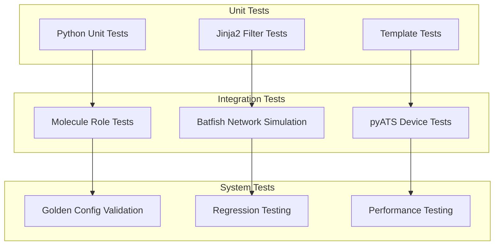
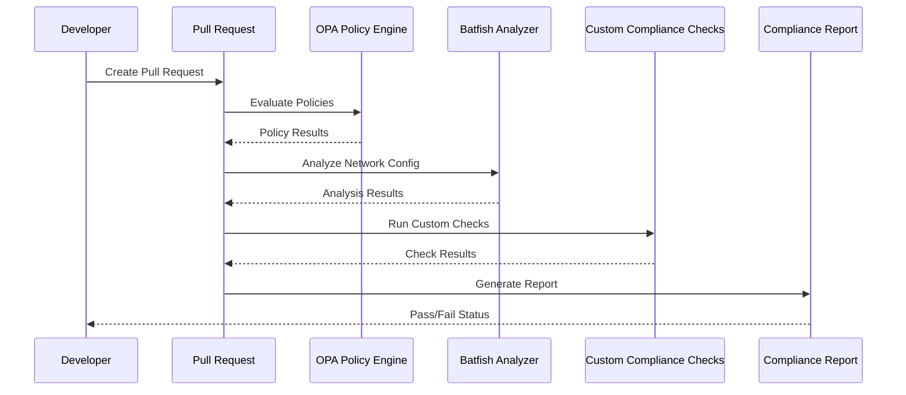
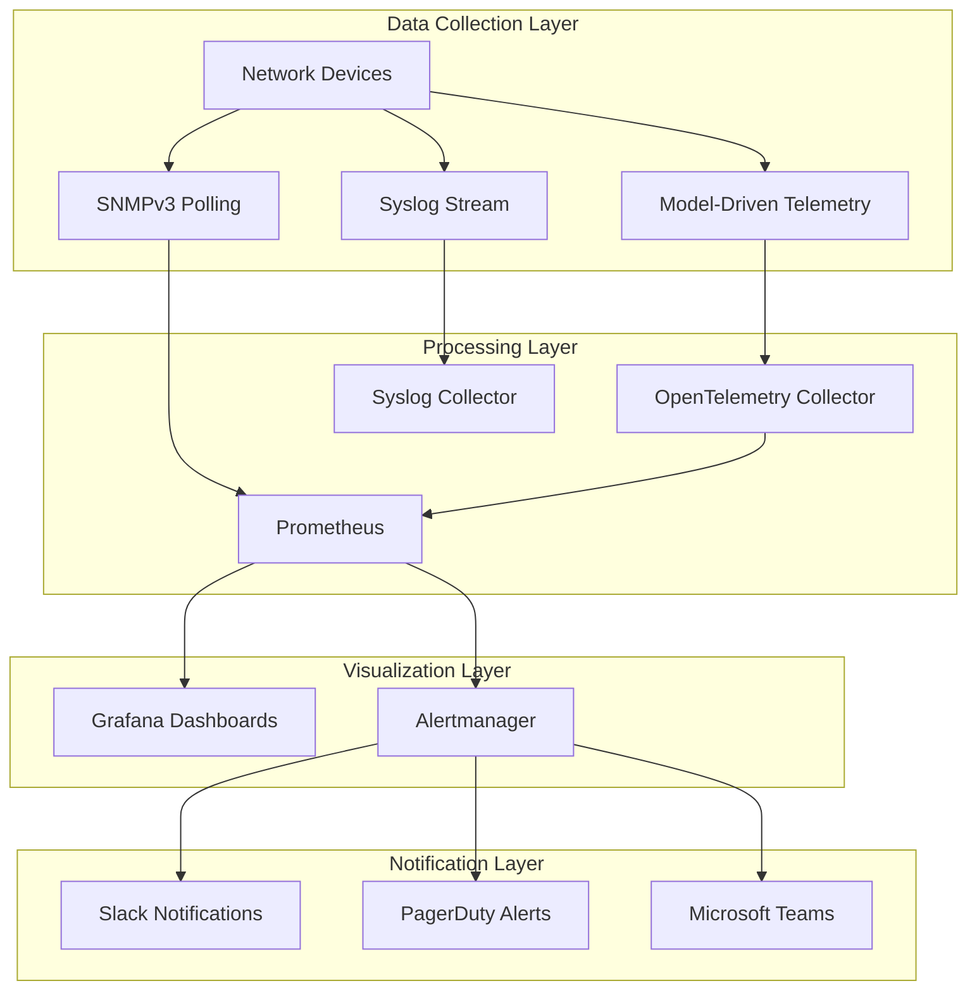
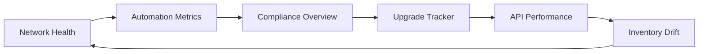
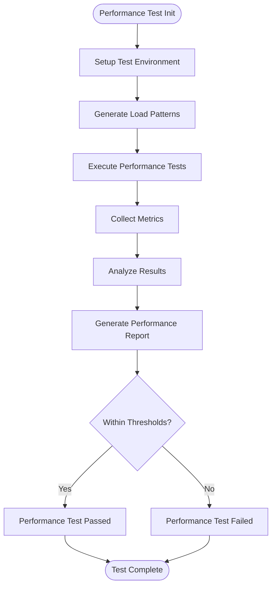
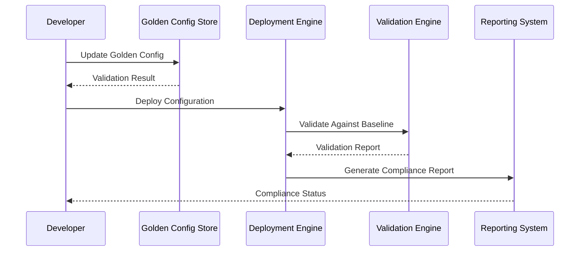
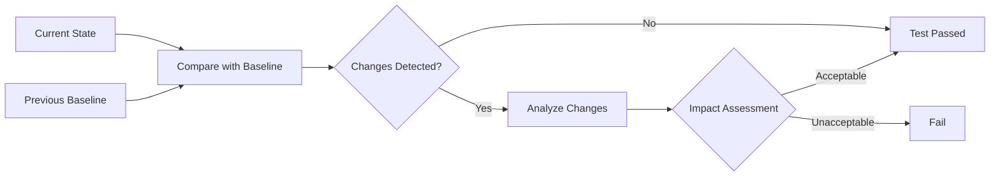
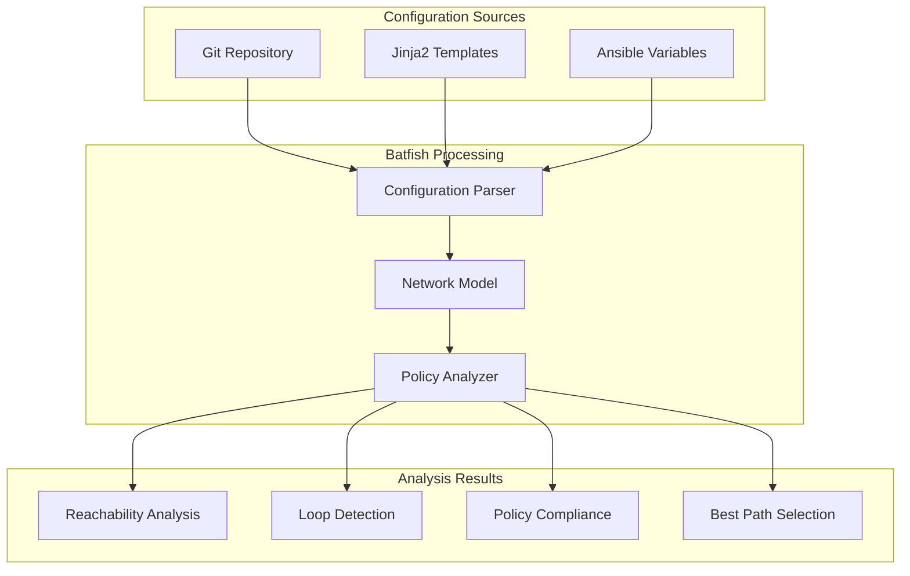
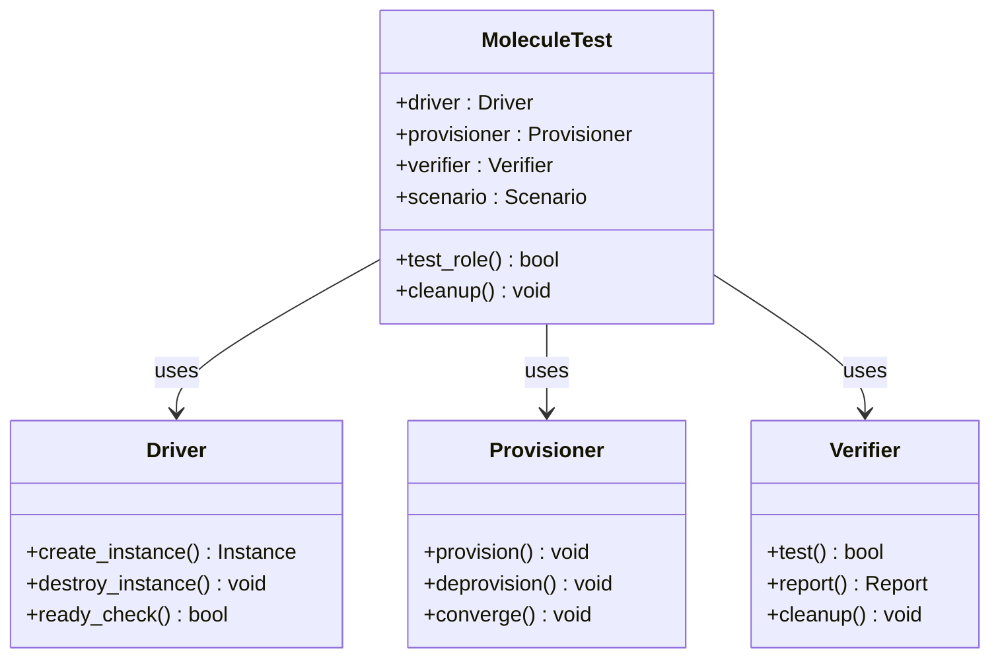
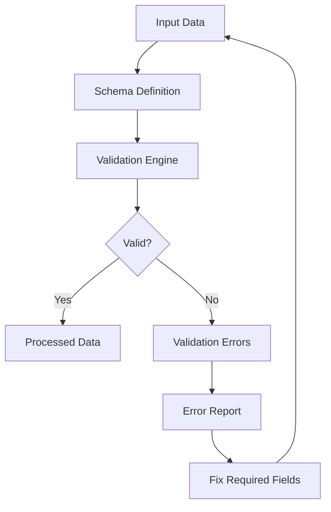

# Operational Excellence

<cite>
**Referenced Files in This Document**
- [README.md](file://README.md)
</cite>

## Table of Contents
1. [Introduction](#introduction)
2. [Testing Strategy](#testing-strategy)
3. [Compliance Strategy](#compliance-strategy)
4. [Monitoring and Observability](#monitoring-and-observability)
5. [Dashboard Architecture](#dashboard-architecture)
6. [Troubleshooting Guide](#troubleshooting-guide)
7. [Performance Testing](#performance-testing)
8. [Integration Testing](#integration-testing)
9. [Golden Configuration Validation](#golden-configuration-validation)
10. [Regression Testing](#regression-testing)
11. [Network Simulation with Batfish](#network-simulation-with-batfish)
12. [Molecule Role Testing](#molecule-role-testing)
13. [Schema Validation](#schema-validation)
14. [Linting and Code Quality](#linting-and-code-quality)
15. [Conclusion](#conclusion)

## Introduction

The Enterprise Network Automation Platform represents a production-grade, vendor-agnostic solution designed to manage thousands of network devices across multi-vendor, multi-region environments. This platform demonstrates Infrastructure as Code, GitOps, CI/CD, compliance enforcement, observability, and security — built for enterprise scale at Fortune 100 organizations including banks, telecoms, and cloud-native enterprises.

The platform operates on core principles that ensure operational excellence:
- **Network as Code**: All device configurations generated from Jinja2 templates + structured data
- **Infrastructure as Code**: Terraform for cloud networking, Ansible for device automation
- **GitOps**: Pull requests trigger validation, approval, deployment, and verification
- **DevSecOps**: Secrets scanning, policy enforcement, and compliance in every pipeline
- **Compliance as Code**: Automated checks for SSH-only, NTP, AAA, SNMPv3, cipher standards
- **Monitoring as Code**: Prometheus, Grafana, OpenTelemetry dashboards defined in Git
- **Testing as Code**: pytest, Molecule, Batfish, pyATS, linting, schema validation
- **Documentation as Code**: Architecture diagrams, runbooks, and API docs auto-generated

## Testing Strategy

The platform implements a comprehensive testing strategy that ensures code quality, configuration correctness, and system reliability across all development stages.

### Test Pyramid Architecture



**Diagram sources**
- [README.md:517-544](file://README.md#L517-L544)

### Unit Testing Framework

The unit testing framework uses pytest to validate Python modules, Jinja2 filters, and template rendering logic. Tests are executed on every pull request to ensure code quality and prevent regressions.

**Section sources**
- [README.md:517-544](file://README.md#L517-L544)

## Compliance Strategy

Compliance is enforced at every stage from pull request to production runtime through automated policy checks and continuous monitoring.

### Compliance Policy Matrix

| Policy | Check | Severity | Enforcement Point |
|--------|-------|----------|-------------------|
| SSH Only | No Telnet configuration allowed | Critical | PR Review |
| NTP Configured | All devices must have NTP | High | Pre-deployment |
| AAA Enabled | TACACS+ or RADIUS required | Critical | Runtime |
| SNMPv3 | No SNMPv1/v2c allowed | High | PR Review |
| Logging Enabled | Syslog must be configured | Medium | Runtime |
| Approved Ciphers | Only approved cipher suites in SSH/TLS | High | PR Review |
| Approved Firmware | Device OS must be on approved list | High | Runtime |
| Password Policy | Minimum length, complexity, rotation | Critical | Runtime |
| ACL Standards | Default deny, explicit allow only | High | PR Review |
| Firewall Rules | No any-any, shadow/duplicate detection | Critical | PR Review |
| Unused Objects | Detect and flag unused ACLs, rules, objects | Low | Scheduled |

### Compliance Enforcement Flow



**Diagram sources**
- [README.md:568-579](file://README.md#L568-L579)

**Section sources**
- [README.md:548-579](file://README.md#L548-L579)

## Monitoring and Observability

The platform implements a comprehensive monitoring and observability architecture using industry-standard tools to provide real-time insights into network health, automation performance, and compliance status.

### Monitoring Architecture



**Diagram sources**
- [README.md:587-604](file://README.md#L587-L604)

### Key Metrics Collection Points

- **Device Health**: CPU utilization, memory usage, interface status, temperature
- **Automation Performance**: Job success/failure rates, execution time, queue depth
- **Compliance Status**: Policy violations by severity, drift detection, remediation progress
- **Network Performance**: Latency, throughput, packet loss, error rates
- **Security Events**: Authentication failures, unauthorized access attempts, policy violations

**Section sources**
- [README.md:583-616](file://README.md#L583-L616)

## Dashboard Architecture

The platform provides six primary dashboards that offer comprehensive visibility into network operations, automation performance, and compliance status.

### Dashboard Overview

| Dashboard | Purpose | Key Metrics | Refresh Rate |
|-----------|---------|-------------|--------------|
| **Network Health** | Device up/down, CPU, memory, interface status | Device availability, resource utilization, interface errors | 30 seconds |
| **Automation Metrics** | Job success/failure rates, execution time, drift count | Pipeline success rate, job duration, configuration drift | 1 minute |
| **Compliance Overview** | Policy violations by severity, trend over time | Violation counts, remediation progress, policy coverage | 5 minutes |
| **Upgrade Tracker** | Firmware versions across fleet, upgrade progress | Version distribution, upgrade completion, rollback events | 1 hour |
| **API Performance** | Bot endpoint latency, error rates, throughput | Response times, error rates, request volume | 1 minute |
| **Inventory Drift** | Detected drift between Git and running config | Drift count, affected devices, drift categories | 15 minutes |

### Dashboard Interconnections



**Diagram sources**
- [README.md:606-616](file://README.md#L606-L616)

**Section sources**
- [README.md:606-616](file://README.md#L606-L616)

## Troubleshooting Guide

This section provides comprehensive troubleshooting guidance for common issues encountered in the Enterprise Network Automation Platform.

### Connection and Connectivity Issues

| Issue | Symptoms | Resolution Steps |
|-------|----------|------------------|
| Ansible connection timeout | Connection refused, timeout errors | Verify SSH reachability: `ansible all -m ping -i inventories/lab/hosts.yml` |
| Device authentication failure | Login prompts, permission denied | Check credentials in secrets backend, verify AAA configuration |
| Protocol negotiation errors | NETCONF/RESTCONF handshake failures | Validate protocol support, check firewall rules, verify certificates |

### Template and Configuration Issues

| Issue | Symptoms | Resolution Steps |
|-------|----------|------------------|
| Template rendering error | Jinja2 syntax errors, missing variables | Check Jinja2 syntax: `python -m python.config_gen --debug --device <name>` |
| Variable resolution failure | Undefined variable errors | Validate inventory structure, check variable precedence |
| Vendor-specific syntax errors | Platform-specific command failures | Review vendor templates, check platform compatibility |

### Compliance and Policy Issues

| Issue | Symptoms | Resolution Steps |
|-------|----------|------------------|
| Compliance check failure | Policy violation reports | Review `compliance/` policies and device running config diff |
| Policy engine errors | OPA/Sentinel evaluation failures | Check policy syntax, validate input data structure |
| Remediation conflicts | Conflicting policy requirements | Review policy definitions, update conflicting rules |

### CI/CD Pipeline Issues

| Issue | Symptoms | Resolution Steps |
|-------|----------|------------------|
| CI pipeline failure | GitHub Actions workflow failures | Check GitHub Actions logs; most failures include actionable error messages |
| Secret retrieval failure | Vault/Secrets Manager authentication errors | Verify OIDC token or AppRole credentials; check Vault policies |
| Test environment setup failure | Docker/Podman container issues | Ensure Docker/Podman is running; check `molecule/default/molecule.yml` |

### Monitoring and Alerting Issues

| Issue | Symptoms | Resolution Steps |
|-------|----------|------------------|
| Metric collection gaps | Missing data points, stale metrics | Check collector health, verify device connectivity, review scrape intervals |
| Alert notification failures | Missing notifications, delayed alerts | Verify Alertmanager configuration, check notification channel connectivity |
| Dashboard display errors | Empty panels, incorrect values | Validate PromQL queries, check metric names, verify data retention |

### Advanced Troubleshooting Commands

```bash
# Comprehensive connectivity test
ansible all -m ping -i inventories/lab/hosts.yml -vvv

# Template debugging
python -m python.config_gen --debug --device <device-name> --output ./debug-output/

# Compliance analysis
python -m python.compliance --inventory inventories/lab/hosts.yml --verbose

# Configuration backup and comparison
ansible-playbook playbooks/backup.yml -i inventories/lab/hosts.yml
diff -u current-config.cfg baseline-config.cfg

# Monitoring system health
curl -s http://localhost:9090/api/v1/status/config | jq .
curl -s http://localhost:3000/api/health | jq .
```

**Section sources**
- [README.md:674-685](file://README.md#L674-L685)

## Performance Testing

The platform includes comprehensive performance testing capabilities to ensure scalability and reliability under load conditions.

### Performance Testing Framework



### Key Performance Indicators

- **API Response Time**: Target < 200ms for bot endpoints
- **Throughput**: Support 1000+ concurrent automation jobs
- **Resource Utilization**: CPU < 80%, Memory < 85% under load
- **Configuration Generation**: < 1 second per device template render
- **Compliance Scanning**: < 5 minutes for 1000+ devices

### Load Testing Tools

- **Locust**: HTTP API load testing for bot endpoints
- **Custom Scripts**: Network automation workload simulation
- **JMeter**: Database and external service performance testing
- **Custom Benchmarks**: Template rendering and configuration generation benchmarks

**Section sources**
- [README.md:529](file://README.md#L529)

## Integration Testing

Integration tests validate the interaction between different components of the automation platform and ensure end-to-end functionality.

### Integration Test Categories

| Category | Scope | Tools | Frequency |
|----------|-------|-------|-----------|
| **Device Connectivity** | SSH, NETCONF, RESTCONF protocols | Netmiko, NAPALM, Paramiko | Every PR |
| **Configuration Deployment** | Playbook execution, template rendering | Ansible, Jinja2 | Staging deploy |
| **Secret Management** | Vault integration, credential rotation | HashiCorp Vault SDK | Daily |
| **Monitoring Integration** | Metric collection, alert generation | Prometheus client, OpenTelemetry | Continuous |
| **External Service Integration** | Cloud APIs, third-party services | Provider SDKs | Weekly |

### Integration Test Execution

```bash
# Run all integration tests
pytest tests/integration/ -v --tb=short

# Run device connectivity tests
pytest tests/integration/connectivity/ -v

# Run configuration deployment tests
pytest tests/integration/deployment/ -v

# Run secret management tests
pytest tests/integration/secrets/ -v
```

**Section sources**
- [README.md:526](file://README.md#L526)

## Golden Configuration Validation

Golden configuration validation ensures that deployed configurations match approved baselines and maintain consistency across the network fleet.

### Golden Configuration Process



### Validation Criteria

- **Syntax Validation**: Configuration syntax correctness
- **Semantic Validation**: Logical consistency and best practices
- **Compliance Validation**: Policy adherence and security requirements
- **Compatibility Validation**: Multi-vendor compatibility and dependencies
- **Performance Validation**: Impact on device performance and resources

### Golden Configuration Management

- **Version Control**: All golden configs stored in Git with change history
- **Approval Workflow**: Peer review and CAB approval for baseline changes
- **Rollback Capability**: Automatic rollback to previous golden config on validation failure
- **Drift Detection**: Continuous monitoring for configuration drift from baseline

**Section sources**
- [README.md:527](file://README.md#L527)

## Regression Testing

Regression testing ensures that changes do not introduce unintended side effects or break existing functionality.

### Regression Test Strategy

| Test Type | Scope | Approach | Frequency |
|-----------|-------|----------|-----------|
| **Configuration Regression** | Device configuration changes | Snapshot comparison, diff analysis | Every PR |
| **Template Regression** | Jinja2 template modifications | Rendered output comparison | Every PR |
| **Playbook Regression** | Ansible playbook changes | Dry-run validation, state comparison | Every PR |
| **API Regression** | Bot endpoint modifications | Contract testing, response validation | Every PR |
| **Integration Regression** | Cross-component interactions | End-to-end workflow testing | Daily |

### Snapshot-Based Testing



### Regression Test Execution

```bash
# Run all regression tests
pytest tests/regression/ -v --tb=short

# Run configuration regression tests
pytest tests/regression/config/ -v

# Run template regression tests
pytest tests/regression/templates/ -v

# Generate regression report
pytest tests/regression/ --junitxml=regression-report.xml
```

**Section sources**
- [README.md:528](file://README.md#L528)

## Network Simulation with Batfish

Batfish provides network simulation and analysis capabilities to validate network configurations before deployment, ensuring network stability and policy compliance.

### Batfish Integration Architecture



### Network Analysis Capabilities

- **Reachability Analysis**: Verify traffic flow paths and connectivity
- **Loop Detection**: Identify routing loops and forwarding anomalies
- **Policy Compliance**: Validate ACLs, firewall rules, and security policies
- **Best Path Selection**: Analyze routing decisions and path optimization
- **Configuration Consistency**: Ensure consistent configuration across devices
- **Change Impact Analysis**: Assess impact of configuration changes

### Batfish Test Execution

```bash
# Initialize Batfish analysis
python -m tests.batfish.init

# Run reachability analysis
python -m tests.batfish.reachability --src 10.0.1.1 --dst 10.0.2.1

# Validate firewall rules
python -m tests.batfish.firewall --rules firewall-rules.yaml

# Analyze routing convergence
python -m tests.batfish.routing --topology topology.yaml
```

**Section sources**
- [README.md:525](file://README.md#L525)

## Molecule Role Testing

Molecule provides role testing capabilities to validate Ansible roles in isolated environments, ensuring role functionality and idempotency.

### Molecule Testing Framework



### Role Testing Categories

| Category | Purpose | Test Cases |
|----------|---------|------------|
| **Installation** | Role installation and dependency resolution | Package installation, service startup |
| **Configuration** | Configuration application and validation | Config file creation, parameter validation |
| **Idempotency** | Multiple runs produce same result | Repeated execution, state preservation |
| **Error Handling** | Failure scenarios and recovery | Invalid inputs, missing dependencies |
| **Cleanup** | Resource cleanup and teardown | Temporary files, services, users |

### Molecule Test Execution

```bash
# Run Molecule tests for specific role
cd roles/cisco_ios_baseline
molecule test

# Run tests with specific driver
molecule test --driver-name docker

# Run tests with specific scenario
molecule test --scenario-name default

# Destroy test instances
molecule destroy
```

**Section sources**
- [README.md:524](file://README.md#L524)

## Schema Validation

Schema validation ensures data integrity and consistency across inventory files, configuration variables, and automation artifacts.

### Schema Validation Framework



### Supported Schemas

| Schema Type | Location | Purpose | Validation Tool |
|-------------|----------|---------|-----------------|
| **Inventory Schema** | `schemas/inventory.json` | Device inventory structure | jsonschema |
| **Group Variables Schema** | `schemas/group_vars.json` | Shared variable definitions | cerberus |
| **Host Variables Schema** | `schemas/host_vars.json` | Per-device variable definitions | cerberus |
| **Template Schema** | `schemas/templates.json` | Jinja2 template metadata | custom validator |
| **Playbook Schema** | `schemas/playbooks.json` | Ansible playbook structure | ansible-lint |

### Schema Validation Execution

```bash
# Validate inventory schema
python -m scripts.validate_schema --type inventory --file inventories/production/hosts.yml

# Validate group variables
python -m scripts.validate_schema --type group_vars --file group_vars/all.yml

# Validate host variables
python -m scripts.validate_schema --type host_vars --file host_vars/core-rtr-01.yml

# Validate all schemas
python -m scripts.validate_all_schemas
```

**Section sources**
- [README.md:523](file://README.md#L523)

## Linting and Code Quality

Comprehensive linting and code quality checks ensure consistent code style, catch potential issues early, and maintain high-quality automation code.

### Linting Tools and Configuration

| Tool | Purpose | Configuration | Scope |
|------|---------|---------------|-------|
| **ansible-lint** | Ansible playbook and role validation | `.ansible-lint` | All YAML, playbooks, roles |
| **yamllint** | YAML syntax and style validation | `.yamllint` | All YAML files |
| **flake8** | Python code style and quality | `.flake8` | All Python files |
| **black** | Python code formatting | `pyproject.toml` | All Python files |
| **pre-commit** | Git hook automation | `.pre-commit-config.yaml` | All staged files |

### Code Quality Metrics

- **Code Coverage**: Target > 80% for Python modules
- **Complexity Score**: Maintain cyclomatic complexity < 10
- **Line Length**: Maximum 120 characters for Python, 80 for YAML
- **Naming Conventions**: PEP 8 for Python, snake_case for variables
- **Documentation**: Docstrings for all functions and classes

### Linting Execution

```bash
# Run all linters
pre-commit run --all-files

# Run specific linters
ansible-lint playbooks/
yamllint .
flake8 python/
black --check python/

# Auto-fix formatting issues
black python/
isort python/
```

**Section sources**
- [README.md:522](file://README.md#L522)

## Conclusion

The Enterprise Network Automation Platform establishes comprehensive operational excellence practices through a multi-layered approach to testing, compliance, monitoring, and quality assurance. The platform's design ensures that every aspect of network automation is validated, monitored, and maintained according to enterprise-grade standards.

Key operational excellence achievements include:

- **Comprehensive Testing Strategy**: From unit tests to integration tests, ensuring code and configuration quality
- **Continuous Compliance Enforcement**: Automated policy checks at every stage from development to production
- **Advanced Monitoring and Observability**: Real-time visibility into network health, automation performance, and compliance status
- **Robust Troubleshooting Framework**: Systematic approaches to identifying and resolving operational issues
- **Performance and Scalability**: Load testing and capacity planning to support enterprise-scale operations
- **Quality Assurance**: Linting, schema validation, and code quality checks maintaining high standards

This operational excellence framework enables the platform to reliably manage thousands of network devices while maintaining security, compliance, and performance standards required by Fortune 100 organizations.