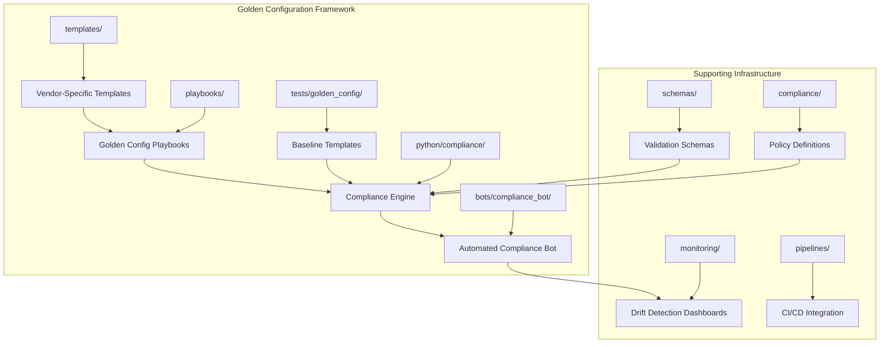
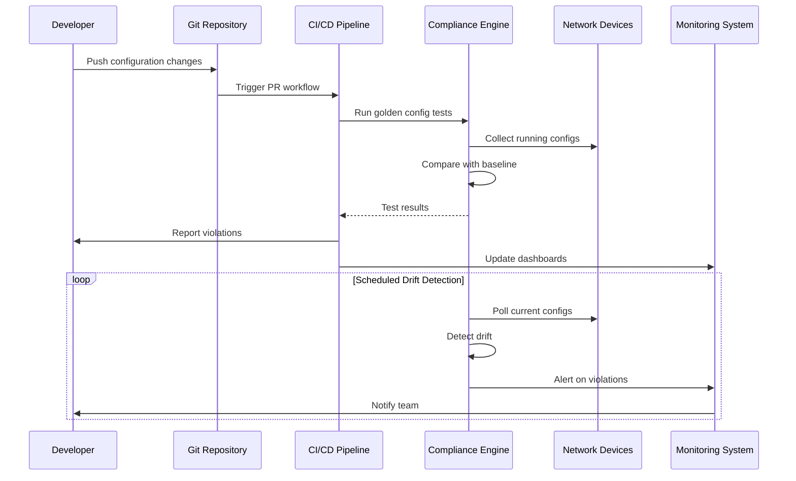
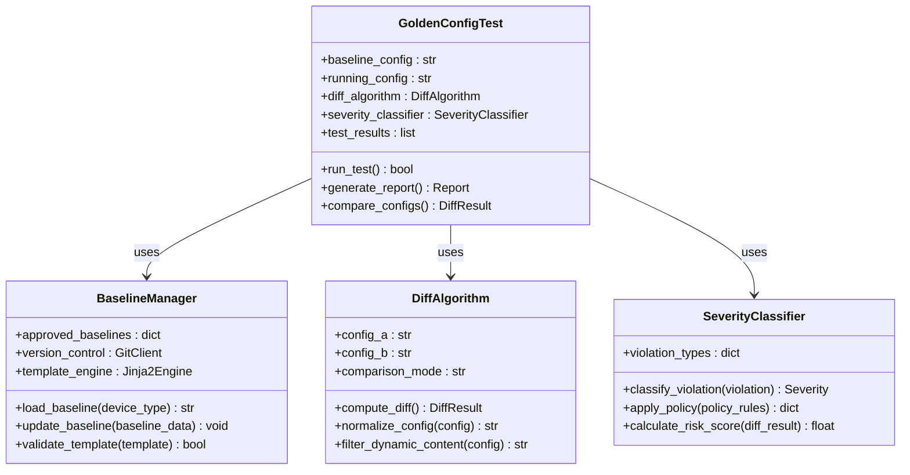
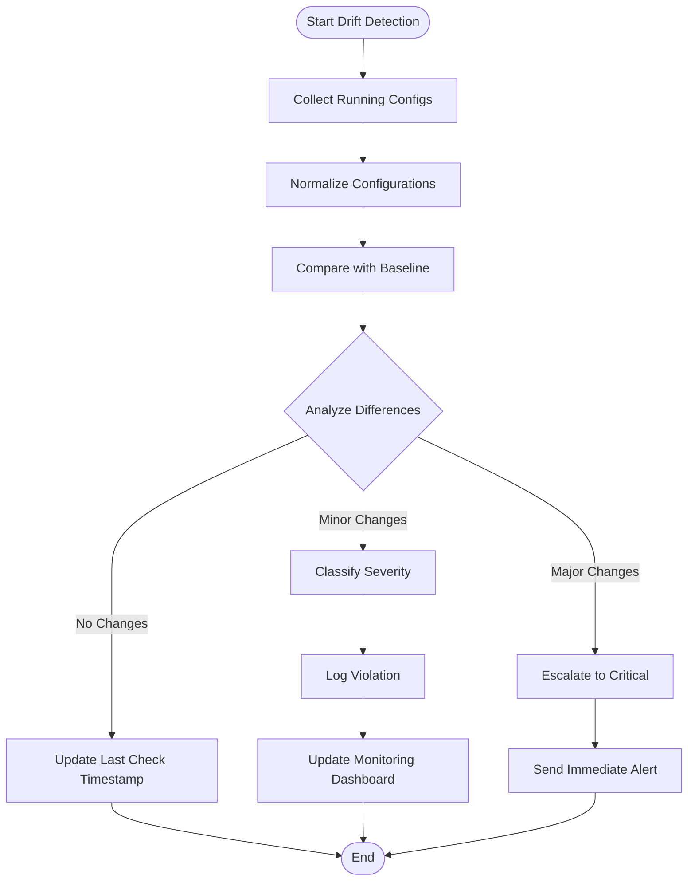
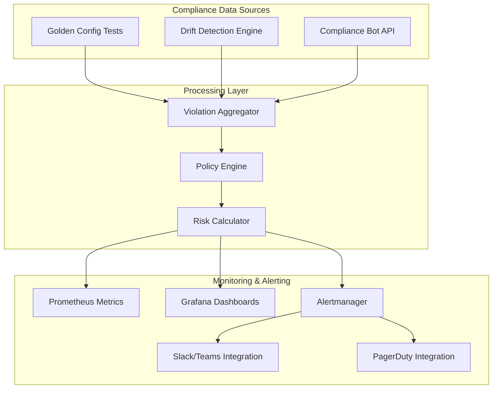
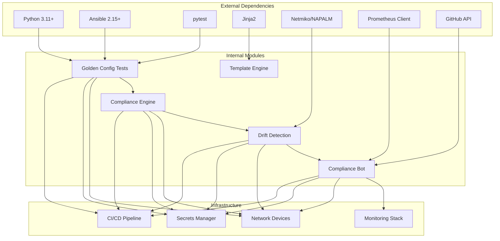

# Golden Config Testing

<cite>
**Referenced Files in This Document**
- [README.md](file://README.md)
</cite>

## Table of Contents
1. [Introduction](#introduction)
2. [Project Structure](#project-structure)
3. [Core Components](#core-components)
4. [Architecture Overview](#architecture-overview)
5. [Detailed Component Analysis](#detailed-component-analysis)
6. [Dependency Analysis](#dependency-analysis)
7. [Performance Considerations](#performance-considerations)
8. [Troubleshooting Guide](#troubleshooting-guide)
9. [Conclusion](#conclusion)

## Introduction

Golden configuration testing and baseline validation form the cornerstone of enterprise network automation, ensuring that all deployed configurations adhere to approved standards and security policies. This comprehensive system implements Infrastructure as Code principles to maintain configuration consistency across thousands of network devices in multi-vendor, multi-region environments.

The platform establishes approved configuration baselines through GitOps workflows, performs automated drift detection between Git state and running configurations, and provides sophisticated violation reporting mechanisms. It leverages advanced diff algorithms for configuration comparison, implements severity classification of deviations, and supports automated remediation workflows integrated with compliance monitoring systems.

## Project Structure

The golden configuration testing framework is organized within a modular architecture that separates concerns across multiple directories and components:

**Diagram sources**
- [README.md:105-180](file://README.md#L105-L180)
- [README.md:152-158](file://README.md#L152-L158)

**Section sources**
- [README.md:105-180](file://README.md#L105-L180)

## Core Components

The golden configuration testing system comprises several interconnected components that work together to ensure configuration compliance and detect drift:

### Golden Configuration Test Suite
The test suite under `tests/golden_config/` implements custom Python-based golden configuration testing that compares device configurations against approved baselines. These tests run during every pull request and on scheduled intervals to maintain continuous compliance.

### Compliance Engine
Located in `python/compliance/`, this engine provides pluggable rule sets for validating configurations against organizational policies. It supports multiple compliance frameworks and can be extended with custom checks.

### Automated Compliance Bot
The `bots/compliance_bot/` component exposes REST APIs for running compliance scans and reporting violations. It integrates with GitHub for automated compliance checking and Slack/Teams for real-time notifications.

### Golden Configuration Playbooks
Ansible playbooks under `playbooks/` include `golden_config.yml` for applying golden configuration baselines and `drift_detection.yml` for detecting configuration drift from approved baselines.

### Vendor-Specific Templates
Jinja2 templates under `templates/` provide vendor-specific golden configuration implementations for Cisco IOS, NX-OS, Juniper SRX/MX, Arista EOS, Palo Alto, Fortinet, and other supported platforms.

**Section sources**
- [README.md:152-158](file://README.md#L152-L158)
- [README.md:426-428](file://README.md#L426-L428)
- [README.md:453](file://README.md#L453)
- [README.md:470](file://README.md#L470)

## Architecture Overview

The golden configuration testing architecture follows a GitOps model where all configuration changes flow through version control and automated validation pipelines:

**Diagram sources**
- [README.md:36-50](file://README.md#L36-L50)
- [README.md:483-501](file://README.md#L483-L501)

The architecture implements multiple layers of validation:

1. **Pre-deployment Validation**: Golden config tests run during pull requests to catch issues before deployment
2. **Post-deployment Verification**: Automated verification ensures deployed configurations match expected state
3. **Continuous Monitoring**: Scheduled drift detection identifies unauthorized changes
4. **Automated Remediation**: Optional self-healing capabilities restore compliant configurations

**Section sources**
- [README.md:36-50](file://README.md#L36-L50)
- [README.md:483-501](file://README.md#L483-L501)

## Detailed Component Analysis

### Golden Configuration Test Framework

The golden configuration testing framework implements a sophisticated comparison engine that validates device configurations against approved baselines:

**Diagram sources**
- [README.md:526-527](file://README.md#L526-L527)
- [README.md:453](file://README.md#L453)

#### Key Features:
- **Multi-format Support**: Handles Cisco IOS, NX-OS, Juniper, Arista, and other vendor formats
- **Intelligent Comparison**: Filters out dynamic content (timestamps, serial numbers) while preserving structural differences
- **Severity Classification**: Categorizes violations by impact level (Critical, High, Medium, Low)
- **Comprehensive Reporting**: Generates detailed reports with actionable remediation steps

### Drift Detection Engine

The drift detection system continuously monitors for unauthorized configuration changes:

**Diagram sources**
- [README.md:427](file://README.md#L427)
- [README.md:615](file://README.md#L615)

#### Drift Detection Process:
1. **Configuration Collection**: Uses SSH, NETCONF, or API calls to retrieve current device configurations
2. **Normalization**: Removes device-specific formatting and dynamic content
3. **Comparison**: Performs intelligent diff analysis against approved baselines
4. **Classification**: Applies policy rules to determine violation severity
5. **Reporting**: Updates dashboards and sends alerts based on severity levels

### Compliance Monitoring Integration

The system integrates with enterprise monitoring and alerting infrastructure:

**Diagram sources**
- [README.md:587-604](file://README.md#L587-L604)
- [README.md:470](file://README.md#L470)

#### Integration Points:
- **Prometheus Metrics**: Exposes compliance scores, violation counts, and drift metrics
- **Grafana Dashboards**: Provides visual monitoring of compliance status and trends
- **Alertmanager**: Routes alerts to appropriate channels based on severity and context
- **ChatOps Integration**: Real-time notifications via Slack and Microsoft Teams
- **Incident Management**: Integration with PagerDuty for critical compliance violations

**Section sources**
- [README.md:526-527](file://README.md#L526-L527)
- [README.md:427](file://README.md#L427)
- [README.md:587-604](file://README.md#L587-L604)

## Dependency Analysis

The golden configuration testing system has well-defined dependencies and integration points:

**Diagram sources**
- [README.md:184-199](file://README.md#L184-L199)
- [README.md:438-456](file://README.md#L438-L456)

### Key Dependencies:

**Core Technologies:**
- Python 3.11+ for automation logic and testing frameworks
- Ansible 2.15+ for configuration management and orchestration
- pytest for unit and integration testing
- Jinja2 for template rendering and configuration generation

**Network Connectivity:**
- Netmiko/NAPALM for multi-vendor device connectivity
- SSH, NETCONF, RESTCONF protocols for configuration access
- SNMPv3 for monitoring and telemetry collection

**Integration Services:**
- Prometheus client for metrics export
- GitHub API for CI/CD integration and pull request validation
- Secrets managers for secure credential handling

**Section sources**
- [README.md:184-199](file://README.md#L184-L199)
- [README.md:438-456](file://README.md#L438-L456)

## Performance Considerations

The golden configuration testing system is designed for enterprise-scale operations with performance optimization at its core:

### Scalability Architecture
- **Parallel Processing**: Concurrent configuration collection and comparison across thousands of devices
- **Incremental Updates**: Only affected configurations are revalidated when changes occur
- **Caching Strategy**: Approved baselines and device metadata are cached to reduce API calls
- **Batch Operations**: Grouped device operations minimize connection overhead

### Resource Optimization
- **Memory Management**: Streaming configuration processing prevents memory exhaustion
- **Connection Pooling**: Reuses network connections for improved throughput
- **Asynchronous Processing**: Non-blocking operations for better resource utilization
- **Load Balancing**: Distributes workload across multiple worker nodes

### Monitoring and Observability
- **Performance Metrics**: Tracks execution time, success rates, and resource usage
- **Bottleneck Identification**: Monitors slow operations and connection timeouts
- **Capacity Planning**: Historical data for scaling decisions and resource allocation

## Troubleshooting Guide

Common issues and their resolutions in the golden configuration testing framework:

### Configuration Collection Issues
- **Connection Timeouts**: Verify SSH reachability and firewall rules using `ansible all -m ping`
- **Authentication Failures**: Check secrets manager integration and credential rotation policies
- **Protocol Compatibility**: Ensure device supports required protocols (SSH, NETCONF, RESTCONF)

### Template Rendering Problems
- **Syntax Errors**: Validate Jinja2 templates using `python -m python.config_gen --debug --device <name>`
- **Variable Resolution**: Check inventory variables and group/host variable precedence
- **Vendor Compatibility**: Verify template compatibility with target device platform

### Compliance Check Failures
- **Policy Conflicts**: Review compliance policies in `compliance/` directory for conflicting rules
- **Baseline Mismatches**: Validate approved baselines against current device configurations
- **Severity Thresholds**: Adjust policy thresholds based on operational requirements

### CI/CD Integration Issues
- **Pipeline Failures**: Check GitHub Actions logs for specific error messages and stack traces
- **Secret Access**: Verify OIDC token configuration and secrets manager permissions
- **Environment Setup**: Ensure Docker/Podman is running for Molecule tests

### Monitoring and Alerting
- **Metric Export**: Verify Prometheus client configuration and endpoint accessibility
- **Dashboard Updates**: Check Grafana data source connectivity and query performance
- **Alert Routing**: Validate Alertmanager configuration and notification channel settings

**Section sources**
- [README.md:674-685](file://README.md#L674-L685)

## Conclusion

The golden configuration testing and baseline validation system provides a comprehensive solution for maintaining configuration compliance across enterprise network environments. By implementing GitOps principles, automated drift detection, and sophisticated compliance monitoring, the platform ensures that network configurations remain consistent, secure, and aligned with organizational policies.

The modular architecture supports multi-vendor environments, scales to thousands of devices, and integrates seamlessly with existing DevSecOps workflows. The combination of pre-deployment validation, continuous monitoring, and automated remediation creates a robust foundation for network automation at scale.

Key benefits include reduced configuration drift, improved security posture, faster incident response, and enhanced operational visibility. The system's extensible design allows organizations to customize compliance rules, integrate with proprietary tools, and adapt to evolving regulatory requirements while maintaining operational efficiency.