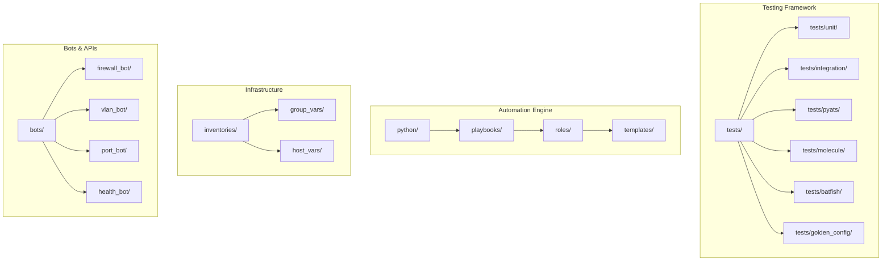
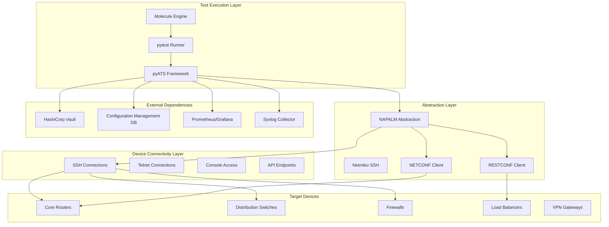
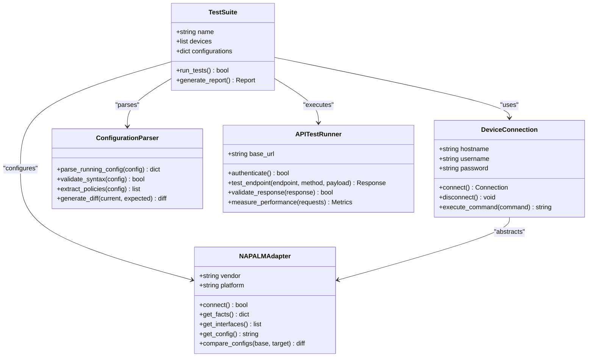
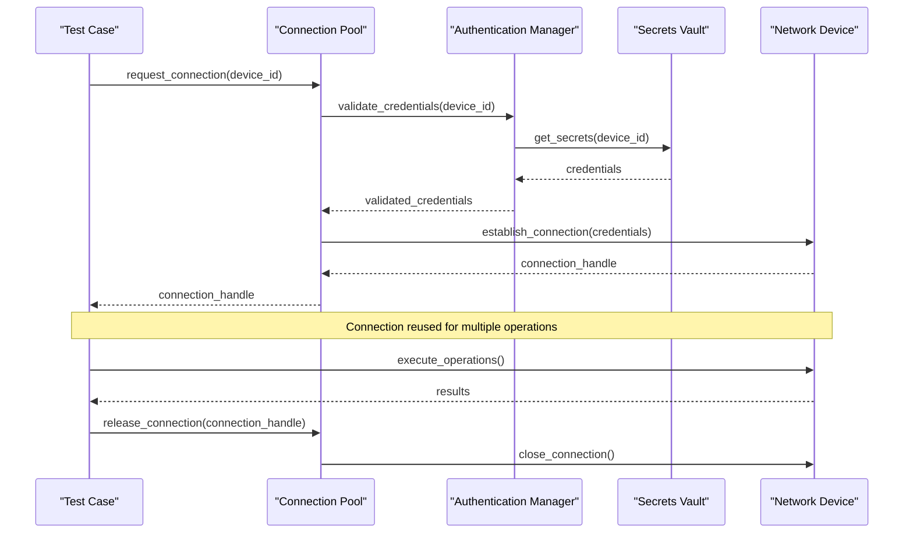
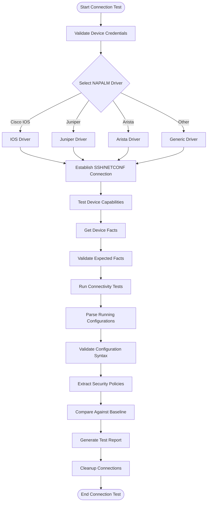
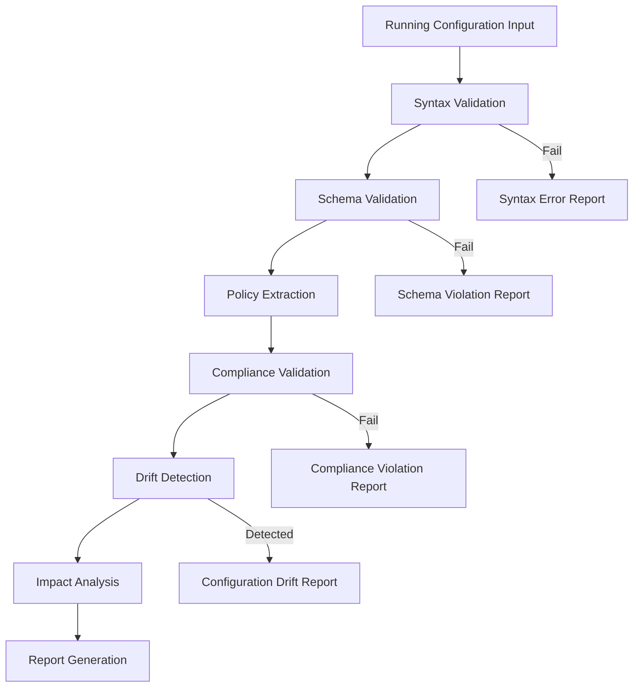
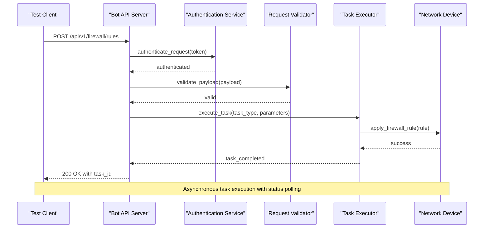
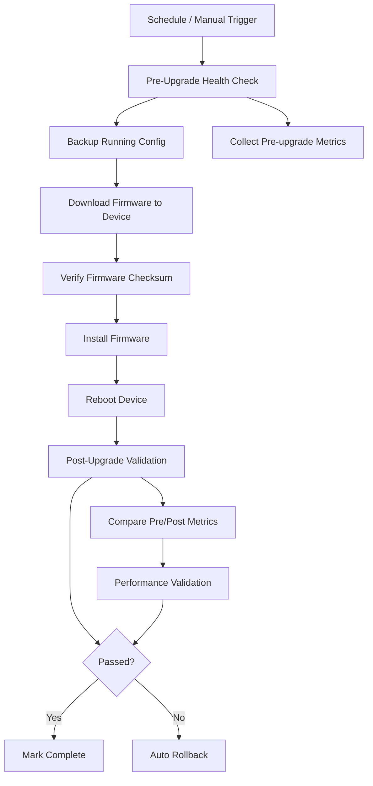
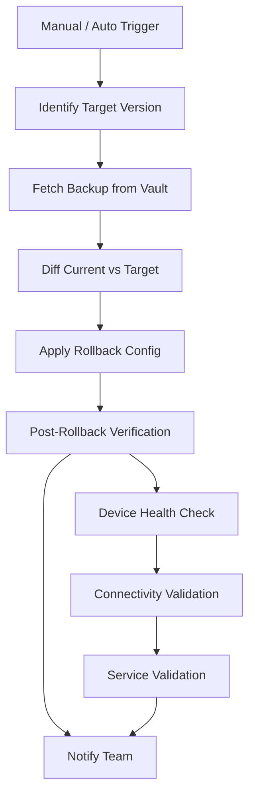
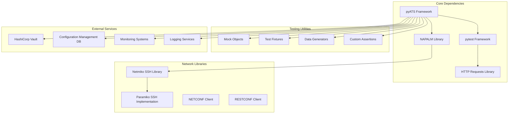

# Integration Testing

<cite>
**Referenced Files in This Document**
- [README.md](file://README.md)
</cite>

## Table of Contents
1. [Introduction](#introduction)
2. [Project Structure](#project-structure)
3. [Core Components](#core-components)
4. [Architecture Overview](#architecture-overview)
5. [Detailed Component Analysis](#detailed-component-analysis)
6. [Dependency Analysis](#dependency-analysis)
7. [Performance Considerations](#performance-considerations)
8. [Troubleshooting Guide](#troubleshooting-guide)
9. [Conclusion](#conclusion)
10. [Appendices](#appendices)

## Introduction

This document provides comprehensive guidance for implementing integration testing using pyATS and NAPALM within the Enterprise Network Automation Platform. The platform is designed as a production-grade, vendor-agnostic solution for managing thousands of network devices across multi-vendor, multi-region environments, demonstrating Infrastructure as Code, GitOps, CI/CD, compliance enforcement, observability, and security at enterprise scale.

The integration testing framework leverages pyATS for test orchestration and NAPALM for vendor-agnostic device connectivity, enabling comprehensive validation of network automation workflows, configuration parsing, API endpoints, and end-to-end processes.

## Project Structure

The platform follows a modular architecture with dedicated directories for different aspects of network automation and testing:



**Diagram sources**
- [README.md:103-180](file://README.md#L103-L180)

**Section sources**
- [README.md:103-180](file://README.md#L103-L180)

## Core Components

The integration testing framework consists of several key components that work together to provide comprehensive network automation testing capabilities:

### Testing Strategy Overview

| Test Type | Tool | Scope | When |
|---|---|---|---|
| **Unit Tests** | pytest | Python modules, Jinja2 filters | Every PR |
| **Linting** | ansible-lint, yamllint, flake8, black | All YAML, Python, Ansible files | Every PR |
| **Schema Validation** | jsonschema, cerberus | Inventory, group_vars, host_vars | Every PR |
| **Role Tests** | Molecule | Individual Ansible roles | Every PR |
| **Network Simulation** | Batfish | ACL, routing, firewall rule analysis | Every PR affecting network config |
| **Integration Tests** | pyATS, NAPALM | Device connectivity, config parsing | Staging deploy |
| **Golden Config Tests** | Custom Python | Diff against approved baseline | Every PR, scheduled |
| **Regression Tests** | pytest + snapshots | Ensure no unintended config changes | Every PR |
| **Performance Tests** | locust, custom | API and bot endpoint load testing | Release candidate |

### Technology Stack for Integration Testing

The platform leverages multiple technologies for comprehensive testing:

- **pyATS**: Test orchestration and framework for network device testing
- **NAPALM**: Vendor-agnostic network abstraction layer for device connectivity
- **pytest**: Python testing framework for unit and integration tests
- **Molecule**: Testing framework for Ansible roles
- **Batfish**: Network configuration analysis and simulation
- **locust**: Performance and load testing for API endpoints

**Section sources**
- [README.md:517-544](file://README.md#L517-L544)

## Architecture Overview

The integration testing architecture follows a layered approach that ensures comprehensive coverage from unit-level validation to end-to-end workflow testing:



**Diagram sources**
- [README.md:34-99](file://README.md#L34-L99)
- [README.md:438-456](file://README.md#L438-L456)

## Detailed Component Analysis

### pyATS Test Suite Architecture

The pyATS framework provides a robust foundation for network device testing with support for multiple protocols and device types:

#### Test Suite Structure



**Diagram sources**
- [README.md:438-456](file://README.md#L438-L456)

#### Test Environment Setup

The platform supports multiple deployment scenarios for integration testing:

1. **Lab Environment**: Physical or virtual network devices
2. **Containerized Lab**: Docker containers simulating network devices
3. **Cloud-based Lab**: Cloud-native network services
4. **Hybrid Environment**: Combination of physical and virtual devices

#### Connection Pooling and Authentication Strategies

The integration testing framework implements sophisticated connection management:



**Diagram sources**
- [README.md:339-368](file://README.md#L339-L368)

### NAPALM Connection Testing

NAPALM provides vendor-agnostic connectivity to network devices through a unified interface:

#### Supported Platforms and Protocols

| Vendor | Platform | Protocol | Status |
|---|---|---|---|
| Cisco | IOS, IOS-XE, NX-OS | SSH, NETCONF, RESTCONF | Supported |
| Juniper | SRX, MX | SSH, NETCONF | Supported |
| Arista | EOS | SSH, eAPI, NETCONF | Supported |
| Palo Alto | PAN-OS | SSH, API | Supported |
| Fortinet | FortiOS | SSH, API | Supported |
| Check Point | Gaia | SSH, API | Supported |
| F5 | BIG-IP | SSH, iControl REST | Supported |
| pfSense | FreeBSD-based | SSH, API | Supported |
| OPNsense | FreeBSD-based | SSH, API | Supported |

#### Connection Testing Workflow



**Diagram sources**
- [README.md:203-226](file://README.md#L203-L226)

### Configuration Parsing Tests

The platform includes comprehensive configuration parsing and validation capabilities:

#### Configuration Validation Pipeline



#### Key Configuration Parsing Features

- **Multi-vendor Support**: Unified parsing across Cisco, Juniper, Arista, and other vendors
- **Policy Extraction**: Automatic extraction of security policies, ACLs, and routing rules
- **Compliance Validation**: Automated checks against organizational security policies
- **Drift Detection**: Comparison between running configuration and desired state
- **Impact Analysis**: Assessment of configuration changes on network behavior

### API Endpoint Testing for Automation Bots

The platform includes comprehensive testing for automation bot APIs:

#### Bot API Testing Framework

| Bot | Endpoints | ChatOps | Purpose |
|---|---|---|---|
| **Firewall Bot** | `/api/v1/firewall/rules` | Slack/Teams | Request, validate, and deploy firewall rules |
| **VLAN Bot** | `/api/v1/vlan` | Slack | Provision VLANs with approval workflow |
| **Port Bot** | `/api/v1/port` | Slack | Enable/disable/configure switch ports |
| **Backup Bot** | `/api/v1/backup` | GitHub | Trigger and schedule device backups |
| **Health Bot** | `/api/v1/health` | Slack/Teams | On-demand health checks across all devices |
| **Compliance Bot** | `/api/v1/compliance` | GitHub | Run compliance scans and report violations |
| **Upgrade Bot** | `/api/v1/upgrade` | Slack | Orchestrate firmware upgrades with rollback |
| **Rollback Bot** | `/api/v1/rollback` | Slack/Teams | One-click rollback to last known good config |
| **ChatOps Bot** | `/api/v1/chatops` | Slack/Teams | Unified command router for all bot operations |
| **Approval Bot** | `/api/v1/approvals` | Slack/Teams | Manage approval workflows for change requests |

#### API Testing Sequence



**Diagram sources**
- [README.md:460-476](file://README.md#L460-L476)

### End-to-End Workflow Validation

The platform supports comprehensive end-to-end workflow testing:

#### Firmware Upgrade Workflow



**Diagram sources**
- [README.md:644-658](file://README.md#L644-L658)

#### Configuration Rollback Workflow



**Diagram sources**
- [README.md:660-670](file://README.md#L660-L670)

## Dependency Analysis

The integration testing framework has well-defined dependencies and relationships:



**Diagram sources**
- [README.md:184-199](file://README.md#L184-L199)

**Section sources**
- [README.md:184-199](file://README.md#L184-L199)

## Performance Considerations

The integration testing framework incorporates several performance optimization strategies:

### Connection Pooling Optimization

- **Connection Reuse**: Maintain persistent connections to frequently accessed devices
- **Connection Limits**: Configure maximum concurrent connections per device type
- **Timeout Management**: Implement appropriate timeouts for different operation types
- **Resource Cleanup**: Ensure proper cleanup of connections and resources

### Test Execution Optimization

- **Parallel Test Execution**: Run independent tests concurrently where possible
- **Test Data Caching**: Cache expensive test data and configuration objects
- **Selective Test Execution**: Run only relevant tests based on code changes
- **Incremental Testing**: Execute tests incrementally rather than full suite runs

### Resource Management

- **Memory Management**: Monitor and optimize memory usage during long-running tests
- **CPU Utilization**: Balance test execution across available CPU cores
- **Network Bandwidth**: Control bandwidth usage during large configuration transfers
- **Storage Optimization**: Efficiently manage test artifacts and logs

## Troubleshooting Guide

Common issues and their resolutions in the integration testing framework:

### Connection Issues

| Issue | Resolution |
|---|---|
| SSH connection timeout | Verify SSH reachability and firewall rules |
| Authentication failure | Check credentials in secrets vault and device configuration |
| Protocol mismatch | Ensure correct NAPALM driver selection for device platform |
| Certificate errors | Validate SSL/TLS certificates for HTTPS connections |

### Test Execution Problems

| Issue | Resolution |
|---|---|
| Test hangs indefinitely | Increase timeout values and check device responsiveness |
| Memory exhaustion | Optimize test data size and implement proper cleanup |
| Concurrent access conflicts | Implement proper locking mechanisms for shared resources |
| Flaky test results | Add retry logic and stabilize test environment |

### Performance Bottlenecks

| Issue | Resolution |
|---|---|
| Slow test execution | Implement parallel execution and connection pooling |
| High memory usage | Optimize data structures and implement streaming processing |
| Network saturation | Throttle test execution and implement backoff strategies |
| Disk I/O bottlenecks | Use in-memory storage where possible and optimize logging |

**Section sources**
- [README.md:674-685](file://README.md#L674-L685)

## Conclusion

The integration testing framework using pyATS and NAPALM provides comprehensive coverage for network automation validation across multi-vendor environments. The framework supports various testing scenarios including device connectivity validation, configuration parsing, API endpoint testing, and end-to-end workflow validation.

Key benefits include:

- **Vendor Agnostic Testing**: Unified testing approach across multiple network vendors
- **Comprehensive Coverage**: From unit-level to end-to-end workflow testing
- **Production-Ready**: Designed for enterprise-scale deployment with proper error handling and monitoring
- **Flexible Architecture**: Modular design supporting various deployment scenarios and testing requirements

The framework integrates seamlessly with the existing CI/CD pipeline, providing automated validation at every stage of the development lifecycle while maintaining high performance and reliability standards.

## Appendices

### A. Installation and Setup

#### Prerequisites

- Python 3.11+
- Ansible 2.15+
- Terraform 1.5+
- Git with LFS support
- Access to HashiCorp Vault or configured secrets backend

#### Bootstrap Process

```bash
# Clone the repository
git clone https://github.com/<org>/network-automation.git
cd network-automation

# Create and activate virtual environment
python -m venv .venv
source .venv/bin/activate  # Linux/macOS
# .venv\Scripts\activate   # Windows

# Install Python dependencies
pip install -r requirements.txt

# Install Ansible collections
ansible-galaxy collection install -r requirements.yml

# Install pre-commit hooks
pre-commit install

# Validate setup
python scripts/validate_environment.py
```

### B. Running Tests

#### Basic Test Execution

```bash
# Run all tests
pytest tests/ -v --tb=short

# Run only unit tests
pytest tests/unit/ -v

# Run compliance tests
pytest tests/compliance/ -v

# Run Molecule tests for a specific role
cd roles/cisco_ios_baseline
molecule test
```

#### pyATS Specific Commands

```bash
# Run pyATS test suite
ats run-test tests/pyats/test_suite.yaml

# Generate test reports
ats generate-report --format html --output ./reports/

# Run specific test cases
ats run-test tests/pyats/connectivity_test.yaml --device core-rtr-01
```

### C. Configuration Examples

#### Device Inventory Configuration

```yaml
# inventories/lab/hosts.yml
all:
  children:
    core_routers:
      hosts:
        core-rtr-01:
          ansible_host: 10.0.1.1
          vendor: cisco
          platform: ios-xe
          role: core_router
          region: us-east
          site: dc1
    firewalls:
      hosts:
        fw-edge-01:
          ansible_host: 10.0.2.1
          vendor: paloalto
          platform: panos
          role: firewall
          region: us-east
          site: dc1
```

#### pyATS Test Configuration

```yaml
# tests/pyats/test_suite.yaml
devices:
  core-rtr-01:
    connection:
      driver: cli
      host: 10.0.1.1
      protocol: ssh
      username: admin
      password: "{{ vault.core_rtr_01_password }}"
    os: ios
    alias: core-router-01
  
  fw-edge-01:
    connection:
      driver: cli
      host: 10.0.2.1
      protocol: ssh
      username: admin
      password: "{{ vault.fw_edge_01_password }}"
    os: panos
    alias: firewall-edge-01

test_suites:
  - name: connectivity_tests
    tests:
      - test_connectivity.py
      - test_device_facts.py
  - name: configuration_tests
    tests:
      - test_config_parsing.py
      - test_compliance_checks.py
```