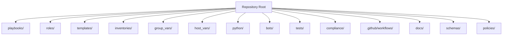
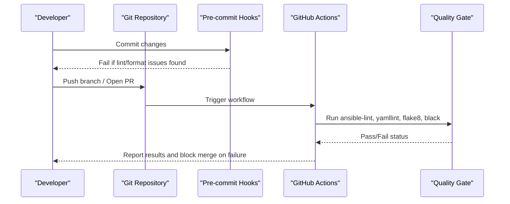
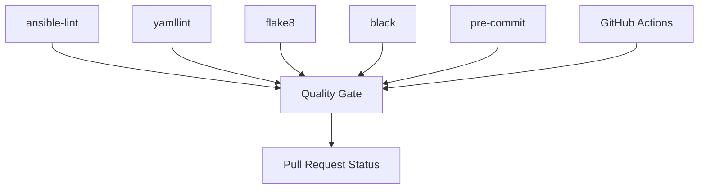

# Linting & Code Quality

<cite>
**Referenced Files in This Document**
- [README.md](file://README.md)
</cite>

## Table of Contents
1. [Introduction](#introduction)
2. [Project Structure](#project-structure)
3. [Core Components](#core-components)
4. [Architecture Overview](#architecture-overview)
5. [Detailed Component Analysis](#detailed-component-analysis)
6. [Dependency Analysis](#dependency-analysis)
7. [Performance Considerations](#performance-considerations)
8. [Troubleshooting Guide](#troubleshooting-guide)
9. [Conclusion](#conclusion)
10. [Appendices](#appendices)

## Introduction
This document describes the linting and code quality enforcement strategy for the platform, focusing on:
- Ansible playbooks and roles (ansible-lint)
- YAML files (yamllint)
- Python code (flake8 and black)
- Pre-commit hooks setup
- Custom lint rules for network automation patterns
- Integration with GitHub Actions workflows
- Examples of common violations and resolutions
- Configuration files (.ansible-lint, .flake8, pyproject.toml)
- Automated quality gates in CI/CD pipelines

The repository’s documentation indicates that all pull requests must pass linting using ansible-lint, yamllint, flake8, and black as part of the validation workflow.

**Section sources**
- [README.md:479-514](file://README.md#L479-L514)
- [README.md:517-544](file://README.md#L517-L544)
- [README.md:701-730](file://README.md#L701-L730)

## Project Structure
The repository organizes automation assets across multiple directories, including playbooks, roles, templates, inventories, Python modules, bots, tests, compliance policies, CI/CD workflows, and more. The README provides a comprehensive layout overview and highlights where linting is applied across these areas.

[No sources needed since this diagram shows conceptual structure]

**Section sources**
- [README.md:103-180](file://README.md#L103-L180)

## Core Components
Quality enforcement spans multiple tools and stages:
- ansible-lint: Enforces best practices for Ansible playbooks and roles
- yamllint: Validates YAML syntax and style across configuration files
- flake8: Checks Python code style and certain error conditions
- black: Formats Python code consistently
- pre-commit: Runs linters locally before commits to catch issues early
- GitHub Actions: Executes automated quality gates on every PR and merge

The repository explicitly requires passing ansible-lint, yamllint, flake8, and black checks in pull requests.

**Section sources**
- [README.md:517-544](file://README.md#L517-L544)
- [README.md:701-730](file://README.md#L701-L730)

## Architecture Overview
The end-to-end quality pipeline integrates local pre-commit hooks with CI/CD workflows to enforce consistent standards and prevent regressions.

[No sources needed since this diagram shows conceptual workflow]

## Detailed Component Analysis

### ansible-lint Rules for Playbooks and Roles
- Scope: All Ansible playbooks under playbooks/ and reusable logic under roles/
- Goals:
  - Prevent unsafe constructs and deprecated features
  - Enforce consistent naming and structure
  - Encourage idempotent and testable automation
- Typical checks include:
  - Avoiding ad-hoc commands in favor of modules
  - Using variables instead of hardcoded values
  - Ensuring proper error handling and change reporting
  - Validating role metadata and file organization

Common violations and resolutions:
- Hardcoded credentials or IPs: Use variables from group_vars/host_vars or secrets backends
- Missing tags or handlers: Add descriptive tags and handlers for controlled execution
- Non-idempotent tasks: Ensure tasks use stateful modules with appropriate parameters
- Deprecated module usage: Update to supported versions per collection requirements

Integration points:
- Local development via pre-commit
- CI validation on PRs and merges

**Section sources**
- [README.md:517-544](file://README.md#L517-L544)
- [README.md:701-730](file://README.md#L701-L730)

### yamllint Configurations for YAML Files
- Scope: Inventory files, variable files, templates, and other YAML artifacts
- Goals:
  - Enforce consistent indentation and spacing
  - Detect malformed YAML structures
  - Standardize key ordering and comments where applicable
- Typical checks include:
  - Line length limits
  - Trailing spaces and blank lines
  - Proper quoting of strings
  - Consistent list formatting

Common violations and resolutions:
- Inconsistent indentation: Align to project standard (e.g., two-space indent)
- Unquoted special characters: Quote values containing colons, braces, etc.
- Excessive line lengths: Break long lists or inline mappings into multi-line formats

Integration points:
- Pre-commit hook runs against staged YAML files
- CI step validates all YAML changes in PRs

**Section sources**
- [README.md:517-544](file://README.md#L517-L544)
- [README.md:701-730](file://README.md#L701-L730)

### flake8 Settings for Python Code
- Scope: Python modules under python/, bots/, scripts/, and tests/
- Goals:
  - Maintain PEP 8 compliance
  - Catch common errors and stylistic inconsistencies
  - Improve readability and maintainability
- Typical checks include:
  - Import ordering and unused imports
  - Line length and whitespace
  - Naming conventions and type hints presence
  - Avoiding overly complex expressions

Common violations and resolutions:
- Long lines: Refactor into smaller statements or use parentheses for continuation
- Unused imports: Remove unnecessary dependencies
- Inconsistent naming: Apply snake_case for functions/variables and CamelCase for classes
- Missing docstrings: Add concise docstrings for public interfaces

Integration points:
- Pre-commit hook enforces style on commit
- CI step ensures no style regressions

**Section sources**
- [README.md:517-544](file://README.md#L517-L544)
- [README.md:701-730](file://README.md#L701-L730)

### Black Formatting Standards
- Scope: All Python files
- Goals:
  - Guarantee deterministic formatting across the codebase
  - Reduce review overhead by removing style debates
- Typical behaviors:
  - Consistent spacing around operators and assignments
  - Uniform string quoting and line breaks
  - Automatic reformatting on save or pre-commit

Common violations and resolutions:
- Manual formatting drift: Re-run formatter to align with project standard
- Conflicts with other formatters: Prefer black as the single source of truth for formatting

Integration points:
- Pre-commit hook auto-formats Python files
- CI step verifies formatting consistency

**Section sources**
- [README.md:517-544](file://README.md#L517-L544)
- [README.md:701-730](file://README.md#L701-L730)

### Pre-commit Hooks Setup
- Purpose: Run linters and formatters locally before committing to catch issues early
- Typical steps:
  - Install pre-commit framework
  - Configure hook definitions for ansible-lint, yamllint, flake8, black
  - Run hooks on staged files only to minimize overhead
- Benefits:
  - Faster feedback loop
  - Reduced CI failures due to trivial issues
  - Consistent developer experience

Common pitfalls and resolutions:
- Hook performance: Limit scope to changed files; consider parallel execution
- Environment differences: Pin tool versions and ensure virtualenv activation

**Section sources**
- [README.md:239-262](file://README.md#L239-L262)
- [README.md:701-730](file://README.md#L701-L730)

### Custom Lint Rules for Network Automation Patterns
- Focus areas:
  - Device connectivity patterns (SSH, NETCONF, RESTCONF)
  - Vendor-specific configurations and constraints
  - Safe defaults for critical settings (AAA, NTP, SNMPv3)
  - Template rendering correctness and data-driven generation
- Implementation approaches:
  - Extend ansible-lint with custom rules targeting playbook anti-patterns
  - Add yamllint rules for inventory and variable file conventions
  - Integrate schema validation for structured data inputs
  - Include custom Python checks for compliance and golden config diffs

Examples:
- Enforce use of connection plugins over raw shell commands
- Require explicit timeouts and retries for device operations
- Validate template outputs against expected schemas

**Section sources**
- [README.md:517-544](file://README.md#L517-L544)
- [README.md:548-579](file://README.md#L548-L579)

### Integration with GitHub Actions Workflows
- Workflow responsibilities:
  - Lint and format checks on push and PR events
  - Schema validation and security scanning
  - Unit and integration tests
  - Compliance policy checks and dry runs
- Key workflows referenced:
  - ci-validate.yml: Lint, test, scan, validate
  - cd-deploy-staging.yml: Deploy to staging with dry run
  - cd-deploy-production.yml: Deploy to production with approval gate
  - compliance-scan.yml: Scheduled full compliance audit
  - docs-generate.yml: Regenerate documentation on merge

Quality gates:
- Merge blocked until all quality checks pass
- Post-deploy verification triggers rollback on failure

**Section sources**
- [README.md:479-514](file://README.md#L479-L514)
- [README.md:517-544](file://README.md#L517-L544)

## Dependency Analysis
The quality pipeline depends on several tools and their interactions:

[No sources needed since this diagram shows conceptual relationships]

**Section sources**
- [README.md:517-544](file://README.md#L517-L544)
- [README.md:701-730](file://README.md#L701-L730)

## Performance Considerations
- Parallelize linting jobs in CI to reduce pipeline duration
- Cache tool installations and dependency wheels in CI runners
- Limit pre-commit scope to staged files to speed up local checks
- Use selective rule sets for large repositories to focus on relevant checks
- Optimize yamllint and ansible-lint configurations to avoid expensive scans on generated artifacts

[No sources needed since this section provides general guidance]

## Troubleshooting Guide
Common issues and resolutions:
- Pre-commit hook failures:
  - Ensure virtual environment is activated and tools are installed
  - Review hook logs for specific rule violations
- CI lint failures:
  - Reproduce locally with the same tool versions
  - Check diff for newly introduced violations
- Formatting conflicts:
  - Run black to auto-format and resolve discrepancies
- YAML parsing errors:
  - Validate with yamllint and fix indentation/quoting issues
- Ansible lint warnings:
  - Update deprecated modules and follow recommended patterns

**Section sources**
- [README.md:674-685](file://README.md#L674-L685)

## Conclusion
The platform enforces high-quality standards through a cohesive set of linters and formatters integrated into both local development and CI/CD. By adopting ansible-lint, yamllint, flake8, and black—alongside pre-commit hooks and GitHub Actions—the team ensures consistent, safe, and maintainable automation across a large, multi-vendor network estate.

[No sources needed since this section summarizes without analyzing specific files]

## Appendices

### Configuration Files Reference
- .ansible-lint: ansible-lint rules and exclusions for playbooks and roles
- .flake8: flake8 options for Python style and complexity checks
- pyproject.toml: Tool configuration for black and potentially other Python tools

Note: These files are referenced as part of the required configuration but are not present in the current repository snapshot.

**Section sources**
- [README.md:517-544](file://README.md#L517-L544)
- [README.md:701-730](file://README.md#L701-L730)