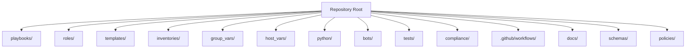
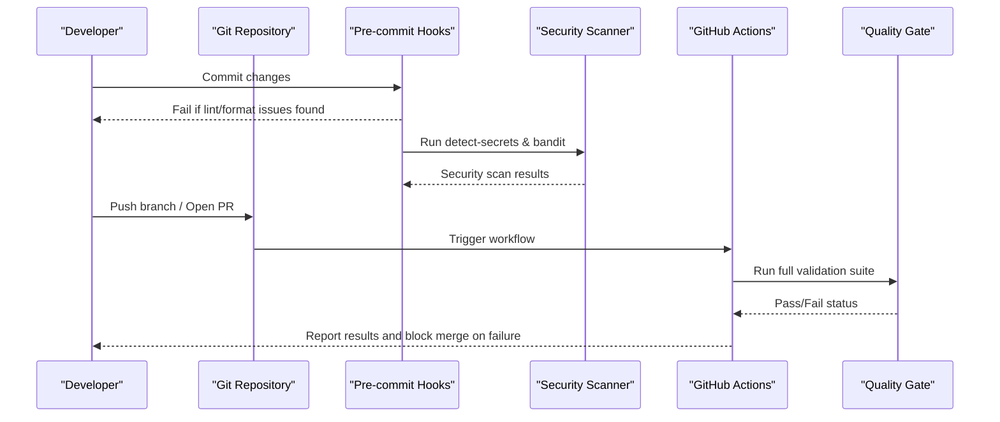
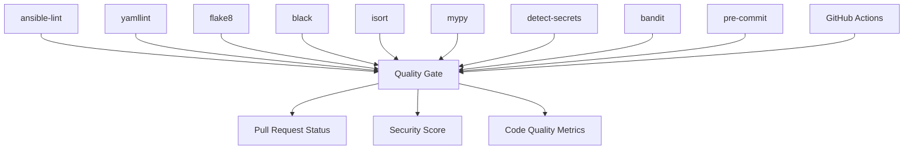

# Linting & Code Quality

<cite>
**Referenced Files in This Document**
- [.pre-commit-config.yaml](file://.pre-commit-config.yaml)
- [pyproject.toml](file://pyproject.toml)
- [.ansible-lint](file://.ansible-lint)
- [.yamllint](file://.yamllint)
- [README.md](file://README.md)
- [ansible.cfg](file://ansible.cfg)
</cite>

## Update Summary
**Changes Made**
- Updated Pre-commit Hooks Setup section to reflect comprehensive tool integration including detect-secrets, bandit, isort, and mypy
- Enhanced Configuration Files Reference with actual configuration files found in repository
- Added detailed security scanning integration with detect-secrets and bandit
- Updated Python tooling configuration with mypy type checking and isort import sorting
- Expanded security scanning capabilities documentation

## Table of Contents
1. [Introduction](#introduction)
2. [Project Structure](#project-structure)
3. [Core Components](#core-components)
4. [Architecture Overview](#architecture-overview)
5. [Detailed Component Analysis](#detailed-component-analysis)
6. [Dependency Analysis](#dependency-analysis)
7. [Performance Considerations](#performance-considerations)
8. [Troubleshooting Guide](#troubleshooting-guide)
9. [Conclusion](#conclusion)
10. [Appendices](#appendices)

## Introduction
This document describes the comprehensive linting and code quality enforcement strategy for the network automation platform, focusing on:
- Ansible playbooks and roles (ansible-lint)
- YAML files (yamllint)
- Python code (flake8, black, isort, mypy)
- Security scanning (detect-secrets, bandit)
- Pre-commit hooks setup with integrated toolchain
- Custom lint rules for network automation patterns
- Integration with CI/CD workflows
- Examples of common violations and resolutions
- Configuration files (.ansible-lint, .yamllint, pyproject.toml)
- Automated quality gates in CI/CD pipelines

The repository implements a production-grade quality assurance pipeline with pre-commit hooks that integrate ansible-lint, yamllint, black, isort, flake8, mypy, detect-secrets, and bandit for comprehensive code validation and security scanning.

**Section sources**
- [.pre-commit-config.yaml:1-66](file://.pre-commit-config.yaml#L1-L66)
- [pyproject.toml:23-100](file://pyproject.toml#L23-L100)
- [README.md:249-250](file://README.md#L249-L250)

## Project Structure
The repository organizes automation assets across multiple directories, including playbooks, roles, templates, inventories, Python modules, bots, tests, compliance policies, CI/CD workflows, and more. The README provides a comprehensive layout overview and highlights where linting is applied across these areas.

[No sources needed since this diagram shows conceptual structure]

**Section sources**
- [README.md:162-237](file://README.md#L162-L237)

## Core Components
Quality enforcement spans multiple tools and stages with comprehensive security scanning:
- **ansible-lint**: Enforces best practices for Ansible playbooks and roles with production profile
- **yamllint**: Validates YAML syntax and style across configuration files with custom rules
- **flake8**: Checks Python code style and certain error conditions with 100-character line length
- **black**: Formats Python code consistently with 100-character line length
- **isort**: Organizes Python imports automatically with black profile compatibility
- **mypy**: Provides static type checking for Python code with strict settings
- **detect-secrets**: Scans for accidentally committed secrets and credentials
- **bandit**: Performs security vulnerability scanning on Python code
- **pre-commit**: Runs all linters locally before commits to catch issues early
- **GitHub Actions**: Executes automated quality gates on every PR and merge

The repository explicitly requires passing all linting, formatting, and security checks in pull requests as part of the validation workflow.

**Section sources**
- [.pre-commit-config.yaml:18-66](file://.pre-commit-config.yaml#L18-L66)
- [pyproject.toml:23-100](file://pyproject.toml#L23-L100)
- [README.md:249-250](file://README.md#L249-L250)

## Architecture Overview
The end-to-end quality pipeline integrates local pre-commit hooks with comprehensive security scanning and CI/CD workflows to enforce consistent standards and prevent regressions.

[No sources needed since this diagram shows conceptual workflow]

## Detailed Component Analysis

### ansible-lint Rules for Playbooks and Roles
- **Scope**: All Ansible playbooks under playbooks/ and reusable logic under roles/
- **Profile**: Production profile with offline mode for security
- **Goals**:
  - Prevent unsafe constructs and deprecated features
  - Enforce consistent naming and structure
  - Encourage idempotent and testable automation
  - Validate role metadata and file organization
- **Configuration**:
  - Excludes virtual environments, tests, and generated files
  - Enables specific rules like `no-same-owner` and `yaml`
  - Configures YAML rules with 200-character line length limit
  - Sets warnings for experimental rules and FQCN usage
- **Typical checks include**:
  - Avoiding ad-hoc commands in favor of modules
  - Using variables instead of hardcoded values
  - Ensuring proper error handling and change reporting
  - Validating role metadata and file organization

Common violations and resolutions:
- Hardcoded credentials or IPs: Use variables from group_vars/host_vars or secrets backends
- Missing tags or handlers: Add descriptive tags and handlers for controlled execution
- Non-idempotent tasks: Ensure tasks use stateful modules with appropriate parameters
- Deprecated module usage: Update to supported versions per collection requirements

Integration points:
- Local development via pre-commit hook with `.yaml|yml$` file matching
- CI validation on PRs and merges with production profile enforcement

**Section sources**
- [.ansible-lint:1-36](file://.ansible-lint#L1-L36)
- [.pre-commit-config.yaml:18-23](file://.pre-commit-config.yaml#L18-L23)

### yamllint Configurations for YAML Files
- **Scope**: Inventory files, variable files, templates, and other YAML artifacts
- **Base Configuration**: Extends default rules with project-specific customizations
- **Goals**:
  - Enforce consistent indentation and spacing
  - Detect malformed YAML structures
  - Standardize key ordering and comments where applicable
  - Maintain readability with configurable line lengths
- **Configuration Details**:
  - Line length: 200 characters with warning level
  - Indentation: 2 spaces with sequence indentation enabled
  - Comments: Minimum 1 space from content
  - Truthy values: Disabled for flexibility
  - Braces/Brackets: Controlled spacing (0-1 spaces inside)
  - Document start: Required for consistency
- **Ignore Patterns**: Excludes virtual environments, Terraform, and node_modules
- **Typical checks include**:
  - Line length limits
  - Trailing spaces and blank lines
  - Proper quoting of strings
  - Consistent list formatting

Common violations and resolutions:
- Inconsistent indentation: Align to project standard (two-space indent)
- Unquoted special characters: Quote values containing colons, braces, etc.
- Excessive line lengths: Break long lists or inline mappings into multi-line formats

Integration points:
- Pre-commit hook runs against staged YAML files with custom config
- CI step validates all YAML changes in PRs

**Section sources**
- [.yamllint:1-28](file://.yamllint#L1-L28)
- [.pre-commit-config.yaml:24-28](file://.pre-commit-config.yaml#L24-L28)

### Python Tooling Suite (flake8, black, isort, mypy)
- **Scope**: All Python modules under python/, bots/, scripts/, and tests/
- **Comprehensive Coverage**: Style checking, formatting, import organization, and type validation
- **Configuration**: Centralized in pyproject.toml with tool-specific sections

#### Black Formatting Standards
- **Line Length**: 100 characters
- **Target Version**: Python 3.11
- **Exclusions**: Virtual environments, build artifacts, distribution packages
- **Goals**:
  - Guarantee deterministic formatting across the codebase
  - Reduce review overhead by removing style debates
  - Maintain consistency with team standards

#### isort Import Organization
- **Profile**: Black-compatible configuration
- **Line Length**: 100 characters
- **First Party**: Recognizes `python` package as first-party
- **Exclusions**: Migration files and virtual environments
- **Benefits**: Automatic import sorting and grouping

#### flake8 Style Checking
- **Line Length**: 100 characters
- **Extended Ignores**: E203 (whitespace around ':') and W503 (line break before binary operator)
- **Exclusions**: Development directories and build artifacts
- **Focus**: PEP 8 compliance and code quality

#### mypy Type Checking
- **Python Version**: 3.11
- **Strict Mode**: Enabled with comprehensive type checking
- **Features**:
  - Disallows untyped definitions and incomplete definitions
  - Checks untyped definitions
  - Strict optional handling
  - No implicit optional types
- **Test Overrides**: Relaxed typing rules for test files

Common violations and resolutions:
- Long lines: Refactor into smaller statements or use parentheses for continuation
- Unused imports: Remove unnecessary dependencies (handled by isort)
- Inconsistent naming: Apply snake_case for functions/variables and CamelCase for classes
- Missing docstrings: Add concise docstrings for public interfaces
- Type errors: Add proper type hints and fix type mismatches

Integration points:
- Pre-commit hook enforces all Python tooling on commit
- CI step ensures no style or type regressions

**Section sources**
- [pyproject.toml:23-61](file://pyproject.toml#L23-L61)
- [.pre-commit-config.yaml:30-46](file://.pre-commit-config.yaml#L30-L46)

### Security Scanning Integration (detect-secrets, bandit)
- **Purpose**: Comprehensive security vulnerability detection and secret scanning
- **Coverage**: All code files during pre-commit and CI/CD processes

#### detect-secrets Configuration
- **Baseline Management**: Uses `.secrets.baseline` file for known acceptable secrets
- **Scanning Scope**: All files except those in baseline
- **Goal**: Prevent accidental commitment of sensitive information
- **Integration**: Runs as part of pre-commit hooks with baseline comparison

#### bandit Security Scanner
- **Configuration**: Uses pyproject.toml for bandit settings
- **Exclusions**: Test files and virtual environments
- **Skipped Rules**: B101 (assert statements) for testing scenarios
- **Focus**: Python security vulnerability detection
- **Dependencies**: Requires `bandit[toml]` for TOML configuration support

Common security findings and resolutions:
- Hardcoded passwords or API keys: Move to secrets management system
- Weak cryptographic algorithms: Use approved cipher suites and encryption methods
- SQL injection vulnerabilities: Implement parameterized queries
- Unsafe function calls: Replace with secure alternatives
- Command injection risks: Validate and sanitize user inputs

Integration points:
- Pre-commit hook scans for secrets and security vulnerabilities
- CI pipeline performs comprehensive security scanning
- Baseline management allows gradual improvement without blocking development

**Section sources**
- [.pre-commit-config.yaml:48-59](file://.pre-commit-config.yaml#L48-L59)
- [pyproject.toml:93-96](file://pyproject.toml#L93-L96)

### Pre-commit Hooks Setup
- **Purpose**: Run comprehensive linters, formatters, and security scanners locally before committing to catch issues early
- **Framework**: pre-commit with version-controlled hook definitions
- **Hook Categories**:
  - **Code Quality**: ansible-lint, yamllint, flake8, black, isort, mypy
  - **Security**: detect-secrets, bandit
  - **File Integrity**: trailing-whitespace, end-of-file-fixer, check-yaml, check-json
  - **Safety**: check-added-large-files, check-merge-conflict, detect-private-key
  - **Branch Protection**: no-commit-to-branch (prevents direct commits to main/production)
- **Configuration Details**:
  - ansible-lint: Targets YAML files only
  - yamllint: Uses custom `.yamllint` configuration
  - black: Python 3.11 target with auto-formatting
  - isort: Black-compatible import sorting
  - flake8: 100-character line length limit
  - detect-secrets: Baseline-based secret scanning
  - bandit: TOML configuration with security scanning
  - mypy: Strict type checking with additional type stubs
- **Benefits**:
  - Faster feedback loop with immediate local validation
  - Reduced CI failures due to trivial issues
  - Consistent developer experience across the team
  - Early detection of security vulnerabilities
  - Automated code formatting and style enforcement

Common pitfalls and resolutions:
- Hook performance: Limit scope to changed files; consider parallel execution
- Environment differences: Pin tool versions and ensure virtualenv activation
- False positives: Configure baselines and exclusions appropriately
- Learning curve: Provide documentation and examples for new team members

**Section sources**
- [.pre-commit-config.yaml:1-66](file://.pre-commit-config.yaml#L1-L66)
- [README.md:314-315](file://README.md#L314-L315)

### Custom Lint Rules for Network Automation Patterns
- **Focus areas**:
  - Device connectivity patterns (SSH, NETCONF, RESTCONF)
  - Vendor-specific configurations and constraints
  - Safe defaults for critical settings (AAA, NTP, SNMPv3)
  - Template rendering correctness and data-driven generation
  - Security best practices for network device access
- **Implementation approaches**:
  - Extend ansible-lint with custom rules targeting playbook anti-patterns
  - Add yamllint rules for inventory and variable file conventions
  - Integrate schema validation for structured data inputs
  - Include custom Python checks for compliance and golden config diffs
  - Leverage bandit for security-focused Python code analysis
- **Network-specific validations**:
  - Enforce use of connection plugins over raw shell commands
  - Require explicit timeouts and retries for device operations
  - Validate template outputs against expected schemas
  - Check for proper credential handling and secret management
  - Verify compliance with security policies and standards

Examples:
- Enforce vendor-agnostic configuration patterns
- Require proper error handling and rollback mechanisms
- Validate network topology and routing configurations
- Check for proper logging and monitoring setup

**Section sources**
- [README.md:249-250](file://README.md#L249-L250)
- [README.md:634-644](file://README.md#L634-L644)

### Integration with GitHub Actions Workflows
- **Workflow responsibilities**:
  - Lint and format checks on push and PR events
  - Schema validation and security scanning
  - Unit and integration tests
  - Compliance policy checks and dry runs
  - Comprehensive security vulnerability assessment
- **Key workflows referenced**:
  - `ci-validate.yml`: Lint, test, scan, validate with full security scanning
  - `cd-deploy-staging.yml`: Deploy to staging with dry run
  - `cd-deploy-production.yml`: Deploy to production with approval gate
  - `compliance-scan.yml`: Scheduled full compliance audit
  - `docs-generate.yml`: Regenerate documentation on merge
- **Quality Gates**:
  - Merge blocked until all quality checks pass including security scans
  - Post-deploy verification triggers rollback on failure
  - Security baseline management for gradual improvement
  - Comprehensive reporting and notification systems

**Section sources**
- [README.md:594-629](file://README.md#L594-L629)

## Dependency Analysis
The quality pipeline depends on several tools and their interactions with comprehensive security scanning:

[No sources needed since this diagram shows conceptual relationships]

**Section sources**
- [.pre-commit-config.yaml:1-66](file://.pre-commit-config.yaml#L1-L66)
- [pyproject.toml:23-100](file://pyproject.toml#L23-L100)

## Performance Considerations
- **Parallel Execution**: Pre-commit hooks run in parallel where possible to reduce local development time
- **Selective Scanning**: Tools are configured to scan only relevant files (e.g., ansible-lint targets YAML files only)
- **Caching Strategy**: Tool installations and dependency wheels cached in CI runners
- **Baseline Management**: Secret scanning uses baselines to avoid blocking on known acceptable patterns
- **Incremental Improvements**: Security scanning allows gradual adoption through baseline updates
- **Optimized Configuration**: 
  - ansible-lint offline mode prevents network calls during linting
  - yamllint excludes large directories like virtual environments
  - mypy uses targeted type checking with relaxed rules for tests
- **Resource Management**: Large file checks limited to 500KB to prevent performance issues

## Troubleshooting Guide
Common issues and resolutions:
- **Pre-commit hook failures**:
  - Ensure virtual environment is activated and tools are installed
  - Review hook logs for specific rule violations
  - Check tool version compatibility between local and CI environments
- **Security scanner false positives**:
  - Update `.secrets.baseline` for acceptable secrets
  - Configure bandit skips for legitimate security warnings
  - Review and remediate genuine security vulnerabilities
- **CI lint failures**:
  - Reproduce locally with the same tool versions
  - Check diff for newly introduced violations
  - Verify all developers have updated pre-commit hooks
- **Formatting conflicts**:
  - Run black to auto-format and resolve discrepancies
  - Use isort for import organization conflicts
  - Ensure consistent editor settings across team
- **Type checking errors**:
  - Add proper type hints following mypy strict settings
  - Use type stubs for external libraries when needed
  - Gradually improve typing coverage starting with critical modules
- **YAML parsing errors**:
  - Validate with yamllint and fix indentation/quoting issues
  - Check for proper document structure and required fields
- **Ansible lint warnings**:
  - Update deprecated modules and follow recommended patterns
  - Review production profile requirements and adjust accordingly

**Section sources**
- [.pre-commit-config.yaml:1-66](file://.pre-commit-config.yaml#L1-L66)
- [pyproject.toml:23-100](file://pyproject.toml#L23-L100)

## Conclusion
The platform enforces high-quality standards through a comprehensive set of linters, formatters, and security scanners integrated into both local development and CI/CD. By adopting ansible-lint, yamllint, flake8, black, isort, mypy, detect-secrets, and bandit—alongside pre-commit hooks and GitHub Actions—the team ensures consistent, safe, and maintainable automation across a large, multi-vendor network estate. The security-first approach with comprehensive scanning ensures that code quality and security vulnerabilities are caught early in the development process.

## Appendices

### Configuration Files Reference
- **.pre-commit-config.yaml**: Complete pre-commit hook configuration with all tool integrations and security scanning
- **.ansible-lint**: ansible-lint rules and exclusions for playbooks and roles with production profile
- **.yamllint**: YAML linting rules with project-specific customizations and ignore patterns
- **pyproject.toml**: Centralized configuration for black, isort, flake8, mypy, pytest, coverage, bandit, and yamllint
- **ansible.cfg**: Ansible configuration with performance tuning and security settings

**Section sources**
- [.pre-commit-config.yaml:1-66](file://.pre-commit-config.yaml#L1-L66)
- [.ansible-lint:1-36](file://.ansible-lint#L1-L36)
- [.yamllint:1-28](file://.yamllint#L1-L28)
- [pyproject.toml:1-100](file://pyproject.toml#L1-L100)
- [ansible.cfg:1-61](file://ansible.cfg#L1-L61)