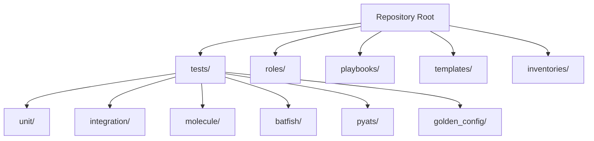
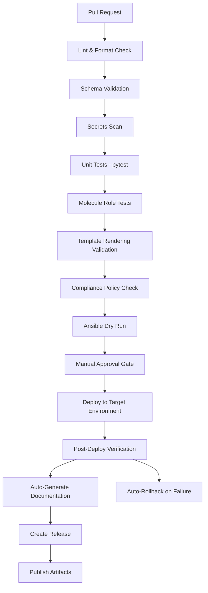
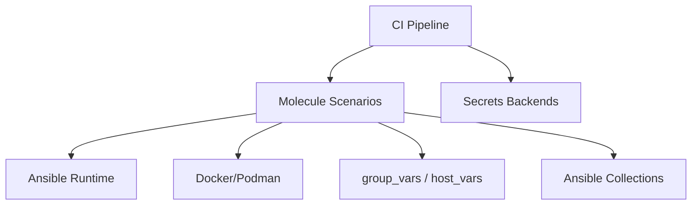

# Molecule Role Tests

<cite>
**Referenced Files in This Document**
- [README.md](file://README.md)
</cite>

## Table of Contents
1. [Introduction](#introduction)
2. [Project Structure](#project-structure)
3. [Core Components](#core-components)
4. [Architecture Overview](#architecture-overview)
5. [Detailed Component Analysis](#detailed-component-analysis)
6. [Dependency Analysis](#dependency-analysis)
7. [Performance Considerations](#performance-considerations)
8. [Troubleshooting Guide](#troubleshooting-guide)
9. [Conclusion](#conclusion)
10. [Appendices](#appendices)

## Introduction
This document explains how to implement and operate Molecule-based role tests for the platform’s Ansible roles. It covers test structure under tests/molecule/, container orchestration with Docker/Podman, scenario design per device platform, variable injection strategies, post-test verification, CI/CD integration, and parallel execution approaches. The guidance is aligned with the repository’s documented testing strategy and CI pipeline that includes Molecule role tests as a core stage.

## Project Structure
The repository documents a comprehensive layout including a dedicated tests directory with a molecule subdirectory. This section outlines where Molecule scenarios live relative to roles and how they integrate into the overall testing strategy.

**Diagram sources**
- [README.md:103-180](file://README.md#L103-L180)

**Section sources**
- [README.md:103-180](file://README.md#L103-L180)

## Core Components
Molecule role tests are part of the broader testing strategy and are executed during pull request validation. The project’s testing strategy explicitly lists “Role Tests” using Molecule and shows an example command to run them for a specific role.

Key points:
- Molecule is used to validate individual Ansible roles in isolated environments.
- The CI pipeline includes a dedicated step for Molecule role tests.
- Local execution is supported via a simple command pattern.

**Section sources**
- [README.md:517-544](file://README.md#L517-L544)

## Architecture Overview
The CI/CD pipeline integrates Molecule role tests after unit tests and before template rendering and compliance checks. This ensures roles are validated early and consistently across platforms.

**Diagram sources**
- [README.md:479-501](file://README.md#L479-L501)

## Detailed Component Analysis

### Test Structure Under tests/molecule/
- Purpose: Provide isolated, repeatable tests for each Ansible role using Molecule scenarios.
- Organization: Place one Molecule scenario per role or per vendor/platform combination to ensure coverage across multi-vendor targets.
- Typical contents per scenario:
  - molecule.yml: Scenario configuration (driver, provisioner, dependencies, platforms, verifiers).
  - converge.yml: Playbook that applies the role against the test instance.
  - verify.yml: Assertions and post-test checks (e.g., golden config diffs, service state, connectivity).
  - requirements.yml: Ansible collections needed by the role.
  - inventory files: Minimal host definitions for the test instance.
  - fixtures: Sample variables and templates used by the role.

Notes:
- The repository layout references a molecule directory under tests/.
- The testing strategy confirms Molecule usage for role tests.

**Section sources**
- [README.md:103-180](file://README.md#L103-L180)
- [README.md:517-544](file://README.md#L517-L544)

### Container Orchestration with Docker/Podman
- Driver selection: Use Docker or Podman as the driver to spin up ephemeral containers for each scenario.
- Image strategy: Choose minimal images that include required Ansible runtime and collection dependencies.
- Networking: Ensure the test container can reach simulated devices or mock endpoints if needed.
- Secrets handling: Do not embed secrets; inject via environment variables or secrets backends at runtime.

Operational tips:
- Ensure Docker/Podman is running locally and in CI.
- Pin image versions for reproducibility.
- Cache container images in CI to speed up runs.

**Section sources**
- [README.md:674-685](file://README.md#L674-L685)

### Test Scenarios for Individual Roles and Platforms
- Multi-vendor matrix: Create separate scenarios for Cisco IOS-XE, NX-OS, Arista EOS, Juniper SRX/MX, Palo Alto PAN-OS, Fortinet FortiOS, F5 BIG-IP, pfSense, OPNsense, etc., as listed in the supported vendors.
- Platform-specific variables: Define group_vars/host_vars per scenario to reflect vendor differences.
- Convergence playbooks: Apply the role with appropriate variables and flags (e.g., check/diff modes).
- Verification steps: Validate configuration state, protocol adjacencies, ACLs, and other assertions relevant to the role.

Example approach:
- For each role, define multiple scenarios named by platform (e.g., cisco_iosxe, arista_eos, juniper_srx).
- Each scenario has its own platforms block targeting different base images if needed.

**Section sources**
- [README.md:203-226](file://README.md#L203-L226)
- [README.md:517-544](file://README.md#L517-L544)

### Variable Injection and Matrix Configuration
- Variables: Use group_vars and host_vars scoped per scenario to inject platform-specific values.
- Matrix: Leverage Molecule platforms and scenario names to build a multi-vendor matrix.
- Secrets: Retrieve from Vault/AWS/Azure backends at runtime; never commit secrets.
- Overrides: Allow CI to override variables via environment variables or workflow inputs.

Best practices:
- Keep variables structured and typed.
- Validate variables with schema checks prior to role execution.
- Use Ansible Vault for sensitive data when necessary.

**Section sources**
- [README.md:103-180](file://README.md#L103-L180)
- [README.md:339-368](file://README.md#L339-L368)

### Post-Test Verification Steps
- Assertions: Verify desired state using custom checks or golden config comparisons.
- Reporting: Produce artifacts such as logs, diffs, and reports for analysis.
- Cleanup: Tear down containers and remove temporary artifacts.

Integration with CI:
- Fail fast on assertion errors.
- Upload artifacts for failed scenarios.

**Section sources**
- [README.md:479-501](file://README.md#L479-L501)

### Example Molecule Configurations
While this repository does not include concrete molecule.yml files, the documented structure and testing strategy indicate that each role should have a corresponding Molecule scenario under tests/molecule/. The typical configuration would include:
- driver: docker or podman
- provisioner: ansible
- platforms: list of target images
- dependencies: ansible-galaxy requirements
- verifier: ansible or pytest
- converge: playbook applying the role
- verify: assertions and checks

For local execution, use the documented command pattern to run Molecule tests for a specific role.

**Section sources**
- [README.md:103-180](file://README.md#L103-L180)
- [README.md:517-544](file://README.md#L517-L544)

### Debugging Failed Role Tests
Common issues and resolutions:
- Container runtime not available: Ensure Docker/Podman is running.
- Missing collections: Install required collections via requirements.yml.
- Variable errors: Validate variables and schemas before running.
- Network connectivity: Confirm test container can reach mocked services or devices.
- Secrets access: Verify OIDC or AppRole credentials in CI.

Useful commands:
- Run Molecule tests for a specific role locally.
- Inspect container logs and Ansible output for failures.

**Section sources**
- [README.md:674-685](file://README.md#L674-L685)
- [README.md:517-544](file://README.md#L517-L544)

### CI/CD Integration and Parallel Execution
- Pipeline placement: Molecule role tests run after unit tests and before template rendering and compliance checks.
- Parallelization: Execute multiple scenarios concurrently by leveraging CI matrix jobs or Molecule’s parallel capabilities.
- Artifacts: Capture logs and outputs for failed scenarios.
- Gates: Block merges on failures; require approvals for production deployments.

Workflow overview:
- PR triggers linting, schema validation, secrets scan, unit tests, then Molecule role tests.
- Subsequent stages include template rendering, compliance checks, dry run, approval gate, deployment, and post-deploy verification.

**Section sources**
- [README.md:479-501](file://README.md#L479-L501)

## Dependency Analysis
Molecule role tests depend on:
- Ansible runtime and collections specified in requirements.yml.
- Container runtime (Docker/Podman) for provisioning.
- Variables and inventories scoped per scenario.
- CI environment variables and secrets backends for authentication.

Relationships:
- Roles consume variables from group_vars/host_vars.
- Scenarios drive convergence and verification playbooks.
- CI orchestrates the sequence and parallelism.

[No sources needed since this diagram shows conceptual relationships]

## Performance Considerations
- Image caching: Cache container images in CI to reduce startup time.
- Scenario granularity: Split large roles into smaller, focused roles to minimize test duration.
- Parallel execution: Use CI matrix or Molecule parallel features to run scenarios concurrently.
- Resource limits: Set CPU/memory limits for containers to avoid CI contention.
- Artifact management: Limit artifact retention to essential logs and diffs.

[No sources needed since this section provides general guidance]

## Troubleshooting Guide
- Molecule test failure: Ensure Docker/Podman is running; check scenario configuration.
- Ansible connection timeout: Verify SSH reachability and credentials.
- Template rendering error: Check Jinja2 syntax and variable completeness.
- Compliance check failure: Review policies and device running config diff.
- CI pipeline failure: Inspect GitHub Actions logs for actionable messages.
- Vault authentication failure: Verify OIDC token or AppRole credentials and policies.
- Batfish analysis error: Validate snapshots and configurations.

**Section sources**
- [README.md:674-685](file://README.md#L674-L685)

## Conclusion
Molecule role tests provide robust, isolated validation for Ansible roles across multi-vendor platforms. By integrating these tests into CI/CD, enforcing variable hygiene, and implementing strong post-test verification, the platform ensures reliable automation and rapid feedback for contributors.

[No sources needed since this section summarizes without analyzing specific files]

## Appendices

### Quick Start Commands
- Run all tests: pytest tests/ -v --tb=short
- Run only unit tests: pytest tests/unit/ -v
- Run Molecule tests for a specific role: cd roles/<role_name>; molecule test

**Section sources**
- [README.md:531-544](file://README.md#L531-L544)