# Network Simulation (Batfish)

<cite>
**Referenced Files in This Document**
- [README.md](file://README.md)
</cite>

## Table of Contents
1. [Introduction](#introduction)
2. [Project Structure](#project-structure)
3. [Core Components](#core-components)
4. [Architecture Overview](#architecture-overview)
5. [Detailed Component Analysis](#detailed-component-analysis)
6. [Dependency Analysis](#dependency-analysis)
7. [Performance Considerations](#performance-considerations)
8. [Troubleshooting Guide](#troubleshooting-guide)
9. [Conclusion](#conclusion)
10. [Appendices](#appendices)

## Introduction
This document explains how the platform integrates Batfish for network simulation and analysis, including snapshot creation from device configurations, ACL analysis for security policy validation, routing analysis for path computation, and firewall rule optimization. It also covers integration with CI/CD pipelines, custom queries for organizational policies, result interpretation, examples of topology snapshots, compliance checks, and automated remediation suggestions based on analysis results. The content is derived from the repository’s documentation and architecture descriptions.

## Project Structure
The repository describes a modular, Git-driven automation platform that includes directories for tests, compliance, playbooks, templates, and CI/CD workflows. Within this structure, Batfish is used as part of the testing and compliance pipeline to analyze ACLs, routing, and firewall rules before changes are deployed.

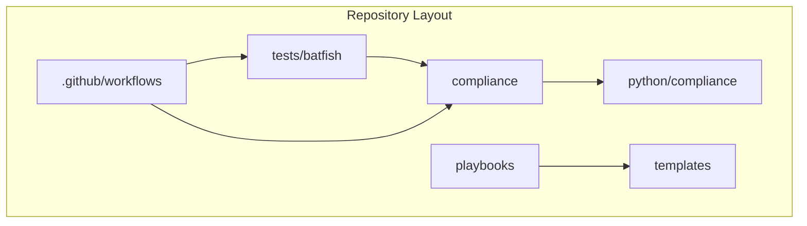

**Diagram sources**
- [README.md:103-180](file://README.md#L103-L180)

**Section sources**
- [README.md:103-180](file://README.md#L103-L180)

## Core Components
- Testing Strategy Integration: Batfish is included in the testing strategy to perform ACL, routing, and firewall rule analysis on every pull request that affects network configuration.
- Compliance Flow: The compliance flow uses OPA policy checks followed by Batfish config analysis and custom Python compliance checks to generate reports and gate merges.
- CI/CD Pipeline: The CI/CD pipeline includes steps for linting, schema validation, secrets scanning, unit tests, Molecule role tests, template rendering validation, compliance policy check, dry run, manual approval, deployment, post-deploy verification, documentation generation, release, and artifact publishing.

Key references:
- Testing Strategy table entry for “Network Simulation” using Batfish.
- Compliance Flow diagram showing Batfish Config Analysis step.
- CI/CD Pipeline diagram and workflow list.

**Section sources**
- [README.md:517-544](file://README.md#L517-L544)
- [README.md:568-579](file://README.md#L568-L579)
- [README.md:479-514](file://README.md#L479-L514)

## Architecture Overview
The platform’s automation engine orchestrates multiple components across control plane, data plane, observability, and security layers. For network simulation, Batfish operates within the testing and compliance stages to validate proposed changes against organizational policies before deployment.

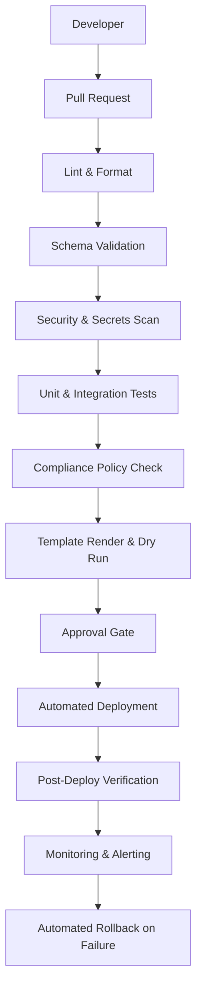

**Diagram sources**
- [README.md:36-50](file://README.md#L36-L50)

## Detailed Component Analysis

### Snapshot Creation from Device Configurations
- Purpose: Build a network model from device configurations to enable simulation and analysis.
- Where it fits: Part of the testing and compliance pipeline; snapshots are validated under tests/batfish/snapshots/.
- How it works conceptually:
  - Collect device configurations from templates or running configs.
  - Generate a Batfish snapshot directory containing vendor-specific files.
  - Validate snapshot integrity prior to analysis.
- Evidence in repository:
  - Troubleshooting guidance references validating Batfish snapshots under tests/batfish/snapshots/.
  - Repository layout indicates a batfish test directory.

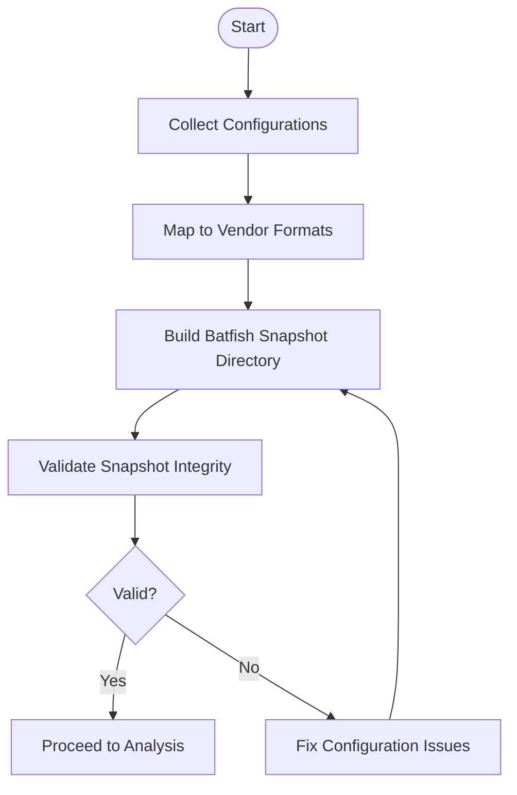

[No sources needed since this diagram shows conceptual workflow, not actual code structure]

**Section sources**
- [README.md:674-685](file://README.md#L674-L685)
- [README.md:103-180](file://README.md#L103-L180)

### ACL Analysis for Security Policy Validation
- Purpose: Ensure ACLs adhere to organizational standards such as default deny and explicit allow only.
- Where it fits: Compliance checks include ACL standards; Batfish performs ACL analysis during compliance flow.
- How it works conceptually:
  - Parse ACL definitions from configurations.
  - Evaluate reachability and policy compliance.
  - Report violations and suggest remediation.
- Evidence in repository:
  - Compliance checks include “ACL Standards: Default deny, explicit allow only.”
  - Compliance flow includes Batfish Config Analysis.

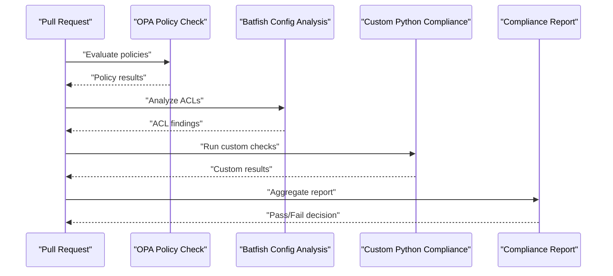

**Diagram sources**
- [README.md:568-579](file://README.md#L568-L579)

**Section sources**
- [README.md:552-566](file://README.md#L552-L566)
- [README.md:568-579](file://README.md#L568-L579)

### Routing Analysis for Path Computation
- Purpose: Compute expected paths and verify routing behavior across devices.
- Where it fits: Included in the “Network Simulation” testing category using Batfish.
- How it works conceptually:
  - Model routing protocols and topologies from configurations.
  - Compute shortest paths and verify reachability.
  - Identify anomalies like black holes or suboptimal routes.
- Evidence in repository:
  - Testing Strategy table lists “Network Simulation: Batfish — ACL, routing, firewall rule analysis.”

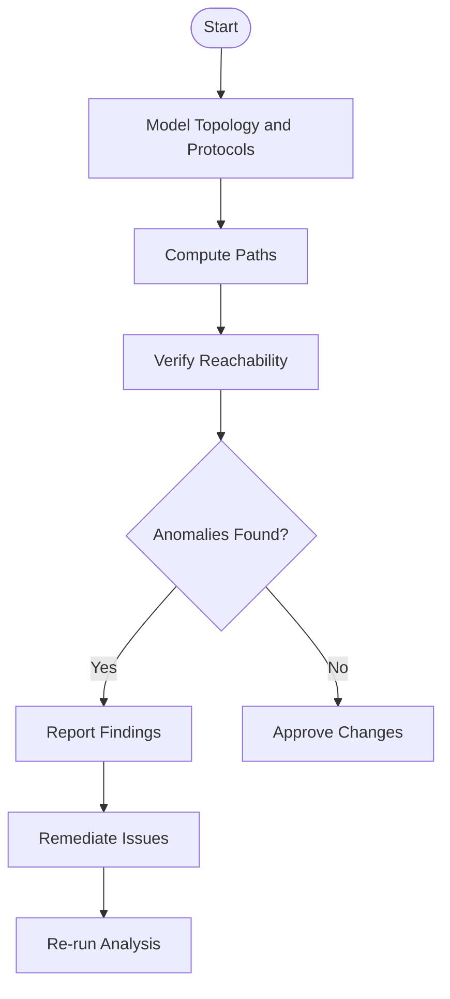

[No sources needed since this diagram shows conceptual workflow, not actual code structure]

**Section sources**
- [README.md:517-544](file://README.md#L517-L544)

### Firewall Rule Optimization
- Purpose: Detect any-any rules, shadow/duplicate rules, and unused objects; optimize rule sets.
- Where it fits: Compliance checks include “Firewall Rules: No any-any, shadow/duplicate detection” and “Unused Objects.”
- How it works conceptually:
  - Analyze firewall rule sets for conflicts and redundancies.
  - Flag any-any rules and suggest tightening.
  - Identify unused rules and recommend cleanup.
- Evidence in repository:
  - Compliance checks explicitly mention firewall rule issues and unused object detection.

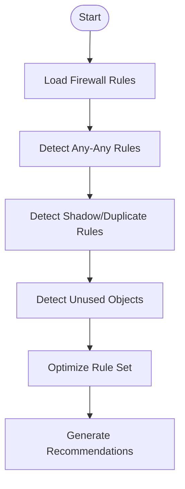

[No sources needed since this diagram shows conceptual workflow, not actual code structure]

**Section sources**
- [README.md:552-566](file://README.md#L552-L566)

### CI/CD Integration
- Purpose: Automate validation and enforcement of network policies using Batfish within CI/CD.
- Where it fits: CI/CD pipeline includes compliance policy check and dry run; testing strategy includes Batfish analysis on PRs affecting network config.
- How it works conceptually:
  - On PR open/update, run lint, schema validation, secrets scan, unit tests, Molecule tests, template rendering validation, compliance policy check, and dry run.
  - If all pass, proceed to approval and deployment; otherwise block merge and notify.
- Evidence in repository:
  - CI/CD Pipeline diagram and Key Workflows table.
  - Testing Strategy table entry for Batfish.

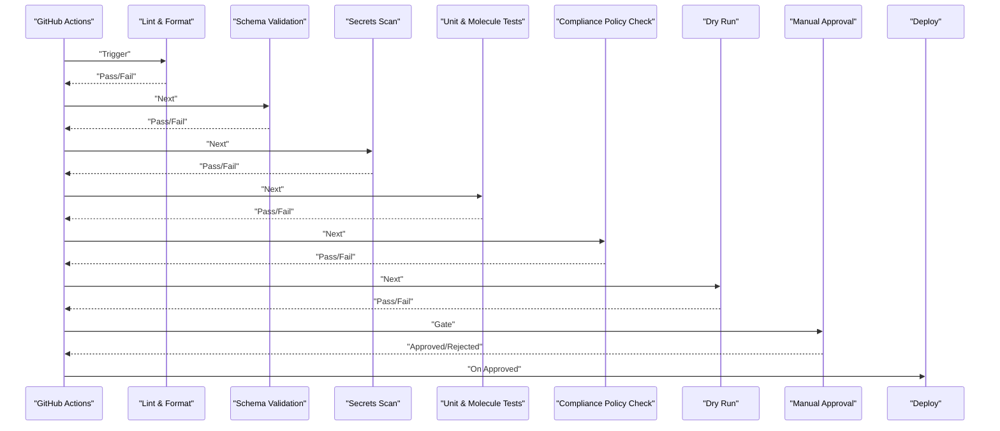

**Diagram sources**
- [README.md:479-514](file://README.md#L479-L514)

**Section sources**
- [README.md:479-514](file://README.md#L479-L514)
- [README.md:517-544](file://README.md#L517-L544)

### Custom Queries for Organizational Policies
- Purpose: Implement organization-specific checks beyond standard compliance.
- Where it fits: Compliance flow includes “Custom Python Compliance” after Batfish analysis.
- How it works conceptually:
  - Define custom checks in Python modules under python/compliance.
  - Integrate these checks into the compliance pipeline.
  - Aggregate results with Batfish findings to produce a unified report.
- Evidence in repository:
  - Compliance Flow diagram shows “Custom Python Compliance” step.
  - Repository layout includes python/compliance module.

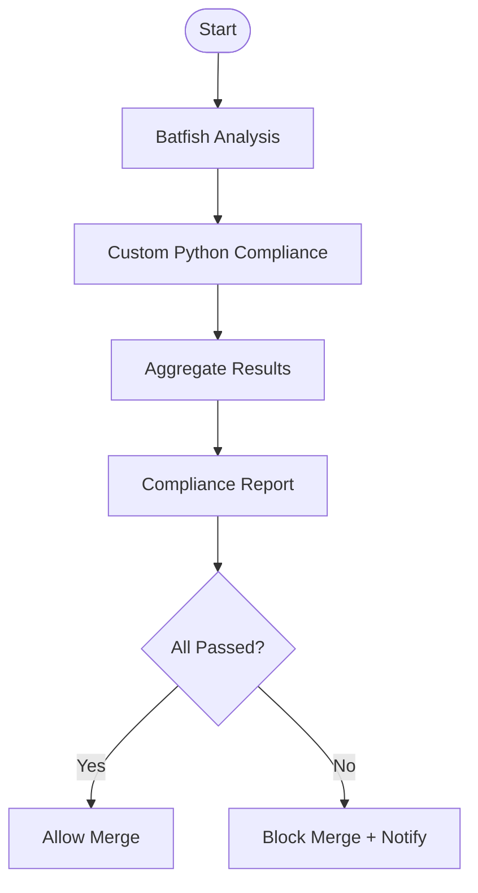

**Diagram sources**
- [README.md:568-579](file://README.md#L568-L579)

**Section sources**
- [README.md:568-579](file://README.md#L568-L579)
- [README.md:103-180](file://README.md#L103-L180)

### Result Interpretation
- Purpose: Translate analysis outputs into actionable insights and decisions.
- Where it fits: Compliance report drives merge gating; troubleshooting guides help diagnose failures.
- How it works conceptually:
  - Review Batfish findings for ACL/routing/firewall issues.
  - Correlate with custom compliance results.
  - Decide whether to allow merge or require remediation.
- Evidence in repository:
  - Compliance Flow produces a report that gates merge.
  - Troubleshooting section references validating Batfish snapshots when analysis errors occur.

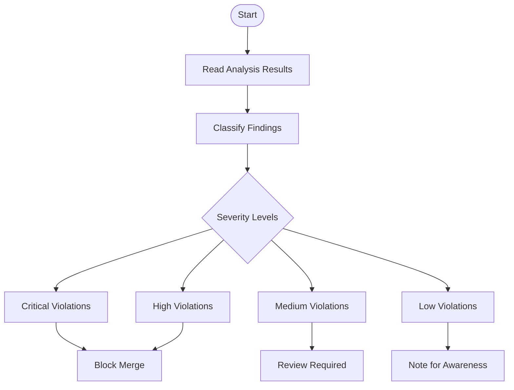

[No sources needed since this diagram shows conceptual workflow, not actual code structure]

**Section sources**
- [README.md:568-579](file://README.md#L568-L579)
- [README.md:674-685](file://README.md#L674-L685)

### Examples of Network Topology Snapshots
- Purpose: Provide sample snapshots for lab and staging environments to simulate real-world scenarios.
- Where it fits: tests/batfish/snapshots/ directory referenced in troubleshooting.
- How it works conceptually:
  - Create snapshot directories per environment (lab, staging).
  - Include vendor-specific configuration fragments.
  - Use snapshots to validate changes without touching production devices.
- Evidence in repository:
  - Troubleshooting mentions validating Batfish snapshot in tests/batfish/snapshots/.
  - Repository layout includes tests/batfish directory.

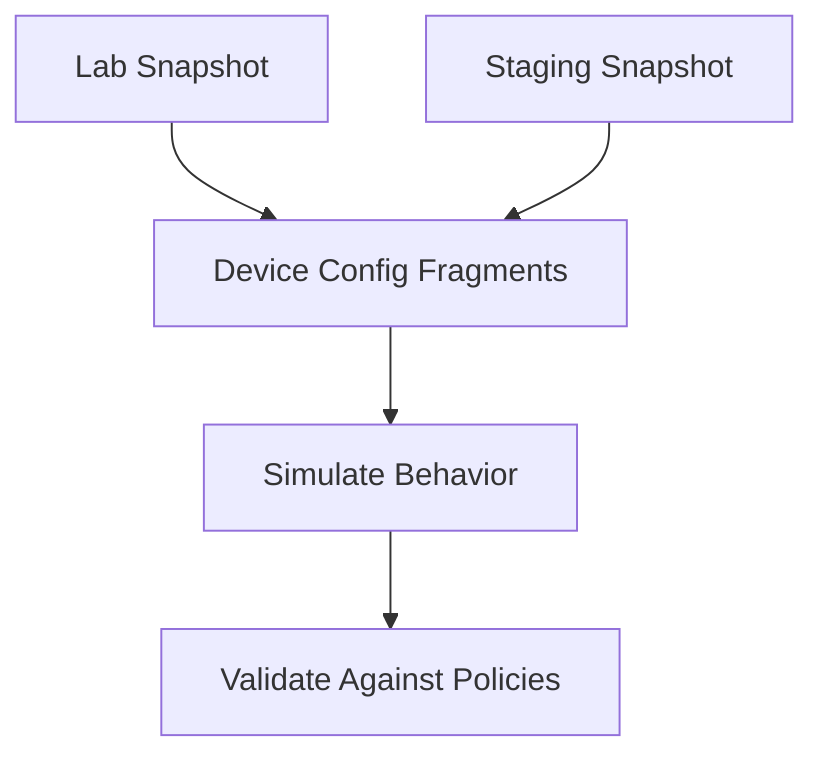

[No sources needed since this diagram shows conceptual workflow, not actual code structure]

**Section sources**
- [README.md:674-685](file://README.md#L674-L685)
- [README.md:103-180](file://README.md#L103-L180)

### Query Definitions for Compliance Checks
- Purpose: Define checks for SSH-only, NTP, AAA, SNMPv3, cipher standards, firmware approvals, password policy, ACL standards, firewall rules, and unused objects.
- Where it fits: Compliance checks table enumerates policies and severities.
- How it works conceptually:
  - Map each policy to a specific check implementation.
  - Integrate checks into the compliance pipeline.
  - Report violations with severity levels.
- Evidence in repository:
  - Compliance checks table lists policies and severities.

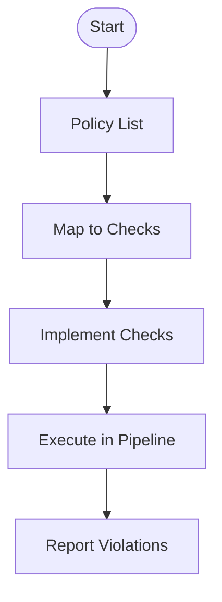

[No sources needed since this diagram shows conceptual workflow, not actual code structure]

**Section sources**
- [README.md:552-566](file://README.md#L552-L566)

### Automated Remediation Suggestions
- Purpose: Provide actionable recommendations based on analysis results.
- Where it fits: Compliance report and troubleshooting guide inform remediation steps.
- How it works conceptually:
  - Generate suggestions for fixing ACLs, optimizing firewall rules, and correcting routing issues.
  - Link suggestions to playbook actions where applicable.
- Evidence in repository:
  - Compliance checks include remediation-oriented policies (e.g., no any-any, shadow/duplicate detection).
  - Playbook catalogue includes firewall-related playbooks.

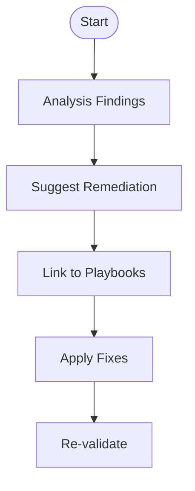

[No sources needed since this diagram shows conceptual workflow, not actual code structure]

**Section sources**
- [README.md:552-566](file://README.md#L552-L566)
- [README.md:388-435](file://README.md#L388-L435)

## Dependency Analysis
The following diagram illustrates dependencies between components involved in network simulation and compliance, mapping to the repository’s documented structure.

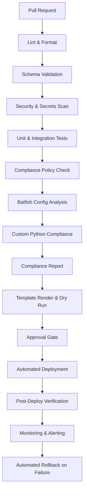

**Diagram sources**
- [README.md:36-50](file://README.md#L36-L50)
- [README.md:568-579](file://README.md#L568-L579)

**Section sources**
- [README.md:36-50](file://README.md#L36-L50)
- [README.md:568-579](file://README.md#L568-L579)

## Performance Considerations
- Parallelize independent checks: Run linting, schema validation, and secrets scanning concurrently to reduce pipeline duration.
- Incremental analysis: Limit Batfish runs to changed configurations to speed up PR feedback.
- Snapshot caching: Cache snapshots for unchanged device groups to avoid redundant processing.
- Resource limits: Configure CI runners with sufficient CPU/memory for large snapshots.
- Early filtering: Fail fast on critical violations to prevent downstream work.

[No sources needed since this section provides general guidance]

## Troubleshooting Guide
Common issues and resolutions related to network simulation and compliance:
- Ansible connection timeout: Verify SSH reachability using ping against inventory hosts.
- Template rendering error: Debug Jinja2 syntax via configuration generation tool.
- Compliance check failure: Review compliance policies and device running config diffs.
- CI pipeline failure: Inspect GitHub Actions logs for actionable error messages.
- Vault authentication failure: Verify OIDC token or AppRole credentials and Vault policies.
- Molecule test failure: Ensure Docker/Podman is running; check molecule configuration.
- Batfish analysis error: Validate Batfish snapshot in tests/batfish/snapshots/.

**Section sources**
- [README.md:674-685](file://README.md#L674-L685)

## Conclusion
The platform integrates Batfish into its testing and compliance pipeline to validate ACLs, routing, and firewall rules before deployment. By combining OPA policy checks, Batfish analysis, and custom Python compliance checks, the system enforces organizational policies early and consistently. The CI/CD pipeline automates these validations, providing rapid feedback and safe deployments. While the repository currently contains high-level documentation, the described architecture and workflows provide a clear blueprint for implementing comprehensive network simulation and analysis at enterprise scale.

[No sources needed since this section summarizes without analyzing specific files]

## Appendices

### Quick Reference: Key Directories and Roles
- tests/batfish: Contains snapshots and tests for network simulation.
- compliance: Holds compliance policies and checks.
- python/compliance: Implements custom compliance logic.
- playbooks: Includes operational playbooks such as firewall_rules.yml.
- .github/workflows: Defines CI/CD workflows integrating validation and compliance.

**Section sources**
- [README.md:103-180](file://README.md#L103-L180)
- [README.md:388-435](file://README.md#L388-L435)
- [README.md:479-514](file://README.md#L479-L514)