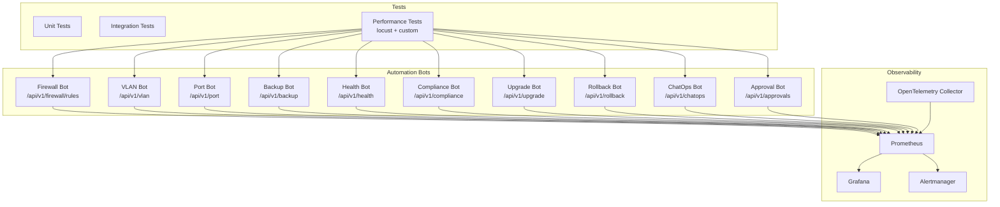
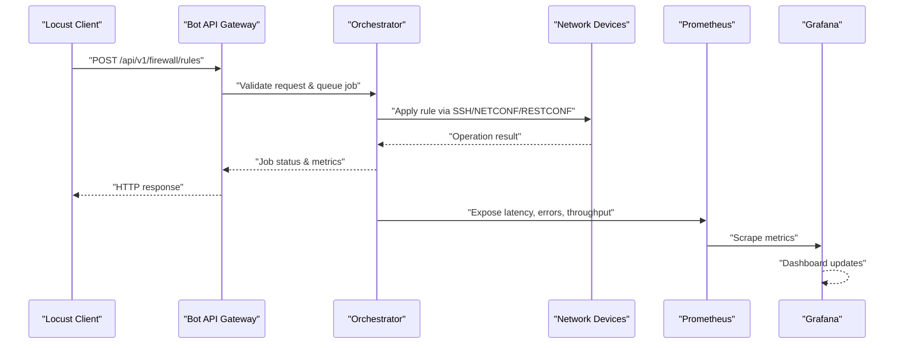
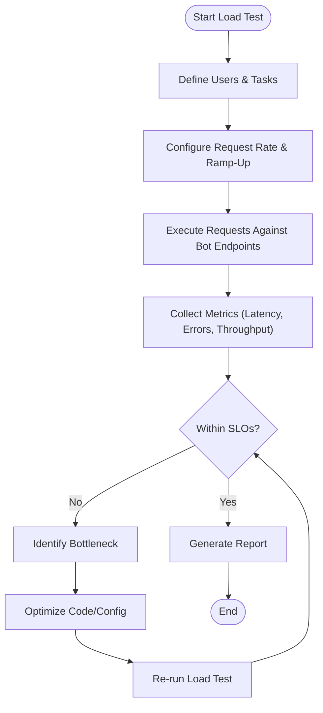
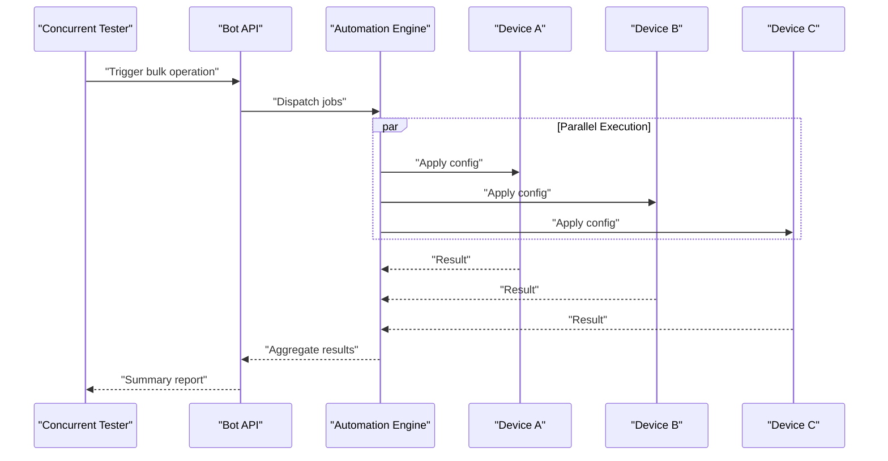
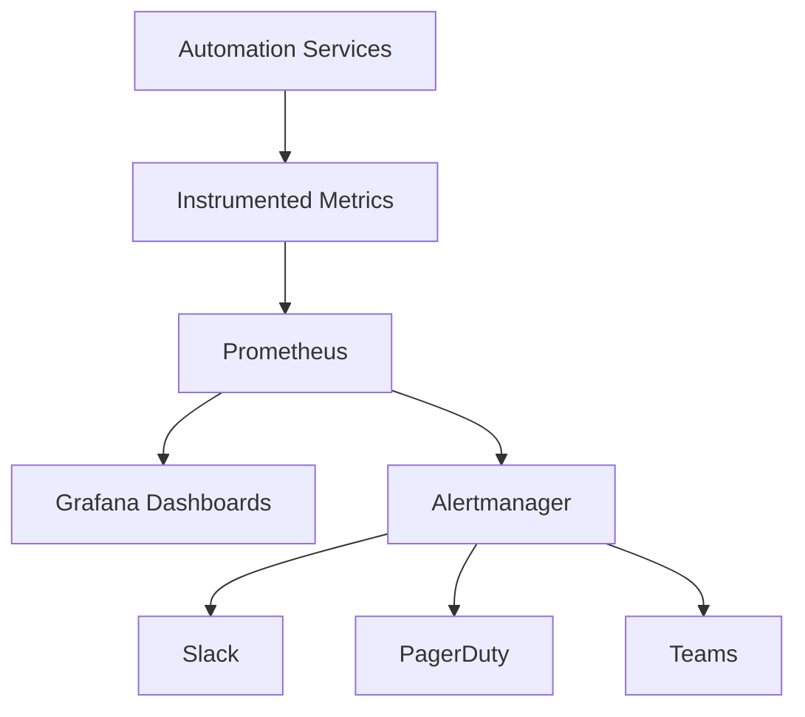
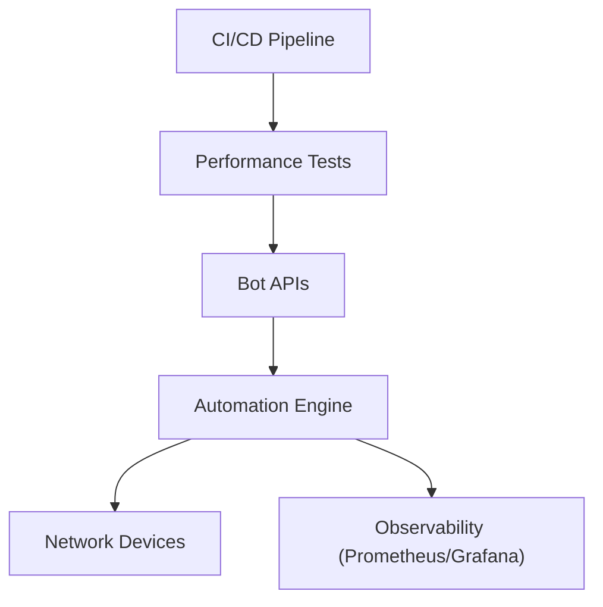

# Performance Testing

<cite>
**Referenced Files in This Document**
- [README.md](file://README.md)
</cite>

## Table of Contents
1. [Introduction](#introduction)
2. [Project Structure](#project-structure)
3. [Core Components](#core-components)
4. [Architecture Overview](#architecture-overview)
5. [Detailed Component Analysis](#detailed-component-analysis)
6. [Dependency Analysis](#dependency-analysis)
7. [Performance Considerations](#performance-considerations)
8. [Troubleshooting Guide](#troubleshooting-guide)
9. [Conclusion](#conclusion)
10. [Appendices](#appendices)

## Introduction
This document provides a comprehensive guide to performance testing for the Enterprise Network Automation Platform, focusing on:
- API endpoint load testing for automation bots using locust and custom frameworks
- Concurrent device operation testing across multi-vendor devices
- Resource utilization monitoring via Prometheus, Grafana, and OpenTelemetry
- Test scenario design for realistic network automation workloads
- Performance metrics collection and bottleneck identification
- Examples of locust test scripts (described conceptually), performance regression detection, and capacity planning guidelines

The platform exposes multiple bot APIs that orchestrate real device operations. Load testing these endpoints ensures reliability under concurrent demand while validating observability and scalability.

## Project Structure
The repository is organized into feature-based directories including bots, tests, monitoring, and CI/CD workflows. The README documents the layout and indicates where performance tests are planned to run during release candidates.

**Diagram sources**
- [README.md:460-476](file://README.md#L460-L476)
- [README.md:517-529](file://README.md#L517-L529)
- [README.md:583-618](file://README.md#L583-L618)

**Section sources**
- [README.md:103-180](file://README.md#L103-L180)
- [README.md:460-476](file://README.md#L460-L476)
- [README.md:517-529](file://README.md#L517-L529)
- [README.md:583-618](file://README.md#L583-L618)

## Core Components
- Automation Bots: REST APIs exposed by each bot for self-service operations such as firewall rules, VLAN provisioning, port configuration, backups, health checks, compliance scans, upgrades, rollbacks, chatops routing, and approvals.
- Performance Tests: Planned to use locust and custom frameworks to simulate realistic loads against bot endpoints.
- Observability Stack: SNMPv3 polling, model-driven telemetry, and syslog feed into Prometheus; Grafana dashboards visualize API performance, error rates, and throughput; Alertmanager routes alerts to Slack, PagerDuty, and Teams.

Key responsibilities:
- Bots implement business logic and orchestrate device operations.
- Performance tests generate synthetic traffic patterns to stress endpoints and validate SLOs.
- Observability components collect metrics and logs to identify bottlenecks and track regressions.

**Section sources**
- [README.md:460-476](file://README.md#L460-L476)
- [README.md:517-529](file://README.md#L517-L529)
- [README.md:583-618](file://README.md#L583-L618)

## Architecture Overview
The performance testing architecture integrates locust clients with bot APIs and observes outcomes through Prometheus and Grafana.

**Diagram sources**
- [README.md:460-476](file://README.md#L460-L476)
- [README.md:583-618](file://README.md#L583-L618)

## Detailed Component Analysis

### API Endpoint Load Testing for Automation Bots
- Target endpoints include firewall rules, VLAN provisioning, port configuration, backup triggers, health checks, compliance scans, firmware upgrades, rollbacks, chatops commands, and approval workflows.
- Use locust to define user tasks that call these endpoints concurrently, varying payload sizes and request rates to emulate real-world automation bursts.
- Validate HTTP status codes, response times, and error rates; assert idempotency and safe retries for non-destructive operations.

[No sources needed since this diagram shows conceptual workflow, not actual code structure]

### Concurrent Device Operation Testing
- Simulate simultaneous operations across routers, switches, firewalls, load balancers, VPN gateways, and cloud networking components.
- Model realistic sequences: pre-checks, config generation, apply, post-validation, rollback on failure.
- Ensure concurrency controls prevent overloading device management planes and respect rate limits.

[No sources needed since this diagram shows conceptual workflow, not actual code structure]

### Resource Utilization Monitoring
- Monitor CPU, memory, I/O, and network usage on automation hosts and device management interfaces.
- Track bot endpoint latency, error rates, and throughput via Prometheus metrics scraped from services.
- Visualize trends in Grafana dashboards and set alerts for anomalies.

**Diagram sources**
- [README.md:583-618](file://README.md#L583-L618)

**Section sources**
- [README.md:460-476](file://README.md#L460-L476)
- [README.md:583-618](file://README.md#L583-L618)

## Dependency Analysis
Performance testing depends on:
- Bot APIs: endpoints defined per bot
- Automation Engine: orchestrates device operations
- Observability: Prometheus, Grafana, Alertmanager
- CI/CD: runs performance tests at release candidate stage

**Diagram sources**
- [README.md:460-476](file://README.md#L460-L476)
- [README.md:517-529](file://README.md#L517-L529)
- [README.md:583-618](file://README.md#L583-L618)

**Section sources**
- [README.md:460-476](file://README.md#L460-L476)
- [README.md:517-529](file://README.md#L517-L529)
- [README.md:583-618](file://README.md#L583-L618)

## Performance Considerations
- Concurrency Limits: Tune worker counts and connection pools to avoid saturating device management planes.
- Backpressure: Implement queues and throttling to protect downstream systems.
- Idempotency: Design endpoints to support safe retries without side effects.
- Metrics Granularity: Capture per-endpoint latency percentiles, error rates, and throughput.
- Baselines: Establish performance baselines for critical paths and enforce regression thresholds.
- Capacity Planning: Use observed saturation points to size automation hosts and device access layers.

[No sources needed since this section provides general guidance]

## Troubleshooting Guide
Common issues and resolutions related to performance testing and observability:
- Ansible connection timeout: Verify SSH reachability and adjust timeouts.
- Template rendering error: Check Jinja2 syntax and debug output.
- Compliance check failure: Review policies and diffs.
- CI pipeline failure: Inspect GitHub Actions logs for actionable messages.
- Vault authentication failure: Verify OIDC tokens or AppRole credentials and policies.
- Molecule test failure: Ensure Docker/Podman is running and configurations are valid.
- Batfish analysis error: Validate snapshots and inputs.

**Section sources**
- [README.md:674-685](file://README.md#L674-L685)

## Conclusion
By integrating locust-based load testing with robust observability, the platform can validate API performance under realistic automation workloads, detect regressions early, and plan capacity effectively. Continuous monitoring and clear SLOs ensure reliable scaling of automation operations across diverse device fleets.

[No sources needed since this section summarizes without analyzing specific files]

## Appendices

### Example Scenarios (Conceptual)
- Firewall Rule Burst: Rapidly submit many rule requests, measure latency and error rates, verify queuing and backpressure behavior.
- Bulk VLAN Provisioning: Create VLANs across multiple sites concurrently, monitor device impact and engine resource usage.
- Health Check Storm: Trigger health checks across all devices simultaneously, observe aggregation time and dashboard updates.
- Compliance Scan Load: Run compliance scans repeatedly to assess scanning throughput and alerting cadence.
- Upgrade Orchestration: Simulate staged firmware upgrades with rollback scenarios under load.

[No sources needed since this section doesn't analyze specific source files]