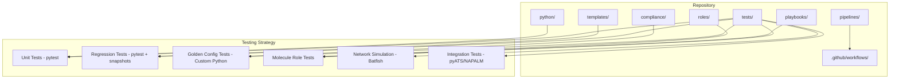
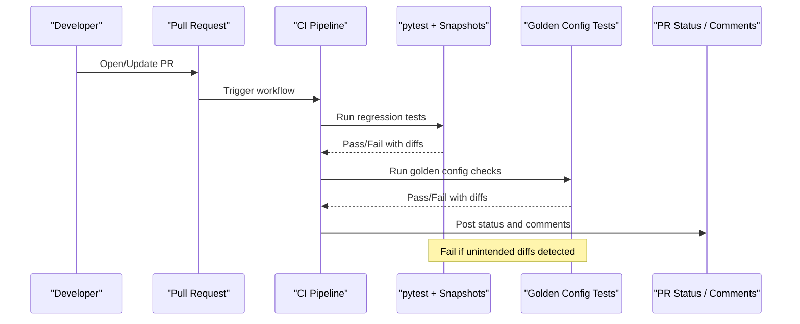
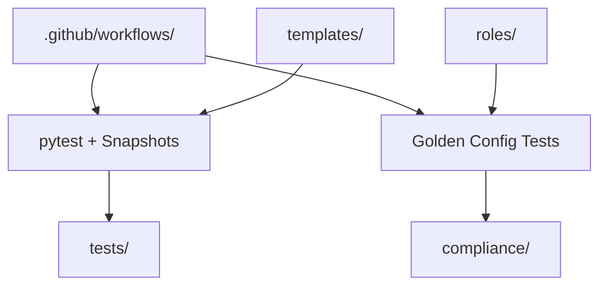

# Regression Testing

<cite>
**Referenced Files in This Document**
- [README.md](file://README.md)
</cite>

## Table of Contents
1. [Introduction](#introduction)
2. [Project Structure](#project-structure)
3. [Core Components](#core-components)
4. [Architecture Overview](#architecture-overview)
5. [Detailed Component Analysis](#detailed-component-analysis)
6. [Dependency Analysis](#dependency-analysis)
7. [Performance Considerations](#performance-considerations)
8. [Troubleshooting Guide](#troubleshooting-guide)
9. [Conclusion](#conclusion)
10. [Appendices](#appendices)

## Introduction
This document provides a comprehensive guide to regression testing using pytest snapshots and configuration comparison within the platform. It explains how to create snapshot baselines for expected outputs, automate comparisons of generated configurations, analyze change impact, manage snapshots across branches, update baselines for legitimate changes, and reduce false positives. It also includes examples of test structures, configuration diff analysis, and integration with pull request workflows to catch unintended changes early.

The platform’s documentation indicates that regression tests are implemented with pytest plus snapshots and run on every pull request to ensure no unintended configuration changes slip through.

**Section sources**
- [README.md:517-544](file://README.md#L517-L544)

## Project Structure
The repository is organized around a GitOps model with extensive automation, templates, roles, and tests. The testing strategy explicitly includes regression tests using pytest and snapshots, alongside unit tests, linting, schema validation, Molecule role tests, network simulation (Batfish), integration tests (pyATS/NAPALM), golden config tests, and performance tests.

**Diagram sources**
- [README.md:103-180](file://README.md#L103-L180)
- [README.md:517-544](file://README.md#L517-L544)

**Section sources**
- [README.md:103-180](file://README.md#L103-L180)
- [README.md:517-544](file://README.md#L517-L544)

## Core Components
- Regression tests: Implemented with pytest and snapshots to detect unintended changes in generated outputs or configurations.
- Golden config tests: Custom Python-based checks comparing current outputs against approved baselines.
- CI pipeline: Executes tests on every PR, including regression tests, to block merges when unexpected diffs are detected.

Key responsibilities:
- Snapshot creation: Generate baseline artifacts for deterministic outputs (e.g., rendered configs).
- Automated comparison: Compare new outputs against stored snapshots during test runs.
- Change impact analysis: Use diffs to understand what changed and whether it is intentional.
- Baseline management: Update snapshots only after review and approval for legitimate changes.
- False positive reduction: Normalize outputs, filter non-deterministic fields, and use stable keys.

**Section sources**
- [README.md:517-544](file://README.md#L517-L544)

## Architecture Overview
The regression testing architecture integrates into the CI pipeline to validate changes before deployment.

**Diagram sources**
- [README.md:479-514](file://README.md#L479-L514)
- [README.md:517-544](file://README.md#L517-L544)

## Detailed Component Analysis

### Snapshot Creation for Expected Outputs
- Purpose: Capture deterministic outputs such as rendered device configurations, policy documents, or API responses.
- Process:
  - Generate outputs from templates and structured data.
  - Store normalized snapshots under a dedicated directory in tests.
  - Ensure stable ordering and remove non-deterministic fields (timestamps, IDs).
- Validation:
  - First run creates baseline snapshots.
  - Subsequent runs compare against baselines; failures indicate diffs.

Best practices:
- Keep snapshots small and focused per feature.
- Use descriptive names indicating device/vendor/template context.
- Commit snapshots alongside code changes.

**Section sources**
- [README.md:517-544](file://README.md#L517-L544)

### Automated Comparison of Generated Configurations
- Mechanism:
  - pytest compares newly generated outputs with stored snapshots.
  - Golden config tests perform additional semantic checks against approved baselines.
- Output:
  - On failure, provide unified diffs highlighting added/removed lines.
  - Include context about which template/device group produced the output.

Operational guidance:
- Run locally to inspect diffs before pushing.
- Use targeted test selection to speed feedback loops.

**Section sources**
- [README.md:517-544](file://README.md#L517-L544)

### Change Impact Analysis
- Diff interpretation:
  - Identify affected devices, vendors, and features.
  - Assess security implications (e.g., cipher suites, ACLs).
- Correlation:
  - Map diffs to specific commits and PRs.
  - Use commit messages to understand intent.

Actionable steps:
- If unintended, revert or adjust templates/variables.
- If intended, update snapshots and document rationale.

**Section sources**
- [README.md:517-544](file://README.md#L517-L544)

### Snapshot Management Strategies
- Organization:
  - Group snapshots by environment and vendor.
  - Version snapshots with code to maintain consistency.
- Lifecycle:
  - Create on first pass.
  - Review and approve updates via PR.
  - Rotate outdated snapshots periodically.

Governance:
- Require reviewer approval for snapshot updates.
- Tag significant baseline changes in release notes.

**Section sources**
- [README.md:517-544](file://README.md#L517-L544)

### Baseline Updates for Legitimate Changes
- When to update:
  - Template improvements, policy changes, or documented behavior shifts.
- How to update:
  - Regenerate outputs locally.
  - Confirm diffs reflect intended changes.
  - Commit updated snapshots with clear messages.

Quality gates:
- Ensure all related tests pass.
- Add explanatory comments in PR describing why snapshots changed.

**Section sources**
- [README.md:517-544](file://README.md#L517-L544)

### False Positive Reduction Techniques
- Normalization:
  - Sort lists/dicts deterministically.
  - Strip timestamps, random IDs, and environment-specific values.
- Filtering:
  - Exclude transient fields from comparisons.
  - Use allowlists for acceptable variations.
- Test design:
  - Isolate snapshots per feature to minimize noise.
  - Prefer canonical representations (e.g., YAML over CLI text).

**Section sources**
- [README.md:517-544](file://README.md#L517-L544)

### Example Snapshot Test Structures
- Unit-level snapshot tests:
  - For each template/device combination, render output and assert snapshot equality.
- Feature-level snapshot tests:
  - Aggregate multiple outputs and compare as a single artifact.
- Golden config tests:
  - Validate structural and semantic properties beyond raw diffs.

Execution:
- Run targeted subsets for rapid iteration.
- Integrate full suite in CI.

**Section sources**
- [README.md:517-544](file://README.md#L517-L544)

### Configuration Diff Analysis
- Tools:
  - Unified diff output from pytest/snapshot plugins.
  - Golden config reports for high-level compliance insights.
- Interpretation:
  - Focus on security-relevant changes (ciphers, ACLs, routing policies).
  - Verify alignment with policy and standards.

Remediation:
- Adjust templates/variables to restore desired state.
- Update snapshots if changes are approved.

**Section sources**
- [README.md:517-544](file://README.md#L517-L544)

### Integration with Pull Request Workflows
- CI triggers:
  - Lint, schema validation, secrets scan, unit tests, regression tests, golden config checks.
- Gatekeeping:
  - Block merge if regression tests fail.
  - Provide actionable comments with diffs.
- Approval:
  - Require explicit approval for snapshot updates.

Workflow overview:
- Developer opens PR → CI validates → Reviewers assess diffs → Approve and merge → CD deploys.

**Section sources**
- [README.md:479-514](file://README.md#L479-L514)
- [README.md:517-544](file://README.md#L517-L544)

## Dependency Analysis
The regression testing components depend on:
- pytest framework for execution and assertions.
- Snapshot storage under tests/.
- Golden config tests for semantic validations.
- CI workflows orchestrating test runs and gating merges.

**Diagram sources**
- [README.md:103-180](file://README.md#L103-L180)
- [README.md:479-514](file://README.md#L479-L514)
- [README.md:517-544](file://README.md#L517-L544)

**Section sources**
- [README.md:103-180](file://README.md#L103-L180)
- [README.md:479-514](file://README.md#L479-L514)
- [README.md:517-544](file://README.md#L517-L544)

## Performance Considerations
- Parallelize tests where possible to reduce CI time.
- Cache dependencies and generated artifacts between runs.
- Use selective test execution for faster feedback on small changes.
- Avoid heavy I/O in snapshot generation; precompute deterministic outputs.

[No sources needed since this section provides general guidance]

## Troubleshooting Guide
Common issues and resolutions:
- Snapshot mismatches:
  - Inspect diffs; normalize outputs; update snapshots if changes are intended.
- Flaky tests:
  - Remove non-deterministic fields; stabilize ordering; isolate noisy tests.
- CI failures:
  - Review logs; run tests locally; confirm environment parity.
- Golden config violations:
  - Align templates/variables with policy; document exceptions.

**Section sources**
- [README.md:674-685](file://README.md#L674-L685)

## Conclusion
Adopting pytest snapshots and configuration comparison strengthens regression testing by catching unintended changes early. Combined with golden config tests and robust CI gating, teams can confidently evolve templates and policies while maintaining stability and compliance. Effective snapshot management, normalization, and PR integration further reduce false positives and streamline reviews.

[No sources needed since this section summarizes without analyzing specific files]

## Appendices

### Quick Commands
- Run all tests: pytest tests/ -v --tb=short
- Run unit tests: pytest tests/unit/ -v
- Run compliance tests: pytest tests/compliance/ -v
- Run Molecule tests for a role: cd roles/<role>; molecule test

**Section sources**
- [README.md:531-544](file://README.md#L531-L544)