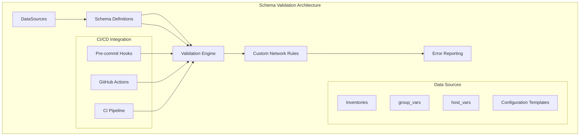
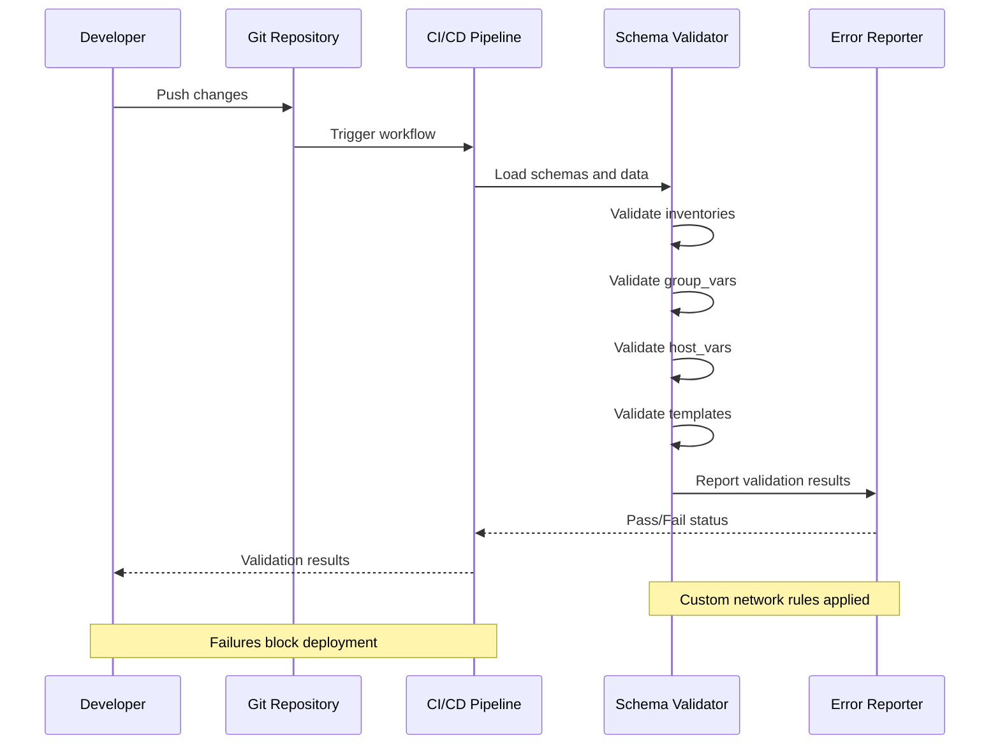
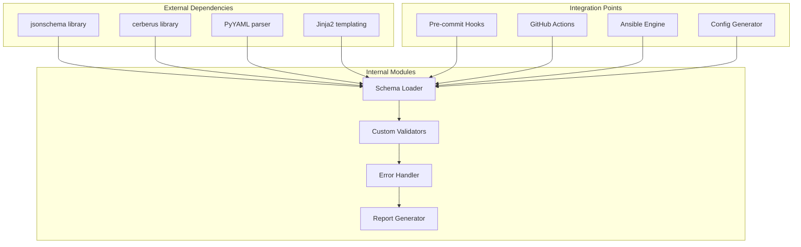

# Schema Validation

<cite>
**Referenced Files in This Document**
- [README.md](file://README.md)
</cite>

## Table of Contents
1. [Introduction](#introduction)
2. [Project Structure](#project-structure)
3. [Core Components](#core-components)
4. [Architecture Overview](#architecture-overview)
5. [Detailed Component Analysis](#detailed-component-analysis)
6. [Dependency Analysis](#dependency-analysis)
7. [Performance Considerations](#performance-considerations)
8. [Troubleshooting Guide](#troubleshooting-guide)
9. [Conclusion](#conclusion)
10. [Appendices](#appendices)

## Introduction

This document provides comprehensive guidance for implementing schema validation using jsonschema and cerberus in the Enterprise Network Automation Platform. The platform validates JSON/YAML schemas for inventories, group_vars, host_vars, and configuration templates to ensure data integrity and prevent invalid configurations from being deployed to production environments.

The validation system serves as a critical quality gate in the CI/CD pipeline, catching configuration errors early in the development process and enforcing network-specific constraints through custom validators.

## Project Structure

The schema validation system is integrated throughout the platform's architecture, with dedicated directories for schemas and validation logic:

**Diagram sources**
- [README.md:103-180](file://README.md#L103-L180)
- [README.md:479-501](file://README.md#L479-L501)

**Section sources**
- [README.md:103-180](file://README.md#L103-L180)
- [README.md:479-501](file://README.md#L479-L501)

## Core Components

The schema validation system consists of several key components that work together to provide comprehensive validation coverage:

### Schema Definition Layer
- **JSON Schema Files**: Define structure, types, and constraints for all configuration data
- **Cerberus Validators**: Provide Python-based validation with custom business logic
- **Network-Specific Rules**: Enforce vendor-specific and protocol-specific constraints

### Validation Engine
- **Multi-format Support**: Handles both JSON and YAML formats
- **Hierarchical Validation**: Supports nested structures common in Ansible inventories
- **Cross-field Validation**: Validates relationships between different fields

### Error Reporting System
- **Structured Error Messages**: Provides clear, actionable error feedback
- **Contextual Information**: Includes file paths, line numbers, and field locations
- **Severity Classification**: Categorizes errors by impact level

**Section sources**
- [README.md:438-456](file://README.md#L438-L456)
- [README.md:517-544](file://README.md#L517-L544)

## Architecture Overview

The schema validation system integrates seamlessly into the existing CI/CD pipeline, providing multiple layers of validation:

**Diagram sources**
- [README.md:479-501](file://README.md#L479-L501)
- [README.md:517-544](file://README.md#L517-L544)

## Detailed Component Analysis

### Inventory Schema Validation

Inventory files define device topology and must conform to strict structural requirements:

#### Core Inventory Fields
- **Device Identification**: hostname, ansible_host, vendor, platform
- **Location Context**: region, site, rack, position
- **Role Assignment**: role, function, priority
- **Connection Details**: credentials, protocols, timeouts

#### Validation Rules
- **Required Fields**: All core identification fields must be present
- **Value Constraints**: Valid vendor/platform combinations enforced
- **Format Validation**: IP addresses, hostnames, and identifiers validated
- **Relationship Checks**: Cross-references between devices validated

### Group Variables Schema

Group variables define shared configuration for device categories:

#### Supported Groups
- **By Role**: core_routers, distribution_switches, access_switches, firewalls
- **By Vendor**: cisco_devices, juniper_devices, arista_devices
- **By Region**: us_east, us_west, eu_west, apac
- **By Function**: wan_edge, internet_edge, vpn_gateways

#### Validation Requirements
- **Template Compatibility**: Variables must match template expectations
- **Security Policies**: Password policies, cipher suites, authentication methods
- **Network Standards**: VLAN ranges, IP addressing schemes, routing protocols

### Host Variables Schema

Host-specific variables override group-level settings:

#### Device-Specific Configuration
- **Interface Definitions**: Port mappings, VLAN assignments, descriptions
- **Protocol Parameters**: OSPF areas, BGP peers, ACL definitions
- **Service Configurations**: SNMP communities, syslog servers, NTP pools
- **Monitoring Settings**: Alert thresholds, collection intervals, retention

#### Custom Network Validators
- **IP Address Validation**: Ensures proper subnet membership and availability
- **Port Range Validation**: Validates interface numbers and port channel IDs
- **Protocol Compliance**: Enforces vendor-specific syntax and parameter limits
- **Security Policy Enforcement**: Validates against organizational security baselines

### Configuration Template Validation

Jinja2 templates require validation for both syntax and semantic correctness:

#### Template Structure Validation
- **Variable References**: All referenced variables must exist in inventory
- **Conditional Logic**: Template conditionals must evaluate correctly
- **Loop Structures**: Iteration patterns must have valid termination conditions
- **Filter Functions**: Jinja2 filters must be supported and properly used

#### Semantic Validation
- **Configuration Completeness**: Required sections present for each device type
- **Vendor Compatibility**: Template output compatible with target platform
- **Best Practices**: Follows vendor-specific configuration guidelines

**Section sources**
- [README.md:284-335](file://README.md#L284-L335)
- [README.md:116-128](file://README.md#L116-L128)

## Dependency Analysis

The schema validation system has well-defined dependencies and integration points:

**Diagram sources**
- [README.md:438-456](file://README.md#L438-L456)
- [README.md:517-544](file://README.md#L517-L544)

**Section sources**
- [README.md:438-456](file://README.md#L438-L456)
- [README.md:517-544](file://README.md#L517-L544)

## Performance Considerations

Schema validation performance is critical for maintaining fast CI/CD pipelines:

### Optimization Strategies
- **Schema Caching**: Load and cache schemas to avoid repeated parsing
- **Parallel Validation**: Process independent files concurrently
- **Incremental Validation**: Only validate changed files in large repositories
- **Lazy Loading**: Load schemas on-demand rather than at startup

### Memory Management
- **Streaming Processing**: Handle large inventory files without loading entirely into memory
- **Resource Cleanup**: Properly release resources after validation completes
- **Batch Processing**: Process files in batches to manage memory usage

### Scalability Considerations
- **Horizontal Scaling**: Distribute validation across multiple workers
- **Queue-based Processing**: Use message queues for high-volume validation tasks
- **Result Caching**: Cache validation results for unchanged files

## Troubleshooting Guide

Common schema validation issues and their resolutions:

### Schema Definition Errors
- **Invalid JSON/YAML Syntax**: Ensure proper formatting and escaping
- **Missing Required Fields**: Check schema definitions for required attributes
- **Type Mismatches**: Verify data types match schema specifications
- **Constraint Violations**: Review custom validator rules and business logic

### Validation Performance Issues
- **Slow Validation Times**: Implement caching and parallel processing
- **High Memory Usage**: Optimize data loading and processing strategies
- **Pipeline Bottlenecks**: Profile validation steps and optimize hot paths

### Integration Problems
- **CI/CD Pipeline Failures**: Check environment setup and dependency versions
- **Pre-commit Hook Issues**: Verify hook installation and configuration
- **Ansible Integration**: Ensure compatibility with Ansible variable resolution

**Section sources**
- [README.md:674-685](file://README.md#L674-L685)

## Conclusion

The schema validation system provides essential quality gates for the Enterprise Network Automation Platform, ensuring configuration integrity and preventing deployment of invalid or non-compliant network configurations. By leveraging jsonschema for structural validation and cerberus for custom business logic, the platform achieves comprehensive coverage of validation requirements while maintaining performance and scalability.

The integration with CI/CD pipelines ensures that validation occurs at every stage of the development lifecycle, from local development through production deployment. This approach significantly reduces the risk of configuration errors reaching production environments and improves overall system reliability.

## Appendices

### Best Practices for Schema Versioning

1. **Semantic Versioning**: Use MAJOR.MINOR.PATCH versioning for schema changes
2. **Backward Compatibility**: Maintain compatibility within major versions
3. **Deprecation Strategy**: Gradually phase out deprecated fields with warnings
4. **Migration Tools**: Provide automated migration scripts for schema updates

### Testing Strategy

1. **Unit Tests**: Test individual schema definitions and validators
2. **Integration Tests**: Validate complete workflows end-to-end
3. **Regression Tests**: Ensure schema changes don't break existing functionality
4. **Performance Tests**: Monitor validation performance under load

### Security Considerations

1. **Input Sanitization**: Validate and sanitize all input data
2. **Resource Limits**: Prevent denial-of-service through resource exhaustion
3. **Audit Logging**: Log validation activities for security monitoring
4. **Access Control**: Restrict schema modification permissions