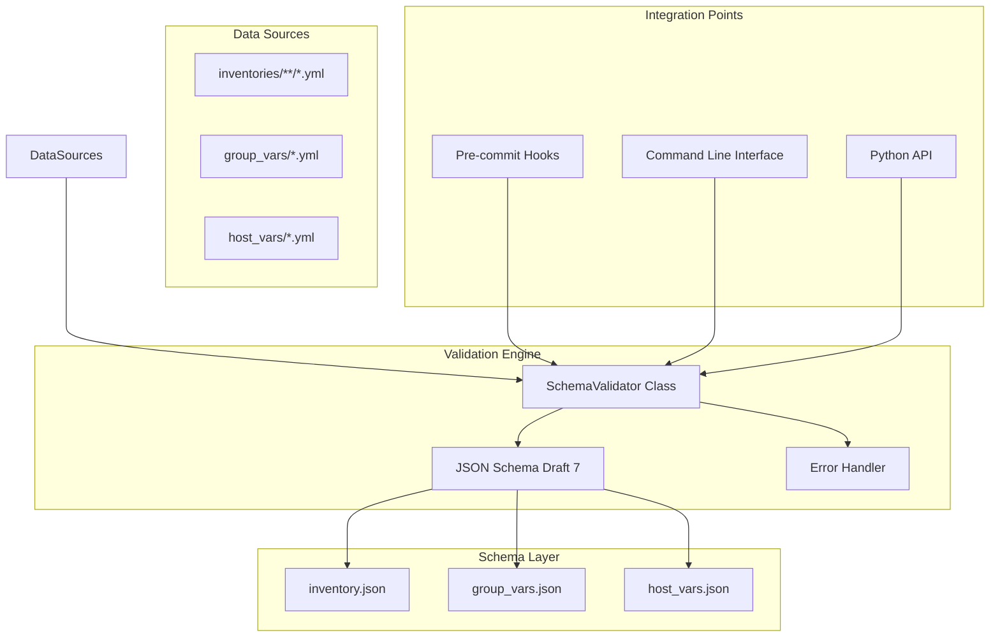

# Schema Validation

<cite>
**Referenced Files in This Document**
- [schemas/__init__.py](file://schemas/__init__.py)
- [schemas/inventory.json](file://schemas/inventory.json)
- [schemas/group_vars.json](file://schemas/group_vars.json)
- [schemas/host_vars.json](file://schemas/host_vars.json)
- [group_vars/all.yml](file://group_vars/all.yml)
- [host_vars/core-rtr-01-us-east.yml](file://host_vars/core-rtr-01-us-east.yml)
- [inventories/production/hosts.yml](file://inventories/production/hosts.yml)
- [.pre-commit-config.yaml](file://.pre-commit-config.yaml)
</cite>

## Update Summary
**Changes Made**
- Added comprehensive JSON Schema validation system with strict validation rules
- Implemented Python-based validation engine with Draft7Validator
- Created detailed schemas for inventory, group_vars, and host_vars files
- Added IP address validation, enum constraints, and business logic enforcement
- Integrated validation into CI/CD pipeline through pre-commit hooks

## Table of Contents
1. [Introduction](#introduction)
2. [Schema Architecture](#schema-architecture)
3. [Core Validation Components](#core-validation-components)
4. [Inventory Schema Definition](#inventory-schema-definition)
5. [Group Variables Schema](#group-variables-schema)
6. [Host Variables Schema](#host-variables-schema)
7. [Validation Engine Implementation](#validation-engine-implementation)
8. [CI/CD Integration](#cicd-integration)
9. [Custom Network Validators](#custom-network-validators)
10. [Error Reporting and Diagnostics](#error-reporting-and-diagnostics)
11. [Best Practices and Guidelines](#best-practices-and-guidelines)
12. [Troubleshooting Guide](#troubleshooting-guide)

## Introduction

The Enterprise Network Automation Platform implements comprehensive data validation and schema enforcement through JSON Schema definitions in the `schemas/` directory. This system validates group variables, host variables, and inventory structures with strict validation for IP addresses, required fields, enum values, and business logic constraints.

The validation system serves as a critical quality gate in the development workflow, preventing invalid configurations from being deployed and ensuring consistency across multi-vendor, multi-region network environments.

## Schema Architecture

The schema validation system follows a hierarchical architecture with dedicated JSON Schema files for each configuration type:



**Diagram sources**
- [schemas/__init__.py:14-96](file://schemas/__init__.py#L14-L96)
- [schemas/inventory.json:1-155](file://schemas/inventory.json#L1-155)
- [schemas/group_vars.json:1-216](file://schemas/group_vars.json#L1-216)
- [schemas/host_vars.json:1-331](file://schemas/host_vars.json#L1-331)

## Core Validation Components

### Schema Definition Layer
The platform uses JSON Schema Draft 7 for defining validation rules across three primary configuration types:

- **Inventory Schema**: Validates Ansible inventory structure, device properties, and relationships
- **Group Variables Schema**: Enforces security policies, network standards, and compliance requirements
- **Host Variables Schema**: Ensures device-specific configurations meet technical and operational standards

### Validation Engine
A Python-based validation engine provides:

- **Multi-format Support**: Handles both JSON and YAML formats seamlessly
- **Hierarchical Validation**: Supports nested structures common in Ansible inventories
- **Cross-field Validation**: Validates relationships between different fields and sections
- **Comprehensive Error Reporting**: Provides structured error messages with file paths and field locations

### Business Logic Enforcement
The system enforces network-specific constraints including:

- **IP Address Validation**: Ensures proper subnet membership and availability
- **Vendor Compatibility**: Validates vendor/platform combinations
- **Security Policies**: Enforces cipher suites, authentication methods, and access controls
- **Network Standards**: Validates VLAN ranges, routing protocols, and interface configurations

**Section sources**
- [schemas/__init__.py:14-96](file://schemas/__init__.py#L14-L96)
- [schemas/inventory.json:57-152](file://schemas/inventory.json#L57-L152)
- [schemas/group_vars.json:7-212](file://schemas/group_vars.json#L7-L212)
- [schemas/host_vars.json:7-327](file://schemas/host_vars.json#L7-L327)

## Inventory Schema Definition

The inventory schema enforces strict structural requirements for device topology definitions:

### Core Device Properties
All devices must include these required fields:

- **ansible_host**: IP address or FQDN with format validation
- **vendor**: Enumerated list of supported vendors (cisco, juniper, arista, paloalto, fortinet, etc.)
- **platform**: Vendor-specific platform identifiers (ios-xe, eos, panos, fortios, etc.)
- **role**: Device role classification (core_router, distribution_switch, firewall, etc.)
- **region**: Geographic region assignment (us-east, us-west, eu-west, apac-east, etc.)

### Advanced Validation Rules
The schema includes sophisticated validation patterns:

- **Hostname Pattern Matching**: `^[a-zA-Z0-9][-a-zA-Z0-9]*$` for valid device names
- **Port Range Validation**: SSH port numbers constrained to 1-65535
- **VLAN Range Enforcement**: Valid VLAN IDs restricted to 1-4094
- **Interface Naming Conventions**: Pattern-based validation for interface identifiers

### Hierarchical Structure Support
The schema supports complex inventory hierarchies:

```yaml
all:
  children:
    core_routers:
      hosts:
        core-rtr-01-us-east:
          ansible_host: 10.0.1.1
          vendor: cisco
          platform: ios-xe
          role: core_router
          region: us-east
```

**Section sources**
- [schemas/inventory.json:57-152](file://schemas/inventory.json#L57-L152)
- [inventories/production/hosts.yml:33-86](file://inventories/production/hosts.yml#L33-L86)

## Group Variables Schema

Group variables define shared configuration policies and security baselines:

### Security Configuration Requirements
- **AAA Authentication**: Required TACACS+ or RADIUS server configuration with minimum 2 servers
- **SNMPv3 Enforcement**: Only SNMPv3 allowed with strong authentication and encryption
- **SSH Hardening**: Approved cipher suites and key exchange algorithms enforced
- **Syslog Configuration**: Minimum 2 syslog servers with severity filtering

### Network Service Definitions
- **NTP Servers**: Minimum 2 servers with redundancy configuration
- **DNS Configuration**: Domain search lists and resolver settings
- **Management VRF**: Dedicated management network isolation
- **Backup Policies**: Automated backup scheduling and retention

### Compliance Baseline Enforcement
- **Golden Config Version**: Tracks approved configuration versions
- **Approved Firmware List**: Validates device firmware against organizational standards
- **Banner Requirements**: Legal and informational banner content enforcement
- **Timezone Configuration**: Standardized timezone formatting

**Section sources**
- [schemas/group_vars.json:7-212](file://schemas/group_vars.json#L7-L212)
- [group_vars/all.yml:7-180](file://group_vars/all.yml#L7-L180)

## Host Variables Schema

Host-specific variables override group-level settings with device-specific configurations:

### Interface Management
- **Interface Definitions**: Comprehensive interface configuration with IP addressing
- **VLAN Configuration**: Access, trunk, and routed interface modes
- **STP Settings**: Spanning tree protocol parameters and portfast/bpduguard
- **Storm Control**: Broadcast/multicast/unicast storm protection

### Routing Protocol Configuration
- **OSPF Areas**: Area types, authentication, and network advertisements
- **BGP Peering**: Neighbor configuration with AS numbers and authentication
- **Static Routes**: Route definitions with next-hop and tracking
- **ACL Management**: Named ACLs with permit/deny entries

### Advanced Network Features
- **Port Channels**: LACP configuration with member interfaces
- **NAT Policies**: Static, dynamic, and PAT NAT rules
- **QoS Policies**: Traffic classification and bandwidth management
- **Loopback Interfaces**: Router ID and service loopbacks

**Section sources**
- [schemas/host_vars.json:7-327](file://schemas/host_vars.json#L7-L327)
- [host_vars/core-rtr-01-us-east.yml:6-103](file://host_vars/core-rtr-01-us-east.yml#L6-L103)

## Validation Engine Implementation

The Python-based validation engine provides a robust foundation for schema enforcement:

### Core Validation Class
The `SchemaValidator` class encapsulates all validation logic:

```python
class SchemaValidator:
    """Validates YAML files against JSON schemas."""
    
    def __init__(self, schemas_dir: str | Path | None = None):
        self.schemas_dir = Path(schemas_dir)
        self._schemas: dict[str, dict[str, Any]] = {}
```

### Validation Methods
The engine provides specialized validation methods:

- **validate()**: Generic validation method for any schema
- **validate_inventory()**: Specific validation for inventory files
- **validate_group_vars()**: Group variables validation
- **validate_host_vars()**: Host-specific variables validation
- **validate_all()**: Batch validation across entire project structure

### Error Handling and Reporting
Comprehensive error reporting includes:

- **Structured Error Messages**: Clear, actionable feedback with field paths
- **File Location Tracking**: Precise identification of validation failures
- **Severity Classification**: Categorization by impact level
- **Batch Processing**: Efficient validation of multiple files

**Section sources**
- [schemas/__init__.py:14-96](file://schemas/__init__.py#L14-L96)
- [schemas/__init__.py:74-160](file://schemas/__init__.py#L74-L160)

## CI/CD Integration

The validation system integrates seamlessly into the development workflow:

### Pre-commit Hook Integration
The `.pre-commit-config.yaml` file includes comprehensive validation hooks:

- **YAML Validation**: Syntax and structure checking
- **JSON Schema Validation**: Custom schema enforcement
- **Security Scanning**: Secret detection and vulnerability scanning
- **Code Quality**: Linting and formatting checks

### Pipeline Integration Points
The validation system operates at multiple stages:

1. **Development Stage**: Local pre-commit validation
2. **Pull Request Stage**: Automated validation in CI pipeline
3. **Deployment Stage**: Final validation before production deployment

### Command Line Interface
Direct command-line usage for manual validation:

```bash
# Validate all files
python -m schemas

# Validate specific file
python -m schemas --file inventories/production/hosts.yml

# Get detailed error reports
python -m schemas --verbose
```

**Section sources**
- [.pre-commit-config.yaml:1-66](file://.pre-commit-config.yaml#L1-L66)
- [schemas/__init__.py:163-192](file://schemas/__init__.py#L163-L192)

## Custom Network Validators

The validation system includes specialized validators for network-specific constraints:

### IP Address Validation
- **IPv4 Format Validation**: Proper subnet notation and range checking
- **Reserved Address Detection**: Prevents use of reserved IP ranges
- **Subnet Overlap Detection**: Identifies conflicting network assignments

### Vendor-Specific Validation
- **Platform Compatibility**: Ensures vendor/platform combinations are valid
- **Feature Availability**: Validates feature support per platform version
- **Syntax Compliance**: Enforces vendor-specific configuration syntax

### Security Policy Enforcement
- **Cipher Suite Validation**: Ensures only approved cryptographic algorithms
- **Authentication Method Checks**: Validates AAA configuration compliance
- **Access Control Lists**: Verifies ACL rules follow organizational standards

### Business Logic Constraints
- **Role-Based Validation**: Different rules apply based on device role
- **Region-Specific Policies**: Geographic compliance requirements
- **Environment Restrictions**: Development vs. production differences

## Error Reporting and Diagnostics

The validation system provides comprehensive error reporting and diagnostic capabilities:

### Structured Error Messages
Errors include detailed context information:

- **Field Path**: Complete path to the problematic field
- **Expected Value**: Description of what was expected
- **Actual Value**: What was actually provided
- **Suggested Fix**: Actionable remediation steps

### Validation Report Generation
Comprehensive reports include:

- **Summary Statistics**: Total files validated, pass/fail counts
- **Error Categorization**: Grouped by type and severity
- **Trend Analysis**: Historical validation performance
- **Compliance Metrics**: Adherence to organizational standards

### Integration with Monitoring Systems
Validation results can be exported to monitoring systems:

- **Prometheus Metrics**: Validation success rates and error counts
- **Grafana Dashboards**: Visual representation of validation health
- **Alerting Integration**: Notifications for validation failures

## Best Practices and Guidelines

### Schema Design Principles
- **Defensive Programming**: Assume worst-case input scenarios
- **Clear Error Messages**: Provide actionable guidance for fixes
- **Backward Compatibility**: Maintain compatibility across schema versions
- **Performance Optimization**: Efficient validation for large datasets

### Validation Strategy Recommendations
- **Layered Validation**: Multiple levels of validation depth
- **Incremental Validation**: Validate changed files only when possible
- **Parallel Processing**: Concurrent validation for improved performance
- **Caching Strategies**: Cache frequently accessed schemas and results

### Testing and Quality Assurance
- **Unit Tests**: Comprehensive test coverage for all validation rules
- **Integration Tests**: End-to-end validation workflow testing
- **Regression Testing**: Ensure schema changes don't break existing functionality
- **Performance Testing**: Validate performance under load conditions

## Troubleshooting Guide

### Common Validation Issues

#### Schema Definition Errors
- **Invalid JSON/YAML Syntax**: Check schema file formatting and escaping
- **Missing Required Fields**: Verify all mandatory attributes are present
- **Type Mismatches**: Ensure data types match schema specifications
- **Constraint Violations**: Review custom validator rules and business logic

#### Performance Issues
- **Slow Validation Times**: Implement caching and parallel processing
- **High Memory Usage**: Optimize data loading and processing strategies
- **Pipeline Bottlenecks**: Profile validation steps and optimize hot paths

#### Integration Problems
- **CI/CD Pipeline Failures**: Check environment setup and dependency versions
- **Pre-commit Hook Issues**: Verify hook installation and configuration
- **Ansible Integration**: Ensure compatibility with Ansible variable resolution

### Diagnostic Tools and Commands

#### Manual Validation
```bash
# Run validation with verbose output
python -m schemas --verbose

# Validate specific file types
python -m schemas --type inventory

# Generate detailed error report
python -m schemas --report ./validation_report.json
```

#### Debug Mode
Enable debug logging for detailed troubleshooting:

```bash
export SCHEMA_VALIDATOR_DEBUG=1
python -m schemas
```

**Section sources**
- [schemas/__init__.py:74-96](file://schemas/__init__.py#L74-L96)
- [schemas/__init__.py:163-192](file://schemas/__init__.py#L163-L192)