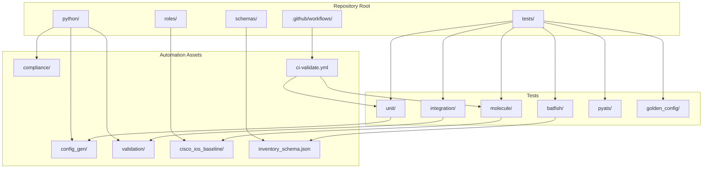
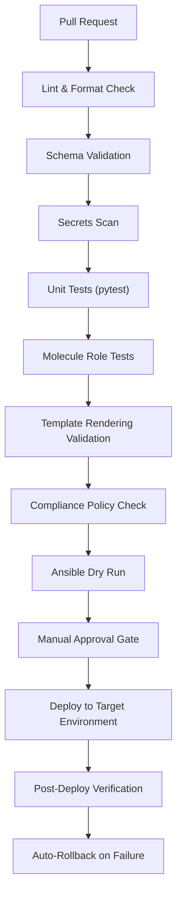
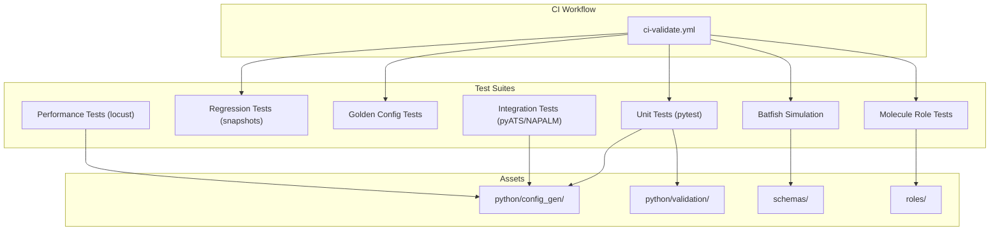

# Testing Strategy

<cite>
**Referenced Files in This Document**
- [README.md](file://README.md)
</cite>

## Table of Contents
1. [Introduction](#introduction)
2. [Project Structure](#project-structure)
3. [Core Components](#core-components)
4. [Architecture Overview](#architecture-overview)
5. [Detailed Component Analysis](#detailed-component-analysis)
6. [Dependency Analysis](#dependency-analysis)
7. [Performance Considerations](#performance-considerations)
8. [Troubleshooting Guide](#troubleshooting-guide)
9. [Conclusion](#conclusion)

## Introduction
This document defines the comprehensive testing strategy for the Enterprise Network Automation Platform. It covers nine test types: unit tests, linting, schema validation, Molecule role tests, network simulation with Batfish, integration tests using pyATS and NAPALM, golden configuration tests, regression tests with snapshots, and performance tests using locust. It also includes execution commands, CI/CD integration patterns, test data management, mock strategies for network devices, and troubleshooting guidance.

## Project Structure
The repository organizes all test suites under a dedicated directory and integrates them into GitHub Actions workflows. The structure aligns with the platform’s modular design and supports multi-vendor automation across environments.

**Diagram sources**
- [README.md:103-180](file://README.md#L103-L180)
- [README.md:479-514](file://README.md#L479-L514)

**Section sources**
- [README.md:103-180](file://README.md#L103-L180)
- [README.md:479-514](file://README.md#L479-L514)

## Core Components
The testing strategy is composed of nine layers that collectively ensure correctness, compliance, and reliability across the platform.

- Unit Tests (pytest): Validate Python modules and Jinja2 filters.
- Linting (ansible-lint, yamllint, flake8, black): Enforce code quality and style across YAML, Python, and Ansible files.
- Schema Validation (jsonschema, cerberus): Validate inventories and variables against schemas.
- Role Tests (Molecule): Test individual Ansible roles in isolated environments.
- Network Simulation (Batfish): Analyze ACLs, routing, and firewall rules without live devices.
- Integration Tests (pyATS, NAPALM): Verify device connectivity and config parsing in staging.
- Golden Config Tests (Custom Python): Compare generated configs against approved baselines.
- Regression Tests (pytest + snapshots): Prevent unintended changes by comparing outputs to stored snapshots.
- Performance Tests (locust): Load-test API and bot endpoints during release candidates.

Execution commands are provided for local runs and CI stages.

**Section sources**
- [README.md:517-544](file://README.md#L517-L544)

## Architecture Overview
The testing architecture integrates with the CI/CD pipeline to enforce quality gates before deployment.

**Diagram sources**
- [README.md:479-501](file://README.md#L479-L501)

## Detailed Component Analysis

### Unit Tests (pytest)
Scope:
- Python modules under python/
- Jinja2 filters used by templates

Objectives:
- Validate logic paths, error handling, and edge cases
- Ensure deterministic behavior for configuration generation and validation utilities

Execution:
- Local: pytest tests/unit/ -v
- CI: Included in ci-validate.yml workflow

Mock Strategies:
- Mock external dependencies (SSH, NETCONF, RESTCONF, SNMP) using standard Python mocking libraries
- Stub file I/O and network calls to isolate business logic

Data Management:
- Use fixtures for sample inventories and structured variables
- Keep test data small and representative

Best Practices:
- One assertion per test where feasible
- Parameterized tests for multiple vendor/platform combinations

**Section sources**
- [README.md:517-544](file://README.md#L517-L544)

### Linting (ansible-lint, yamllint, flake8, black)
Scope:
- All YAML, Python, and Ansible files

Objectives:
- Enforce consistent formatting and style
- Catch common issues early

Execution:
- Pre-commit hooks recommended
- CI step in ci-validate.yml

Rules:
- ansible-lint for playbooks and roles
- yamllint for YAML structure and best practices
- flake8 for Python style and complexity checks
- black for consistent Python formatting

**Section sources**
- [README.md:517-544](file://README.md#L517-L544)

### Schema Validation (jsonschema, cerberus)
Scope:
- Inventory files and variable sets (group_vars, host_vars)

Objectives:
- Ensure required fields and correct types
- Prevent invalid configurations from reaching later stages

Execution:
- Local: run schema validators against inventories and vars
- CI: integrated after linting and secrets scan

Schemas:
- JSON/YAML schemas under schemas/
- Cerberus validators for complex business rules

**Section sources**
- [README.md:517-544](file://README.md#L517-L544)

### Role Tests (Molecule)
Scope:
- Individual Ansible roles (e.g., cisco_ios_baseline)

Objectives:
- Validate idempotency and side effects
- Test role behavior across platforms and scenarios

Execution:
- Local: cd roles/cisco_ios_baseline && molecule test
- CI: invoked per role or via matrix builds

Environment:
- Docker/Podman-backed instances for isolation
- Scenario matrices for multi-vendor coverage

**Section sources**
- [README.md:517-544](file://README.md#L517-L544)

### Network Simulation (Batfish)
Scope:
- ACL analysis, routing reachability, firewall rule semantics

Objectives:
- Detect policy violations and unreachable routes without touching live devices
- Provide actionable insights for remediation

Execution:
- Place snapshots under tests/batfish/snapshots/
- Run Batfish analysis as part of CI when network config changes occur

Outputs:
- Reachability graphs, ACL hit counts, and violation reports

**Section sources**
- [README.md:517-544](file://README.md#L517-L544)

### Integration Tests (pyATS, NAPALM)
Scope:
- Device connectivity, config parsing, and basic operational checks

Objectives:
- Validate end-to-end flows in staging environments
- Confirm compatibility with target vendors and platforms

Execution:
- Triggered on staging deployments
- Uses pyATS topologies and NAPALM drivers

Device Access:
- Credentials sourced from secrets backends (Vault, AWS Secrets Manager, Azure Key Vault)
- Timeouts and retries configured for resilience

**Section sources**
- [README.md:517-544](file://README.md#L517-L544)

### Golden Config Tests (Custom Python)
Scope:
- Generated configurations compared against approved baselines

Objectives:
- Ensure baseline integrity and detect drift
- Support scheduled and PR-triggered runs

Execution:
- Diff current output vs. golden snapshot
- Fail if unauthorized differences detected

Management:
- Baselines versioned alongside templates and variables
- Approvals required to update golden configs

**Section sources**
- [README.md:517-544](file://README.md#L517-L544)

### Regression Tests (pytest + Snapshots)
Scope:
- Output stability across changes

Objectives:
- Prevent unintended changes in generated artifacts and logs
- Maintain backward compatibility

Execution:
- Snapshot comparison in CI
- Update snapshots only with explicit approval

Strategy:
- Store canonical outputs per scenario
- Flag diffs for review

**Section sources**
- [README.md:517-544](file://README.md#L517-L544)

### Performance Tests (locust)
Scope:
- API and bot endpoint load testing

Objectives:
- Measure latency, throughput, and error rates under load
- Identify bottlenecks before release

Execution:
- Run on release candidates
- Simulate realistic user traffic patterns

Metrics:
- Response time percentiles
- Error rate thresholds
- Resource utilization indicators

**Section sources**
- [README.md:517-544](file://README.md#L517-L544)

## Dependency Analysis
Testing components depend on shared assets and CI workflows. The following diagram maps key relationships among tests, automation modules, schemas, and workflows.

**Diagram sources**
- [README.md:479-514](file://README.md#L479-L514)
- [README.md:103-180](file://README.md#L103-L180)

**Section sources**
- [README.md:479-514](file://README.md#L479-L514)
- [README.md:103-180](file://README.md#L103-L180)

## Performance Considerations
- Parallelize independent test suites in CI to reduce feedback time
- Cache dependencies and Docker images for faster Molecule runs
- Limit integration tests to staging-only to avoid production impact
- Use targeted triggers for Batfish and golden config tests when only network-related files change
- Configure locust with realistic concurrency profiles and ramp-up phases

[No sources needed since this section provides general guidance]

## Troubleshooting Guide
Common issues and resolutions:
- Ansible connection timeout: Verify SSH reachability using ping against lab inventory
- Template rendering errors: Use debug mode in config generator to inspect Jinja2 context
- Compliance check failures: Review policies and running config diffs
- CI pipeline failures: Inspect GitHub Actions logs for actionable messages
- Vault authentication failures: Validate OIDC tokens or AppRole credentials and policies
- Molecule test failures: Ensure Docker/Podman is running; verify molecule configuration
- Batfish analysis errors: Validate snapshots and input formats

**Section sources**
- [README.md:674-685](file://README.md#L674-L685)

## Conclusion
This testing strategy ensures robustness across code, configuration, and runtime behaviors. By integrating unit, linting, schema, role, simulation, integration, golden config, regression, and performance tests into CI/CD, the platform maintains high standards for quality, security, and compliance while enabling rapid, safe evolution.

[No sources needed since this section summarizes without analyzing specific files]