# Unit Testing

<cite>
**Referenced Files in This Document**
- [README.md](file://README.md)
</cite>

## Table of Contents
1. [Introduction](#introduction)
2. [Project Structure](#project-structure)
3. [Core Components](#core-components)
4. [Architecture Overview](#architecture-overview)
5. [Detailed Component Analysis](#detailed-component-analysis)
6. [Dependency Analysis](#dependency-analysis)
7. [Performance Considerations](#performance-considerations)
8. [Troubleshooting Guide](#troubleshooting-guide)
9. [Conclusion](#conclusion)
10. [Appendices](#appendices)

## Introduction

This document provides comprehensive guidance for implementing unit tests in the Enterprise Network Automation Platform using pytest. The platform follows a "Testing as Code" principle where all configurations, policies, templates, tests, pipelines, dashboards, and bots are stored in Git. The testing strategy encompasses multiple layers including unit tests, integration tests, compliance checks, and performance validation.

The platform supports enterprise-scale network automation across multi-vendor environments, requiring robust testing to ensure reliability, security, and compliance. All Python modules follow PEP 8 standards, use type hints, include docstrings, and have corresponding unit tests.

## Project Structure

The testing infrastructure is organized under the `tests/` directory with specialized subdirectories for different test types:

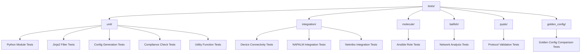

**Diagram sources**
- [README.md:152-158](file://README.md#L152-L158)

The project structure supports a comprehensive testing approach covering all aspects of the network automation platform, from individual Python functions to full device interactions.

**Section sources**
- [README.md:152-158](file://README.md#L152-L158)

## Core Components

The Enterprise Network Automation Platform implements a multi-layered testing strategy with distinct responsibilities for each test category:

### Test Categories and Scope

| Test Type | Tool | Scope | When |
|---|---|---|---|
| **Unit Tests** | pytest | Python modules, Jinja2 filters | Every PR |
| **Linting** | ansible-lint, yamllint, flake8, black | All YAML, Python, Ansible files | Every PR |
| **Schema Validation** | jsonschema, cerberus | Inventory, group_vars, host_vars | Every PR |
| **Role Tests** | Molecule | Individual Ansible roles | Every PR |
| **Network Simulation** | Batfish | ACL, routing, firewall rule analysis | Every PR affecting network config |
| **Integration Tests** | pyATS, NAPALM | Device connectivity, config parsing | Staging deploy |
| **Golden Config Tests** | Custom Python | Diff against approved baseline | Every PR, scheduled |
| **Regression Tests** | pytest + snapshots | Ensure no unintended config changes | Every PR |
| **Performance Tests** | locust, custom | API and bot endpoint load testing | Release candidate |

### Python Modules Under Test

The platform includes comprehensive Python modules that require thorough unit testing:

| Module | Purpose | Testing Focus |
|---|---|---|
| `inventory/` | Inventory parsing, device enrichment, CMDB integration | Data validation, parsing logic, error handling |
| `netconf/` | NETCONF client with capability negotiation | Protocol communication, error scenarios |
| `restconf/` | RESTCONF client with YANG model support | API calls, response validation |
| `ssh/` | SSH abstraction over Netmiko/Paramiko with retry | Connection handling, retry logic, timeouts |
| `snmp/` | SNMPv3 polling and trap handling | Protocol communication, data parsing |
| `telemetry/` | Model-driven telemetry receiver and parser | Data ingestion, format validation |
| `config_gen/` | Jinja2-based configuration generation from structured data | Template rendering, output validation |
| `validation/` | Pre-deployment config validation (syntax + semantics) | Rule enforcement, compliance checking |
| `backup/` | Backup management with versioning and encryption | File operations, encryption, version control |
| `compliance/` | Compliance engine with pluggable rule sets | Policy evaluation, reporting |
| `utils/` | Logging, retry, concurrency, diff, bulk operations | Utility functions, edge cases |

**Section sources**
- [README.md:438-456](file://README.md#L438-L456)
- [README.md:517-529](file://README.md#L517-L529)

## Architecture Overview

The testing architecture integrates seamlessly with the CI/CD pipeline, ensuring comprehensive validation at every stage of the development lifecycle:

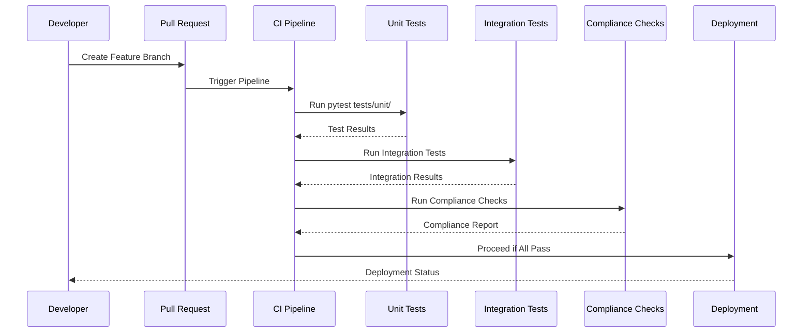

**Diagram sources**
- [README.md:479-501](file://README.md#L479-L501)

The testing pipeline ensures quality gates at multiple stages, from initial code submission through production deployment, providing confidence in the stability and security of network automation changes.

**Section sources**
- [README.md:479-501](file://README.md#L479-L501)

## Detailed Component Analysis

### Unit Testing Framework Setup

The platform uses pytest as the primary testing framework with comprehensive configuration and fixtures. The testing setup includes:

#### Test Discovery and Configuration

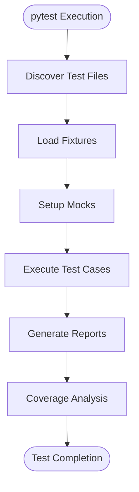

**Diagram sources**
- [README.md:531-544](file://README.md#L531-L544)

#### Key Testing Commands

The platform provides standardized commands for executing different test suites:

| Command | Purpose | Output |
|---|---|---|
| `pytest tests/ -v --tb=short` | Run all tests with verbose output | Comprehensive test results |
| `pytest tests/unit/ -v` | Execute only unit tests | Unit test execution details |
| `pytest tests/compliance/ -v` | Run compliance-specific tests | Compliance validation results |
| `molecule test` | Test specific Ansible roles | Role testing outcomes |

### Mocking Strategies for Network Devices

The platform employs sophisticated mocking strategies to simulate network device interactions without requiring physical or virtual devices during unit testing:

#### NAPALM Mocking Patterns

NAPALM (Network Automation and Programmability Abstraction Layer with Multivendor Support) is mocked to simulate various vendor responses:

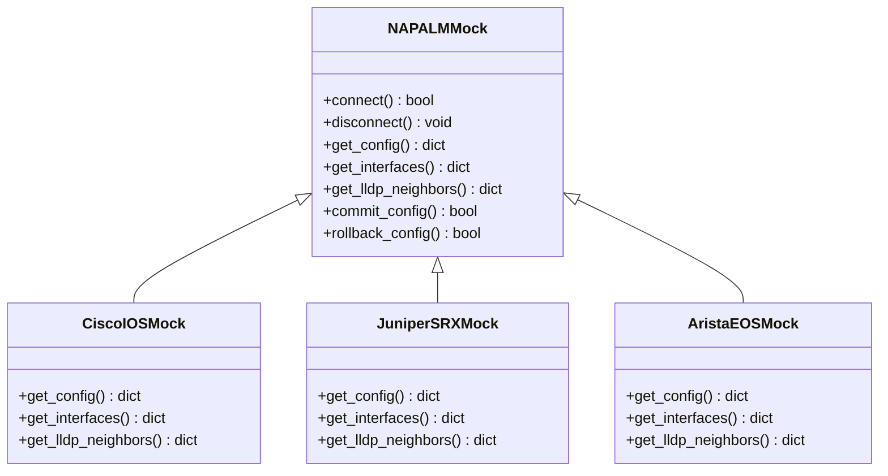

**Diagram sources**
- [README.md:188-198](file://README.md#L188-L198)

#### Netmiko Mocking Implementation

Netmiko connections are mocked to simulate SSH sessions and command execution:

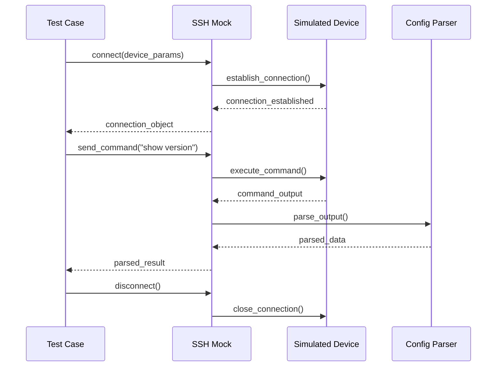

**Diagram sources**
- [README.md:447-448](file://README.md#L447-L448)

### Test Data Management with Fixtures

The platform implements comprehensive fixture management for test data consistency and reusability:

#### Fixture Hierarchy

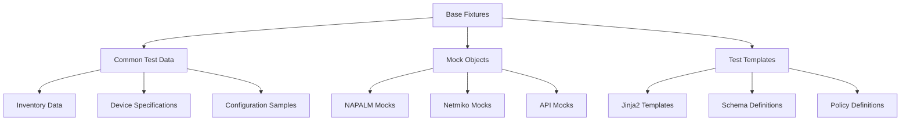

#### Fixture Categories

| Category | Purpose | Examples |
|---|---|---|
| **Inventory Fixtures** | Provide test inventory data | Device lists, group variables, host variables |
| **Configuration Fixtures** | Supply sample configurations | Valid configs, invalid configs, edge cases |
| **Mock Fixtures** | Create mock objects | NAPALM connections, Netmiko sessions, API clients |
| **Template Fixtures** | Provide Jinja2 templates | Vendor-specific templates, custom filters |
| **Policy Fixtures** | Define compliance policies | Security policies, naming conventions, standards |

### Assertion Patterns for Configuration Output Validation

The platform implements sophisticated assertion patterns to validate generated configurations:

#### Configuration Validation Strategies

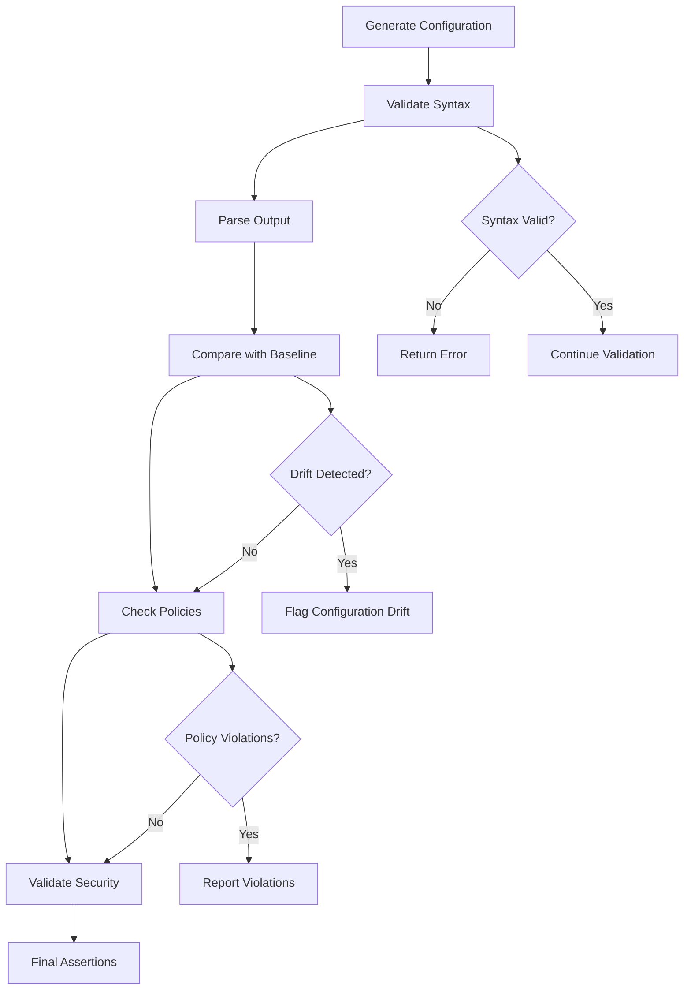

**Diagram sources**
- [README.md:450-451](file://README.md#L450-L451)

#### Multi-Level Validation

The platform performs validation at multiple levels:

1. **Syntax Validation**: Ensures generated configuration syntax is correct
2. **Semantic Validation**: Validates logical consistency and dependencies
3. **Policy Validation**: Enforces organizational policies and standards
4. **Security Validation**: Checks for security best practices and compliance
5. **Baseline Comparison**: Compares against approved golden configurations

### Testing Jinja2 Filters and Template Rendering

The platform extensively uses Jinja2 for configuration generation, requiring comprehensive testing of custom filters and template rendering:

#### Jinja2 Filter Testing

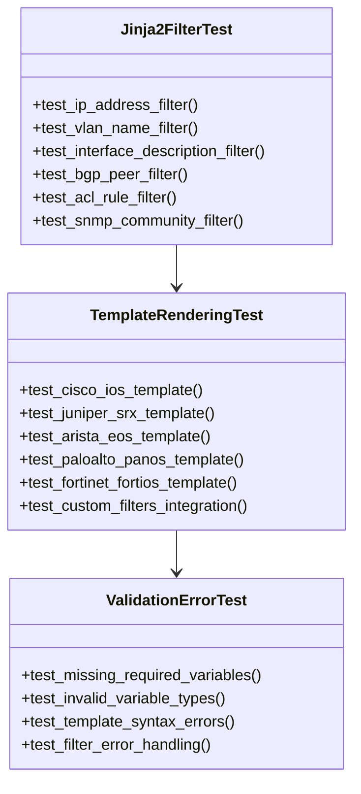

**Diagram sources**
- [README.md:450](file://README.md#L450)

#### Template Rendering Validation

Template rendering tests ensure that:
- All required variables are present and valid
- Generated configurations match expected output
- Custom filters produce correct transformations
- Error handling works properly for malformed inputs

### Error Handling Scenarios

The platform implements comprehensive error handling testing to ensure robustness:

#### Error Scenario Categories

| Category | Description | Test Coverage |
|---|---|---|
| **Connection Errors** | Network connectivity failures, authentication issues | Timeout handling, retry logic, fallback mechanisms |
| **Parsing Errors** | Malformed configuration data, unexpected formats | Input validation, error recovery, logging |
| **Template Errors** | Invalid Jinja2 syntax, missing variables | Template validation, graceful degradation |
| **Policy Violations** | Non-compliant configurations | Policy enforcement, detailed reporting |
| **Resource Limitations** | Memory constraints, file system limits | Resource monitoring, cleanup procedures |

### Performance-Critical Code Paths

The platform identifies and tests performance-critical paths to ensure scalability:

#### Performance Testing Strategy

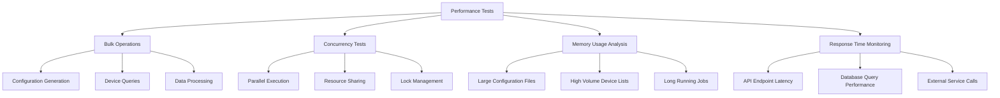

**Diagram sources**
- [README.md:529](file://README.md#L529)

## Dependency Analysis

The testing framework has well-defined dependencies and relationships between components:

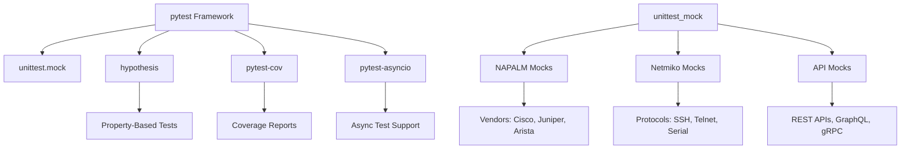

**Diagram sources**
- [README.md:188-198](file://README.md#L188-L198)

### External Dependencies

The testing framework relies on several key external libraries:

| Library | Purpose | Version Requirements |
|---|---|---|
| **pytest** | Testing framework | Latest stable |
| **hypothesis** | Property-based testing | Latest stable |
| **pytest-cov** | Coverage reporting | Latest stable |
| **pytest-asyncio** | Async test support | Latest stable |
| **napalm** | Network device abstraction | Compatible with platform |
| **netmiko** | SSH automation library | Compatible with platform |
| **jinja2** | Template rendering | Latest stable |
| **pyyaml** | YAML processing | Latest stable |

**Section sources**
- [README.md:188-198](file://README.md#L188-L198)

## Performance Considerations

The platform implements several performance optimization strategies for testing:

### Test Optimization Techniques

1. **Parallel Test Execution**: Utilize pytest-xdist for concurrent test execution
2. **Fixture Caching**: Cache expensive fixture creation and mock setup
3. **Selective Test Runs**: Use markers to run specific test subsets
4. **Memory Profiling**: Monitor memory usage during long-running tests
5. **Network Simulation**: Use lightweight mocks instead of real device connections

### Coverage Requirements

The platform enforces minimum coverage thresholds:
- **Overall Coverage**: Minimum 80% line coverage
- **Critical Paths**: 100% coverage for security and compliance logic
- **Public APIs**: 90%+ coverage for exposed interfaces
- **Error Handling**: Comprehensive coverage for exception scenarios

## Troubleshooting Guide

Common testing issues and their resolutions:

### Test Execution Issues

| Issue | Symptoms | Resolution |
|---|---|---|
| **Import Errors** | Module not found, circular imports | Verify PYTHONPATH, check module structure |
| **Fixture Failures** | Fixture setup errors, data inconsistencies | Review fixture dependencies, validate test data |
| **Mock Problems** | Unexpected behavior, missing methods | Verify mock configuration, check method signatures |
| **Timeout Issues** | Tests hanging, connection timeouts | Adjust timeout values, optimize network calls |
| **Coverage Gaps** | Low coverage percentages | Add missing test cases, review untested branches |

### Debugging Strategies

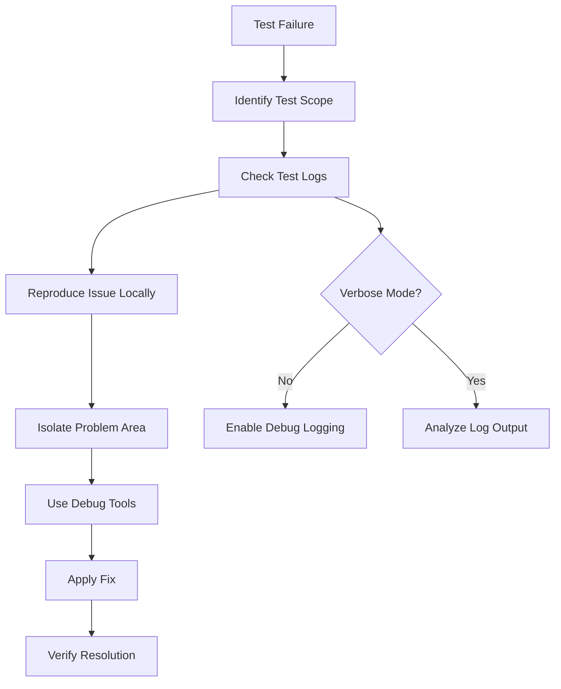

**Section sources**
- [README.md:674-685](file://README.md#L674-L685)

## Conclusion

The Enterprise Network Automation Platform implements a comprehensive testing strategy that ensures reliability, security, and compliance across its multi-vendor network automation capabilities. The pytest-based unit testing framework provides robust coverage for Python modules, Jinja2 templates, and network device interactions through sophisticated mocking strategies.

Key strengths of the testing approach include:
- **Multi-layered validation** from unit tests to integration and compliance checks
- **Comprehensive mocking** for network devices using NAPALM and Netmiko abstractions
- **Extensive fixture management** for consistent test data and reusable test components
- **Performance-focused testing** for critical code paths and scalability requirements
- **Seamless CI/CD integration** for automated quality assurance

The testing infrastructure supports enterprise-scale operations while maintaining developer productivity through clear organization, comprehensive documentation, and efficient execution strategies.

## Appendices

### Test Execution Commands Reference

| Command | Description | Usage Context |
|---|---|---|
| `pytest tests/unit/ -v` | Run unit tests with verbose output | Development workflow |
| `pytest tests/ -v --tb=short` | Run all tests with short traceback | CI/CD pipeline |
| `pytest tests/unit/ --cov=python/` | Run unit tests with coverage | Quality gate checks |
| `pytest tests/unit/ -m slow` | Run slow tests only | Performance validation |
| `pytest tests/unit/ -k "test_compliance"` | Run tests matching pattern | Targeted testing |
| `molecule test` | Test Ansible roles | Role development |

### Coverage Reporting

The platform generates comprehensive coverage reports:
- **HTML Reports**: Interactive coverage visualization
- **XML Reports**: CI/CD integration and trend analysis
- **Console Output**: Quick summary during development
- **Threshold Enforcement**: Automated blocking of low coverage

### CI/CD Integration

Testing integrates seamlessly with GitHub Actions workflows:
- **Automated Execution**: Tests run on every pull request
- **Quality Gates**: Coverage thresholds enforced automatically
- **Artifact Generation**: Test results and reports preserved
- **Notification System**: Team alerts for test failures