# Project Overview

<cite>
**Referenced Files in This Document**
- [README.md](file://README.md)
</cite>

## Table of Contents
1. [Introduction](#introduction)
2. [Project Structure](#project-structure)
3. [Core Components](#core-components)
4. [Architecture Overview](#architecture-overview)
5. [Detailed Component Analysis](#detailed-component-analysis)
6. [Dependency Analysis](#dependency-analysis)
7. [Performance Considerations](#performance-considerations)
8. [Troubleshooting Guide](#troubleshooting-guide)
9. [Conclusion](#conclusion)

## Introduction
This Enterprise Network Automation Platform is a production-grade, vendor-agnostic solution designed for Fortune 100-scale operations. It automates the full lifecycle of routers, switches, firewalls, load balancers, VPN gateways, and cloud networking components across multi-vendor and multi-region environments. The platform embraces modern engineering practices: everything is code, with configurations, policies, templates, tests, pipelines, dashboards, and bots stored in Git. Secrets are never committed; they are managed through secure backends.

The platform’s purpose is to provide reliable, repeatable, and auditable network automation at scale while enforcing security, compliance, and observability throughout the change lifecycle.

## Project Structure
The repository follows a modular, Git-driven layout that separates concerns by environment, device role, vendor, and function. Key areas include inventories, playbooks, roles, Jinja2 templates per vendor, Python automation modules, automation bots, test suites, CI/CD workflows, monitoring definitions, Terraform for cloud networking, and policy/compliance assets.

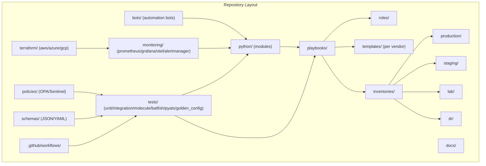

**Diagram sources**
- [README.md:103-180](file://README.md#L103-L180)

**Section sources**
- [README.md:103-180](file://README.md#L103-L180)

## Core Components
The platform is built around several core components that together deliver enterprise-grade automation:

- Control Plane
  - Ansible Engine: orchestrates configuration changes across devices using playbooks and roles.
  - Python Modules: reusable libraries for NETCONF/RESTCONF/SSH/SNMP/telemetry, config generation, validation, backup, and compliance.
  - Automation Bots: API-driven services exposing self-service endpoints for firewall rules, VLANs, ports, backups, health checks, upgrades, rollbacks, approvals, and ChatOps routing.
  - Terraform: manages cloud networking resources (AWS VPC, Azure VNets, GCP VPC).

- Data Plane
  - Routers, Switches, Firewalls, Load Balancers, VPN Gateways, and Cloud Networking components across multiple vendors and regions.

- Observability
  - Prometheus, Grafana, OpenTelemetry, and Syslog collectors for metrics, logs, and telemetry.

- Security
  - HashiCorp Vault, AWS Secrets Manager, Azure Key Vault, CyberArk PAM, and Ansible Vault for secrets management and rotation.

These components interact via well-defined interfaces and follow GitOps principles to ensure consistency, auditability, and safety.

**Section sources**
- [README.md:52-99](file://README.md#L52-L99)
- [README.md:438-456](file://README.md#L438-L456)
- [README.md:460-476](file://README.md#L460-L476)
- [README.md:339-368](file://README.md#L339-L368)

## Architecture Overview
The platform implements a layered architecture with clear separation between control plane, data plane, observability, and security. Changes originate from developers via pull requests and flow through automated validation, approval, deployment, verification, and rollback gates.

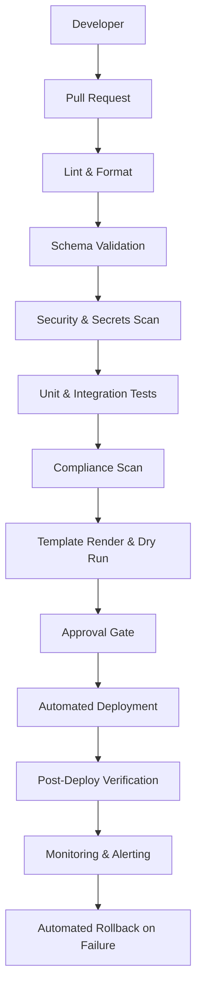

**Diagram sources**
- [README.md:36-50](file://README.md#L36-L50)

### Automation Engine Architecture
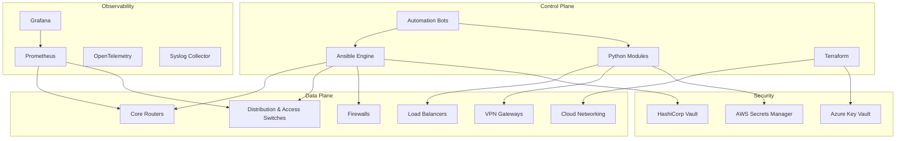

**Diagram sources**
- [README.md:54-99](file://README.md#L54-L99)

**Section sources**
- [README.md:36-99](file://README.md#L36-L99)

## Detailed Component Analysis

### Inventory Design
Devices are organized by environment, role, region, and vendor. Each inventory entry defines connectivity and attributes used by automation tools.

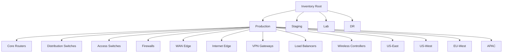

**Diagram sources**
- [README.md:288-309](file://README.md#L288-L309)

**Section sources**
- [README.md:284-336](file://README.md#L284-L336)

### Secrets Architecture
Secrets are never committed to Git. A unified adapter layer abstracts multiple backends, enabling consistent access patterns across automation tools and CI/CD pipelines.

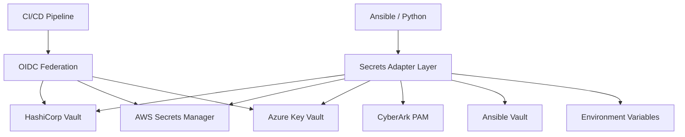

**Diagram sources**
- [README.md:343-357](file://README.md#L343-L357)

**Section sources**
- [README.md:339-368](file://README.md#L339-L368)

### Playbook Catalogue
The platform provides comprehensive playbooks covering device lifecycle, network services, routing protocols, high availability, and operational tasks. Examples include initial provisioning, AAA/NTP/DNS/SNMP/Syslog setup, VLAN/trunk/LACP/QoS/ACL/NAT/VPN/firewall rules, OSPF/BGP/IS-IS/static routes, VRRP/HSRP, backups, restores, firmware upgrades/rollbacks, golden configs, drift detection, compliance scans, health checks, inventory collection, neighbor discovery, license validation, and monitoring agents.

**Section sources**
- [README.md:371-435](file://README.md#L371-L435)

### Python Modules
Reusable, typed, documented Python modules under python/ implement capabilities such as inventory parsing, NETCONF/RESTCONF clients, SSH abstraction, SNMPv3 polling, telemetry receiver/parser, Jinja2-based configuration generation, pre-deployment validation, backup management, compliance engine, and utilities for logging/retry/concurrency/diff/bulk operations.

**Section sources**
- [README.md:438-456](file://README.md#L438-L456)

### Automation Bots
Bots expose REST APIs and optional ChatOps integrations for self-service operations including firewall rule requests, VLAN provisioning, port configuration, backups, health checks, compliance scans, firmware upgrades, rollbacks, and unified command routing.

**Section sources**
- [README.md:460-476](file://README.md#L460-L476)

### CI/CD Pipeline
All pipelines are defined in .github/workflows and enforce linting, schema validation, secrets scanning, security scanning, unit and integration tests, Molecule role tests, template rendering validation, compliance checks, dry runs, manual approval gates, deployment, post-deploy verification, documentation generation, release artifacts, and auto-rollback on failure.

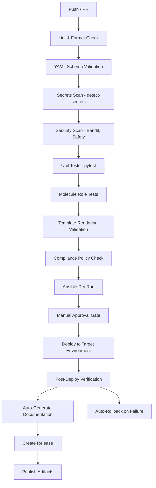

**Diagram sources**
- [README.md:483-501](file://README.md#L483-L501)

**Section sources**
- [README.md:479-514](file://README.md#L479-L514)

### Testing Strategy
A comprehensive testing strategy includes unit tests, linting, schema validation, role tests, network simulation with Batfish, integration tests with pyATS/NAPALM, golden config tests, regression tests, and performance tests.

**Section sources**
- [README.md:517-544](file://README.md#L517-L544)

### Compliance Strategy
Compliance is enforced at every stage—from pull request to production runtime—using OPA policies, Batfish analysis, and custom Python checks. Policies cover SSH-only, NTP, AAA, SNMPv3, logging, approved ciphers/firmware, password policy, ACL standards, firewall rules, and unused object detection.

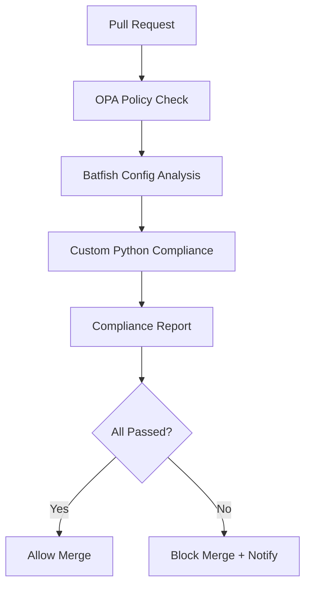

**Diagram sources**
- [README.md:570-579](file://README.md#L570-L579)

**Section sources**
- [README.md:548-580](file://README.md#L548-L580)

### Monitoring & Observability
Observability is implemented via SNMPv3 polling, model-driven telemetry, and syslog streaming into Prometheus, OpenTelemetry, and a Syslog collector. Alerts route to Slack, PagerDuty, and Teams, with dashboards providing visibility into network health, automation metrics, compliance overview, upgrade tracking, API performance, and inventory drift.

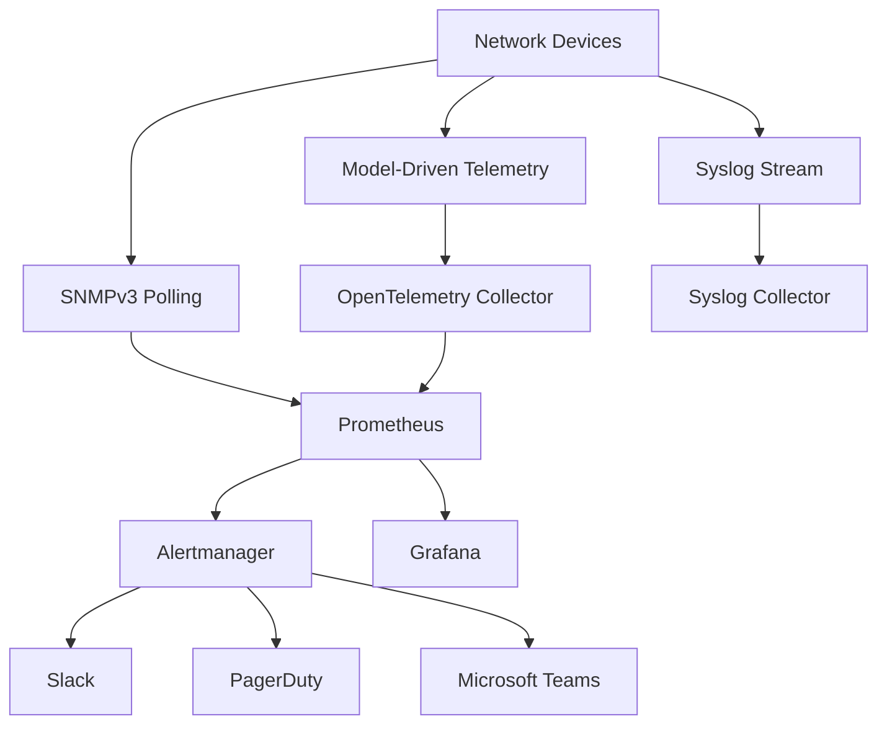

**Diagram sources**
- [README.md:587-604](file://README.md#L587-L604)

**Section sources**
- [README.md:583-616](file://README.md#L583-L616)

### GitOps Workflow
Changes follow a strict GitOps model: feature branch creation, pull request opening, automated validation, peer/CAB approval, automated deployment, post-deploy verification, and automatic rollback on failure.

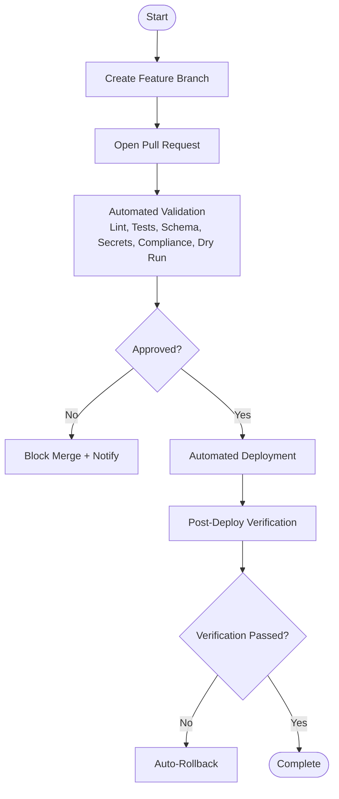

**Diagram sources**
- [README.md:619-638](file://README.md#L619-L638)

**Section sources**
- [README.md:619-638](file://README.md#L619-L638)

### Upgrade & Rollback Workflows
Firmware upgrades include pre-checks, backups, download, checksum verification, installation, reboot, and post-upgrade validation with automatic rollback on failure. Configuration rollbacks identify target versions, fetch backups, diff current vs target, apply rollback, verify, and notify.

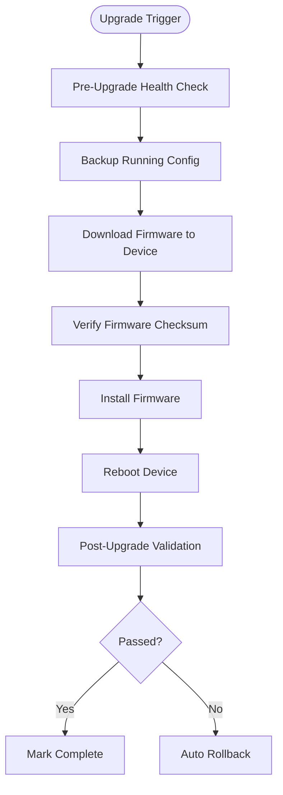

**Diagram sources**
- [README.md:646-658](file://README.md#L646-L658)

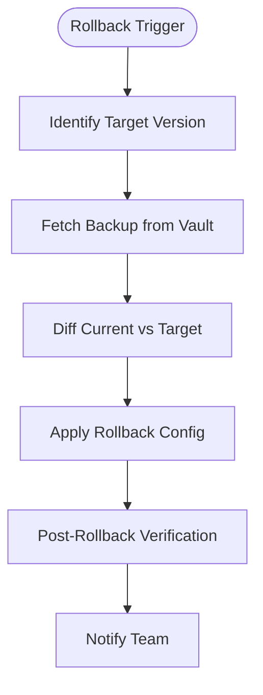

**Diagram sources**
- [README.md:662-670](file://README.md#L662-L670)

**Section sources**
- [README.md:642-671](file://README.md#L642-L671)

## Dependency Analysis
The platform’s dependencies span automation engines, protocols, templates, CI/CD, testing, compliance, monitoring, secrets, ChatOps, version control, and cloud networking. These layers integrate tightly to support enterprise-scale operations.

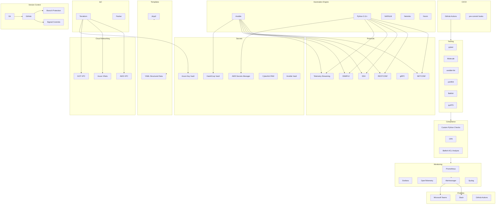

**Diagram sources**
- [README.md:184-200](file://README.md#L184-L200)

**Section sources**
- [README.md:184-200](file://README.md#L184-L200)

## Performance Considerations
- Use parallel execution where supported by automation engines to reduce job times across large fleets.
- Prefer model-driven telemetry over heavy polling to minimize device overhead.
- Cache frequently accessed data (e.g., inventory enrichment) to speed up repeated operations.
- Implement idempotent playbooks and roles to avoid unnecessary reconfigurations.
- Leverage dry-run and validation stages to catch issues early and prevent costly rollbacks.
- Scale automation workers horizontally when needed (e.g., Kubernetes-based scaling) to handle peak loads.

[No sources needed since this section provides general guidance]

## Troubleshooting Guide
Common issues and resolutions include verifying SSH reachability for connection timeouts, checking Jinja2 syntax for template rendering errors, reviewing compliance policies and diffs for compliance failures, inspecting CI pipeline logs for actionable errors, validating OIDC tokens or AppRole credentials for Vault authentication issues, ensuring Docker/Podman is running for Molecule tests, and validating Batfish snapshots for analysis errors.

**Section sources**
- [README.md:674-685](file://README.md#L674-L685)

## Conclusion
This Enterprise Network Automation Platform delivers a robust, scalable, and secure foundation for managing thousands of network devices across multi-vendor, multi-region environments. By embracing Network as Code, Infrastructure as Code, GitOps, DevSecOps, Compliance as Code, Monitoring as Code, Testing as Code, and Documentation as Code, it ensures reliability, auditability, and continuous improvement. The layered architecture, comprehensive toolchain, and disciplined workflows enable both beginners and experienced engineers to operate confidently at enterprise scale.

[No sources needed since this section summarizes without analyzing specific files]