# Enterprise Network Automation Platform

[]()
[]()
[]()
[]()
[]()

> A production-grade, vendor-agnostic network automation platform demonstrating Infrastructure as Code, GitOps, CI/CD, compliance enforcement, observability, and security — built for enterprise scale.

---

## Overview

This repository is a fully modular, Git-driven network automation platform designed to manage thousands of network devices across multi-vendor, multi-region environments. It simulates how Fortune 100 organizations — banks, telecoms, and cloud-native enterprises — automate the full lifecycle of routers, switches, firewalls, load balancers, VPN gateways, and cloud networking components.

Every configuration, policy, template, test, pipeline, dashboard, and bot is stored in Git. Secrets are never committed. Everything is code.

### Core Principles

| Principle | Implementation |
|---|---|
| **Network as Code** | All device configurations generated from Jinja2 templates + structured data |
| **Infrastructure as Code** | Terraform for cloud networking, Ansible for device automation |
| **GitOps** | Pull requests trigger validation, approval, deployment, and verification |
| **DevSecOps** | Secrets scanning, policy enforcement, and compliance in every pipeline |
| **Compliance as Code** | Automated checks for SSH-only, NTP, AAA, SNMPv3, cipher standards |
| **Monitoring as Code** | Prometheus, Grafana, OpenTelemetry dashboards defined in Git |
| **Testing as Code** | pytest, Molecule, Batfish, pyATS, linting, schema validation |
| **Documentation as Code** | Architecture diagrams, runbooks, and API docs auto-generated |

---

## Architecture

### Platform Architecture Overview

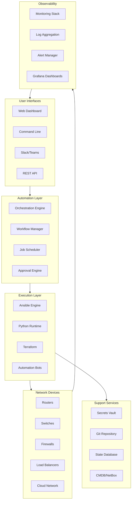

### CI/CD Pipeline Flow

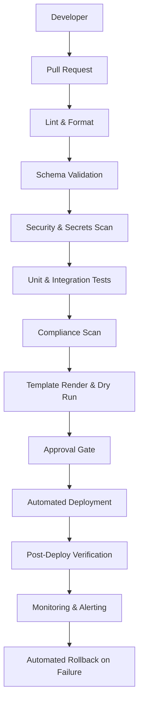

### Automation Engine Architecture

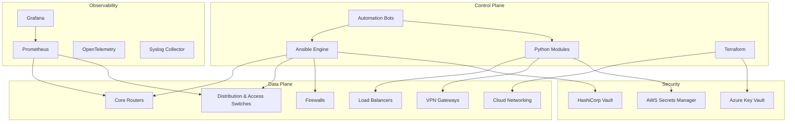

---

## Repository Layout

```
network-automation/
├── inventories/              # Ansible inventories per environment
│   ├── production/
│   ├── staging/
│   ├── lab/
│   └── dr/
├── group_vars/               # Shared variables by device group
├── host_vars/                # Per-device variables
├── playbooks/                # Ansible playbooks for all operations
├── roles/                    # Reusable Ansible roles
├── templates/                # Jinja2 configuration templates per vendor
│   ├── cisco_ios/
│   ├── cisco_nxos/
│   ├── cisco_iosxe/
│   ├── juniper_srx/
│   ├── juniper_mx/
│   ├── arista_eos/
│   ├── paloalto/
│   ├── fortinet/
│   ├── checkpoint/
│   ├── f5/
│   ├── pfsense/
│   └── opnsense/
├── collections/              # Ansible collections
├── python/                   # Python automation modules
│   ├── inventory/
│   ├── netconf/
│   ├── restconf/
│   ├── ssh/
│   ├── snmp/
│   ├── telemetry/
│   ├── config_gen/
│   ├── validation/
│   ├── backup/
│   ├── compliance/
│   └── utils/
├── bots/                     # Automation bots (ChatOps, API-driven)
│   ├── firewall_bot/
│   ├── vlan_bot/
│   ├── port_bot/
│   ├── backup_bot/
│   ├── health_bot/
│   ├── compliance_bot/
│   ├── upgrade_bot/
│   ├── rollback_bot/
│   └── chatops_bot/
├── tests/                    # All test suites
│   ├── unit/
│   ├── integration/
│   ├── molecule/
│   ├── batfish/
│   ├── pyats/
│   └── golden_config/
├── compliance/               # Compliance policies and checks
├── pipelines/                # CI/CD pipeline definitions
├── monitoring/               # Monitoring configurations
│   ├── prometheus/
│   ├── grafana/
│   ├── otel/
│   └── alertmanager/
├── terraform/                # Cloud networking IaC
│   ├── aws/
│   ├── azure/
│   └── gcp/
├── packer/                   # VM image builds
├── policies/                 # OPA / Sentinel policies
├── schemas/                  # JSON/YAML schemas for validation
├── examples/                 # Usage examples and sample workflows
├── scripts/                  # Utility and bootstrap scripts
├── docs/                     # Extended documentation
├── images/                   # Architecture diagrams and screenshots
├── .github/                  # GitHub Actions workflows
│   └── workflows/
└── README.md
```

---

## Technology Stack

| Layer | Technologies |
|---|---|
| **Automation Engine** | Ansible, Python 3.11+, NAPALM, Netmiko, Nornir |
| **Infrastructure as Code** | Terraform, Packer, Ansible |
| **Protocols** | NETCONF, RESTCONF, SSH, SNMPv3, gRPC, Telemetry Streaming |
| **Templates** | Jinja2, YAML structured data |
| **CI/CD** | GitHub Actions, pre-commit hooks |
| **Testing** | pytest, Molecule, ansible-lint, yamllint, Batfish, pyATS |
| **Compliance** | Custom Python checks, OPA, Batfish ACL analysis |
| **Monitoring** | Prometheus, Grafana, OpenTelemetry, Alertmanager, Syslog |
| **Secrets** | HashiCorp Vault, AWS Secrets Manager, Azure Key Vault, CyberArk, Ansible Vault |
| **ChatOps** | Slack, Microsoft Teams, GitHub Actions |
| **Version Control** | Git, GitHub, branch protection, signed commits |
| **Cloud Networking** | AWS VPC, Azure VNets, GCP VPC |

---

## Supported Vendors

### On-Premises / Data Center

| Vendor | Platform | Protocol | Status |
|---|---|---|---|
| Cisco | IOS, IOS-XE, NX-OS | SSH, NETCONF, RESTCONF | Supported |
| Juniper | SRX, MX | SSH, NETCONF | Supported |
| Arista | EOS | SSH, eAPI, NETCONF | Supported |
| Palo Alto | PAN-OS | SSH, API | Supported |
| Fortinet | FortiOS | SSH, API | Supported |
| Check Point | Gaia | SSH, API | Supported |
| F5 | BIG-IP | SSH, iControl REST | Supported |
| pfSense | FreeBSD-based | SSH, API | Supported |
| OPNsense | FreeBSD-based | SSH, API | Supported |

### Cloud

| Provider | Services | Module |
|---|---|---|
| AWS | VPC, Subnets, Route Tables, Security Groups, Transit Gateway | `terraform/aws/` |
| Azure | VNets, NSGs, ExpressRoute, Application Gateway | `terraform/azure/` |
| GCP | VPC, Firewall Rules, Cloud Router, Cloud NAT | `terraform/gcp/` |

---

## Quick Start

### Prerequisites

- Python 3.11+
- Ansible 2.15+
- Terraform 1.5+
- Git with LFS support
- Access to HashiCorp Vault or configured secrets backend

### Bootstrap

```bash
# Clone the repository
git clone https://github.com/<org>/network-automation.git
cd network-automation

# Create and activate virtual environment
python -m venv .venv
source .venv/bin/activate  # Linux/macOS
# .venv\Scripts\activate   # Windows

# Install Python dependencies
pip install -r requirements.txt

# Install Ansible collections
ansible-galaxy collection install -r requirements.yml

# Install pre-commit hooks
pre-commit install

# Validate setup
python scripts/validate_environment.py
```

### Run Your First Playbook

```bash
# Dry-run a compliance scan against lab devices
ansible-playbook playbooks/compliance_scan.yml \
  -i inventories/lab/hosts.yml \
  --check --diff

# Generate configuration for a device
python -m python.config_gen --device core-rtr-01 --output ./output/

# Run unit tests
pytest tests/unit/ -v

# Run compliance checks locally
python -m python.compliance --inventory inventories/lab/hosts.yml
```

---

## Inventory Design

Devices are organized by **environment**, **role**, **region**, and **vendor**.

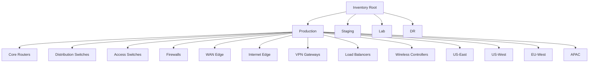

Each inventory entry defines:

```yaml
# inventories/production/hosts.yml
all:
  children:
    core_routers:
      hosts:
        core-rtr-01:
          ansible_host: 10.0.1.1
          vendor: cisco
          platform: ios-xe
          role: core_router
          region: us-east
          site: dc1
    firewalls:
      hosts:
        fw-edge-01:
          ansible_host: 10.0.2.1
          vendor: paloalto
          platform: panos
          role: firewall
          region: us-east
          site: dc1
```

---

## Secrets Architecture

**No secrets are ever stored in Git.** The platform supports multiple secrets backends:

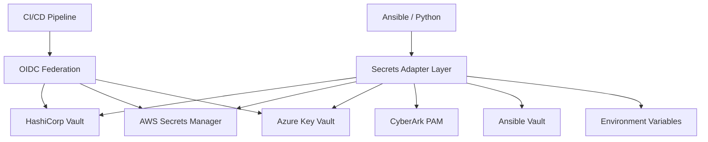

### Secret Rotation Policy

| Secret Type | Rotation Interval | Method |
|---|---|---|
| Device passwords | 90 days | Vault auto-rotation + Ansible push |
| API tokens | 30 days | Secrets Manager + Lambda/Function |
| SSH keys | 90 days | Vault SSH CA with short-lived certs |
| TLS certificates | 1 year (auto-renew at 60 days) | ACME / Vault PKI |
| CI/CD tokens | Ephemeral | OIDC federation (no static secrets) |

---

## Playbook Catalogue

### Device Lifecycle

| Playbook | Purpose | Command |
|---|---|---|
| `initial_provisioning.yml` | Bootstrap new device (hostname, AAA, NTP, DNS, SSH, SNMP, Syslog, banners) | `ansible-playbook playbooks/initial_provisioning.yml -i inventories/lab/hosts.yml` |
| `hostname.yml` | Set device hostname from inventory | `ansible-playbook playbooks/hostname.yml -l <device>` |
| `aaa.yml` | Configure AAA (TACACS+/RADIUS) | `ansible-playbook playbooks/aaa.yml` |
| `ntp.yml` | Configure NTP servers | `ansible-playbook playbooks/ntp.yml` |
| `dns.yml` | Configure DNS resolvers | `ansible-playbook playbooks/dns.yml` |
| `snmp.yml` | Configure SNMPv3 | `ansible-playbook playbooks/snmp.yml` |
| `syslog.yml` | Configure Syslog destinations | `ansible-playbook playbooks/syslog.yml` |
| `ssh_hardening.yml` | Harden SSH configuration | `ansible-playbook playbooks/ssh_hardening.yml` |
| `certificates.yml` | Deploy TLS certificates | `ansible-playbook playbooks/certificates.yml` |
| `banners.yml` | Set login/MOTD banners | `ansible-playbook playbooks/banners.yml` |

### Network Services

| Playbook | Purpose |
|---|---|
| `vlan.yml` | Create / modify VLANs |
| `trunk.yml` | Configure trunk interfaces |
| `lacp.yml` | Configure LACP / port channels |
| `qos.yml` | Apply QoS policies |
| `acl.yml` | Manage access control lists |
| `nat.yml` | Configure NAT rules |
| `vpn.yml` | Site-to-site and remote-access VPN |
| `firewall_rules.yml` | Deploy firewall rule sets |

### Routing Protocols

| Playbook | Purpose |
|---|---|
| `ospf.yml` | Configure OSPF routing |
| `bgp.yml` | Configure BGP peering and policies |
| `isis.yml` | Configure IS-IS routing |
| `static_routes.yml` | Manage static routes |
| `loopbacks.yml` | Configure loopback interfaces |

### High Availability

| Playbook | Purpose |
|---|---|
| `vrrp.yml` | Configure VRRP |
| `hsrp.yml` | Configure HSRP |

### Operations

| Playbook | Purpose |
|---|---|
| `backup.yml` | Backup running configuration |
| `restore.yml` | Restore from backup |
| `firmware_upgrade.yml` | Upgrade device firmware with pre/post checks |
| `firmware_rollback.yml` | Rollback firmware on failure |
| `config_rollback.yml` | Rollback configuration to last known good |
| `golden_config.yml` | Apply golden configuration baseline |
| `drift_detection.yml` | Detect configuration drift from baseline |
| `compliance_scan.yml` | Run compliance checks |
| `health_check.yml` | Full device health assessment |
| `inventory_collection.yml` | Collect device inventory (serials, versions, modules) |
| `neighbor_discovery.yml` | Discover CDP/LLDP neighbors |
| `license_validation.yml` | Validate license compliance |
| `monitoring_agents.yml` | Deploy and configure monitoring agents |

---

## Python Modules

Reusable, typed, and documented Python modules under `python/`:

| Module | Purpose |
|---|---|
| `inventory/` | Inventory parsing, device enrichment, CMDB integration |
| `netconf/` | NETCONF client with capability negotiation |
| `restconf/` | RESTCONF client with YANG model support |
| `ssh/` | SSH abstraction over Netmiko/Paramiko with retry |
| `snmp/` | SNMPv3 polling and trap handling |
| `telemetry/` | Model-driven telemetry receiver and parser |
| `config_gen/` | Jinja2-based configuration generation from structured data |
| `validation/` | Pre-deployment config validation (syntax + semantics) |
| `backup/` | Backup management with versioning and encryption |
| `compliance/` | Compliance engine with pluggable rule sets |
| `utils/` | Logging, retry, concurrency, diff, bulk operations |

All modules follow PEP 8, use type hints, include docstrings, and have corresponding unit tests.

---

## Automation Bots

Bots expose REST APIs and optional ChatOps integrations for self-service network operations.

### Bot Architecture

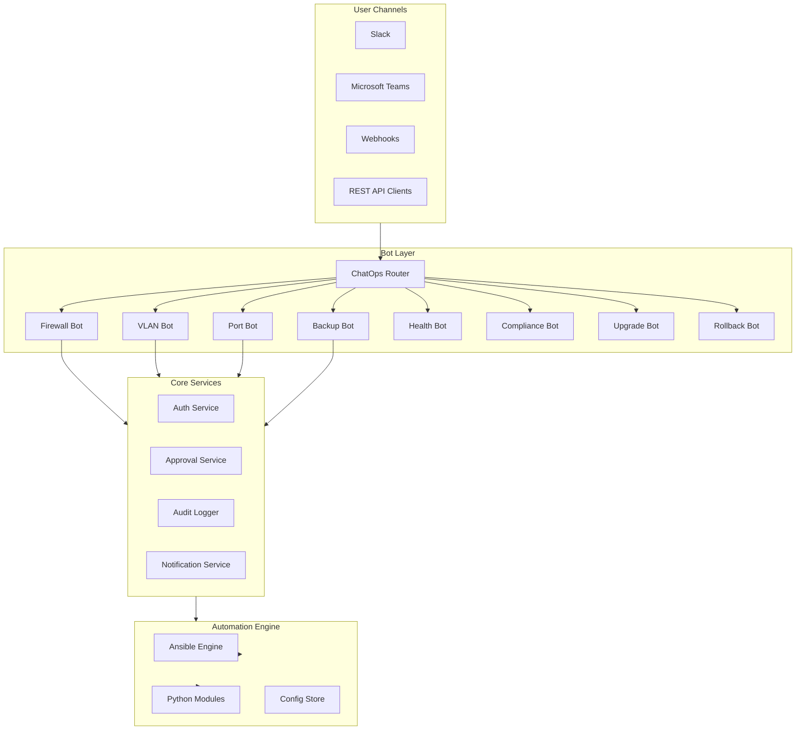

### Available Bots

| Bot | Endpoints | ChatOps | Purpose |
|---|---|---|---|
| **Firewall Bot** | `/api/v1/firewall/rules` | Slack/Teams | Request, validate, and deploy firewall rules |
| **VLAN Bot** | `/api/v1/vlan` | Slack | Provision VLANs with approval workflow |
| **Port Bot** | `/api/v1/port` | Slack | Enable/disable/configure switch ports |
| **Backup Bot** | `/api/v1/backup` | GitHub | Trigger and schedule device backups |
| **Health Bot** | `/api/v1/health` | Slack/Teams | On-demand health checks across all devices |
| **Compliance Bot** | `/api/v1/compliance` | GitHub | Run compliance scans and report violations |
| **Upgrade Bot** | `/api/v1/upgrade` | Slack | Orchestrate firmware upgrades with rollback |
| **Rollback Bot** | `/api/v1/rollback` | Slack/Teams | One-click rollback to last known good config |
| **ChatOps Bot** | `/api/v1/chatops` | Slack/Teams | Unified command router for all bot operations |
| **Approval Bot** | `/api/v1/approvals` | Slack/Teams | Manage approval workflows for change requests |

---

## CI/CD Pipeline

All pipelines are defined in `.github/workflows/` and follow this flow:

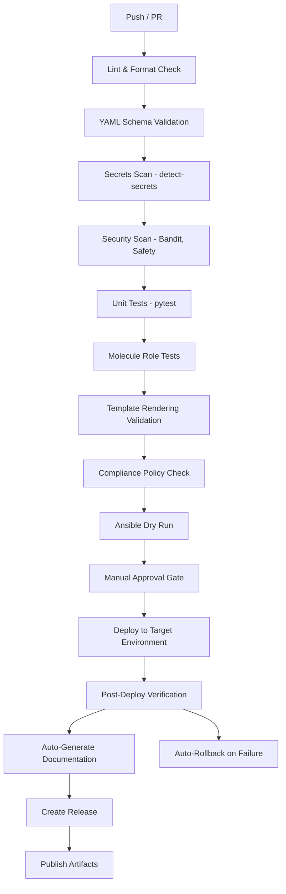

### Key Workflows

| Workflow | Trigger | Purpose |
|---|---|---|
| `ci-validate.yml` | PR opened/updated | Lint, test, scan, validate |
| `cd-deploy-staging.yml` | Merge to `staging` | Deploy to staging with dry run |
| `cd-deploy-production.yml` | Merge to `main` + approval | Deploy to production |
| `compliance-scan.yml` | Scheduled (daily) | Full compliance audit |
| `firmware-upgrade.yml` | Manual dispatch | Orchestrated firmware upgrade |
| `backup-schedule.yml` | Scheduled (daily 02:00 UTC) | Automated configuration backup |
| `docs-generate.yml` | Merge to `main` | Regenerate documentation |

---

## Testing Strategy

| Test Type | Tool | Scope | When |
|---|---|---|---|
| **Unit Tests** | pytest | Python modules, Jinja2 filters | Every PR |
| **Linting** | ansible-lint, yamllint, flake8, black | All YAML, Python, Ansible files | Every PR |
| **Schema Validation** | jsonschema, cerberus | Inventory, group_vars, host_vars | Every PR |
| **Role Tests** | Molecule | Individual Ansible roles | Every PR |
| **Network Simulation** | Batfish | ACL, routing, firewall rule analysis | Every PR affecting network config |
| **Integration Tests** | pyATS, NAPALM | Device connectivity, config parsing | Staging deploy |
| **Golden Config Tests** | Custom Python | Diff against approved baseline | Every PR, scheduled |
| **Regression Tests** | pytest + snapshots | Ensure no unintended config changes | Every PR |
| **Performance Tests** | locust, custom | API and bot endpoint load testing | Release candidate |

```bash
# Run all tests
pytest tests/ -v --tb=short

# Run only unit tests
pytest tests/unit/ -v

# Run compliance tests
pytest tests/compliance/ -v

# Run Molecule tests for a specific role
cd roles/cisco_ios_baseline
molecule test
```

---

## Compliance Strategy

Compliance is enforced at **every stage** — from pull request to production runtime.

### Compliance Checks

| Policy | Check | Severity |
|---|---|---|
| SSH Only | No Telnet configuration allowed | Critical |
| NTP Configured | All devices must have NTP | High |
| AAA Enabled | TACACS+ or RADIUS required | Critical |
| SNMPv3 | No SNMPv1/v2c allowed | High |
| Logging Enabled | Syslog must be configured | Medium |
| Approved Ciphers | Only approved cipher suites in SSH/TLS | High |
| Approved Firmware | Device OS must be on approved list | High |
| Password Policy | Minimum length, complexity, rotation | Critical |
| ACL Standards | Default deny, explicit allow only | High |
| Firewall Rules | No any-any, shadow/duplicate detection | Critical |
| Unused Objects | Detect and flag unused ACLs, rules, objects | Low |

### Compliance Flow

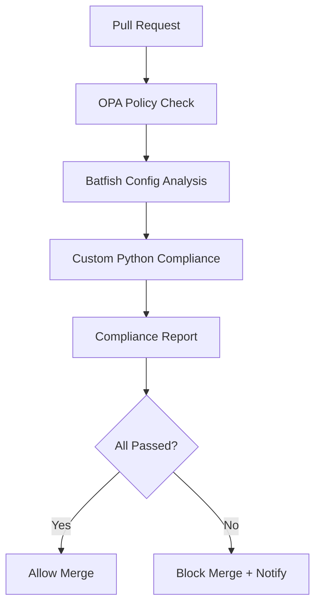

---

## Monitoring & Observability

### Architecture

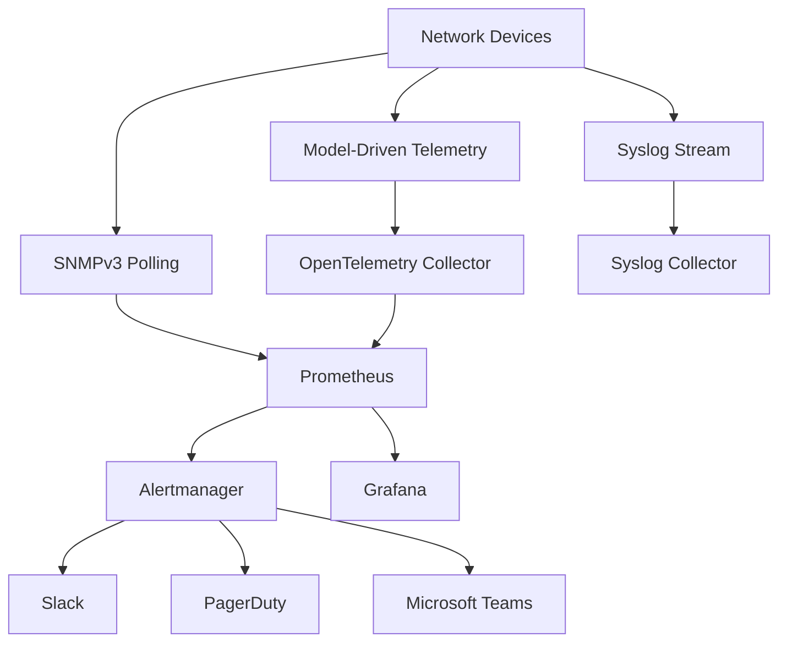

### Dashboards

| Dashboard | Purpose |
|---|---|
| **Network Health** | Device up/down, CPU, memory, interface status |
| **Automation Metrics** | Job success/failure rates, execution time, drift count |
| **Compliance Overview** | Policy violations by severity, trend over time |
| **Upgrade Tracker** | Firmware versions across fleet, upgrade progress |
| **API Performance** | Bot endpoint latency, error rates, throughput |
| **Inventory Drift** | Detected drift between Git and running config |

---

## GitOps Workflow

All changes follow the GitOps model:

### Detailed GitOps Flow

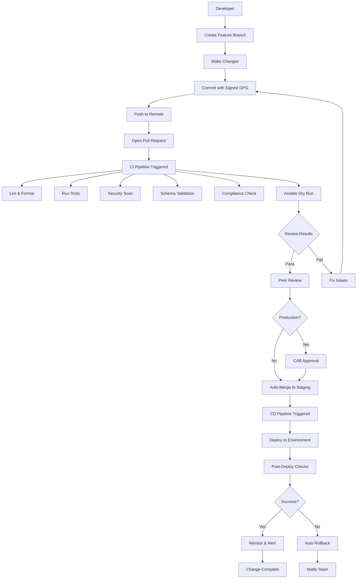

### GitOps Principles

1. **Developer** creates a feature branch and modifies configuration, templates, or playbooks
2. **Pull Request** is opened targeting `staging` or `main`
3. **Automated Validation** runs lint, tests, schema validation, secrets scan, compliance check, and dry run
4. **Approval** from a peer reviewer and optionally a change advisory board (CAB) for production
5. **Deployment** is triggered automatically on merge via GitHub Actions
6. **Verification** runs post-deploy health checks and config validation
7. **Rollback** is automatic if verification fails, reverting to the last known good state

```bash
# Create a change
git checkout -b feature/add-vlan-100
# ... make changes ...
git push origin feature/add-vlan-100

# Open PR → CI validates → Approval → Merge → CD deploys → Verify
```

---

## Upgrade & Rollback Workflows

### Firmware Upgrade

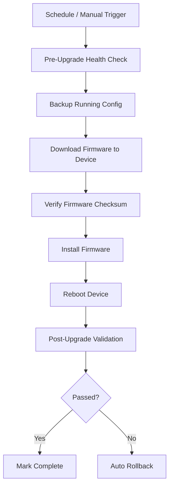

### Configuration Rollback

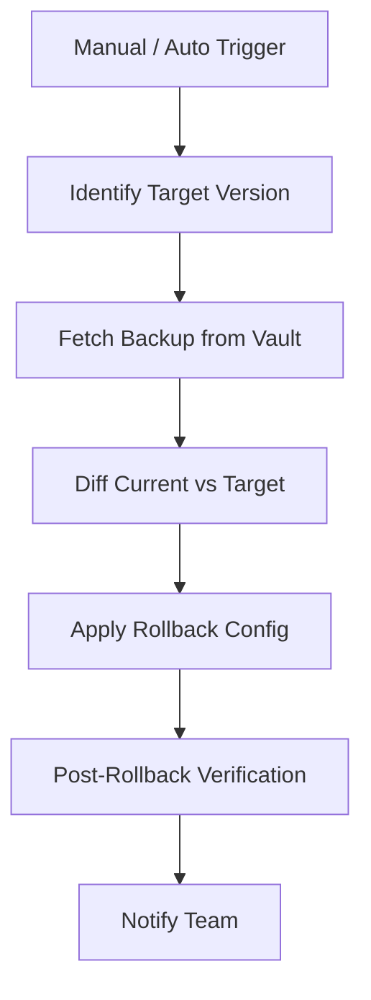

### Disaster Recovery Workflow

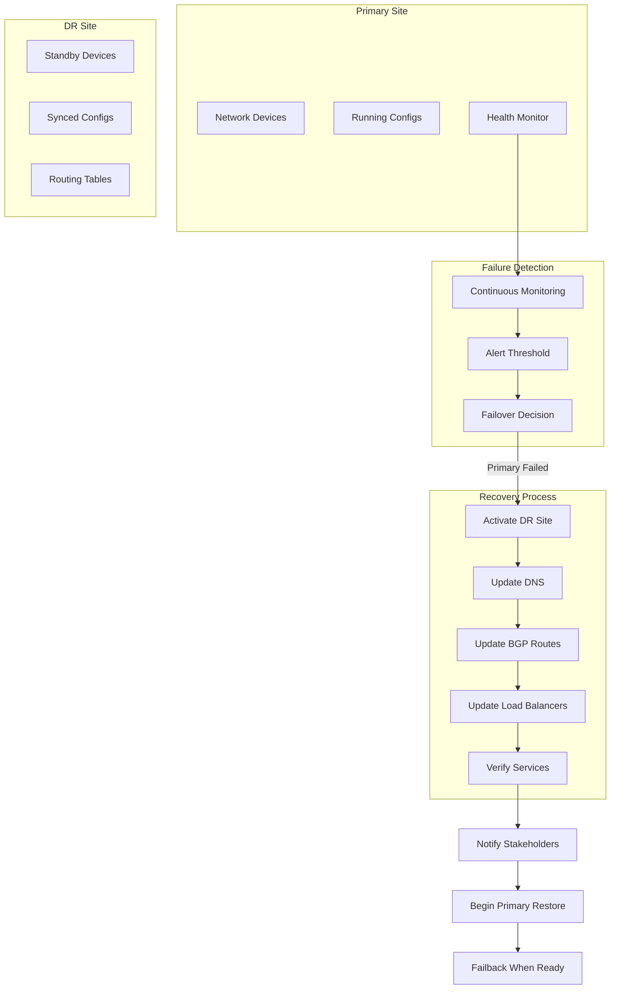

### Configuration Generation Pipeline

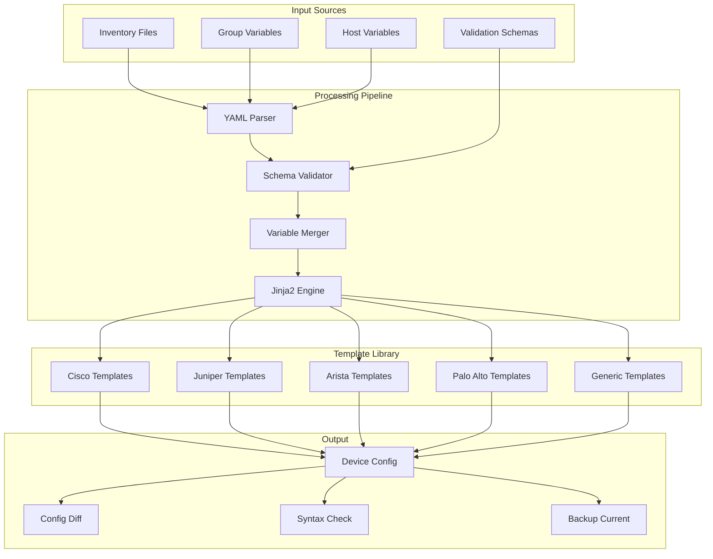

---

## Troubleshooting

| Issue | Resolution |
|---|---|
| Ansible connection timeout | Verify SSH reachability: `ansible all -m ping -i inventories/lab/hosts.yml` |
| Template rendering error | Check Jinja2 syntax: `python -m python.config_gen --debug --device <name>` |
| Compliance check failure | Review `compliance/` policies and device running config diff |
| CI pipeline failure | Check GitHub Actions logs; most failures include actionable error messages |
| Vault authentication failure | Verify OIDC token or AppRole credentials; check Vault policies |
| Molecule test failure | Ensure Docker/Podman is running; check `molecule/default/molecule.yml` |
| Batfish analysis error | Validate Batfish snapshot in `tests/batfish/snapshots/` |

---

## Roadmap

- [ ] Multi-tenancy support with tenant-isolated inventories
- [ ] AI-driven anomaly detection on telemetry streams
- [ ] Zero-touch provisioning (ZTP) integration
- [ ] Network digital twin with Batfish + NSO
- [ ] Self-healing automation with auto-remediation playbooks
- [ ] FinOps integration for cloud networking cost tracking
- [ ] Kubernetes-based automation worker scaling
- [ ] SSoT (Single Source of Truth) integration with NetBox / Nautobot

---

## Contributing

We welcome contributions. Please follow these steps:

1. **Fork** the repository
2. **Branch** from `main`: `git checkout -b feature/your-feature`
3. **Install** pre-commit hooks: `pre-commit install`
4. **Make changes** following the existing code style and structure
5. **Test** locally: `pytest tests/unit/ -v` and `molecule test`
6. **Commit** with a descriptive message (Conventional Commits preferred)
7. **Push** and open a **Pull Request** against `main`

### Commit Convention

```
feat: add BGP playbook for Arista EOS
fix: correct NTP server variable in group_vars
docs: update compliance policy documentation
test: add unit tests for VLAN bot
refactor: simplify SSH retry logic in python/ssh
ci: add secrets scanning to PR workflow
```

All PRs must pass:
- Linting (`ansible-lint`, `yamllint`, `flake8`, `black`)
- Unit tests (`pytest`)
- Schema validation
- Secrets scan (`detect-secrets`)
- Compliance policy check

---

## License

This project is licensed under the MIT License. See [LICENSE](LICENSE) for details.

---

## Acknowledgments

Built with inspiration from production network automation platforms at Fortune 100 enterprises, leveraging best practices from the Ansible, Terraform, and network engineering communities.
